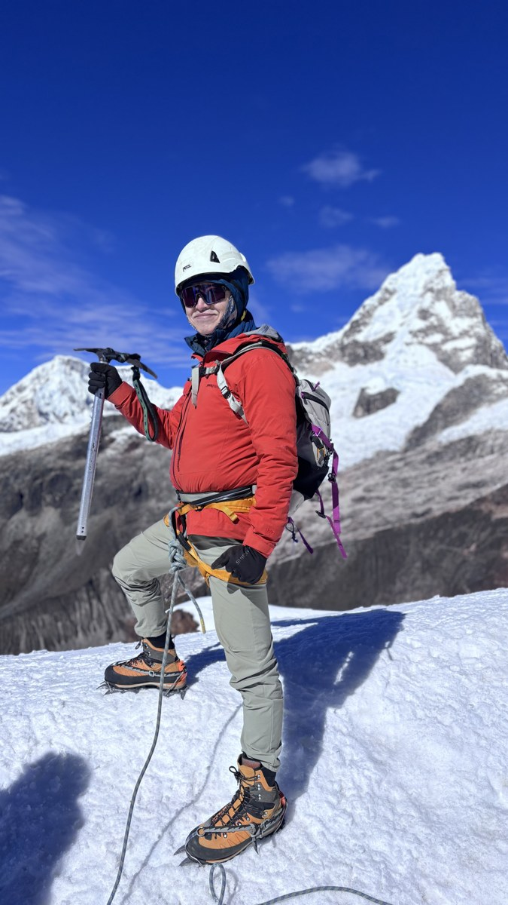

## 關於我

半退休的單車與背包旅人,筆名 **Ride from Taiwan**。

過去幾年,用一台鈦合金 gravel 車、兩個馱包和兩個前叉包,穿越歐洲、南美與亞洲;不騎車的時候,就是一顆 18 公升的背包。2025 年春夏騎了 74 天、歐洲十國;2026 年在秘魯與玻利維亞的高原上,站上人生第一座 5,150 公尺。

不是年輕人的壯遊,是**中年以後才開始、而且還走得動的時候就去**。

## 這個網站在做什麼

這裡是作品的家,也是給「想出發但還沒出發的人」的資料庫。每一趟旅程都會留下:

- **完整遊記**——一段一篇,只寫真的發生過的事
- **每天住哪、花多少**——營地與旅館名稱、訂房方式、實際價格
- **怎麼帶單車過境**——飛機、火車、渡輪的實際流程與規定
- **路線與數據**——GPX 下載、Komoot 原始路線、每日公里與爬升
- **誠實的評價**——不值得去的路段,我會直接寫不值得

照片同步整理在 [Flickr](https://www.flickr.com/photos/ridefromtaiwan/);文字另刊於方格子。

## 合作

裝備實測、照片授權、路線諮詢、稿件邀約都歡迎。請透過 Flickr 私訊,或在任一篇文章下留言。
