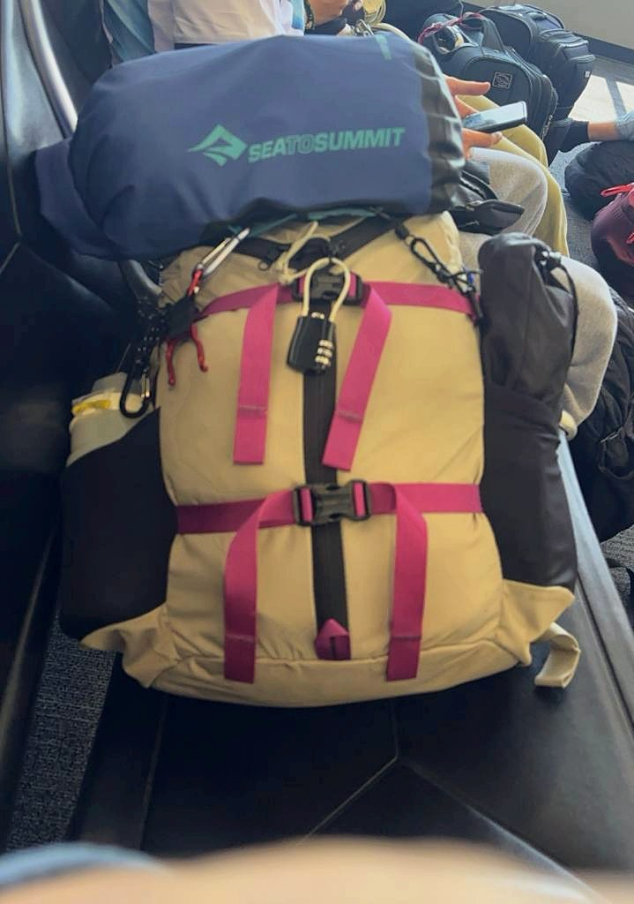

| | |
|---|---|
| 背包 | Mystery Ranch,18 公升;頂上外掛 Sea to Summit 防水袋 |
| 期間 | 2026/6/12–7/7,26 天 |
| 路線 | 利馬 → 瓦拉斯(Cordillera Blanca,5,150 m 冰攀)→ 拉巴斯 → 烏尤尼鹽湖與高原(零下的夜)→ 庫斯科 → 印加古道 → 馬丘比丘 → 利馬 |
| 移動 | 飛機 ×6、夜巴、鹽湖吉普車 3 天、徒步 |

這一趟是我這幾年自由行裡,**唯一一次不騎車、純粹的背包旅行**。

一個月,從海邊到 5,150 公尺的冰河、從零下的高原到雨林邊的馬丘比丘,行李就是一顆 18 公升的背包——大概是一般人一日健行的容量。

背包客,但不是睡青年旅館那種。這一路住的都是有品質的飯店,基本上一定有獨立衛浴。輕的是背包,不是過夜的方式。

## 為什麼只帶 18 公升

(待補:你講,我寫。例如:騎車旅行的習慣帶過來、飛機不託運、鹽湖團車頂沒位置、印加古道要自己背……)

## 裡面裝了什麼

(待補:清單。衣物幾件、羽絨、冰攀裝備租的還是帶的、藥品清單(南美Daily 裡有)、電子產品、證件影本兩份……)

## 哪些用到、哪些沒用到

(待補)

---

相關遊記:[瓦拉斯五日](/journeys/2026-huaraz/)・[鹽湖與高原](/journeys/2026-bolivia/)
