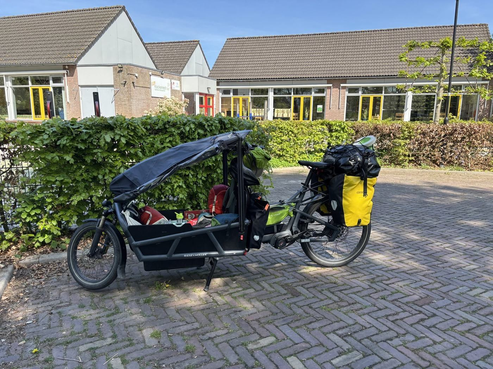
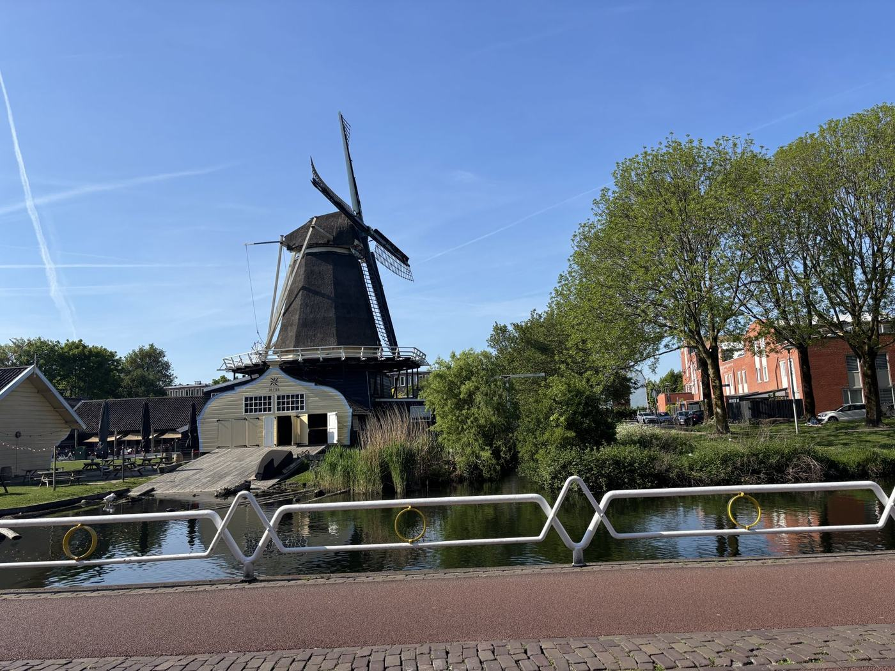
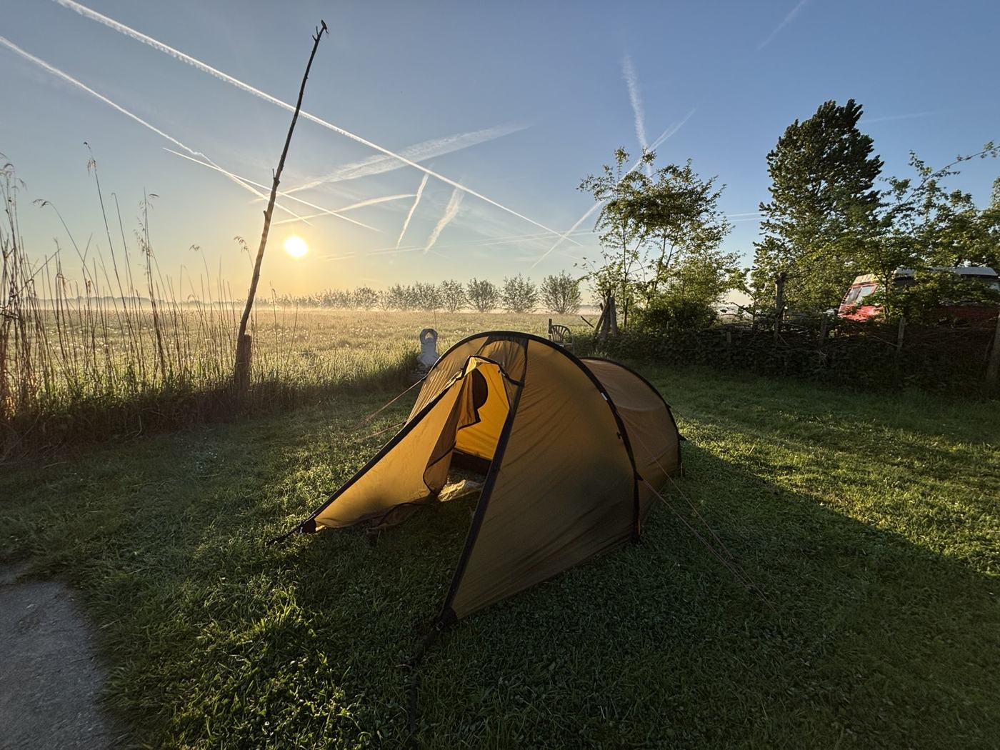
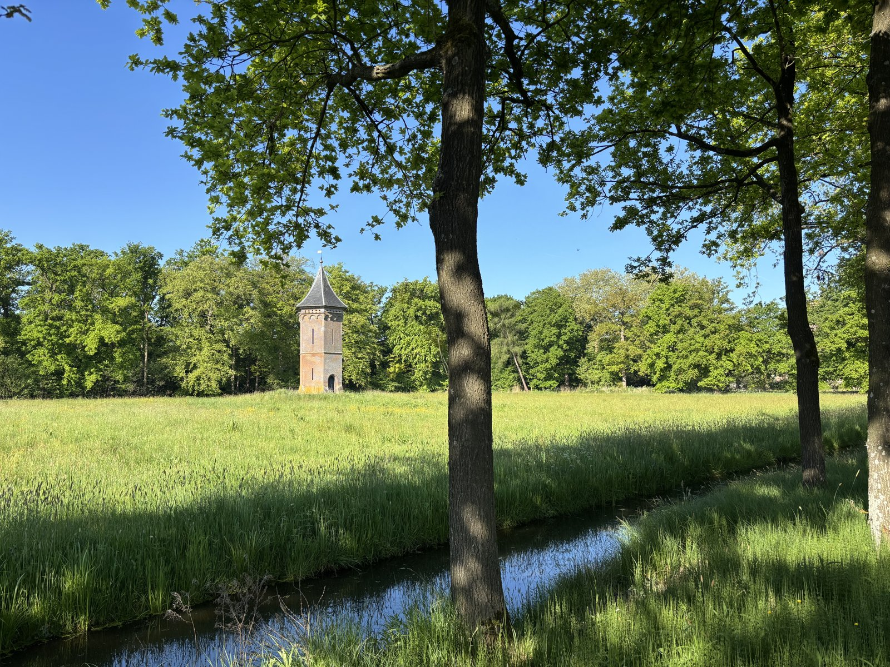
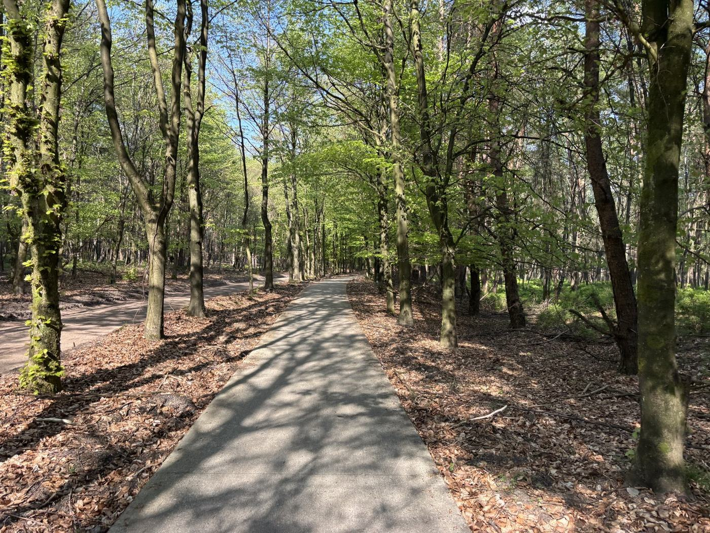

<small>4/30–5/2・223 km|下一站:德國北部</small>

| | |
|---|---|
| 日期 | 2025/4/30–5/2 |
| GPX |  |
| Komoot | 4/30 [①](https://www.komoot.com/tour/2203325467) [②](https://www.komoot.com/tour/2203753282)|5/1 [①](https://www.komoot.com/tour/2205553878) [②](https://www.komoot.com/tour/2206350752) [③](https://www.komoot.com/tour/2209979690) [④](https://www.komoot.com/tour/2206785709)|5/2 [①](https://www.komoot.com/tour/2210954739) [②](https://www.komoot.com/tour/2211586062) |
| 路線 | Schiphol 機場 → Aalsmeer → Mijdrecht → Driebergen-Rijsenburg → Amerongen → Dieren → Baak → Almen → Borculo → Enschede 東南(德國邊界前),走荷蘭國家自行車道 LF4 |
| 距離 | 3 天 223 km(GPS:69.4 / 81.1 / 72.9 km) |
| 住宿 | 4/30 Camping Strosteeg(Driebergen-Rijsenburg) 5/1 Boerderijcamping de Hank(Baak) 5/2 Natuurkampeerterrein Aamsveen(Enschede 東南,德國邊界前) |
| 交通 | 全程騎車 |

## 為什麼是這條路

一開始只是想去挪威騎車。後來越畫越大,整個繞了一圈:兩個月,從阿姆斯特丹機場一路向東,穿越荷蘭、進德國,最後再回到阿姆斯特丹。

車是一台鈦合金 gravel 車。兩個馱包、兩個前叉包、帳篷、睡袋,就這樣。

兩個月要走完這個行程,其實還蠻趕的。

## 4/30:機場組車,牽出去就騎

荷蘭的機場蠻友善的。領到自行車的時候,轉盤附近就有一個區域讓你直接組裝;組裝完,紙箱放在旁邊的區域,他們會收走。人還沒出關,車就已經組好,然後直接牽著自行車出關——一出機場,就可以一路開始騎。

剛落地就上路,所以第一天沒有排太遠:原本是 70 公里,到 Driebergen 那一帶的營地。

GPS 記的是 11 點多從 Schiphol 出發,晚上快七點停下來,69.4 公里。整天最高海拔 11 公尺——Schiphol 機場本身就蓋在海平面以下。荷蘭的第一天,就是平。

## 4/30:到處都像羊角村

一出機場就接上 LF4。LF 是荷蘭的國家長途自行車道網,LF4 這一條橫貫荷蘭中部、一路通到德國邊界;接下來三天,我就順著它往東。

路非常舒服,很快就進入森林區。整個森林區道路是平的,樹蔭遮得非常茂密。

中午前後到 Aalsmeer。路邊就是一條筆直的水道,兩岸的樹籬修剪得整整齊齊,樹上開著白色的花穗。

沿途的風景讓我覺得:怎麼到處都像是圖片中的羊角村一樣?家家戶戶門前有一條小河,前面停著小船。羊角村(Giethoorn)是荷蘭北邊那個用水道當馬路、出門靠船的村子;原來這一帶的鄉下,本來就是同一種樣子。

下午兩點多過 Mijdrecht,再往東是 Wilnis。水道長滿睡蓮,岸邊一整叢白花,對面一棟磚房。

路邊一座茅草頂的風車,門上寫著 De Veenmolen。把車靠在圍籬上,拍了一張。Veen 是荷蘭文的泥炭:這一帶早年是一整片泥炭地,就是靠這樣的風車把水抽掉,才有了田、有了路。

隔幾分鐘,又一座白色的吊橋跨在水道上,後面是磚砌的農舍,前面一片睡蓮。

快三點,一間小學門口停著一台黑色的貨運三輪車(bakfiets),前面的貨斗裝著兒童座椅——荷蘭人接小孩用的。我的車靠在旁邊,兩台車剛好一比。

快五點,又一座風車,黑色的,立在水道邊,前面一排白色的護欄。

4/30 傍晚,在 Driebergen-Rijsenburg 附近的營地紮營。晚上八點多天還亮著,帳篷搭在草地上。

5/1 早上七點,太陽剛從田的那頭升起來,草地上一層薄霧,天空是飛機劃出來的白線。

## 5/1:荷蘭也有坡

5/1,早上九點多從營地出發。原本排 87 公里,實際騎了 81.1 公里、爬升 291 公尺,最高點 82 公尺。荷蘭不是全平的——這一天穿過 Utrechtse Heuvelrug,一道冰河時期推出來的丘陵,是荷蘭少數有起伏的地方。對照前一天的 11 公尺,已經算是有坡了。

早上九點多,出營地不久,草地那頭一座紅磚的方塔,前面一條小水溝,橡樹排成一列。

中午在 Amerongen 附近,一座黑色的三角形穀倉,掛著 Utrechts Landschap 的牌子,前面幾張野餐桌。停下來休息。

下午四點多,一條鋪好的自行車道穿過山毛櫸林,光從樹縫打在落葉上。

傍晚五點多,路線鑽進一段林道,松樹和闊葉樹混在一起,一根橫木擋在路口。

出了林子,沿著運河走。岸邊是蘆葦和老橡樹,水面平得像鏡子。快七點,在 Dieren 過去一點、IJssel 河附近停下來。IJssel 是萊茵河的一條分支,從這裡一路往北,流進 IJsselmeer。

## 5/2:騎到邊界前

5/2 早上九點多。出發前的營地:果樹下兩張野餐桌,旁邊一間木造小屋。

這是 Dieren 附近的 Boerderijcamping de Hank,前一天傍晚在手機上訂的。Boerderijcamping 就是農場營地——荷蘭鄉下不少農家,在自家地上劃幾塊草皮給人紮營。這個營地蠻特別的:從入住到離開,都沒有遇到營地的主人。沒有人接待——網路上預訂、繳費,直接去住。現場露營的人倒是有幾位。

九點多出發。Zutphen 外的小路,一邊一整排蒲公英,另一邊是麥田。

十點多在 Almen,樹蔭下是乳牛。

中午經過 Borculo,鎮中心的教堂鐘塔。

一路往東,72.9 公里,爬升 149 公尺,下午五點多停在 Enschede 東南邊,離德國邊界只剩幾公里。原本排 72 公里,剛好。

這三天全程騎車,沒有搭火車;火車是後來在德國才搭的。



隔天早上,從 Losser 過邊界,進德國。

---

這段的攝影作品之後放 Flickr。
