<small>歐洲十國單車・第 1 段|荷蘭(4/30–5/2)|下一段:德國北部</small>

| | |
|---|---|
| 日期 | 2025/4/30–5/2 |
| 路線 | Schiphol 機場 → Aalsmeer → Mijdrecht → Driebergen-Rijsenburg → Amerongen → Dieren → Baak → Almen → Borculo → Enschede 東南(德國邊界前),走荷蘭國家自行車道 LF4 |
| 距離 | 3 天 223 km(GPS:69.4 / 81.1 / 72.9 km) |
| 住宿 | 帳篷,營地 |
| 交通 | 全程騎車 |

## 為什麼是這條路

一開始主要是想去挪威騎車,後來就整個繞了一圈:兩個月,從阿姆斯特丹機場一路向東,穿越荷蘭、進德國,最後再回到阿姆斯特丹。

車是一台鈦合金 gravel 車,兩個馱包、兩個前叉包、帳篷、睡袋,就這樣。

兩個月要走這個行程,其實還蠻趕的。

## 機場組車,牽出去就騎

荷蘭的機場蠻友善的。領到自行車的時候,轉盤附近就有一個區域讓你直接組裝;組裝完,紙箱放在旁邊的區域,他們會收走。人還沒出關,車就已經組好,然後直接牽著自行車出關——一出機場,就可以一路開始騎。

剛落地,第一天上午一出來就開始騎車,所以第一天的路線並沒有安排騎很遠。原本排的是 70 公里,到 Driebergen 那一帶的營地。

GPS 記的是 11 點多從 Schiphol 出發,晚上快七點停下來,69.4 公里。整天最高海拔 11 公尺——荷蘭的第一天,就是平。

## 第一天:到處都像羊角村

從機場出來就走國家自行車道,非常舒服,很快就進入森林區。整個森林區道路是平的,樹蔭的遮蔽非常茂密。

中午前後到 Aalsmeer。路邊就是一條筆直的水道,兩岸是修剪整齊的樹籬,樹上開著白色的花穗。

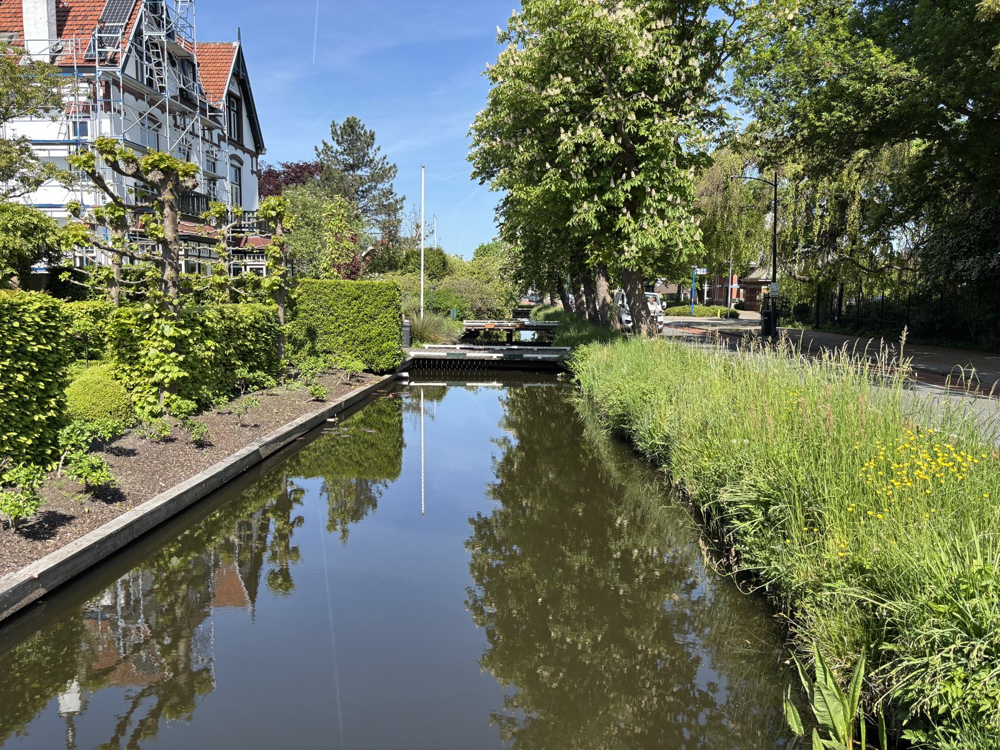

沿途的風景讓我覺得:怎麼到處都像是圖片中的羊角村一樣?家家戶戶門前有一條小河,前面停著小船。

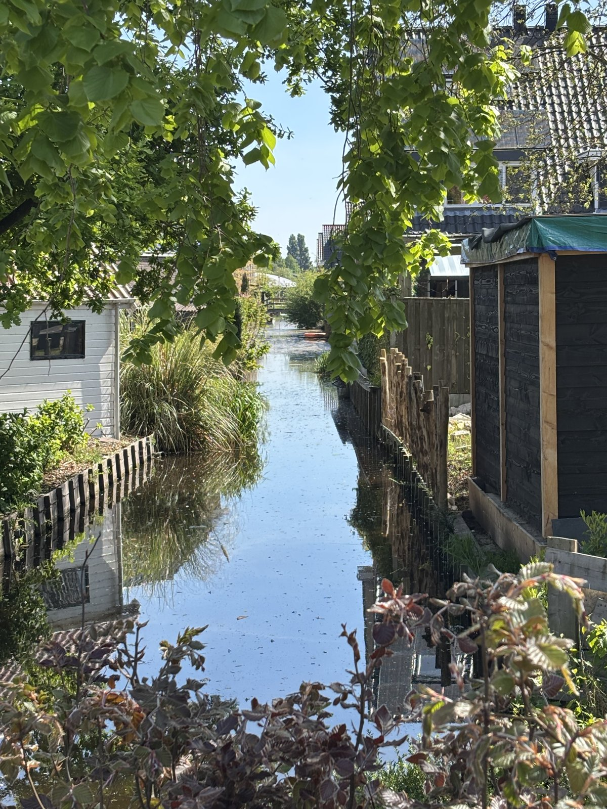

下午兩點多過 Mijdrecht,再往東是 Wilnis。這裡的水道長滿睡蓮,岸邊一整叢白花,對面是一棟磚房。

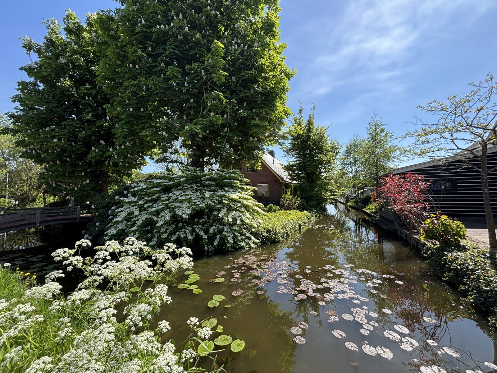

路邊一座茅草頂的風車,門上寫著 De Veenmolen。把車靠在圍籬上拍了一張。

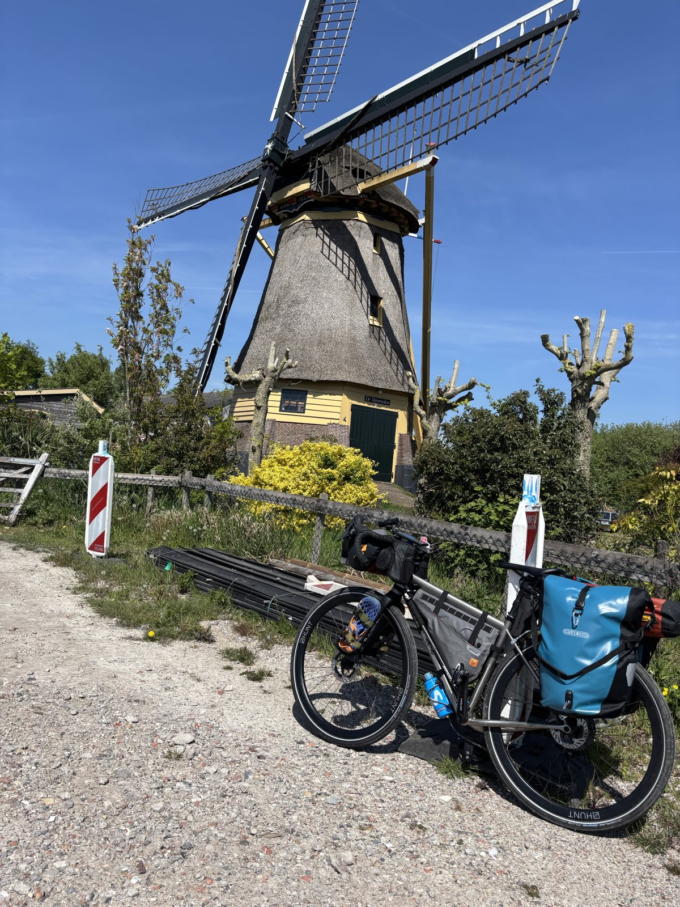

隔幾分鐘,又是一座白色的吊橋跨在水道上,後面是磚砌的農舍,前面一片睡蓮。

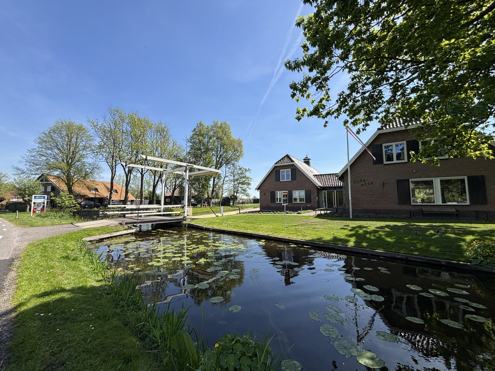

傍晚在 Driebergen-Rijsenburg 附近的營地紮營。晚上八點多天還亮著,帳篷搭在草地上,野餐桌上攤著晚餐和水。

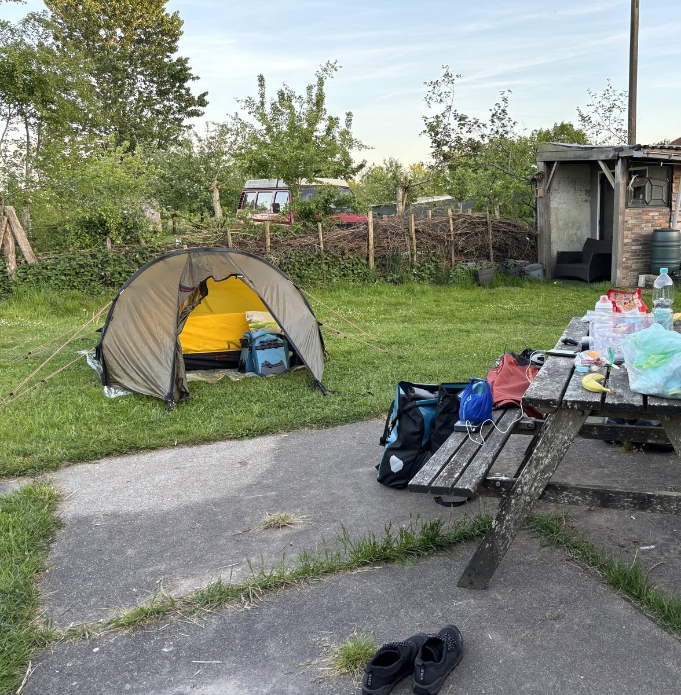

## 第二天:荷蘭也有坡

5/1,早上九點多從營地出發。原本排的是 87 公里,實際騎了 81.1 公里、爬升 291 公尺,最高點 82 公尺。荷蘭不是全平的——這一天穿過 Utrechtse Heuvelrug 這道丘陵,對照前一天的 11 公尺,已經算是有坡了。

中午在 Amerongen 附近,一座黑色的三角形穀倉,掛著 Utrechts Landschap 的牌子,前面幾張野餐桌。停下來休息。

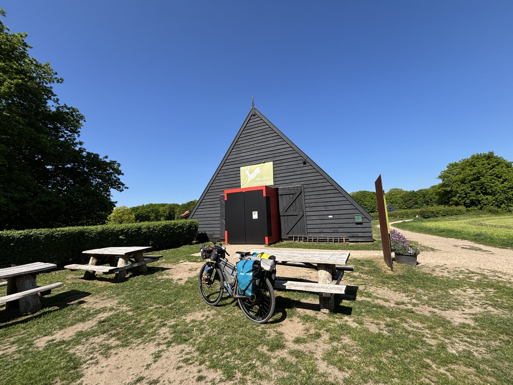

傍晚五點多,路線進到一段林道,松樹和闊葉樹混在一起,一根橫木擋在路口。

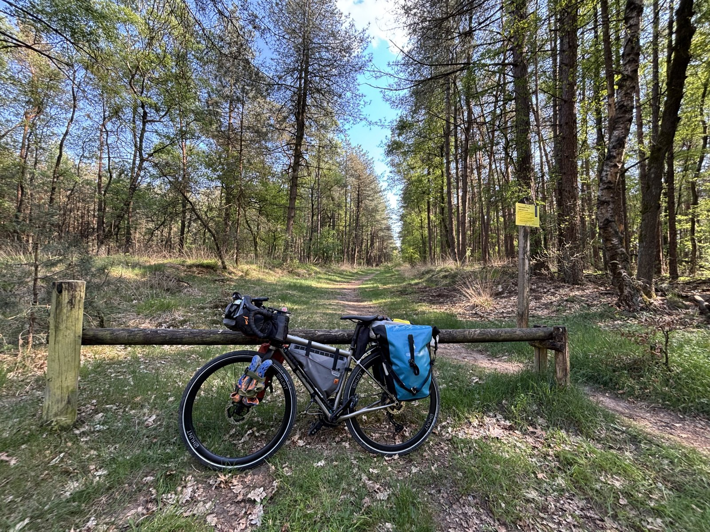

出了林子,沿著運河走。岸邊是蘆葦和老橡樹,水面平得像鏡子。快七點在 Dieren 過去一點、IJssel 河附近停下來。

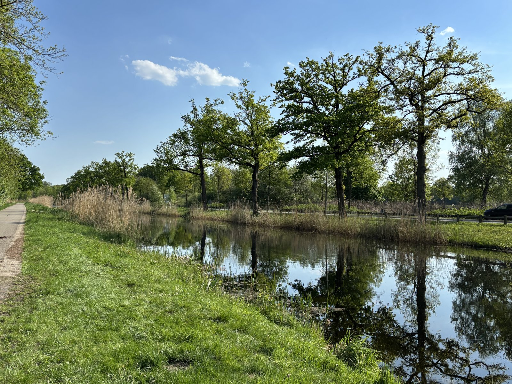

## 第三天:騎到邊界前

5/2 早上九點多,出發前的營地:果樹下兩張野餐桌,旁邊一間木造小屋。

這是 Dieren 附近的 Boerderijcamping de Hank,前一天傍晚在手機上訂的。這個營地蠻特別的:從入住到離開,都沒有遇到營地的主人。沒有人接待——網路上預訂、繳費,直接去住。現場露營的人倒是有幾位。

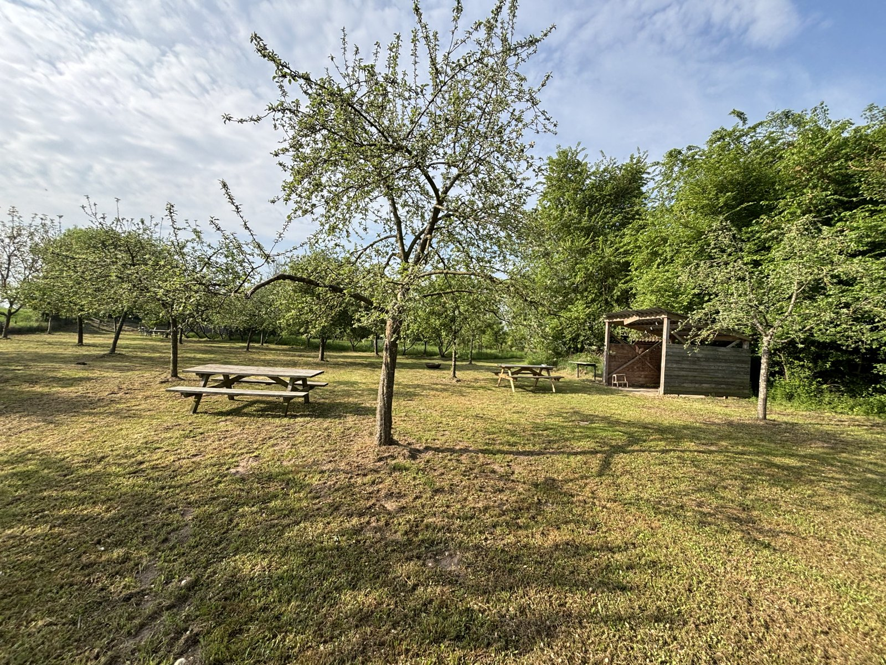

九點多出發。Zutphen 外的小路,路邊一整排蒲公英,另一邊是麥田。

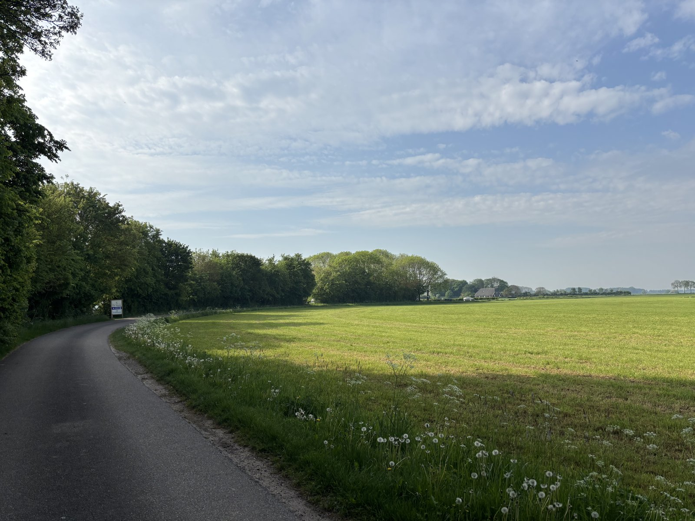

十點多在 Almen,樹蔭下是乳牛。

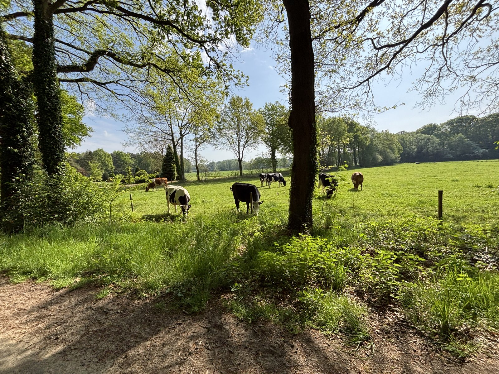

中午經過 Borculo,鎮中心的教堂鐘塔。

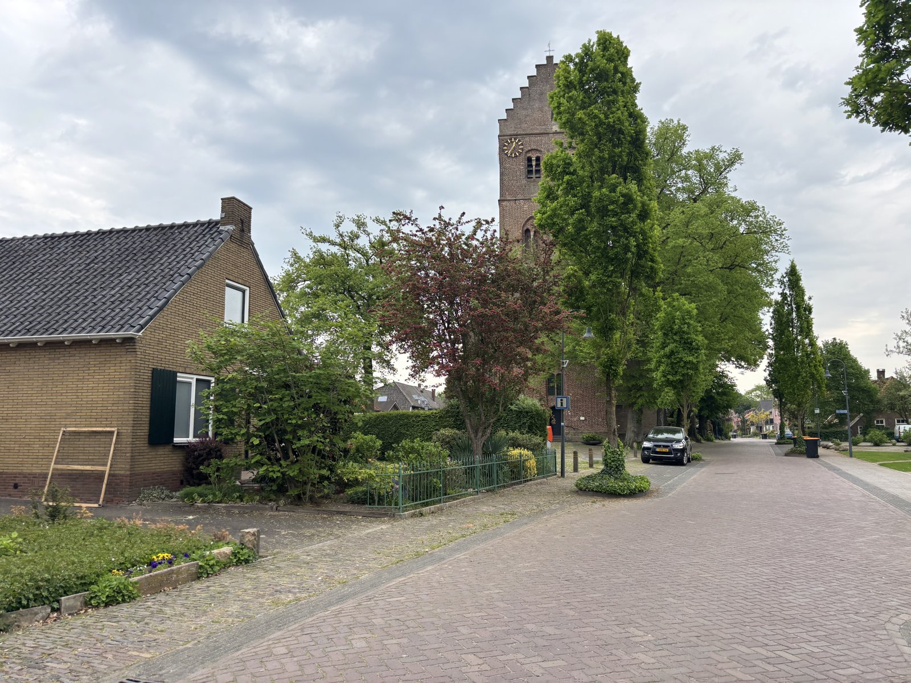

一路往東,72.9 公里,爬升 149 公尺,下午五點多停在 Enschede 東南邊,離德國邊界只剩幾公里。原本排的是 72 公里,剛好。

這三天全程騎車,沒有搭火車;火車是後來在德國才搭的。



隔天早上,從 Losser 過邊界,進德國。

---

這段的攝影作品之後放 Flickr。
