<small>5/6–5/11・161 km|上一站:[德國北部](../2025-eu-02-north-germany/)|下一站:哥本哈根與奧斯陸</small>

受到氣溫的影響,就先去波蘭古城什切青(Szczecin),隨後往 EuroVelo 10 波羅的海岸線——有點想收集各條 EV,看看每一條的特色。原本這幾天排的是丹麥。

EuroVelo 是橫跨全歐的長途自行車道網,EV10 繞波羅的海一整圈,約 9,000 公里;我騎的是德波邊界上的一小截。

| | |
|---|---|
| 日期 | 2025/5/6–5/11 |
| GPX |  |
| Komoot | 5/8 [①](https://www.komoot.com/tour/2226047839) [②](https://www.komoot.com/tour/2226220107)|5/9 [①](https://www.komoot.com/tour/2228474085)|5/10 [①](https://www.komoot.com/tour/2234639191) [②](https://www.komoot.com/tour/2238987115)|5/11 [①](https://www.komoot.com/tour/2235317324) |
| 路線 | Lübeck ‖ 火車 ‖ 什切青(Szczecin)→ 跨回德國,Rieth → Ueckermünde → Usedom → 回波蘭 Świnoujście → Międzyzdroje → Świnoujście ‖ 夜船 ‖ Trelleborg(瑞典) |
| 距離 | 4 天 161 km(GPS:64.4 / 59.3 / 19.1 / 17.9 km);5/6、5/7 沒有騎乘紀錄 |
| 交通 | 5/6 Lübeck → Szczecin 約 250 km,搭火車;5/11 晚上 TT-Line 夜船 Świnoujście → Trelleborg |
| 住宿 | 5/6、5/7 什切青市中心公寓(Monte Cassino 9) 5/8 Pension und Ferienwohnungen am Rosengarten(Ueckermünde) 5/9 Świnoujście 的私人公寓(鑰匙留在門口密碼盒,自助入住) 5/10 Międzyzdroje 的民宿 5/11 TT-Line 夜船(沒訂艙房,睡休息區) |

## 5/6–5/7:火車到什切青

5/6 清晨六點多,Lübeck 的營地。帳篷還沒收,坐墊上結了一層霜。

Lübeck 到 Szczecin 有 250 公里。這天沒有騎乘紀錄,是搭火車過去的。

在德國搭火車帶單車,要挑車廂外面有單車標誌的那種區域車——那一節可以直接把車牽進車廂,靠著掛好就行,不用拆、不用裝袋。月台上一看標誌就知道該站哪裡等。

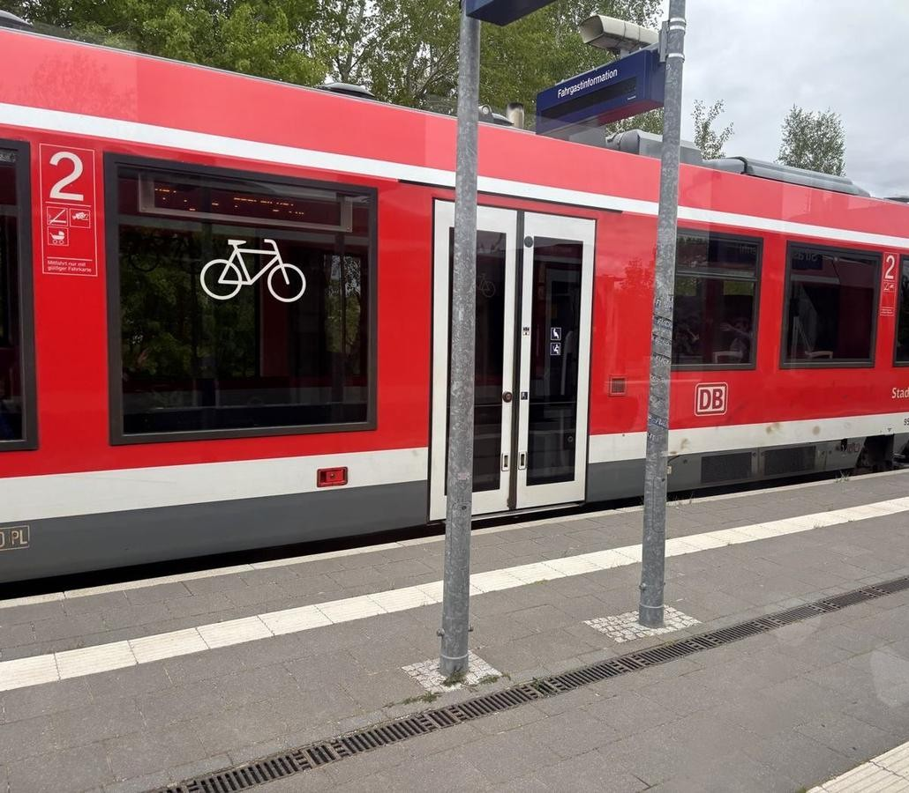

什切青在奧得河口。它很長一段時間叫 Stettin,是普魯士的港口,二戰後才劃給波蘭;城裡的紅磚哥德式,和北德是同一個系統。

5/7 在 Szczecin 停一天。天晴。下午兩點多,一棟紅磚的大樓,山牆上滿是石雕,屋頂飄著波蘭國旗,門口掛著白鷹的國徽。

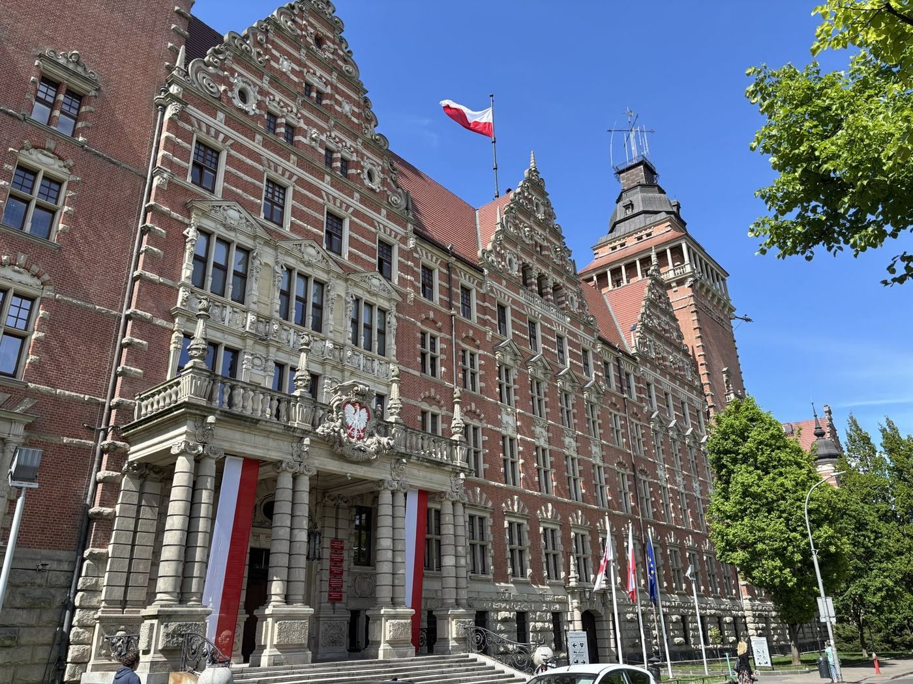

什切青是個很有特色的城市,整座城裡都是磚造建築。連街角一棟一棟的老樓,也都是紅磚砌到頂。

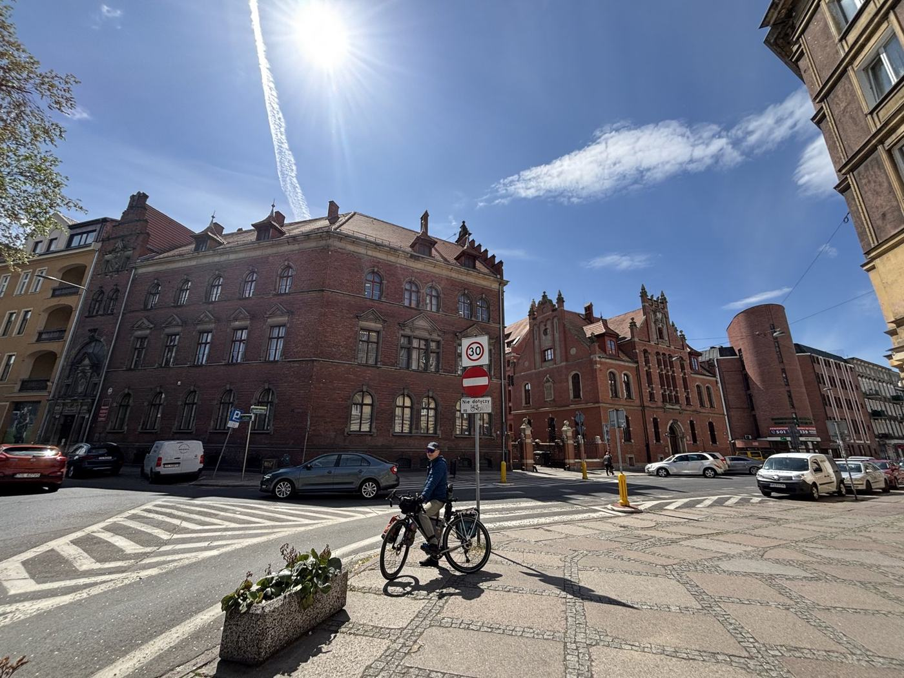

三點,紅磚的大教堂,尖塔正頂著太陽,側面還掛著整修用的網子。這是聖雅各大教堂,二戰末尾打壞,戰後才慢慢修回來。

另一座磚造的老教堂,綠色的小尖頂,基座用的是石塊。

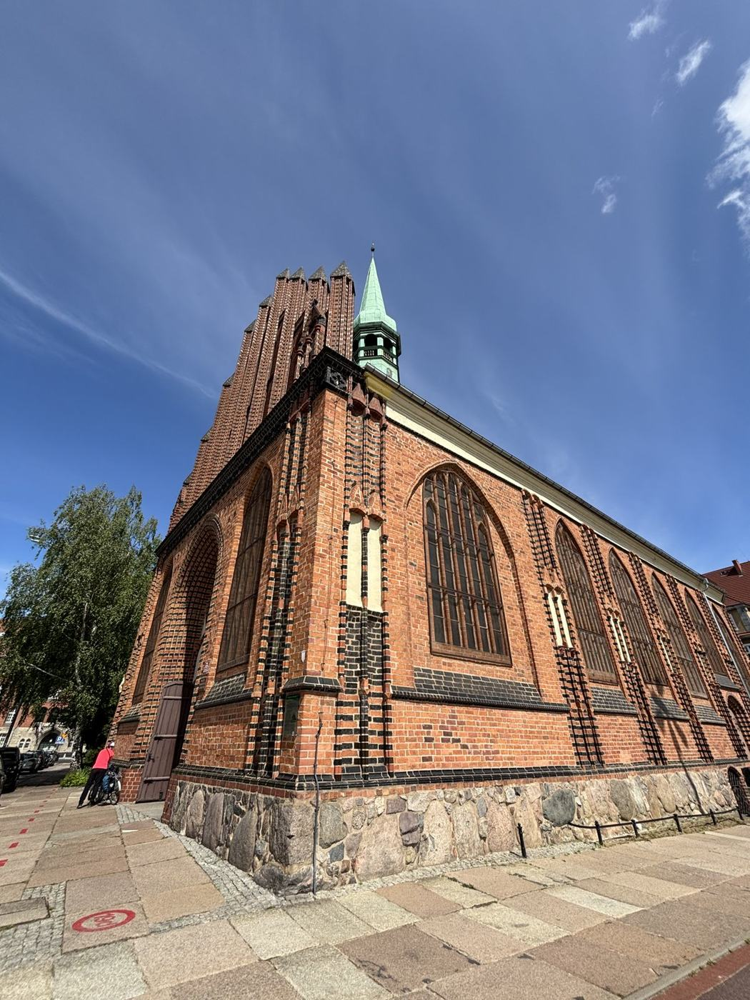

繞到正面,整座聖雅各大教堂都是紅磚砌的:尖拱的門、細長的窗,磚一路疊到塔頂。什切青最有意思的就是這些磚造建築和教堂——這是波羅的海沿岸的磚造哥德式,從呂北克一路延伸過來。

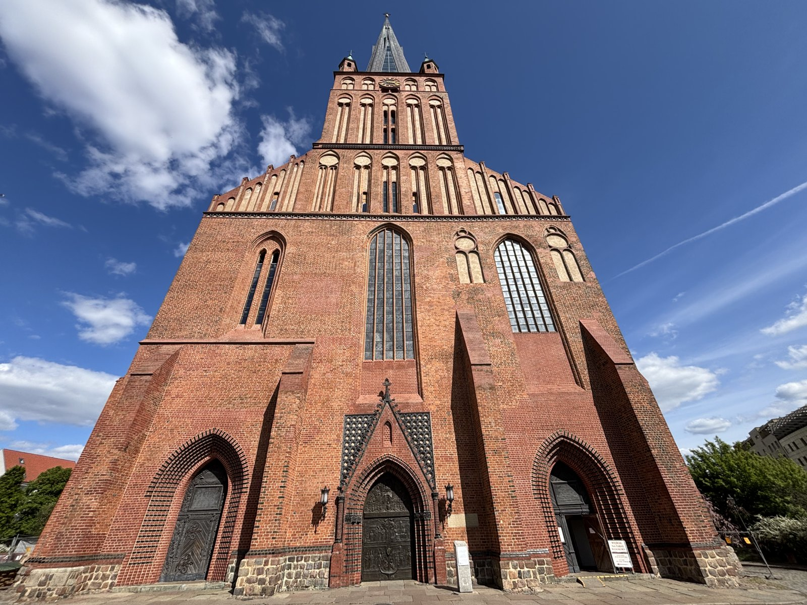

教堂的側門:尖拱的門框用紅磚和黑磚交錯砌成,木門刻滿花紋,門楣上一塊刻字的石板。

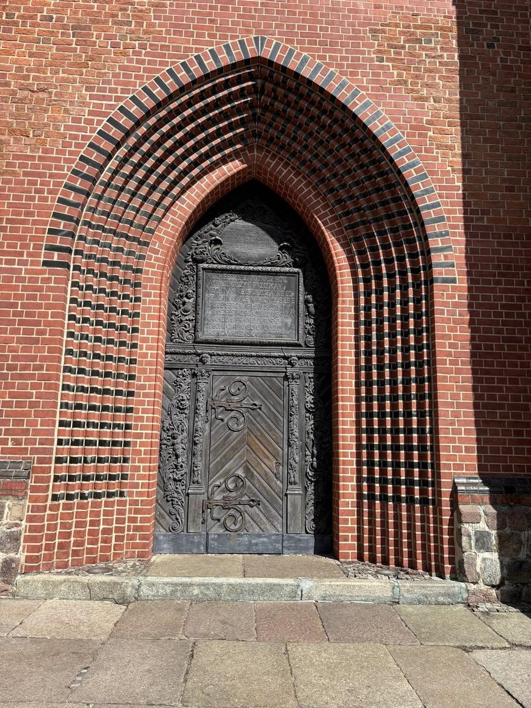

門上是一整片青銅浮雕,拱圈的紅磚一層一層往內收。

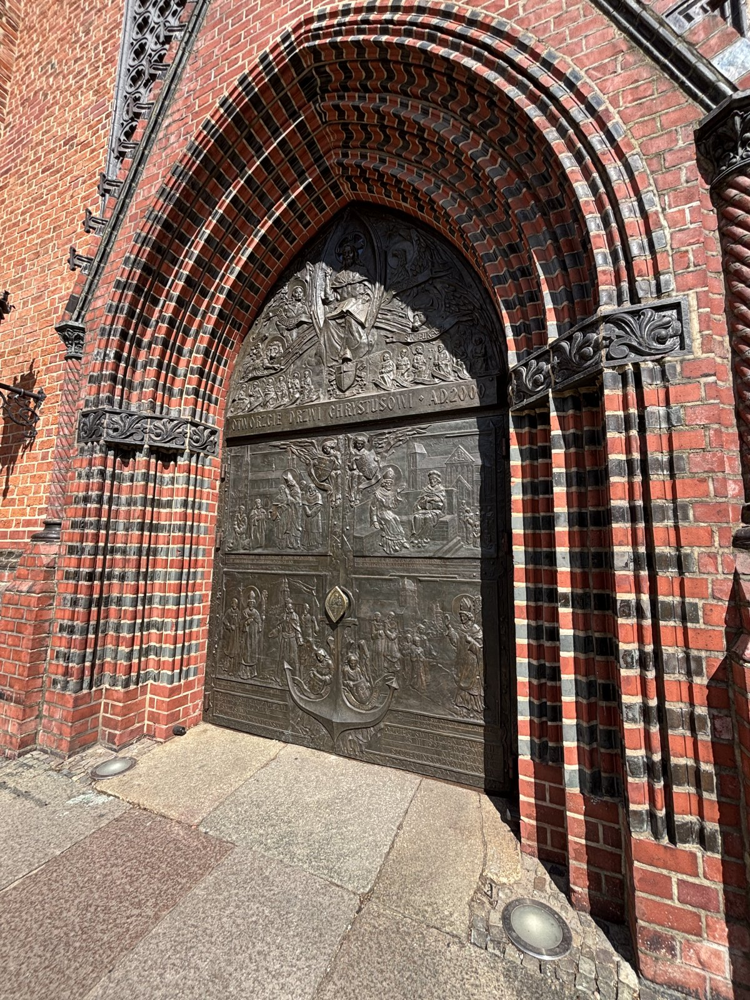

從門前抬頭,整面紅磚的塔身一路收到綠色的尖頂。

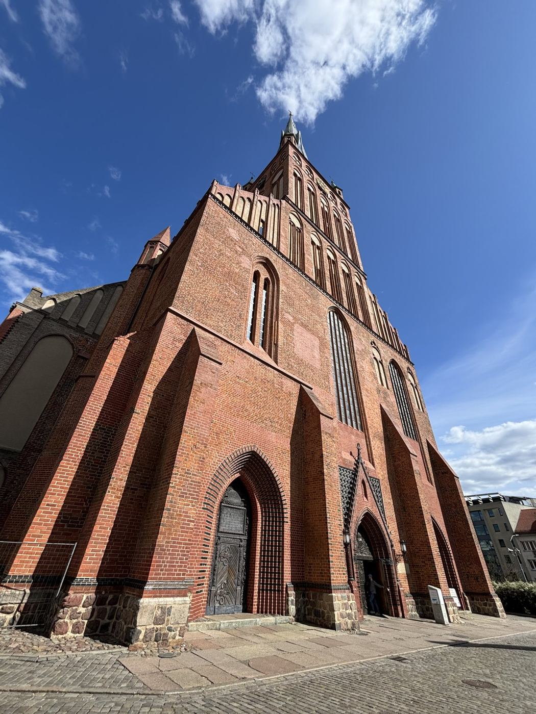

再走幾步是老市政廳,哥德式的階梯山牆,頂上一排尖尖的小塔。

連一般的樓房也有這種階梯狀的磚砌山牆,後面是舊城區的塔樓。

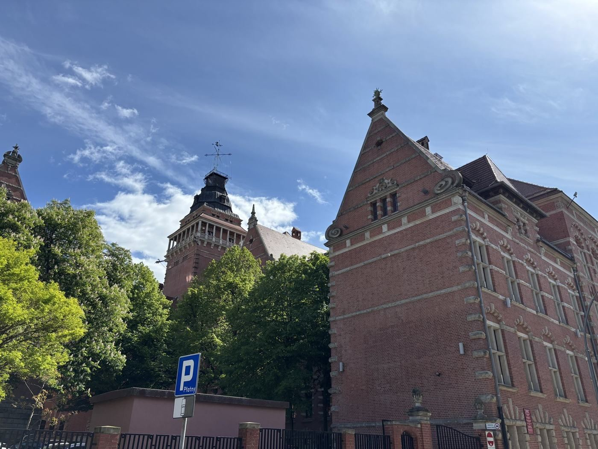

路邊停著一台很有趣的咖啡車:一台黑色的載貨三輪車,後半截撐起帳篷、罩上透明布,裡面就是一間小咖啡店——磨豆機、蒸氣管、瓶瓶罐罐都裝在貨斗上,店主站在裡面現煮。連咖啡店都能騎著走。

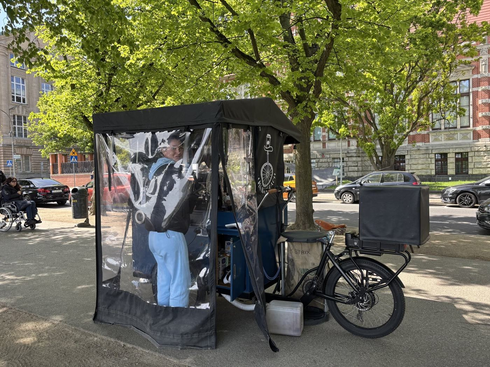

## 5/8:跨回德國,64 公里到 Ueckermünde

早上九點從 Szczecin 出發,往西北。這一天 64.4 公里、爬升 237 公尺,路線繞著 Stettiner Haff 的南岸走——奧得河出海前積成的大潟湖,德波兩國一人一半。

快十二點,森林邊一座木造的狩獵高塔,前面一整片綠色的麥田。

下午一點多,一座紅磚小教堂,前面幾棵大樹,樹蔭下一張長椅,車靠在椅子邊。

兩點多,路口一根自行車道的指標,寫著 Ueckermünde、Rieth,旁邊立著一尊木雕的人像。

接近三點,Rieth 村裡一間半木造的小屋,門口掛著 MUSEUM 的牌子,屋簷的木板漆成藍色。一間小巧的農家博物館:木門推開就是半開放的屋子,裡面把從前農家的東西原樣擺著——衣服晾在繩子上、洗衣板、五斗櫃、掛鐘、爐子、嬰兒床。沒有管理員,也沒有門票。

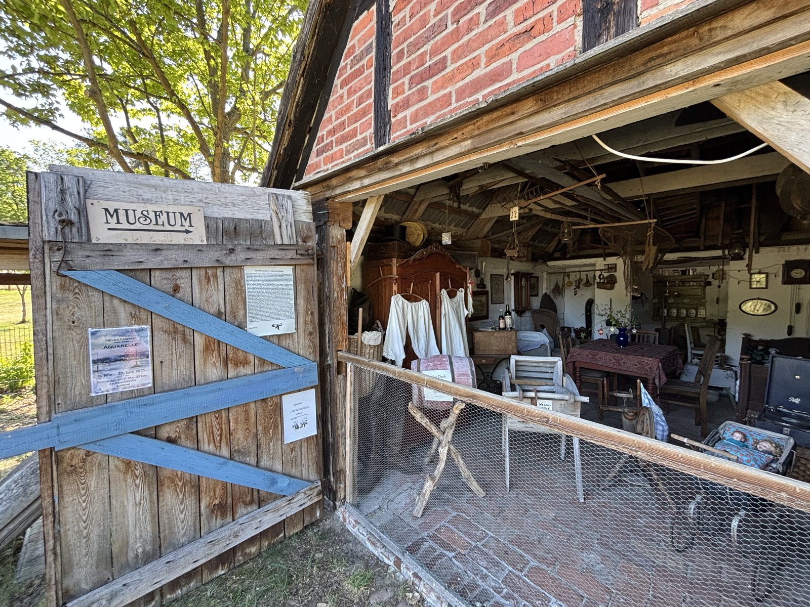

繞到側面,磚牆上吊著幾張漁網,前面靠著一台老式的黑色腳踏車。

裡面用鐵絲網圍著:白色的舊衣服掛在衣櫃前,木頭做的洗衣工具、舊桌椅、一台嬰兒車。

旁邊還有一間小小的圖書室:牆上畫著一疊書,三個書架、一張桌子、藍色的椅子和長凳。

外面的牌子寫著 **Buchhaltestelle**——「書的停靠站」。這是地區性的書籍交流空間:自己拿一本走、也放一本回來,沒有人管理,就一間紅色的小屋擺在路邊。

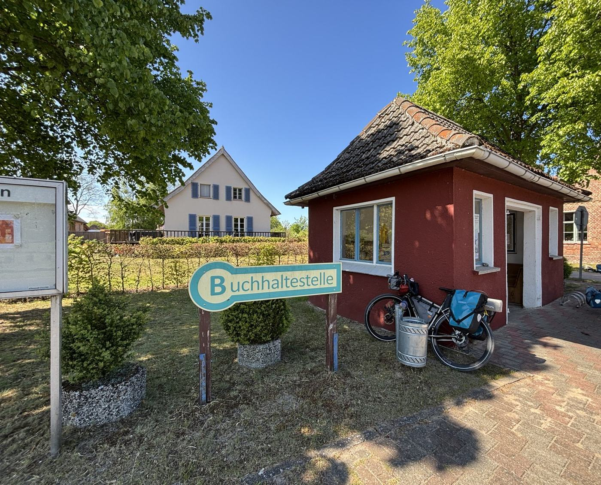

一個人口沒多少的小村子,願意留一間屋子給書,還有一間屋子保存從前的生活。台灣的鄉間好像很少看到這樣的東西,覺得蠻值得學習的。

三點多離開村子。筆直的柏油自行車道,一邊草地,一邊蘆葦。

傍晚五點,到 Ueckermünde。港口裡停著一艘木造的老式帆船,單桅,帆收著;對岸是白色的遊船和幾艘小艇。Ueckermünde 是潟湖南岸的小港,名字就是「Uecker 河口」。

## 5/9:59 公里回波蘭

5/9 早上九點多從 Ueckermünde 出發,59.3 公里。先經過一條運河:兩邊是蘆葦,一道木頭棧橋,幾艘小船,對岸一棟黃磚的房子。

十一點多,濕地邊一座木造的瞭望塔,遠處的水面後面是一排枯掉的樹。

再過去是一段碎石的堤路,一邊是運河,對岸幾棵光禿禿的樹。

十二點多,一道磚牆後面一間小磚造教堂,塔樓是半木造的,黑色的尖頂。

中午進 Anklam,穿過一座紅磚的老城門,門洞上方是階梯狀的山牆,牌子寫著限重 3.5 噸。

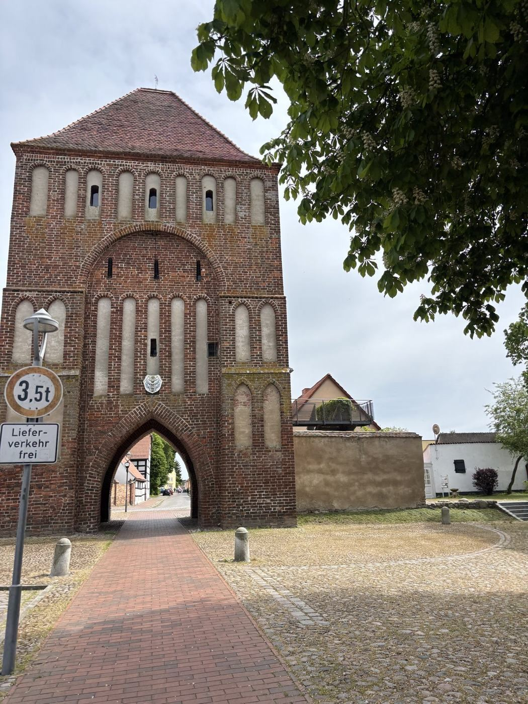

快一點,進到 Usedom 小鎮:石板路,前面是紅磚的教堂塔。小鎮和島同名。Usedom 島橫在潟湖和波羅的海之間,一島兩國:大半是德國,東端一角是波蘭,Świnoujście 就在那一角。

教堂的塔樓:紅磚的方塔,四角有階梯狀的小尖,牆上一面金色指針的時鐘,旁邊靠著一座圓形的小角樓。

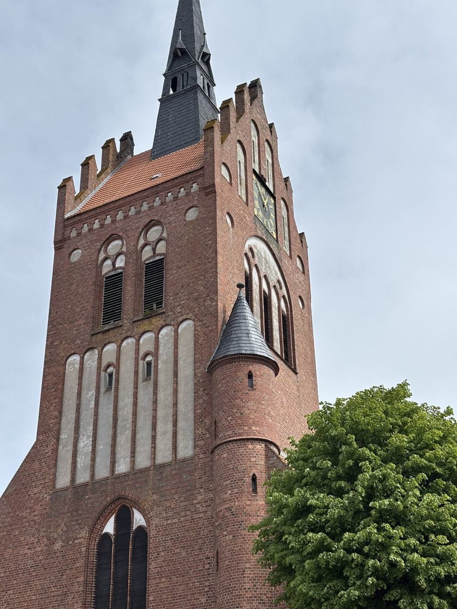

下午三點半,路邊一座白色的老風車,鐵絲網圍著,葉片早就拆了。

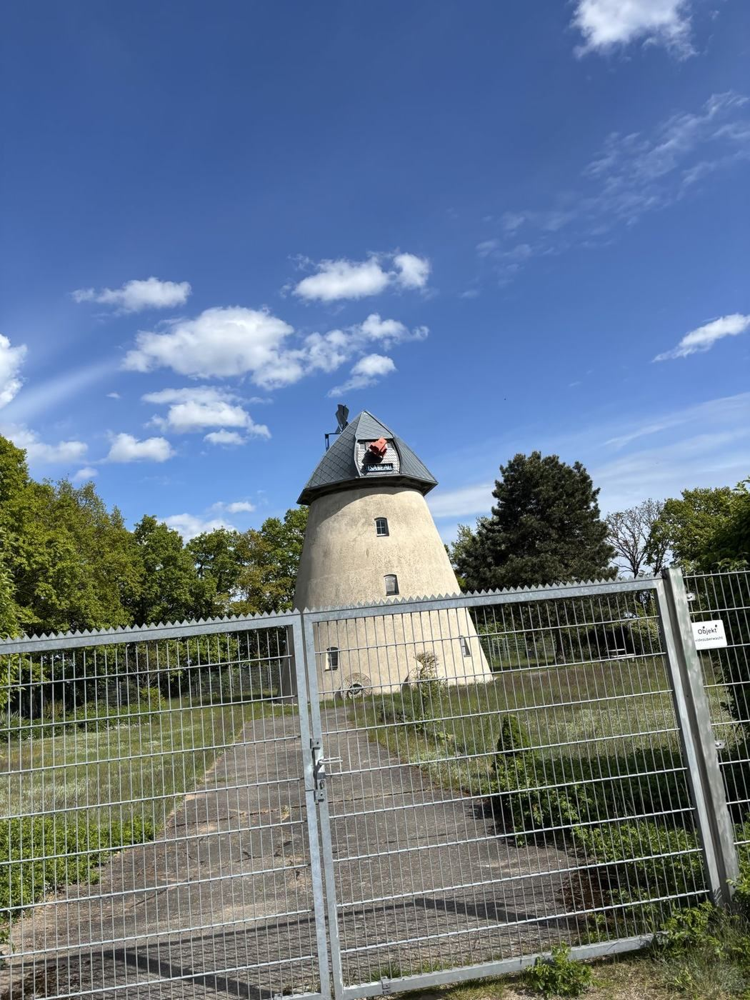

下午四點,回到波蘭,到 Świnoujście。

## 5/10–5/11:Świnoujście 和 Międzyzdroje

Świnoujście 的意思是「Świna 河口」,城市分在河兩岸的島上。5/10 只騎 19.1 公里到 Międzyzdroje。早上十點多,碼頭邊停著一艘白色的渡輪,船身寫著 Świnoujście,船尾的跳板還翹著。

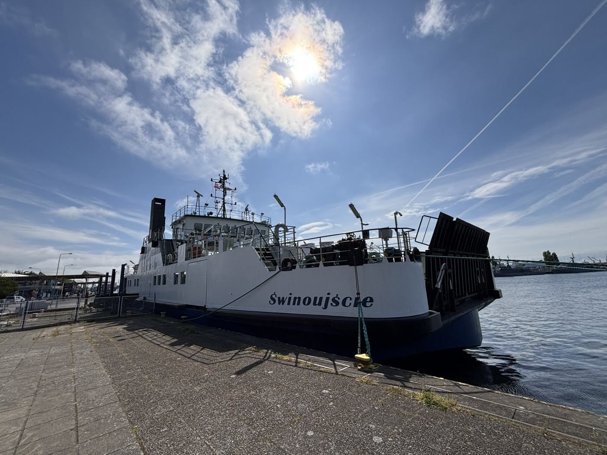

中午,松林裡的沙土路,兩邊都是筆直的松樹。Międzyzdroje 是海邊的老度假小鎮,旁邊就是 Wolin 國家公園。

松林裡出現一道鐵門,旁邊的牌子用四種語言寫著「軍事區,禁止進入」——不過再過去的紅底白字寫的是 Muzeum Obrony Wybrzeża w Świnoujściu(Świnoujście 海防博物館,Bateria Vineta)。原來是舊的海岸砲台改成的博物館。我沒有買票進去,只在外圍看了一下。

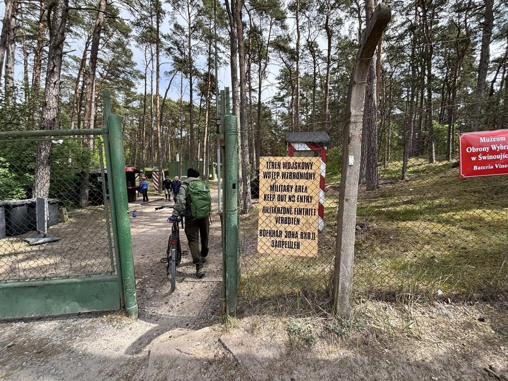

門口一間木造的售票亭,穿軍服的人站在裡面。

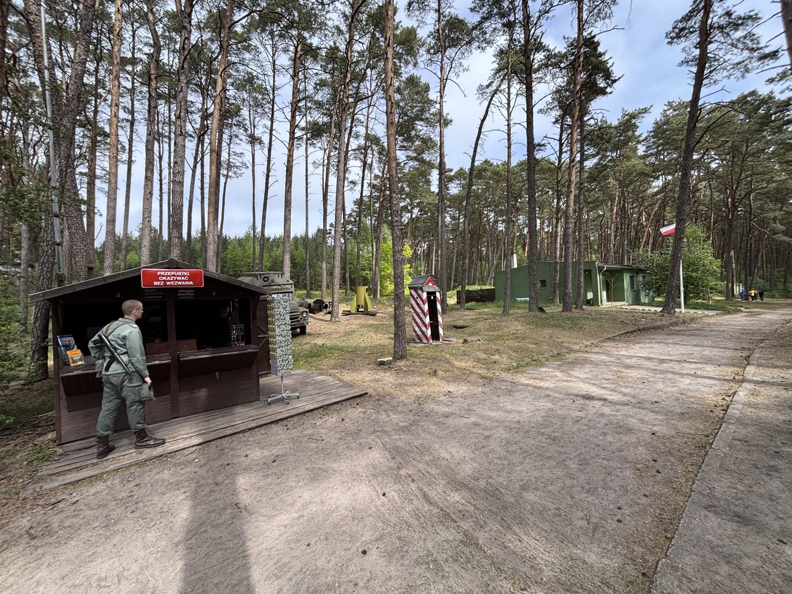

外圍的林子裡就擺著一台裝甲車,旁邊一根旗桿掛著波蘭國旗,有人爬上去坐在砲塔上。

旁邊還有一台迷彩的軍用卡車,擋風玻璃蒙著灰,掛著波蘭車牌。

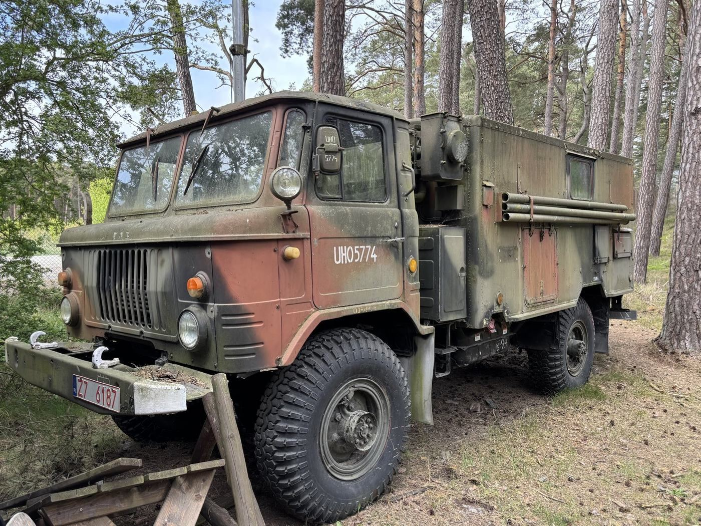

5/11 下午騎回 Świnoujście,17.9 公里。海邊的松林裡一條沙路,右手邊就是波羅的海。

三點半,松林裡一張木頭長椅,車靠在椅背後面;旁邊的松樹上釘著一個小小的神龕,掛著紅白的彩帶。

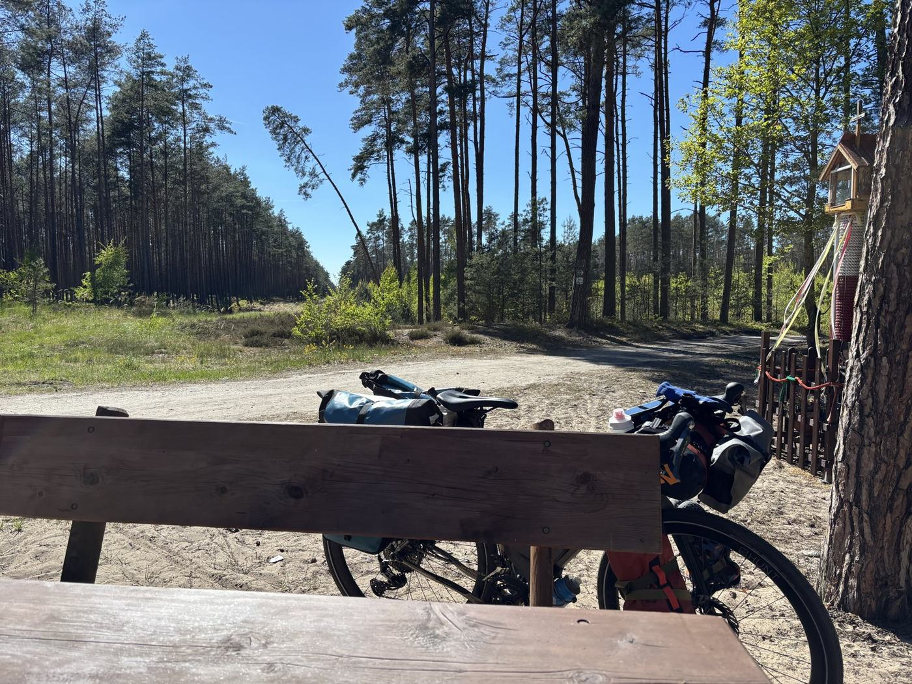



## 一對老夫妻

這一段最特別的,是遇到了一對住在丹麥的老夫妻,騎著普通的自行車——他們是從瑞典的馬爾默(Malmö)搭船過來波蘭,單車旅行。

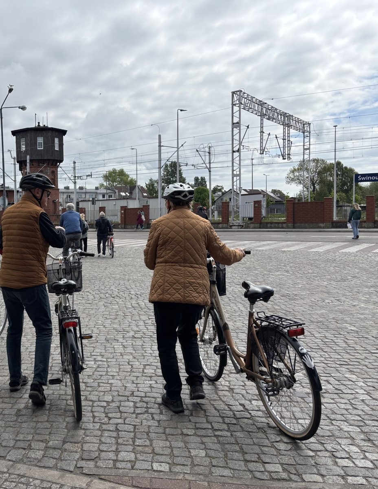

看著他們伉儷情深的樣子,很受感動。覺得如果能找到這樣的伴侶,人生應該很棒——其實生活上的物質需求不需要太多,最重要的是能夠一起走、長遠地一起騎下去。

## 夜船往瑞典

5/11 晚上九點多,TT-Line 碼頭的候船室。車停在藍色的座椅旁邊,牆上一整面渡輪的海報。

船票在 TT-Line 官網訂,現場報到跟搭飛機差不多。帶單車上船一點都不麻煩:工作人員直接告訴你到哪裡排隊,而且單車優先上船,排在最前面,不用跟在汽車後面等。

等著上船的時候,遇到五、六位從挪威騎過來瑞典的哈雷騎士,彼此交換不同的旅遊經驗,非常有趣。從聊天的過程中,也感受到挪威人崇尚自由、崇尚自然,還有豪邁的性格。

那天晚上沒訂艙房,就直接在休息區的一整排椅子上躺著睡。它分成很多區,蠻多人都是這麼做的,睡眠品質其實還算不錯。

這班夜船從 Świnoujście 開到瑞典最南端的 Trelleborg,5/12 到 Malmö。一夜過海,隔天就是北歐。

---

這段的攝影作品之後放 Flickr。
