<small>2026/2/28–3/1・山梨縣 富士五湖・兩天</small>

舊版千圓鈔的背面,印著一座倒映在湖裡的富士山。那個景真的存在,在本栖湖的西北岸,一台租來的菜籃車就騎得到。2026 年 2 月 28 日下午四點多,我站在那裡,把鈔票舉起來,跟真的山對了一次。

這趟只有兩天,車是租來的菜籃車,兩天都是電動輔助的,前面掛菜籃、座管後面掛著電池。第一天往西,騎到富士五湖最西邊的本栖湖;第二天往東,到山中湖看天鵝。兩天都是藍天,富士山大半天都露著臉。

| | |
|---|---|
| 日期 | 2026/2/28–3/1 |
| 路線 | 2/28 10:40 小街上的溫泉旅館招牌 → 11:26 湖邊碎石灘 → 12:28 熔岩洞(冰穴)→ 14:00 前後午餐 → 15:26 本栖湖東南角 → 南岸 → 15:53 西岸 → 16:05 西北岸「千圓鈔富士」→ 17:05 西湖西端 3/1 11:00 富士吉田(國道 139 號)→ 12:52 山中湖東岸(平野附近)→ 13:03 山中湖畔自行車道 → 15:56 河口湖車站北邊的租車店 時間都取自照片;有些照片沒有定位,地點是照時間順序和畫面判斷的 |
| 距離 | 把照片定位串起來、沿公路粗估,從河口湖車站出發再回到車站來算:2/28 約 55–60 公里,3/1 約 40 公里 |
| 交通 | 兩天都騎租來的電動輔助菜籃車 從東京來:新宿有高速巴士直達河口湖車站(約 1 小時 45 分),也有 JR 特急「富士回遊」直通(最快 1 小時 53 分) |
| 住宿 | 河口湖車站一帶選擇最多;要連騎兩天,可以租「過夜」方案,車晚上留在身邊(見文末) |
| GPX / Komoot | 暫無公開;路線依照片的時間與定位整理 |



二月底來,是看富士山的好時候。冬天空氣乾、雲少,是富士山最常露臉的季節,山頂的雪也最完整;夏天上山的人多,山卻常常整天躲在雲裡。只想從湖邊好好看它、不打算爬的人,冬天來最划算。代價只有一個——冷。

富士五湖是富士山北麓的五座湖:山中湖、河口湖、西湖、精進湖、本栖湖,大多是古時候富士山噴發的熔岩擋住河谷積成的。湖面海拔從河口湖的 830 公尺到山中湖的 980 公尺,二月底還是冬天。兩天的照片裡,騎車都穿著羽絨外套、戴著安全帽,第一天還戴著手套。

菜籃車夠不夠?看數字,夠。五座湖的海拔只差一百多公尺,湖邊的路大多平緩,一天四十到六十公里,騎騎停停拍照,不趕。隨身的包和水丟進菜籃,不必背在身上。兩天租的都是電動輔助車,座管後面掛著電池,車把上有切換助力的開關;電動車一整天比一般車貴 ¥1,200,湖與湖之間總有些上上下下,平常不太騎車的人,多花這一點很划算。價目表在文末。

## 2/28 往西:冰穴、本栖湖、西湖

這天最早的照片在上午十點多,富士山的山頂還埋在雲裡。十點四十分騎過一條小街,路邊立著一塊有屋簷的木招牌,寫著「食事處・溫泉旅館」,旁邊停著一台白色小貨車。街上沒什麼人,只有電線杆和藍天。

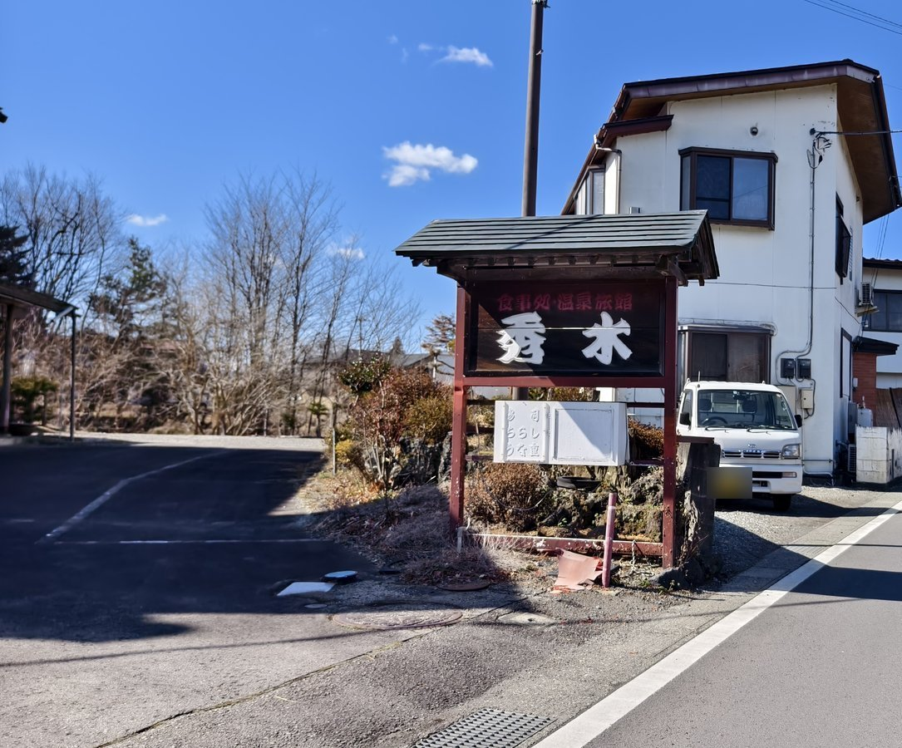

十一點多,到一座湖的碎石灘。湖水藍得很深,水面上浮著兩隻水鳥;對岸是一座尖尖的山,整片光禿禿的樹林裡,只有松杉是綠的。這張照片沒有定位,照時間順序,是往冰穴路上經過的湖——河口湖的西段,或是西湖。湖窄,對岸看起來很近。

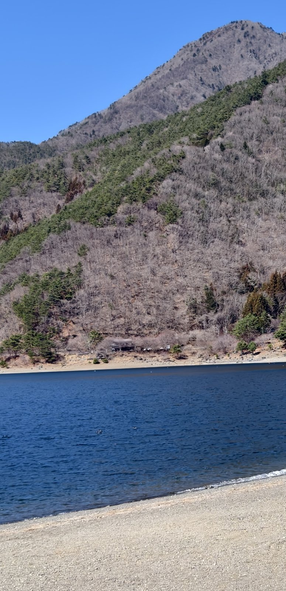

十二點半前後,鑽進一個熔岩洞,洞頂垂著一根根冰柱,岩壁上結了一層亮亮的冰。富士山北麓的青木原樹海一帶有好幾個這樣的洞,最有名的是鳴澤冰穴和富岳風穴,都是西元 864 年貞觀大噴發的熔岩流留下來的,洞裡的平均溫度只有三度左右。兩個洞離得不遠,門票都是大人 350 日圓。鳴澤冰穴全長 153 公尺,走一趟六、七分鐘,洞頂最低的地方只有一公尺上下,要彎著腰走,階梯也濕滑;富岳風穴全長 201 公尺,走一趟約 15 分鐘。

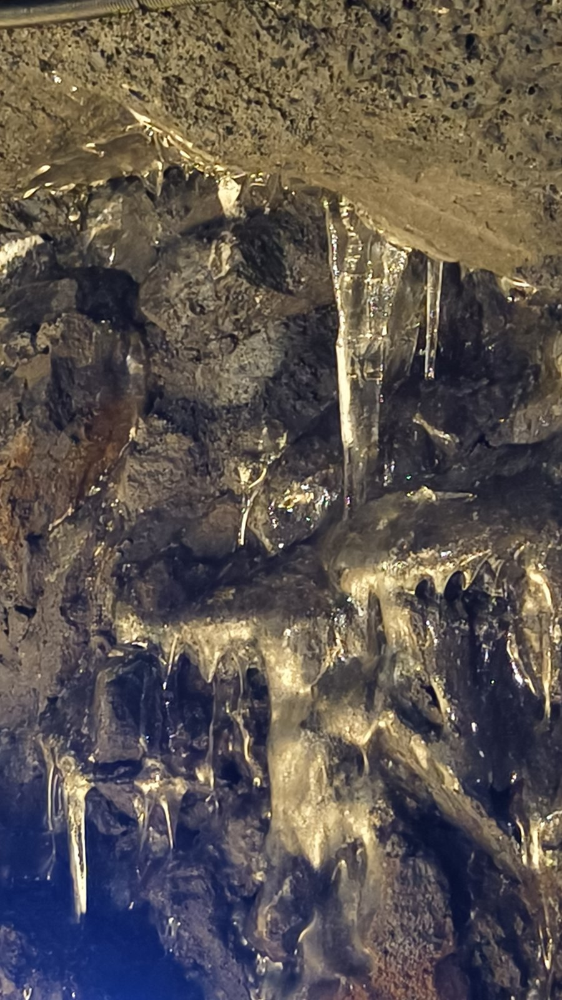

午餐在下午兩點左右。一盤蔬菜咖哩,白飯堆成一座尖尖的山,山頂還放了一撮紅的,旁邊靠著蓮藕、茄子、紅蘿蔔、南瓜,配一小碗高麗菜絲。這一帶不少店都把飯堆成富士山的樣子,叫「富士山咖哩」,這盤也是這個樣子。店在路邊,露台的欄杆上掛著鹿角,窗外是光禿禿的山;陽光斜斜地切過桌面,看著就暖。

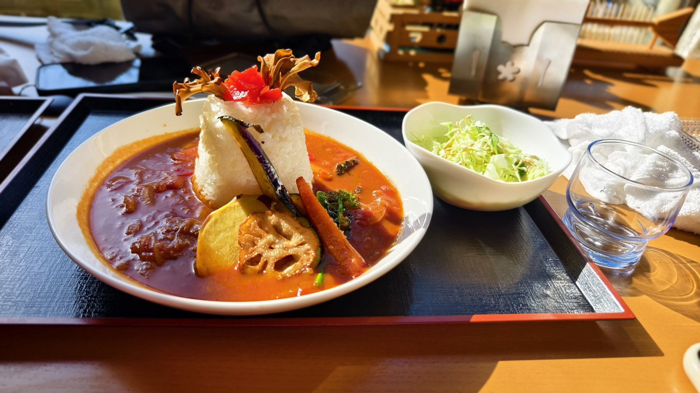

### 本栖湖

三點半前,到本栖湖的東南角。路口立著山梨縣的「路面注意」牌子,路旁的樹林還沒發芽,路上幾乎看不到車。本栖湖是富士五湖最西邊、也最深的一座,水深超過一百二十公尺,深到冬天也不結冰。

沿著南岸、西岸繞過去,富士山從松枝底下露出來,山頂一大片雪。路貼著湖走,有護欄,路肩很窄,也沒有車。

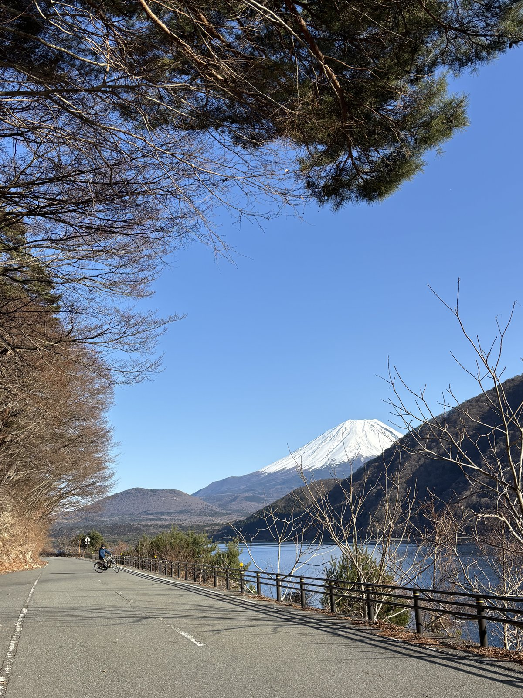

再往前是一條更窄的小路,柏油裂了幾道長縫,護欄就貼著水。傍晚的光把對岸的山照成一層淡淡的金色。這段路貼著湖面走,起伏不大,只是窄,會車要小心;照片裡,路上一台車也沒有。

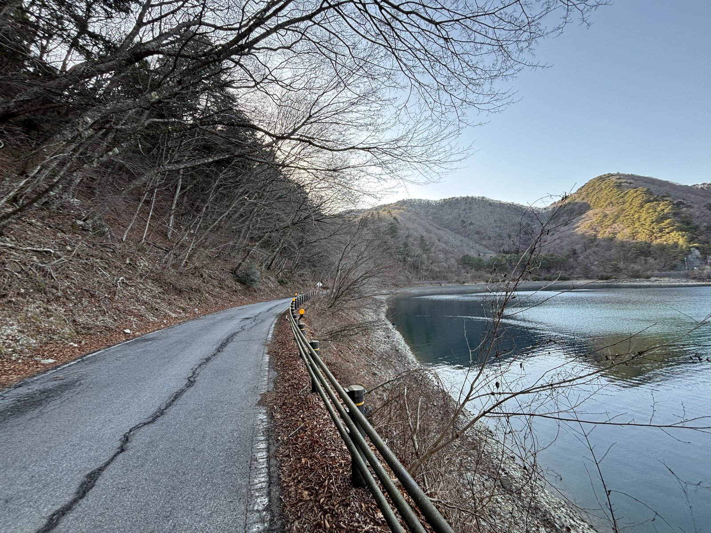

### 千圓鈔的富士山

四點過後,到本栖湖的西北岸。舊版千圓鈔——野口英世那一版——背面的富士山,就是從這一帶看出去的景,取材自攝影家岡田紅陽在本栖湖拍的作品,所以這裡被叫做「千圓鈔的富士山」。

拍照的地方就在湖邊的路旁,不用爬:照片定位的海拔約 940 公尺,只比湖面高四十公尺上下。鈔票上那個從高處看下去的角度,在上面的中之倉峠展望台,標高 1,082 公尺,從浩庵露營場附近的登山口走上去約半小時、爬升約 150 公尺。那天的照片從 16:05 拍到 16:16,一個小時後已經在西湖的西端,展望台沒有上去。

一棵松樹立在坡上,富士山在對岸,小小的,整個湖在它前面。

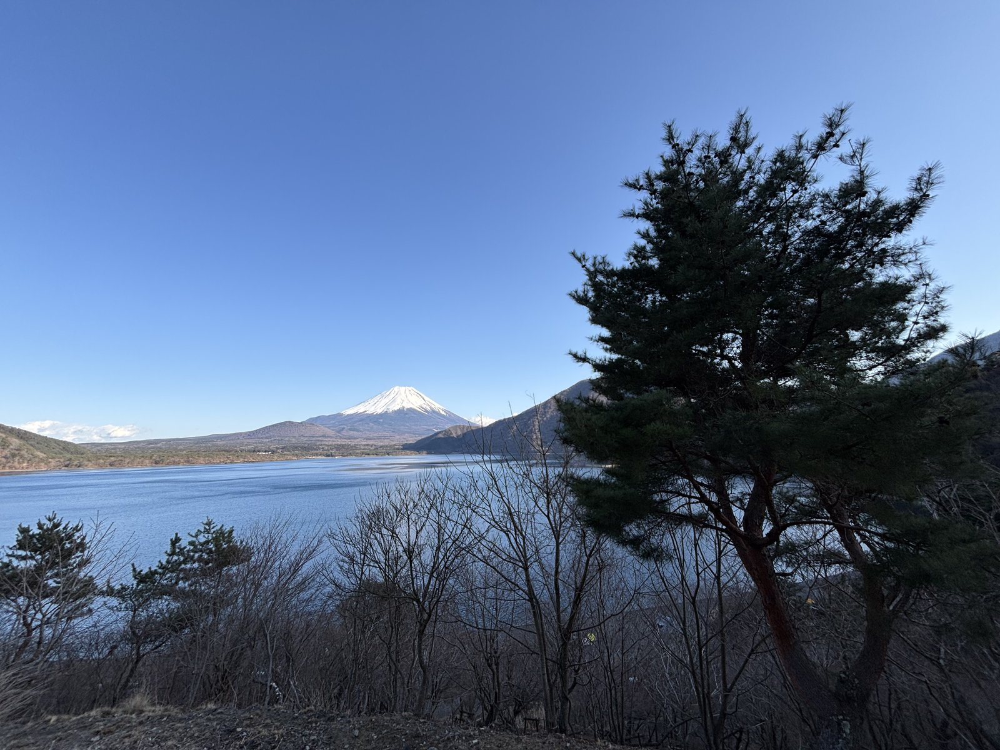

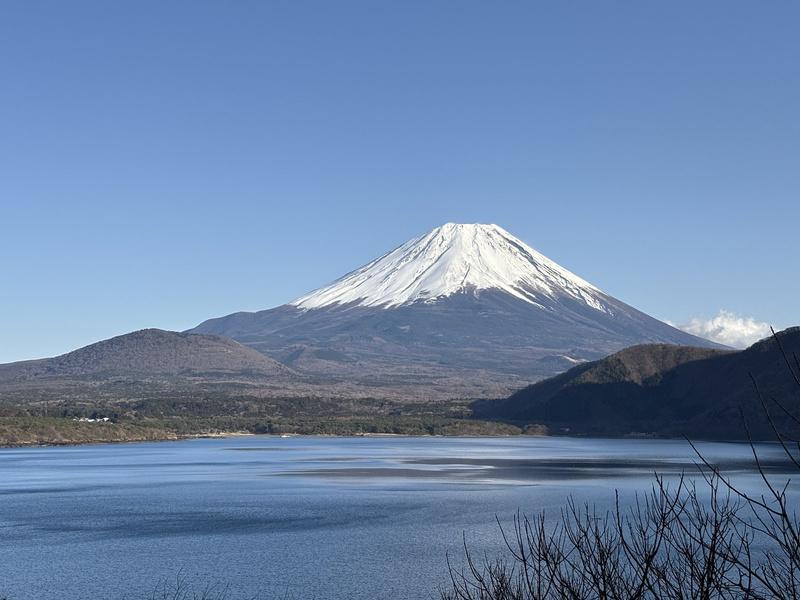

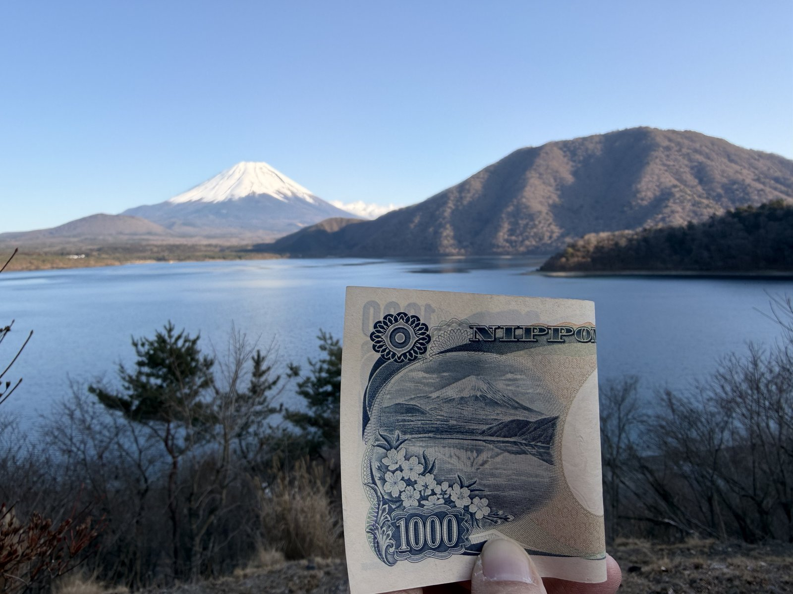

鈔票上的富士山有倒影,前面還有櫻花;那天下午湖面有風,一道道波紋,照片裡沒有倒影,也沒有花。山倒是同一座山。要來對照的人,先留一張舊版千圓鈔——2024 年 7 月起發行的新鈔,背面換成了葛飾北齋的浪,富士山縮到浪後面小小的一角。

這天最後一張照片是 17:05,定位在西湖的西端,湖邊的小船已經翻過來疊好收了。這裡離河口湖車站還有十幾公里,那天的日落大約在 17:40——冬天往西騎這一圈,回程要算在天黑之前。

## 3/1 往東:富士吉田、山中湖

上午十一點前後,騎上富士吉田的國道 139 號。好幾線道,人行道和車道之間種著修得整整齊齊的灌木,兩旁是二手車行、鞋店、咖啡店和大大小小的招牌,路筆直地對著富士山,山就在路的盡頭,把整個路口填滿。富士吉田離山近,市區往南的直路,盡頭常常就是它。

### 山中湖的天鵝

12:52,手機定位在山中湖東岸、平野附近。山中湖是富士五湖裡面積最大、湖面也最高的一座,海拔大約 980 公尺;湖的東岸正對著富士山,山腳下是一大片枯黃的草原,再往下才是湖。

湖岸是黑色的火山石和砂,遊客沿著水邊拍照,兩隻天鵝就在岸邊游。是疣鼻天鵝:橘色的嘴,嘴基有一塊黑色的突起。山中湖的疣鼻天鵝,是 1968 年從山口縣宇部市引進的兩對(四隻)繁衍下來的,現在約六十隻定居在湖上,一年到頭都看得到。

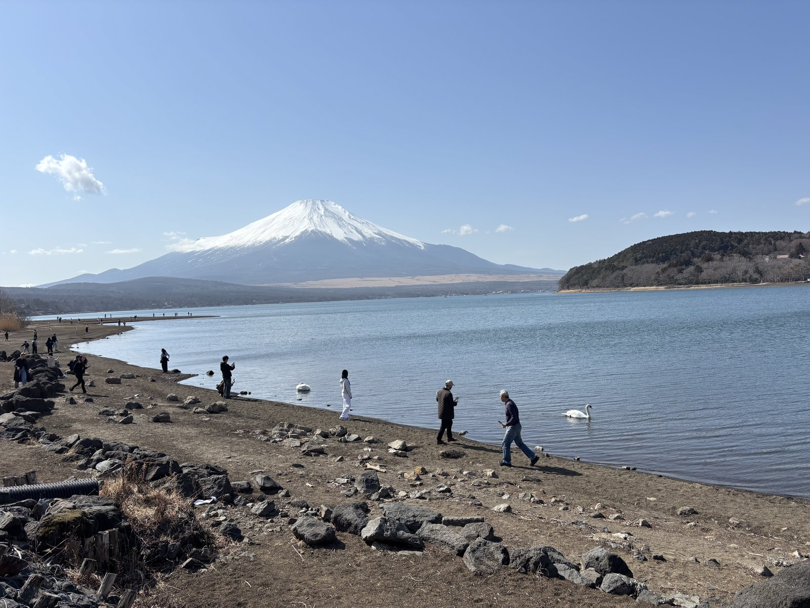

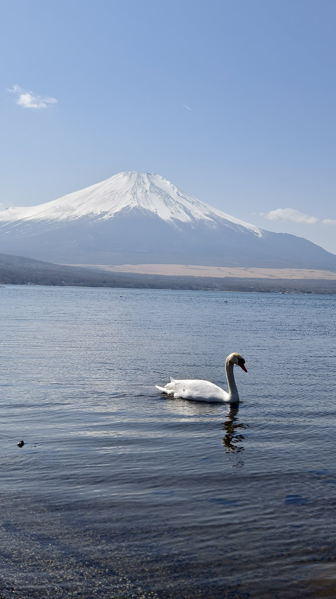

山中湖邊有一圈自行車道,繞湖一圈大約 14 公里,大部分跟汽車道分開,靠湖那一側有圍欄。下午一點多,騎上這條車道;富士山的半山腰掛著一圈雲,一艘小遊船從山前面慢慢開過去。這段車道是單車和行人共用的,遊客常停在圍欄邊拍富士山,騎慢一點。

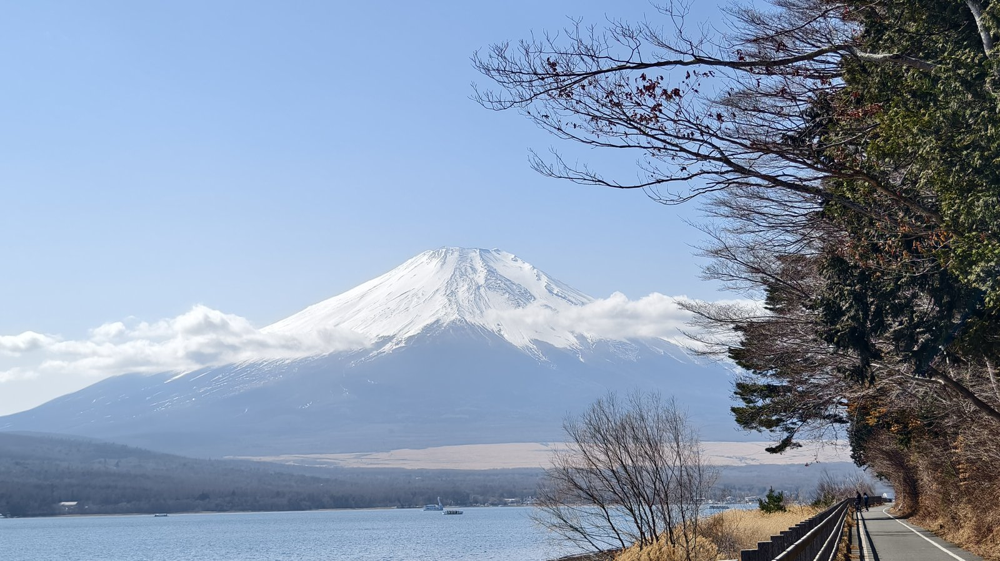

下午快四點,騎到河口湖車站北邊五百公尺左右、一家門口寫著「Rental Bike & Luggage Keeping」的店;文末的租車價目表,就是 15:56 在這家店門口拍的。第二天那台淺藍色菜籃車的車架上,貼著的就是這家店的電話,車是在這裡租的。

兩天下來,富士山從鈔票上、從大馬路的盡頭、從天鵝的背後,換了好幾個樣子出現,哪一個都不用爬山就看得到。看富士山不必上山,也不必好車;冬天、兩天、一台菜籃車,就看夠了。

## 這一段的實用筆記

**怎麼到河口湖**

- 從東京去河口湖,最省事的是新宿高速巴士總站(Busta 新宿)出發的富士急高速巴士,直達河口湖車站,約 1 小時 45 分;大人單程 ¥2,200 起,網路預約並付款另有折扣(2026 年 9 月富士急官網)。
- 搭電車:JR 特急「富士回遊」從新宿直通河口湖,最快 1 小時 53 分;或搭 JR 中央線到大月,轉富士急行線。

**帶自己的單車來**

- 高速巴士:新宿—富士五湖線可以帶單車,但要拆開或折起來、裝進輪行袋,放行李艙;雙層巴士不能帶,行李艙滿了也不能改帶上座位,出了損壞不賠(富士急官網)。
- 電車:富士急行線和 JR 都一樣,單車拆開或折疊、裝進專用的輪行袋,就能當隨身行李免費帶上車。
- 這趟我在當地租車。三月中,我帶著自己的單車從大阪關西機場進、也從關西機場出,在日本騎了一個月。帶車出國最麻煩的是裝車的紙箱,我的做法是:落地那天已經是晚上,就住關西機場島上、跟車站相連的飯店,紙箱寄放在飯店,隔天早上直接從飯店出發;回程再回到同一家飯店,用寄放的紙箱把車打包上飛機。紙箱寄放的細節、輪行袋怎麼搭 JR,寫在〈[2026 日本](../2026-jp-01-sanin/)〉系列。

**租車**(3/1 在河口湖車站北邊那家租車兼寄行李的店門口拍到的價目表,2026 年 3 月)

| | 一般單車 | 電動輔助單車 |
|---|---|---|
| 1 小時 | ¥500 | ¥600 |
| 3 小時 | ¥1,300 | ¥1,800 |
| 一整天 | ¥1,600 | ¥2,800 |
| 過夜 | ¥1,600–4,000 | ¥2,800–6,500 |

- 同一張價目表:寄放行李一件 ¥500,租車的人寄行李 ¥300;營業時間 9:00–18:00(18:00 是貼紙上手寫補上的)。搭電車來、只騎一天的人,行李可以直接寄在店裡。
- 兩天騎的都是電動輔助菜籃車:第一天那台橄欖綠的,看得到電池和車把上的助力開關;第二天那台淺藍色的,前輪花鼓是馬達,座管後面也有電池。兩天都戴了安全帽。日本從 2023 年 4 月起,騎單車戴安全帽是「努力義務」,租車店多半備有,租的時候問一聲。

**住宿**

- 河口湖車站一帶住宿最集中,從青年旅館、商務旅館到湖邊的溫泉旅館都有;住車站附近,租車店、巴士站、便利商店都走得到。
- 單車晚上停哪:租的車,當天 18:00 前還;要連騎兩天,價目表上有「過夜」方案(電動車 ¥2,800–6,500),車可以留在身邊。住的地方能不能停單車,訂房時先問清楚。

**路況與距離**

- 五湖的海拔:河口湖 833 公尺、西湖 900、精進湖 900、本栖湖 900、山中湖 980。湖與湖之間多是緩坡,不是山路。往西走國道 139 號,從河口湖車站(約 860 公尺)緩緩爬到冰穴一帶的一千公尺上下,十一公里爬一百五十多公尺,平均坡度不到 2%,再慢慢下到本栖湖;往東要先下到富士吉田(約 800 公尺),再用六公里左右爬升將近 190 公尺到山中湖,平均約 3%,比往西那段陡一些(依國土地理院標高粗算)。
- 公路距離(概略):河口湖車站 → 鳴澤冰穴約 12 公里;→ 本栖湖東南角約 20 公里;→ 山中湖約 15 公里(到東岸平野約 19 公里)。
- 直線距離(照片定位):河口湖車站附近 → 山中湖東岸約 15 公里;→ 本栖湖西北岸約 18 公里;本栖湖西北岸 → 西湖西端約 9 公里。實際騎的路一定更長;把照片定位串起來沿公路算,從車站出發再回到車站,2/28 約 55–60 公里,3/1 約 40 公里。
- 湖與湖之間主要靠國道 139 號(往西)和 138 號(往山中湖),都是觀光巴士、貨車也走的幹道。富士吉田市區那段國道 139 號好幾線道,人行道寬,和車道之間隔著一排灌木。想少走幹道,河口湖、西湖都有繞湖的湖畔路可以接。
- 本栖湖西岸的湖畔路窄、柏油有裂縫、護欄緊貼湖面,路口有山梨縣的「路面注意」牌子;車很少。
- 山中湖畔的自行車道跟汽車道分開,繞湖一圈約 14 公里;單車和行人共用,遊客會停在路邊拍照。

**景點與費用**

- 鳴澤冰穴、富岳風穴:門票都是大人 ¥350、小學生以下 ¥200(官網價)。鳴澤冰穴全長 153 公尺,走一趟六、七分鐘,洞頂最低約一公尺,要彎腰;富岳風穴全長 201 公尺,約 15 分鐘。洞裡平均約 3 度,階梯濕滑,穿好走的鞋。開放時間隨季節變:2/16–2/28 是 9:00–16:00,3/1–3/15 是 9:00–16:30(官網)。
- 千圓鈔富士山:本栖湖西北岸、浩庵露營場一帶的湖邊路旁,就看得到同一座山,不用爬;要鈔票上那個從高處看的角度,得從登山口走到中之倉峠展望台(標高 1,082 公尺,上去約 25–30 分鐘,爬升約 150 公尺;登山口附近有停車場)。要對照請帶舊版千圓鈔(野口英世那一版);新鈔背面不是這座山。
- 白飯堆成富士山形狀的「富士山咖哩」,這一帶不少店都有。

**補給**

- 河口湖、富士吉田、山中湖周邊都有便利商店;西湖到本栖湖之間店少,國道 139 號上有道之驛鳴澤可以補給。

**天氣與穿著**

- 二月底、三月初,湖面海拔 830–980 公尺。河口湖二月的平均最低氣溫在零下五度上下、最高只有六、七度(氣象平均值)。這兩天比往年暖:河口湖氣象站的紀錄,2/28 最低 4.1 度、最高 17.8 度,3/1 最低 1.3 度、最高 17.5 度。兩天都是大晴天,照片裡騎車都穿著羽絨外套,第一天還戴著手套;冰穴裡還掛著冰柱。
- 兩天照片裡的路面都是乾的,路邊也沒有積雪。平常年份的二月,清晨常在零度以下,樹林裡背陰的彎道可能結冰,早上別出發得太早。

**怎麼排這兩天**

- 往西(冰穴、本栖湖)路比較長,西湖到本栖湖之間店也少;冬天冰穴下午四點多就關、日落在 17:40 前後,要早點出門。
- 往東(富士吉田、山中湖)比較短,山中湖有和汽車道分開的湖畔自行車道,第一次在日本騎車的人,從這一天開始比較輕鬆。
- 兩天的照片裡,富士山最完整、前面又有湖的,是本栖湖西北岸和山中湖東岸這兩處。

**GPX / Komoot**

- 暫無公開。文中的路線、時間和距離,是把照片的時間和定位串起來整理的。

---

這段的攝影作品之後放 Flickr。
