<small>2026/3/18–3/22・鳥取縣、島根縣|下一站:[丹後・若狹](../2026-jp-02-tango-wakasa/)</small>

3 月 18 日晚上,關西機場的行李轉盤旁,我的單車還裝在一個紙箱裡。隔天早上,它換進一個黑色的輪行袋,立在 JR 特急最後一排座位的後面。再過一天,它連袋子都不用套,整台站在一畑電車的車門邊,沿著宍道湖往松江開。

帶單車出國,很多人卡在同一件事:落地之後,那個大紙箱要放哪裡,回程又去哪裡生一個箱子出來。這趟日本我是大阪進、大阪出,去回都走關西機場,做法很簡單——第一晚就住在機場島上的日航飯店,空紙箱寄放在飯店,隔天從飯店直接出發;整趟騎完回程,再回到同一家飯店領紙箱、把車打包好。

這趟日本一個月,第一站是山陰——本州面向日本海的那一側,鳥取縣和島根縣。從關西機場進來,到鳥取只要換一次車;山陰是這趟路線最西的一頭,之後幾站一路往東走丹後、若狹,不用走回頭路。五天裡,單車換了三種方式搭車:紙箱、輪行袋、整台推上車。剩下的路,自己騎——照片位置推算,每天十幾到五、六十公里,不趕。這一站與其說是騎車,不如說是一堂帶單車搭車的課。

行李很少:一個把手袋、一個車架袋、後架上一個防水袋,再加一個搭車時放上行李架的橘色大袋子。晚上落腳的地方:第一晚是機場島上的飯店,之後是鳥取車站一帶,以及松江、米子一帶。東西少,拆車、裝袋、上下火車都輕鬆一點。

| | |
|---|---|
| 日期 | 2026/3/18–3/22 |
| 路線 | 3/18 台北 ✈ 關西機場(住機場島上的飯店,紙箱寄放在那裡) 3/19 關西機場 ‖ JR 特急はるか ‖ 新大阪 ‖ 超級白兔號 ‖ 鳥取 → 河堤 → 因幡自行車道 → 鳥取砂丘 → 鳥取市區 3/20 鳥取 ‖ JR ‖ 出雲市 → 出雲大社 → 稻佐之濱 → 往日御碕的海岸公路(騎一小段折返)→ 出雲大社前 ‖ 一畑電車 ‖ 松江しんじ湖溫泉 → 松江市區 3/21 米子 → 弓濱半島 → 江島大橋 → 江島 → 中海上的堤防道路 → 島根半島北岸(片江、惣津)→ 境水道大橋 → 境港・水木茂之路 → 弓濱自行車道 → 米子 3/22 米子 → 安來 → 中海南岸 → 松江城・塩見繩手 → 宍道湖畔 → 米子 |
| 距離 | 照片位置粗估(不是 GPS 紀錄):3/19 約 15–20 km、3/20 約 15–20 km、3/21 約 60 km、3/22 三十多 km(單程) |
| 交通 | 飛機(單車裝紙箱)+ JR(輪行袋)+ 一畑電車(整台推上車)+ 單車 |
| 單車紙箱 | 寄放在關西機場島上的日航飯店:落地當晚入住、把車拿出來、空箱寄放,隔天從飯店直接出發;回程回到同一家飯店領箱、打包 |
| 住宿 | 3/18 關西機場日航飯店(Hotel Nikko Kansai Airport,機場島上唯一的飯店,和第一航廈、關西機場站用通道相連) 3/19 鳥取車站附近 3/20–3/22 松江、米子一帶;3/21、3/22 晚上都回到米子車站一帶,3/22 早上也從那裡出發 |
| GPX / Komoot | 這一站沒有附軌跡檔,距離依照片位置推算 |
| 天氣 | 3/19 鳥取上午下雨、下午多雲時晴;3/20–3/21 晴;3/22 陰(日本氣象廳紀錄) |



## 3/18 關西機場:單車裝紙箱上飛機,紙箱寄放在機場飯店

晚上六點四十分,關西機場入境大廳。行李轉盤旁的牌子寫著 IT212 台北——台灣虎航從桃園來的班機。單車裝在一個瓦楞紙箱裡,是單車品牌出貨新車用的那種箱子,外面綁了兩條綁帶,立在推車旁邊的地上。

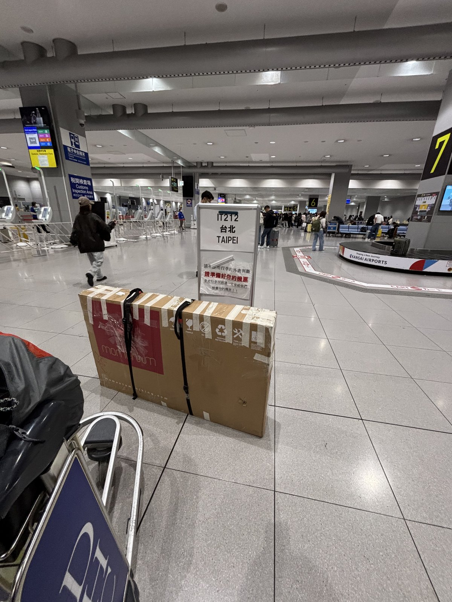

到的時候已經是晚上,這天不騎車,直接住機場。七點前,我把紙箱斜靠在行李推車上,一路推到機場島上的日航飯店門口。飯店在航廈旁邊的 Aeroplaza 裡,和第一航廈、JR/南海關西機場站之間都有室內通道直接相連,不用出戶外。門口立著一塊告示:住客可以推著機場的行李推車,直接搭電梯到一樓櫃台辦入住——拖著一個單車紙箱的人,最需要的就是這一句。

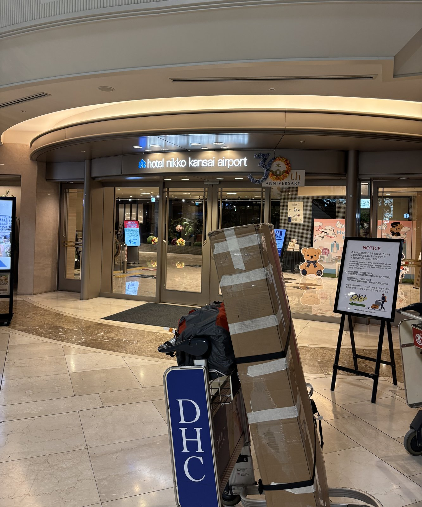

在飯店把車從紙箱裡拿出來、換進輪行袋,空紙箱寄放在飯店。晚餐是一份炸豬排定食。隔天早上,從飯店直接走到關西機場站搭車;整趟騎完回程,再回到這家飯店把紙箱領出來,在那裡把車拆好、裝箱,再推去航廈報到。去回都不用在日本另外找紙箱、丟紙箱。

## 3/19 鳥取:JR 輪行袋、因幡自行車道、鳥取砂丘

早上七點多,單車已經在黑色的輪行袋裡,立在 JR 特急最後一排座位和車廂牆壁之間;橘色的袋子放上行李架。車廂牆上貼著 Hello Kitty——這是從關西機場往新大阪的「はるか」特急。

在日本搭 JR 帶單車,規矩很簡單,也很硬:車子要拆到能整台裝進輪行袋,袋口收好、不能露出任何一部分;三邊加起來 250 公分以內、30 公斤以內,不另外收費。輪行袋有前後輪都拆的,也有只拆前輪的,看袋子的款式。特急列車上,袋裝的單車有大型行李區就放那裡,沒有的話,輪行的慣例是放在最後一排座位跟牆壁之間——剛好塞得進一台;買指定席的時候挑最後一排,車就在自己身後。

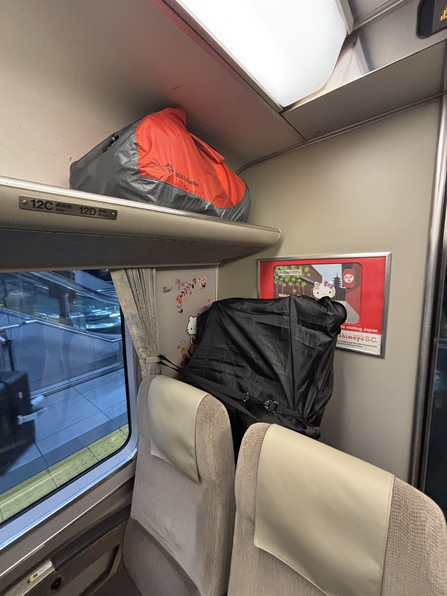

在新大阪換上 9:15 開的超級白兔 3 號(Super Hakuto),走智頭急行線穿過中國山地,兩個半小時左右到鳥取。指定席是前一天落地後,在 JR 關西機場站先買好的,我在鳥取(Tottori)下車。中午,人已經在鳥取車站前。

在車站前把車組回來,十二點四十分,車已經組好、行李也掛上了。午餐在車站附近一家燒肉店吃;下午出門時,後架已經空了,只帶把手袋和車架袋。三點,人在河堤上,堤上開了一片黃色的油菜花。

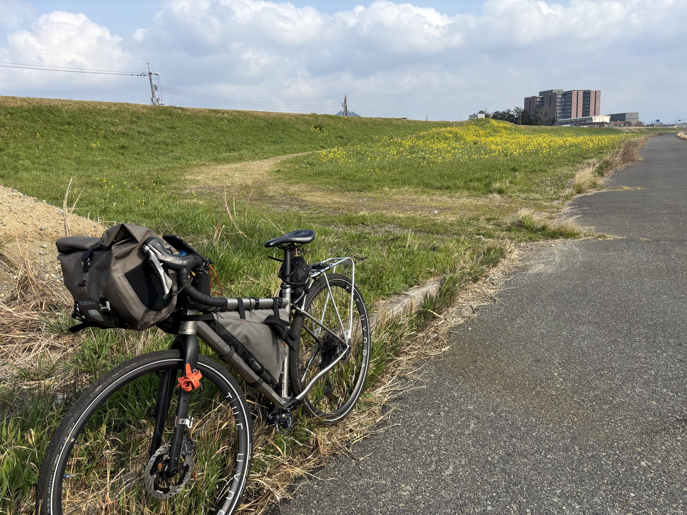

往海邊的方向,路邊出現一塊藍色的路牌:因幡自轉車道,Inaba Cycle Road。中間漆成綠色的自行車道鑽進還沒長葉子的樹林裡,一路沒有車。

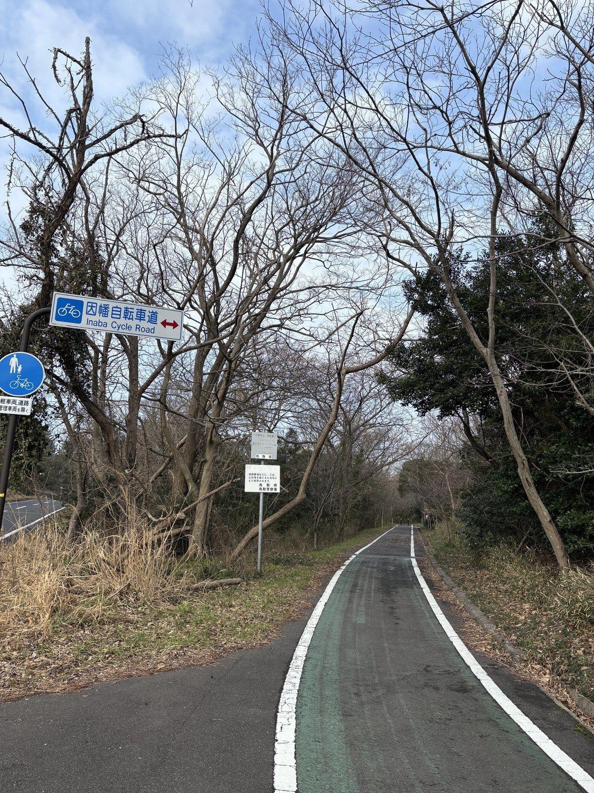

路過沙丘旁的砂之美術館,四點前到了鳥取砂丘。這片沙丘東西約 16 公里、南北約 2.4 公里,是山陰海岸國立公園的一部分。站在沙坡上看出去,是一道面海的大沙脊,叫「馬背」(馬の背);沙脊下的低窪處積了一池水,人一個一個小小的往上爬,後面就是日本海。

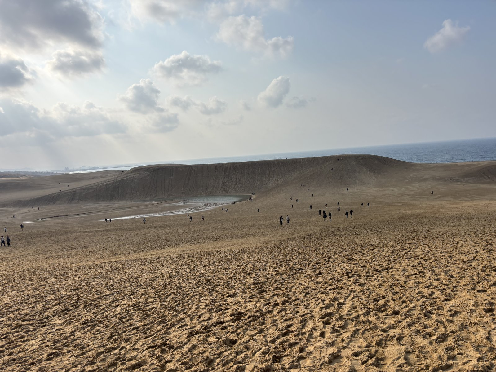

照片時間看,我在沙丘上停了十五分鐘左右。從入口到馬背直線只有 400 公尺左右,可是沙地一步一陷;鳥取市的官方觀光網站建議,慢慢爬上高約 47 公尺的馬背、休息、再走回來,要留一個小時。騎車來的人,這一小時要算進去。回程沿著河堤上的小路騎回市區,天上堆著大朵的白雲,遠處一排矮矮的山。

## 3/20 出雲大社、稻佐之濱,一畑電車整台推上車

3/20 是春分之日,日本的國定假日。這天單車又裝回輪行袋,從鳥取搭 JR 一路往西;十一點多,車窗外已經是宍道湖。中午在出雲市站下車、組車,經過出雲巨蛋,一點多到了出雲大社(Izumo Taisha)。大鳥居下的石階上全是人。

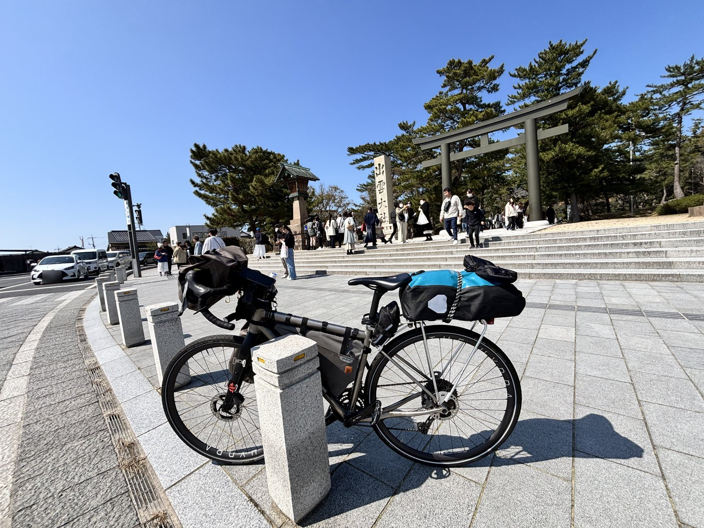

出雲大社是日本最古老的神社之一,供奉大國主大神,求姻緣的人特別多。穿過松樹參道,再過一座鳥居,後面就是拜殿。

最有名的是神樂殿屋簷下那條大注連繩:長約 13.6 公尺,重約 5.2 噸。站在底下抬頭看,稻草編成的繩結比人還粗。

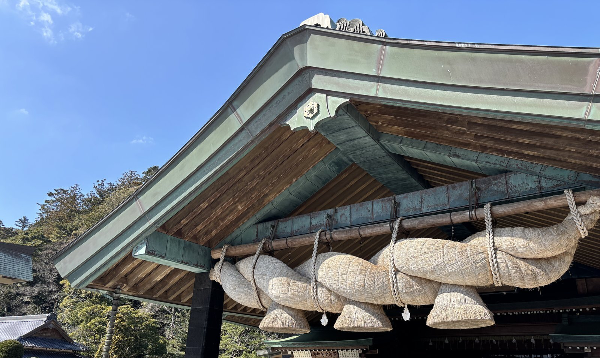

假日的出雲大社,人是真的多:大鳥居前、拜殿前、注連繩底下都是人,要拍一張沒有人頭的照片得等。想看安靜一點的大社,最好避開假日。

三點半過後,往西騎到海邊,再沿著海岸公路往北、往日御碕的方向騎。路在懸崖邊繞,雙線道、有護欄,護欄外就是浪花拍著黑色的礁岩。騎到離稻佐之濱兩公里多的地方,我就掉頭了;從那裡到日御碕燈塔,還有五公里多的海岸山路。

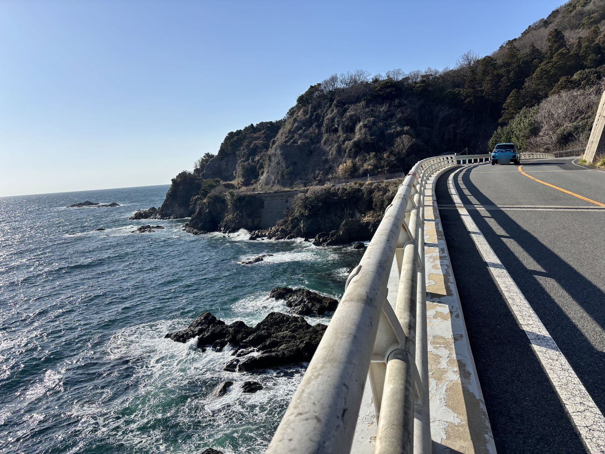

四點多,回到稻佐之濱(稲佐の浜)。沙灘上那塊大岩石叫弁天島,岩上有一座小鳥居。傳說每年舊曆十月,全日本的神明都從這片海灘上岸,聚到出雲開會——所以別的地方把十月叫「神無月」,出雲叫「神在月」。太陽已經偏西,弁天島只剩一個黑色的輪廓。稻佐之濱面朝西,本來就是出雲看夕陽的地方;下午以後看弁天島都是逆光,想拍順光的弁天島得上午來。

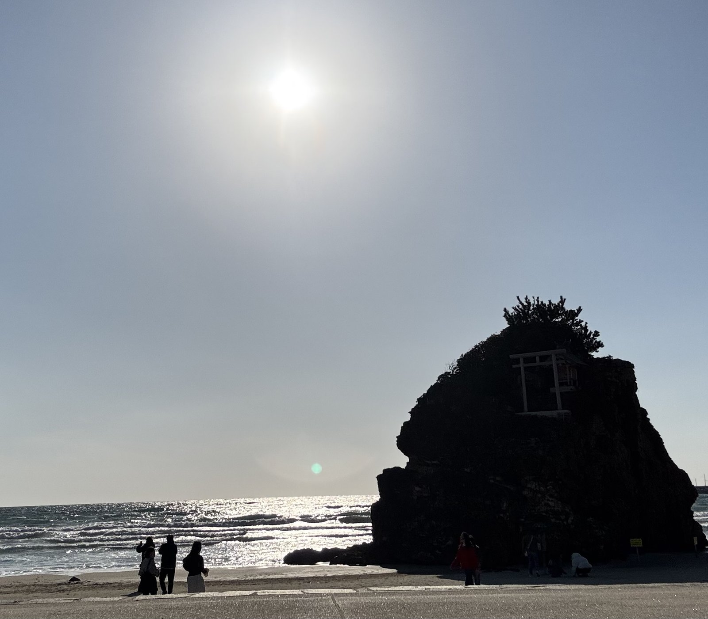

回程沒有騎,改搭一畑電車(當地人叫「畑電」)。出雲大社前站的月台,頂棚是老式的鐵骨拱架;旁邊停著一輛橘色的老電車,車頭寫著 52。

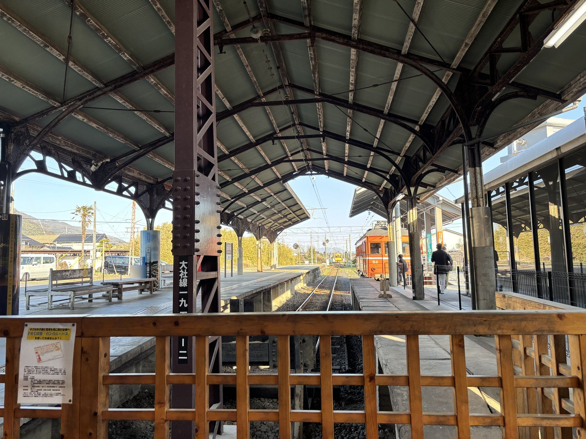

畑電可以把單車整台推上車,不用裝袋,另外買一張自行車票就好(單程一台 350 日圓)。單車靠在車門旁的窗下,安全帽掛在車把上。這是五天裡帶車最輕鬆的一段。

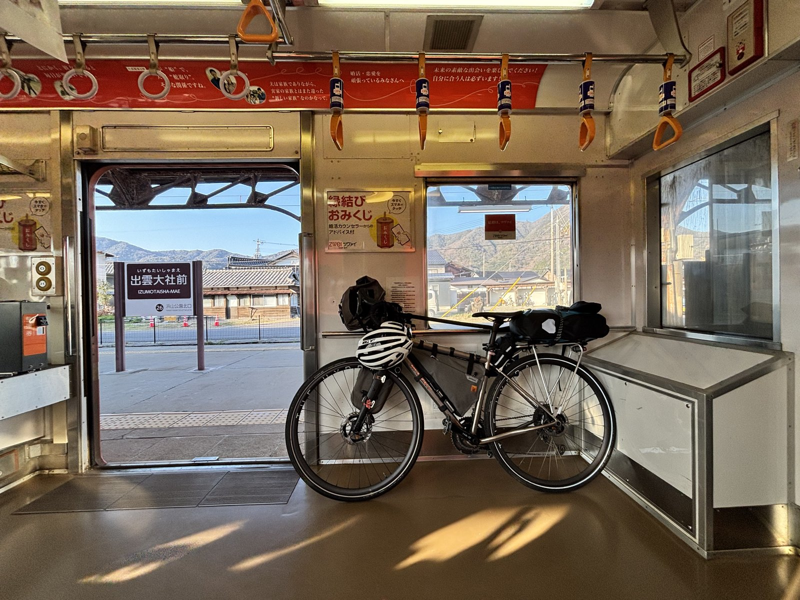

電車先開到川跡——從大社前往松江,多半要在這裡換車——換上往松江的車,再沿著宍道湖北岸走。五點二十幾分,坐的已經是另一種車廂:木頭內裝、綠色的座椅。途中一個車站的牌子上寫著電影《RAILWAYS》——這部 2010 年的電影,就是以畑電為舞台;到一畑口站,列車停下來換個方向倒著開,這是個折返式的車站。

宍道湖是日本第七大湖,半鹹水,以蜆和夕陽出名。六點前後,窗外的湖面開始變成橘色,遠方的山只剩一道剪影。

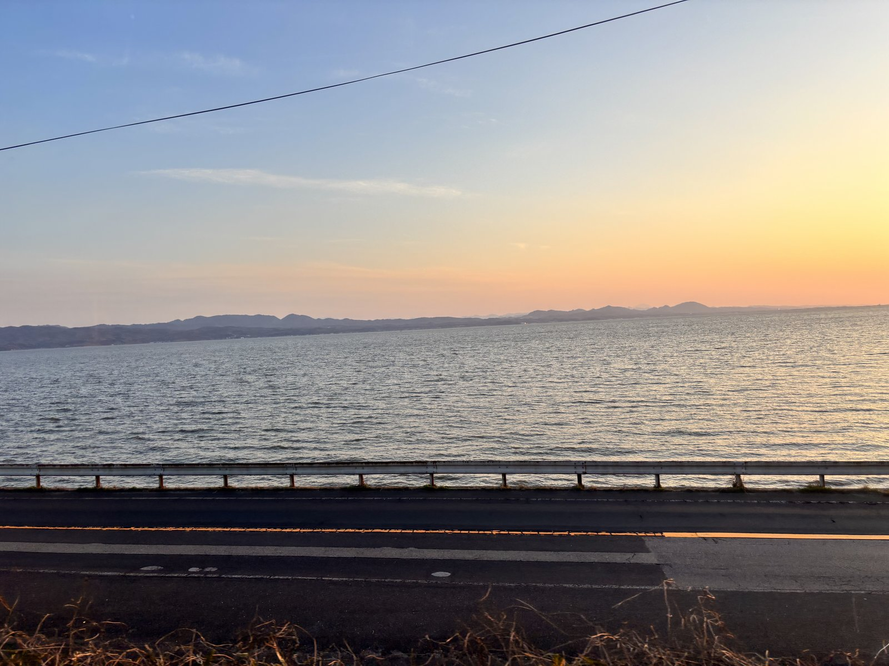

六點半,人已經在松江的街上,茶町一帶的路燈剛亮。這一天從鳥取出發,JR、單車、畑電輪流用上,從日本海這一側的鳥取,一路移到了宍道湖邊。

## 3/21 弓濱半島、江島大橋、中海北岸、島根半島北岸、境港

上午十點四十分,人在米子北邊的弓濱半島。這天後架是空的,只帶把手袋和車架袋。弓濱半島是一條長長的沙洲,把中海和美保灣隔開;靠美保灣這一側有一條鋪得很好的自行車道,從米子的皆生溫泉一直通到境港,路邊立著「YUMIGAHAMA CYCLING MAP」的看板。一邊是松林,一邊是白沙灘,有些地方沙子已經吹上了路面。

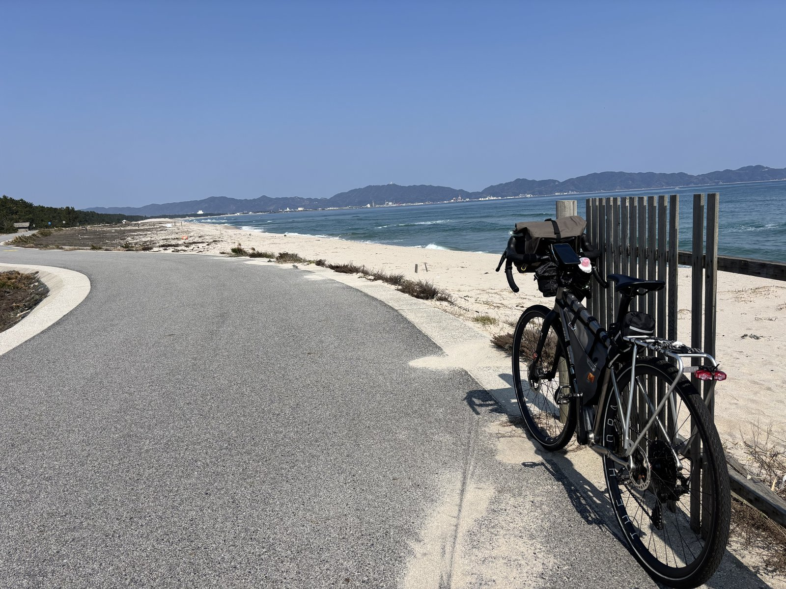

快中午,騎上江島大橋。這座橋因為一支汽車廣告,被叫做「ベタ踏み坂」(油門要踩到底的坡);從遠處用長鏡頭看,橋面像一道牆立在海上。實際的坡度是鳥取縣境港這一側 5.1%、島根縣江島那一側 6.1%,橋長約 1.4 公里,最高點離水面 44.7 公尺。我從境港這一側上橋;照片時間看,從橋頭到過了江島,連停下來拍照在內大約二十分鐘。橋上有大貨車開過,一側有和車道用護欄隔開的步道。

過了橋是江島,再騎過一段橫在湖面上的堤防道路,路面上漆著「中海北部周遊サイクリング」(Northern Nakaumi Cycling Course)的箭頭。中海是日本第五大湖,也是半鹹水湖,和宍道湖一樣在島根半島的南側。中午的太陽把我和車的影子印在箭頭旁邊。

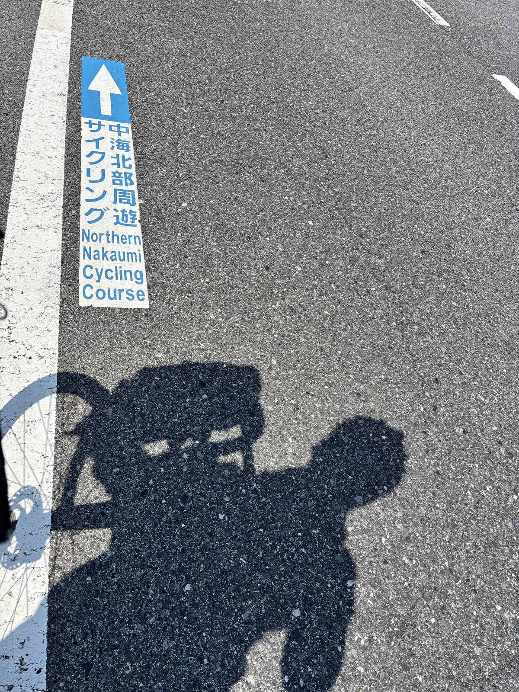

從堤防這頭翻過半島的山,一點多到北岸,面對日本海。路邊是小小的聚落,老房子一路排到海邊;路旁的導覽牌寫著,這一帶是美保關的菅浦、片江、玉結、笹子地區。

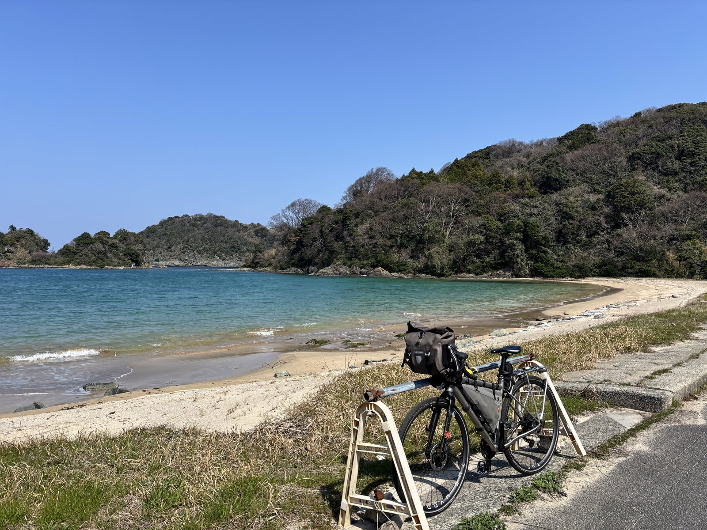

海灣的水是透明的藍綠色,沙灘上一個人也沒有。北岸的路貼著海,在一個個小海灣和海岬之間起伏:菅浦、片江的海灣邊海拔只有一到三公尺,惣津那個觀景點則在四、五十公尺高的地方(國土地理院地圖的標高)。

兩點半,在那個觀景點停下來。這一帶屬於「島根半島・宍道湖中海地質公園」的美保關山地,下面是惣津海岸:退潮時會露出一大片被浪削平的黑色泥岩「波食棚」。近處長滿松樹的小島叫明島,以前是離岸約 15 公尺的海中小島,靠一座石橋連著,現在石橋被沙埋掉,已經和陸地連在一起;島頂有一座明島神社。解說牌上還寫著:1992 年,一顆隕石落在明島西邊約 200 公尺的一戶民家。

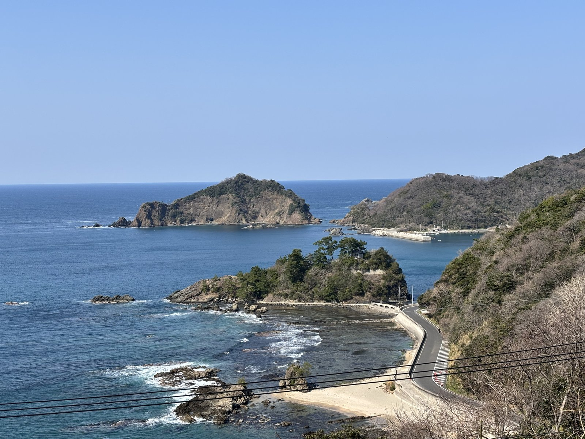

下午過境水道大橋,四點多回到鳥取縣這一側的境港(Sakaiminato)。境港是《鬼太郎》作者水木茂的故鄉,車站前的「水木茂之路」上排著一百多座妖怪銅像。其中一座是鬼太郎的爸爸「眼珠老爹」,泡在一只飯碗裡洗澡。

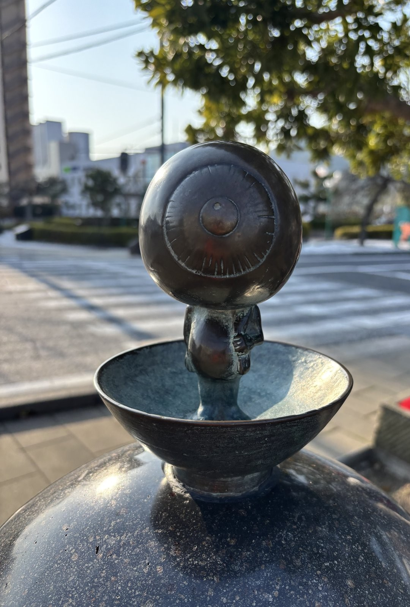

傍晚沿著弓濱半島的自行車道往南騎回米子。五點過後,霧濛濛的天空裡,對面浮出一座頂著雪的山——大山(Daisen),1,729 公尺,中國地方最高峰,因為山形被叫做「伯耆富士」。七點多回到米子車站一帶,天已經黑了。

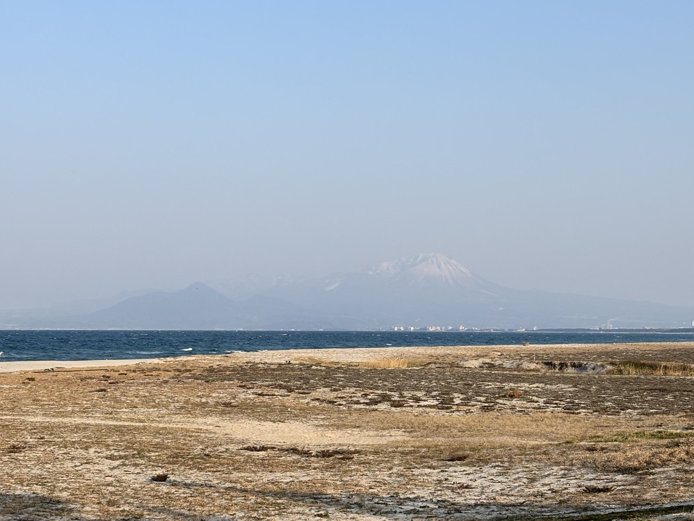

## 3/22 米子到松江:中海南岸、松江城、塩見繩手,和陰天的宍道湖

這天轉陰。早上十點前後從米子出發,快十二點騎到安來過去一點的中海岸邊,再沿著中海南岸往西,一點多到松江(Matsue),全程三十多公里,大致是平路。

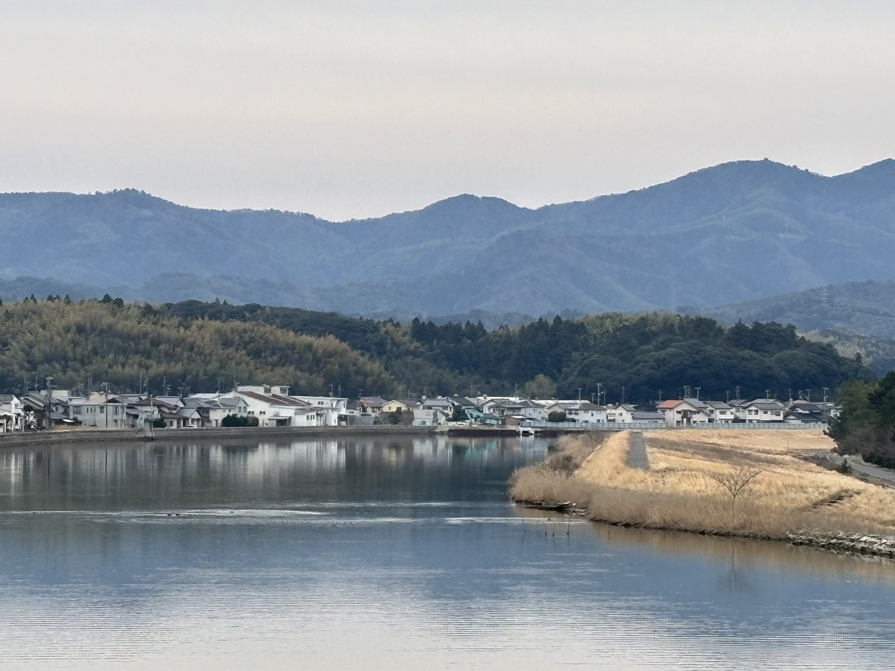

午餐的桌上先來一只研磨缽和一小撮芝麻,要自己磨——有這個規矩的,多半是炸豬排店:芝麻磨碎,再倒醬汁進去沾著吃。

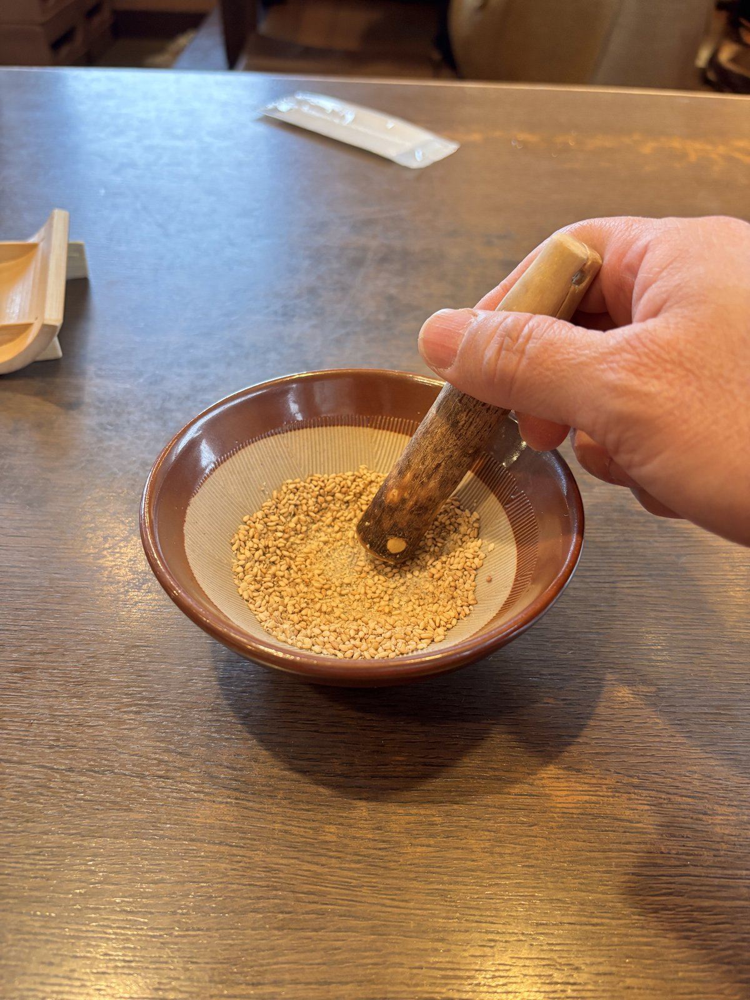

下午繞著松江城的護城河騎。松江城是日本現存十二座原始天守之一,2015 年列為國寶。護城河上有「堀川遊覽船」,船夫戴著斗笠,載著客人從城下的木橋底下穿過去。

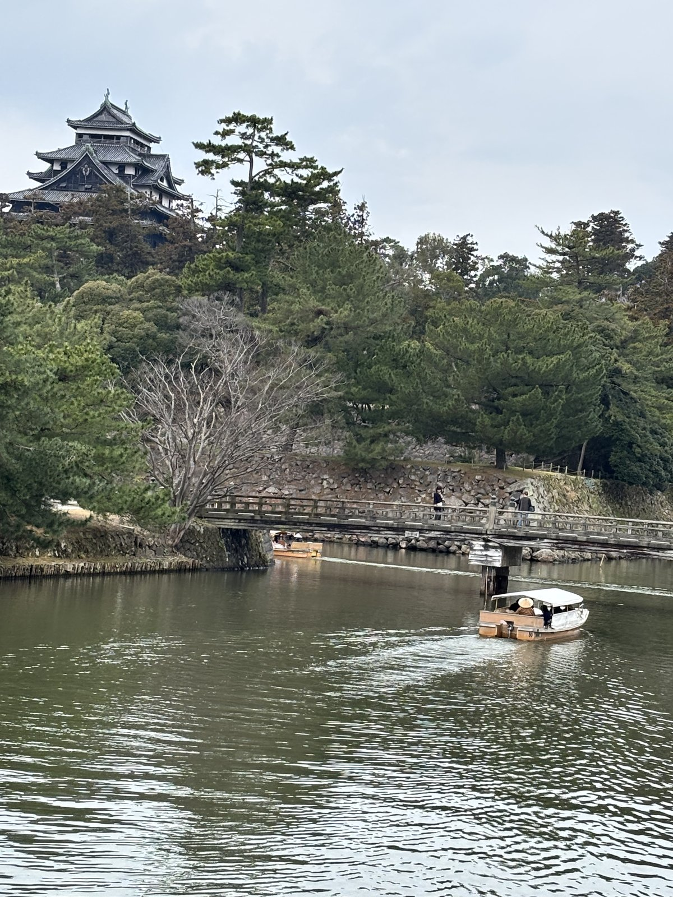

城的北邊是塩見繩手:一邊是武家屋敷的黑色木牆,一邊是護城河和斜長出去的老松。小泉八雲(Lafcadio Hearn)的舊居和紀念館,也在這條街上。

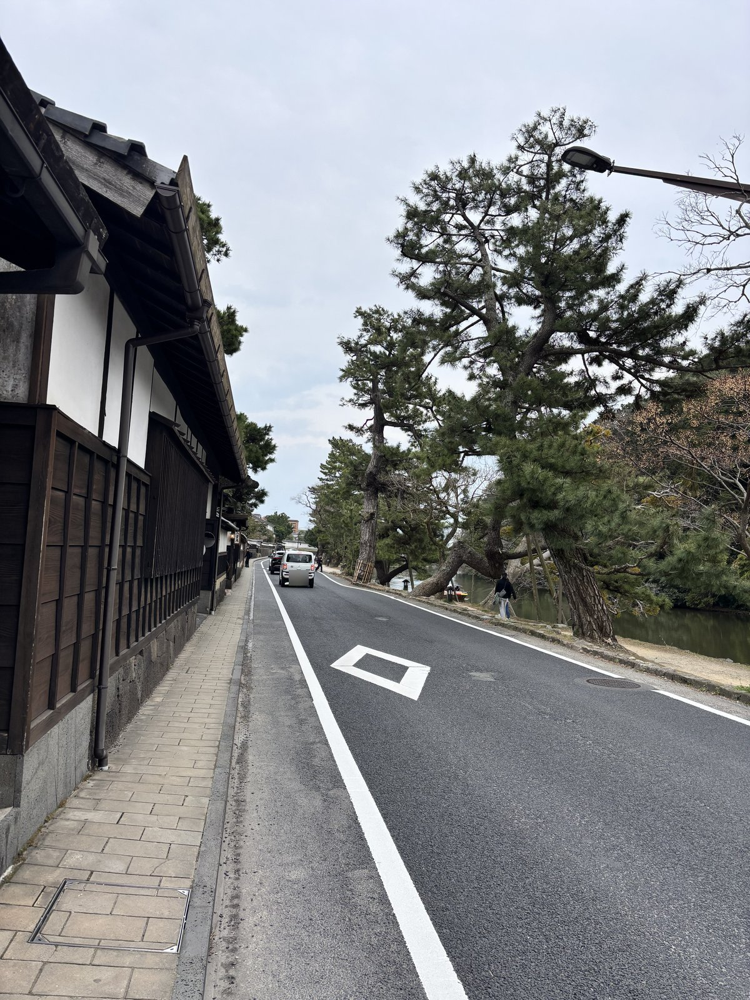

快五點,到宍道湖畔。湖面平得像鏡子,對岸一排建築倒映在水上,一隻水鳥划過去留下一道波紋。前天在畑電車窗裡看到的是橘色的夕陽;這天的湖是一片灰。

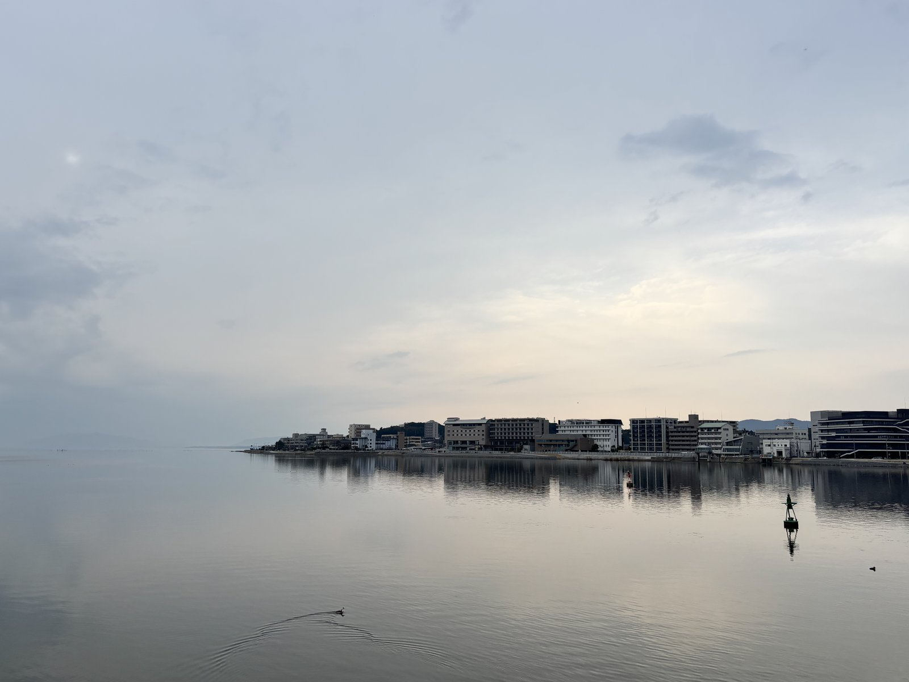

晚上七點過後,回到米子車站一帶。

五天下來,帶單車的三種搭法各用過一次:上飛機用紙箱,上 JR 用輪行袋,上畑電什麼都不用套;紙箱則一直寄放在關西機場的飯店,等回程再去領。想騎的路就騎,不想騎的交給火車——單車一下子是行李,一下子又是車。第一站到這裡。

## 這一段的實用筆記

### 單車紙箱怎麼辦:寄放在關西機場飯店

> **我的做法:大阪進、大阪出,紙箱寄放在關西機場島上的日航飯店**
>
> 1. 落地已經是晚上,第一晚就住機場島上的日航飯店(Hotel Nikko Kansai Airport)。飯店在航廈旁的 Aeroplaza 裡,是機場島上唯一的飯店,和第一航廈、JR/南海關西機場站都有室內通道直接相連。
> 2. 門口的告示寫著:住客可以推著機場的行李推車,直接搭電梯到一樓櫃台。紙箱不用拆就推得進去。
> 3. 在飯店把車從紙箱拿出來、換進輪行袋,空紙箱寄放在飯店。
> 4. 隔天一早從飯店直接出發,走到關西機場站搭はるか往新大阪。
> 5. 整趟騎完回程,回到同一家飯店領回紙箱,在那裡把車拆好、裝箱,再推去航廈報到。
>
> 這樣去回都不用在日本另外找紙箱、丟紙箱。紙箱能寄放多久、要不要收費,每家飯店規定不同,訂房時先跟飯店確認。

- **單車上飛機(台灣虎航)**:單車裝在單車品牌出貨用的瓦楞紙箱裡,外面綁兩條綁帶,搭台灣虎航到關西機場。虎航的規定是一人限託運一件單車,要裝箱或裝袋,輪胎洩氣、把手轉到和車架平行、踏板拆下或轉到和車架平行、變速器做好保護;單車不另外收運動器材費,重量併進你預購的託運公斤數。另外,2025 年 10 月 26 日起,單邊超過 100 公分或三邊合計超過 203 公分的行李算「大型行李」,每件加收手續費(公告為新台幣 550 元)——單車紙箱一定超過,訂票時一起算進去。規定常改,出發前以官網為準。
- **JR 帶車(輪行)**:JR 的規矩是單車要拆開或折疊,整台裝進輪行袋、不能露出來,三邊合計 250 公分以內、30 公斤以內,免費。特急列車上,袋裝的車放大型行李區;沒有的話放最後一排座位跟牆壁之間,所以訂指定席時挑最後一排。這趟關西機場 → 新大阪的はるか就是這樣放的。新大阪 → 鳥取的超級白兔號,指定席前一天落地後就在 JR 關西機場站先買好。
- **一畑電車(畑電)帶車**:整台推上車,不用裝袋,另外買一張自行車票(單程一台 350 日圓,2025 年 3 月起的價格;人的車票另買)。官網寫的是全天、全線都能帶,不用預約;不能帶的是 12/31 的跨年夜電車、1/1–1/3、松江水鄉祭和出雲神話祭等活動日,人多時也可能被拒,出發前看一下官網。出雲大社前 → 川跡換車 → 松江しんじ湖溫泉,大約一小時,車票 900 日圓,後半段車窗外就是宍道湖;少數班次直通不用換車。一畑口站列車會折返,不用緊張。
- **鳥取砂丘**:從鳥取車站沿河堤小路、因幡自行車道騎過去,照片位置推算約 9 公里,大部分是平路。我兩點多從車站出發、快四點到,照片時間看,在沙丘停了十五分鐘左右。想爬上馬背(高約 47 公尺),從入口直線約 400 公尺,但沙地難走,鳥取市官方觀光網站建議上下加休息留一小時。春天的週間下午,人不少但不擠。
- **出雲大社**:從 JR 出雲市站騎過去約 9、10 公里,平路,會經過出雲巨蛋。3/20 春分之日是國定假日,人很多;想安靜一點,避開假日。稻佐之濱在大社西邊約 1 公里,海灘面朝西,下午以後逆光。往日御碕的海岸公路雙線道、有護欄、車不多,從稻佐之濱到日御碕燈塔約 8 公里;我騎了兩公里多就折返,時間不夠的話別勉強。
- **江島大橋**:坡度境港(鳥取縣)側 5.1%、江島(島根縣)側 6.1%,橋長約 1.4 公里,最高 44.7 公尺。我從境港側上橋,照片時間看,從橋頭到過了江島,連拍照約二十分鐘。橋上有大貨車開過,一側有和車道用護欄隔開的步道。
- **自行車道與路況**:鳥取的「因幡自行車道」中間漆綠、穿樹林;弓濱半島靠美保灣這側的弓濱自行車道從米子皆生溫泉到境港,鋪面好,有些路段沙子吹上路面,轉彎小心;中海北岸的堤防道路,路面標著「中海北部周遊サイクリング」的箭頭。鳥取縣的單車旅遊網站把繞中海一圈的「中海周遊サイクリングコース」列為中級:一圈 70.4 公里、累積爬升 332 公尺,起終點在米子鬼太郎機場。島根半島北岸的海岸公路在海灣和海岬之間起伏,惣津觀景點一帶海拔四、五十公尺;這一段照片裡幾乎沒有車。米子 → 松江沿中海南岸走一般道路,大致平坦,三十多公里。
- **住宿**:3/18 關西機場日航飯店(紙箱寄放,見上面那一段);3/19 鳥取車站附近;3/21、3/22 晚上都回到米子車站一帶,3/22 早上從那裡出發;3/21 後架是空的,輕裝出門。帶單車住日本的商務旅館,單車能不能進房間、有沒有室內可以停,各家不同,訂房前先問。
- **時間參考(照片時間)**:鳥取砂丘 15:50–16:05;出雲大社 13:20–15:10;往日御碕的海岸公路 15:45–16:00 折返;稻佐之濱 16:20 前後(逆光);畑電出雲大社前 17:00 上車,松江六點多下車;宍道湖夕陽 3/20 17:58(車窗);惣津觀景點 14:30;境港水木茂之路 16:30;弓濱半島看大山 17:05。
- **天氣**:三月中下旬。3/19 鳥取上午下雨、下午多雲時晴,3/20、3/21 晴,3/22 陰。日本氣象廳鳥取、米子測站這幾天白天最高 12–17 度,清晨只有 1–4 度,早晚出門要多一層。
- **時間多的話**:日御碕燈塔這次沒騎到,從稻佐之濱沿海岸公路再往北約 8 公里。島根半島從惣津再往東,是美保關港和半島最東端的地藏崎。

---

這段的攝影作品之後放 Flickr。
