<small>2026/3/23–3/27・兵庫縣(路過)、京都府、福井縣|上一站:[山陰](../2026-jp-01-sanin/)|下一站:[琵琶湖・京都・大阪](../2026-jp-03-biwa-kyoto-osaka/)</small>

這五天,單車有不少時間是裝在輪行袋裡、跟著火車走的。從米子到敦賀,直線就有兩百五十公里,我只挑了幾段來騎:宮津灣邊往伊根的海岸公路、天橋立那條種滿松樹的沙洲、三方五湖繞一圈、沿著敦賀半島去看一片藍得不像日本海的海灣。其他的路,交給火車。

這趟日本一個月,從山陰一路走到中山道;這是第二站,從京都府北邊的丹後,沿著若狹灣走到福井縣的敦賀。3/23 大半天和 3/25 上午在火車上,真正騎車的是 3/24、3/26、3/27 三天。假期不長、又想帶單車出國的人,可以拿這一段當參考:JR 和丹鐵怎麼帶車、無人站怎麼付錢、哪幾段值得騎、每晚住哪,都整理在後面。

| 日期 | 路線(依照片的時間與定位) | 騎車(照片位置推算) | 天氣 | 過夜 |
|---|---|---|---|---|
| 3/23 | 米子 ‖ JR ‖ 鳥取 ‖ JR 特急「濱風 4 號」(經余部橋梁)‖ 豐岡 ‖ 丹鐵 ‖ 岩滝口 → 阿蘇海西岸 | 幾乎都在火車上 | 晴 | 与謝野町岩滝・橋立ベイホテル |
| 3/24 | 岩滝 → 天橋立北端(府中)→ 国道 178 沿宮津灣 → 養老漁港 → 伊根舟屋 → 回到府中 → 騎過天橋立沙洲 → 文殊 → 岩滝 | 約 45 km | 晴,有薄霧 | 同上 |
| 3/25 | 岩滝口 ‖ 丹鐵(宮津、由良川橋梁)‖ 西舞鶴;東舞鶴:八島商店街 → 舞鶴紅磚公園 → 港邊木棧道 → 松榮館 | 東舞鶴市區幾公里 | 陰 | 東舞鶴一帶(晚餐後沒有照片) |
| 3/26 | 10:56 JR 美濱站 → 久久子海岸 → 日向湖・日向漁村 → 浦見川 → 水月湖 → 三方湖 → 菅湖 → 久久子湖 → 早瀨 | 約 25–30 km | 陰,湖上風大 | 美濱町・ホテル湾彩 |
| 3/27 | 早瀨 → 敦賀半島西岸(菅浜・ダイヤ浜、水晶浜)→ 竹波 → 馬背峠隧道 → 敦賀灣西岸 → 氣比松原 → 敦賀市區 → 敦賀港紅磚倉庫 → 氣比神宮 | 約 30 km | 晴 | 敦賀(隔天 7:44 在敦賀站) |



## 3/23 米子到岩滝口:大半天在火車上

早上八點半還在米子,十點鐘火車已經貼著日本海往東開,十一點半到鳥取。車票上寫的是:鳥取 12:56 開,豐岡 14:23 到,特急「濱風 4 號」,車票 1,520 日圓加特急券 1,930 日圓,共 3,450 日圓。帶單車上 JR,照規矩要整台裝進輪行袋。

一點多,車窗外是岩美一帶的山陰海岸:藍得很乾淨的海,一個接一個的小灣,幾間屋子縮在山腳下。一點四十三分,火車開上余部橋梁(Amarube),整列車在四十一公尺高的空中過橋,往下看是余部的小漁村、一段海堤和整片海灣。原本的鋼鐵棧橋是 1912 年蓋的;1986 年 12 月,一列列車被強風從橋上吹落,造成六人死亡,後來才改建成現在這座混凝土橋,2010 年通車。舊橋留下的幾座橋墩,做成了展望設施「空の駅」,就在餘部站旁邊。

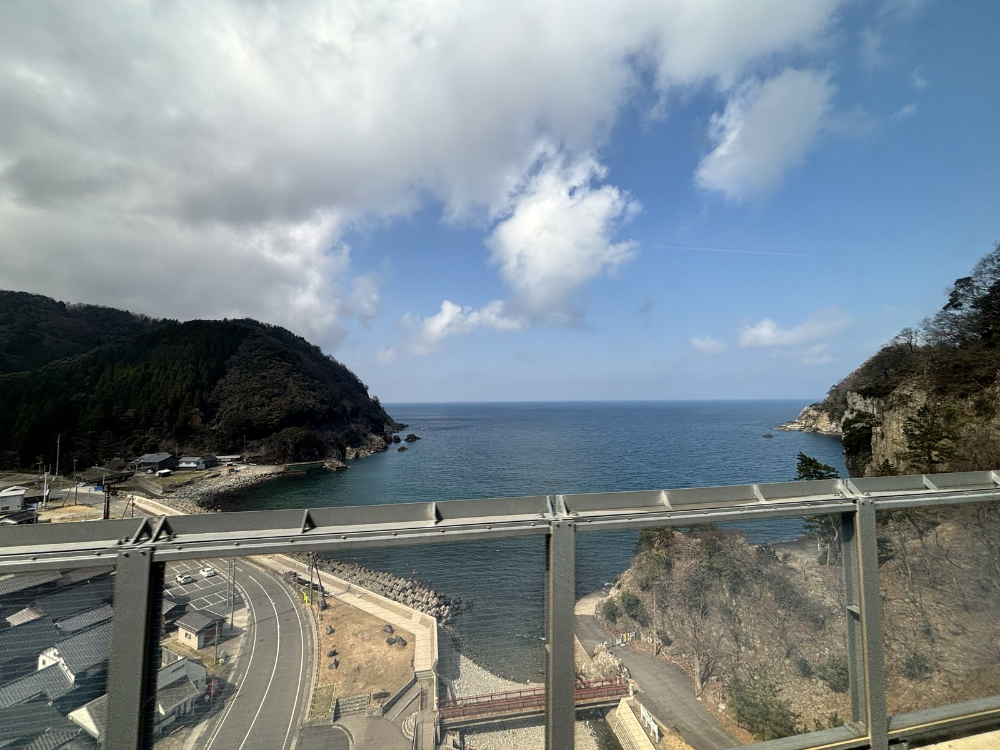

過了豐岡,換京都丹後鐵道——當地人叫它「丹鐵」——繼續往東,沿著久美濱灣走。四點過後,在岩滝口下車。月台邊停著一列米色的丹鐵,只有一節車廂,司機一個人開,車頭的牌子寫著「西舞鶴」。

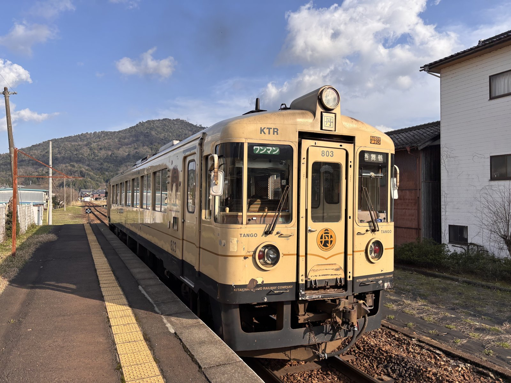

住處在阿蘇海西岸,離車站兩三公里。五點多,在附近的河邊晃了一下:傍晚的光斜斜地打在河灘上,一座紅色的鐵橋橫過河面,水面浮著幾隻水鳥。

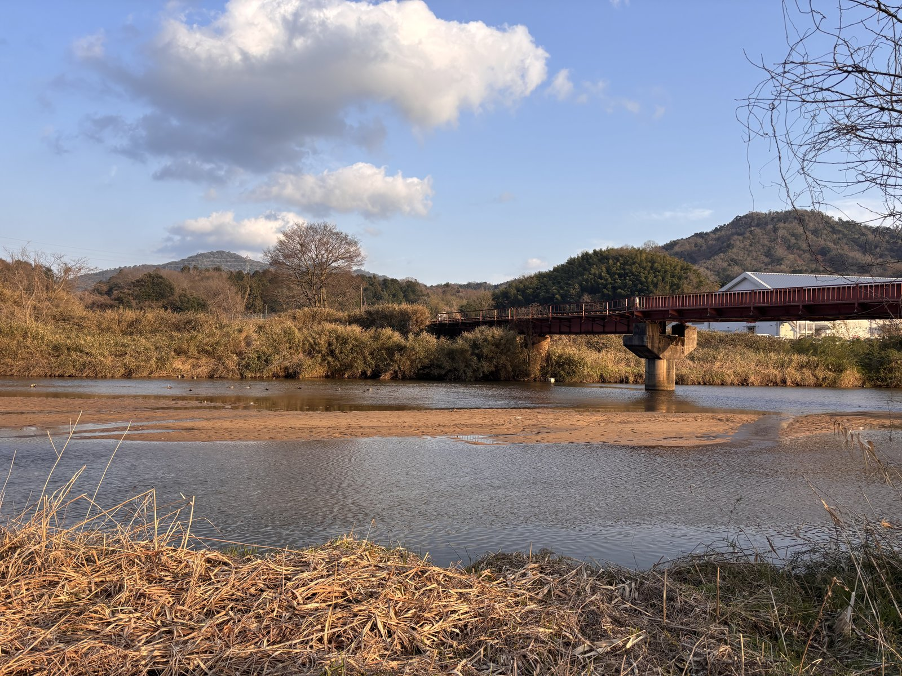

## 3/24 伊根的舟屋,和一條可以騎的沙洲

這是這一站拍照最多的一天,兩百七十幾張。

早餐是飯店的自助吧,裡面有一道「へしこ」:春天到秋天抓的魚用米糠醃起來,留到冬天捕不到魚的時候吃,日本海這一帶的鄉土食。

十點前騎到天橋立北端的府中,上傘松公園的纜車站就在這裡。在纜車站前拍了兩張照片,十點二十分,人已經在北邊三公里外的海邊,往伊根的方向走。

沿著宮津灣邊的海岸公路(国道 178)往北。路貼著海,一邊是枯黃的草坡,一邊是護欄和海,路面每隔一段畫著藍色的箭頭,是自行車路線的標示,跟著走就對了。中間經過養老漁港,停了一下。

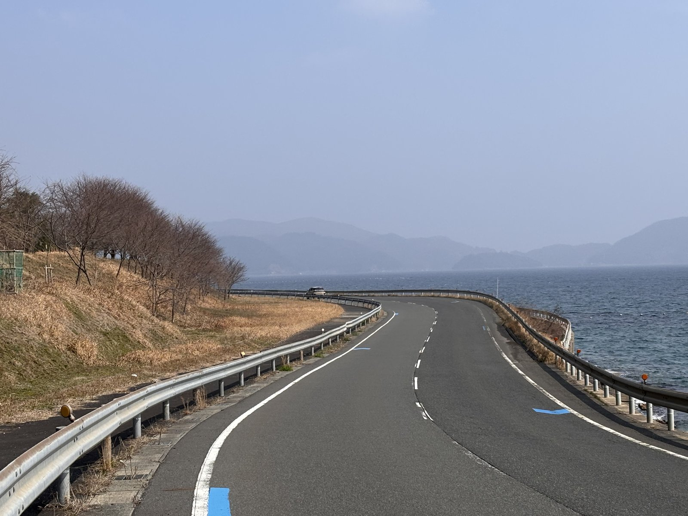

十一點多到伊根。伊根灣沿岸有兩百多棟「舟屋」:一樓是船庫,直接開向海,船就停在屋子裡;二樓住人。整個聚落是日本的「重要傳統的建造物群保存地區」。

十一點半,灣邊坡上一棵樹開滿了白花,底下就是舟屋的屋頂和海灣。

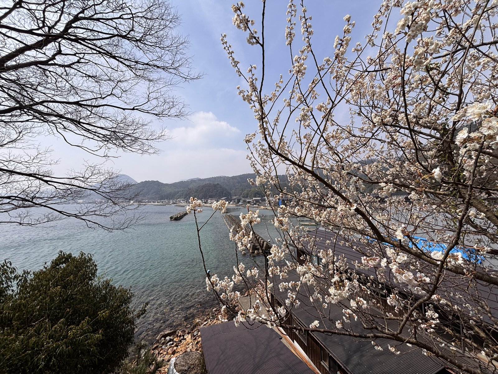

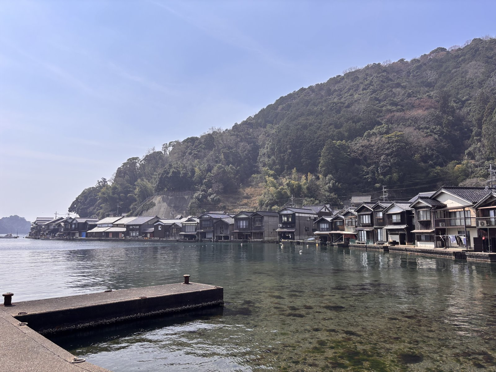

走近看,舟屋的一樓朝海敞開,木船就擱在斜坡上,門口就是海。

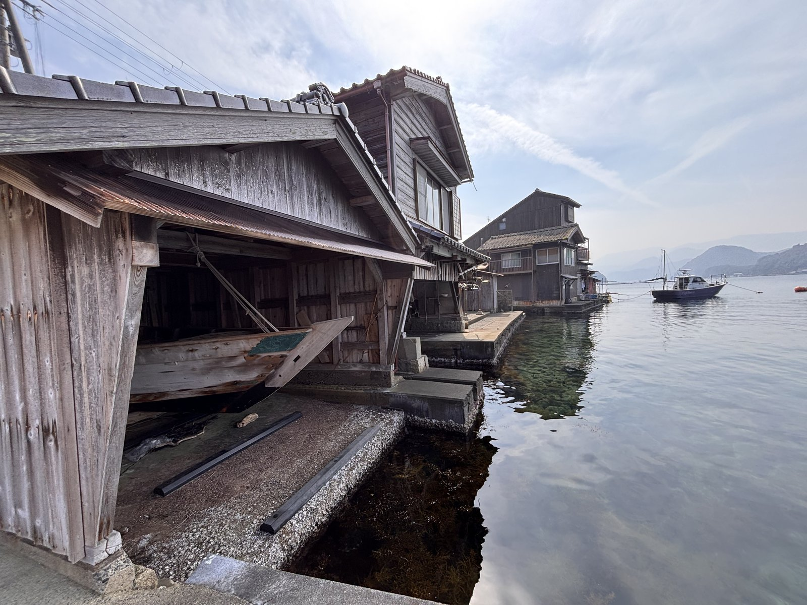

從十一點到快三點,我在伊根待了快四個小時,沿著灣邊慢慢走,舟屋一棟一棟看過去。從陸上看,只看得到舟屋的側面和屋頂;想從正面看整排舟屋,灣裡有遊覽船,從日出的碼頭出發,繞灣一圈二十五分鐘左右(班次和票價整理在文末)。

兩點半,伊根南邊的海堤上,一棵光禿禿的樹站在海邊,車就靠在樹下,太陽在薄雲後面。

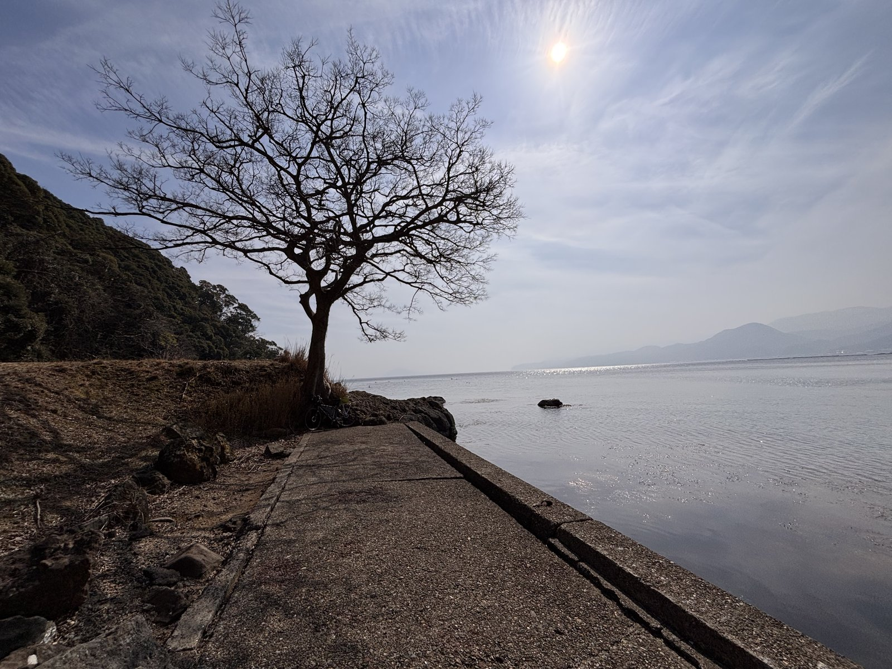

四點零一分,回到天橋立北端,一塊木牌寫著「松並木終点」,旁邊的指標:到小天橋(廻旋橋)2.6 公里。天橋立全長約 3.6 公里,是日本三景之一,也是少數可以直接騎單車穿過去的名勝。沙洲上是一條沙土路,兩邊是松樹,左右都看得到海。

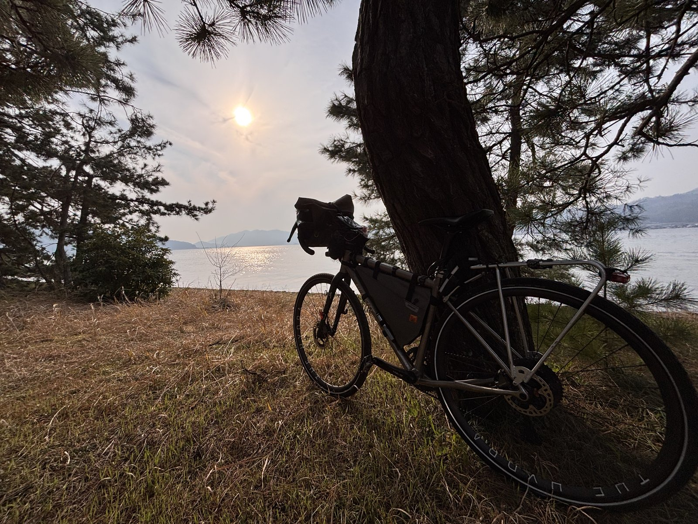

四點半到南端的文殊。橋下的運河很靜,一邊是松樹,一邊是一排和式的旅館。從北端到這裡,含停下來拍照,二十五分鐘。

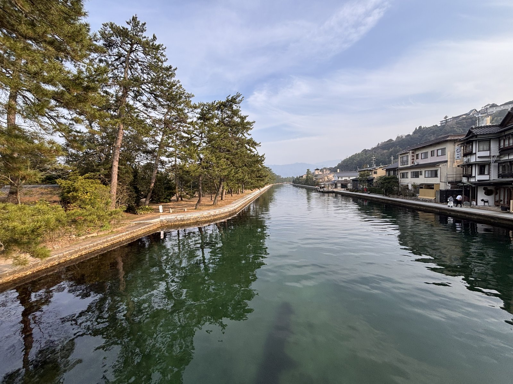

## 3/25 舞鶴:自行車列車、紅磚倉庫和海軍咖哩

早上十點四十九分,又回到岩滝口站。這次停在月台邊的是一節黃色的丹鐵,車身寫著「Hello, bicycle!」「No bicycle, No life.」,窗戶上方印著 KYOTO BICYCLE TRAIN。這是丹鐵的自行車列車:單車不用裝袋,整台推上去。不過它只在特定日子跑固定的班次,只在西舞鶴、宮津、天橋立、夕日ヶ浦木津溫泉、豐岡五站上下,要先預約,不另外收費。這一班往豐岡,和我反方向。我要往東去舞鶴,搭的是一般列車;一般列車上,單車一樣要拆開、裝進輪行袋。

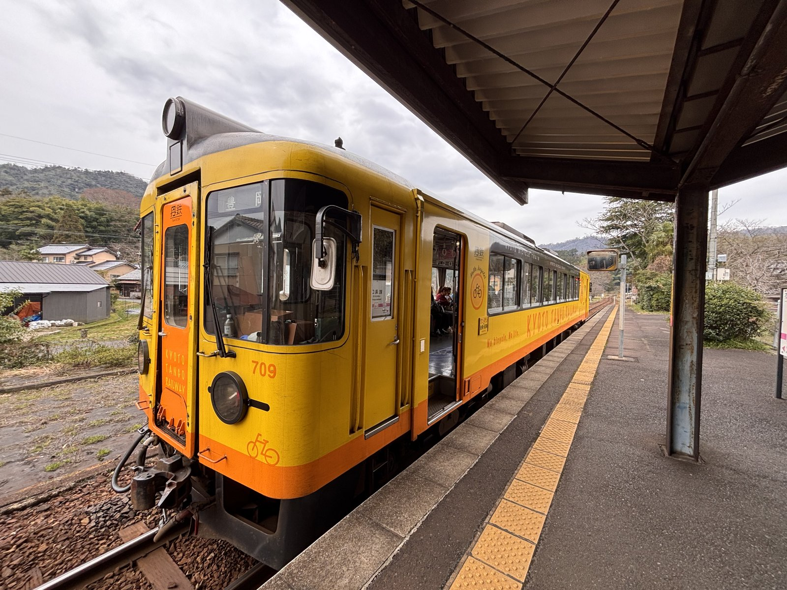

岩滝口是無人站,沒有售票窗口:上車時抽一張整理券,下車時再付車資。丹鐵只到西舞鶴,西舞鶴到東舞鶴是 JR 舞鶴線,兩家公司、車資分開算。在月台上,我還先查了一下這兩段錢要怎麼付。

火車往東,過宮津,沿著奈具海岸貼著海走;十一點半,從由良川橋梁上跨過由良川出海口——一座 1924 年蓋的鐵橋,全長約五百五十公尺,離水面只有六公尺多,坐在車上像是貼著水面過河。過了由良川,就是西舞鶴。舞鶴分成西、東兩個市區,中間隔著一座小山;東舞鶴是舊海軍鎮守府的所在。

下午一點二十分,我在東舞鶴的八島商店街。一條很長的拱廊商店街,平日的中午,大部分店家的鐵門拉下來,整條街幾乎沒有人。東舞鶴的街道是明治年間跟著軍港一起規劃的棋盤格,東西向的路叫一条到九条,南北向的路用軍艦取名——三笠、敷島、朝日、初瀨;「八島」也是一艘明治時代的戰艦。

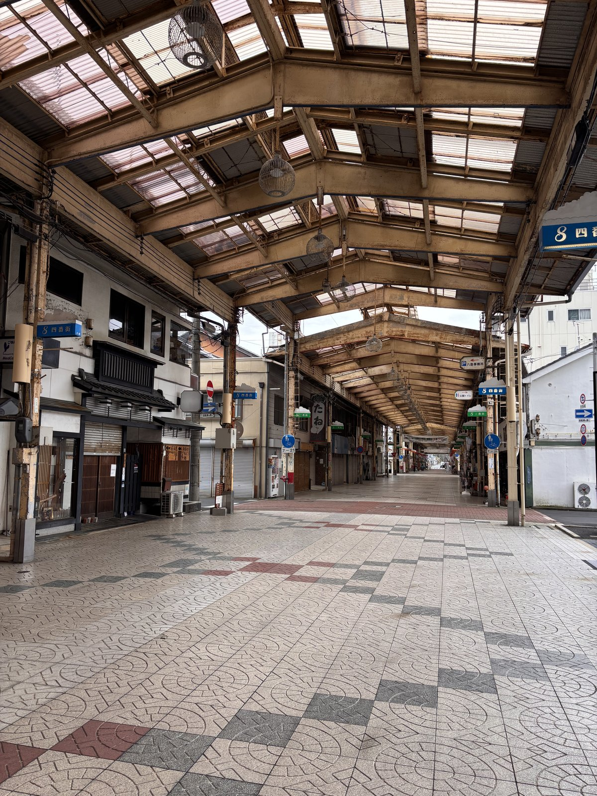

舞鶴從明治時代起就是海軍的港口,1901 年設鎮守府,第一任長官是東鄉平八郎。港邊一排紅磚倉庫,是明治末到大正年間海軍蓋的,現在叫「舞鶴紅磚公園」(舞鶴赤れんがパーク)。那天陰天,兩排紅磚牆中間一條石板路,一直往遠處延伸。

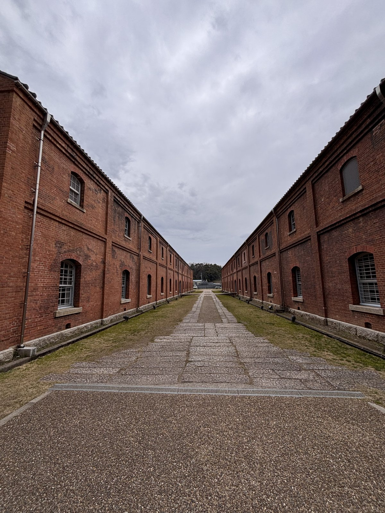

公園後面的木棧道對著港口,對面就停著灰色的海上自衛隊艦艇,舷號看得清清楚楚。

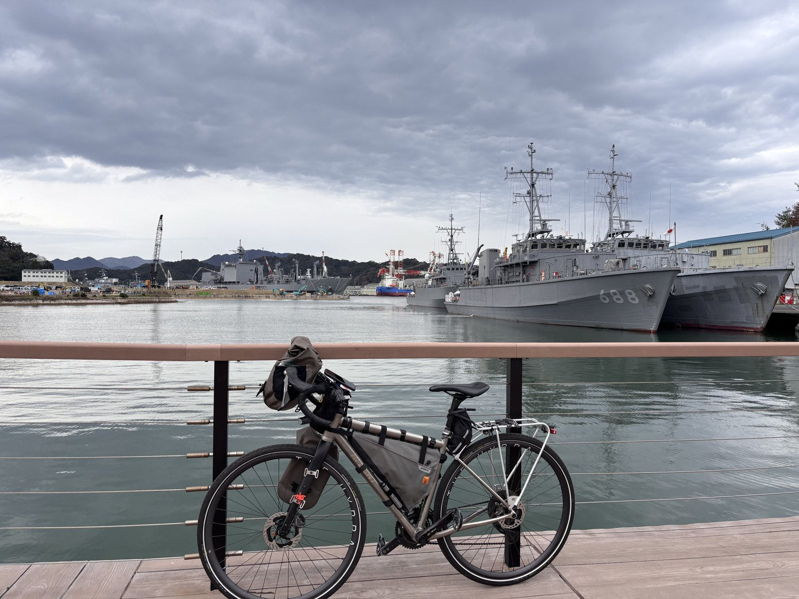

傍晚在「松榮館」吃飯。松榮館是舊海軍常出入的老旅館,東鄉平八郎和海軍的軍官都來過;現在的餐廳在它 1904 年蓋的木造別館裡,照著舊海軍 1908 年的《海軍割烹術參考書》做菜。屋裡陳列著軍艦模型、書法掛軸,和鎮守府時代的老照片。海軍咖哩是這樣上桌的:咖哩裝在銀色的醬汁壺裡,飯捏成一圈,看得出摻了麥——舊海軍用麥飯防腳氣病的老規矩——旁邊一小碗沙拉、一杯牛奶。收據上,海軍咖哩 1,500 日圓(含稅)。

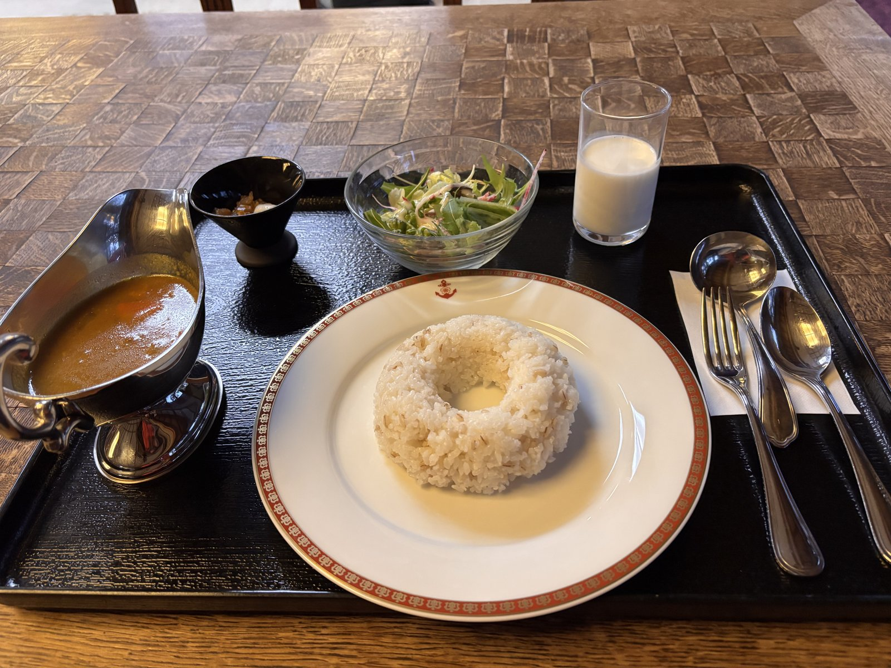

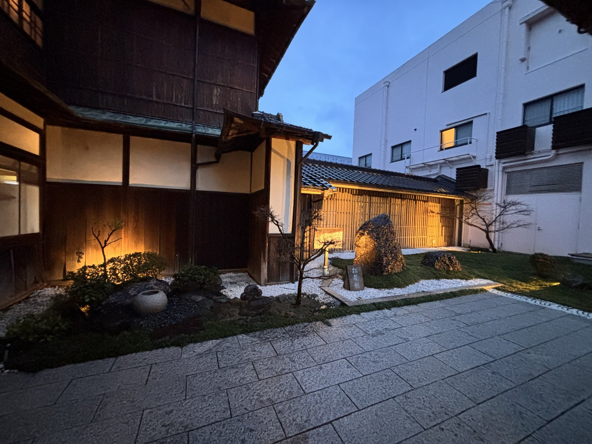

要注意的是時間:松榮館平日只開晚餐,五點半開門;午餐只有週末和假日。我那天是星期三,收據上的時間是五點四十分。

## 3/26 三方五湖:五個顏色不一樣的湖

東舞鶴和美濱都在 JR 小濱線上,沿著若狹灣一路到敦賀,中間不用轉車。十點五十六分,我人在 JR 美濱站。車站裡就是若狹美濱觀光協會,可以租單車,店裡掛著若狹灣自行車路線的標誌,架上擺著一排摺頁和地圖。

住處在美濱站西邊兩公里多、久久子海岸的一家海邊飯店,大廳的落地窗正對著若狹灣。先去放行李,中午在附近的餐廳吃飯,桌上攤著一張英文版的三方五湖自行車地圖。

三方五湖是若狹灣邊上的五個湖:三方湖、水月湖、菅湖、久久子湖、日向湖。有的是淡水、有的是海水、有的半鹹,所以顏色不一樣。

一點多出發。先沿著日向湖走,日向是夾在湖和海之間的漁村,湖邊一排兩層的木造房子貼著水,漁船就停在屋前。再到浦見川——一條從山裡切開的窄水道,連著水月湖和久久子湖。1662 年的大地震讓三方湖一帶淹水,之後花了約兩年,鑿出這條水道來排水。

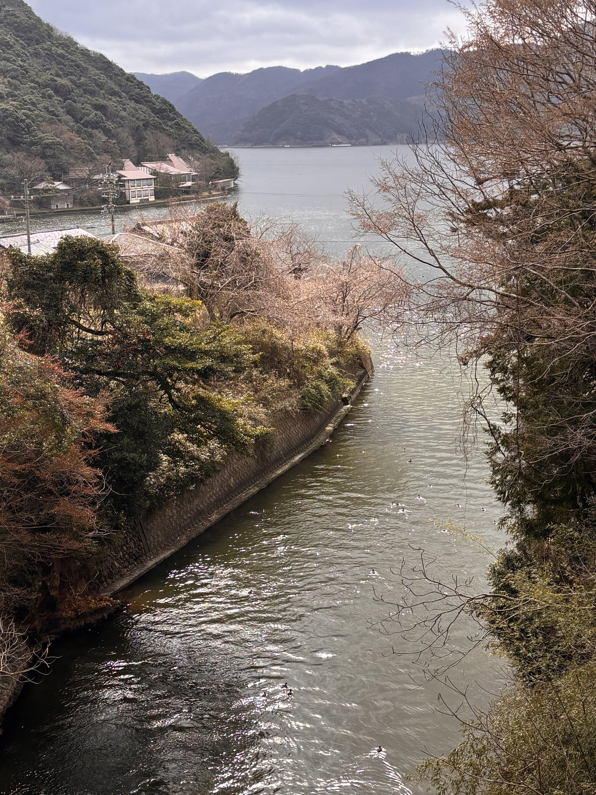

之後沿著水月湖騎。水月湖的湖底有七萬多年一年一層的沉積「年縞」,是全世界拿來校正年代測定的標準;三方湖東南岸的「縄文ロマンパーク」裡,有一座專門展示它的福井縣年縞博物館,和若狹三方縄文博物館相鄰;三點四十五分,我從園區前經過。

湖邊的自行車道很窄,地上畫著淺藍色的箭頭,兩旁是修剪過的果樹——這一帶是福井梅的產地,三月底,樹上還沒長葉子。

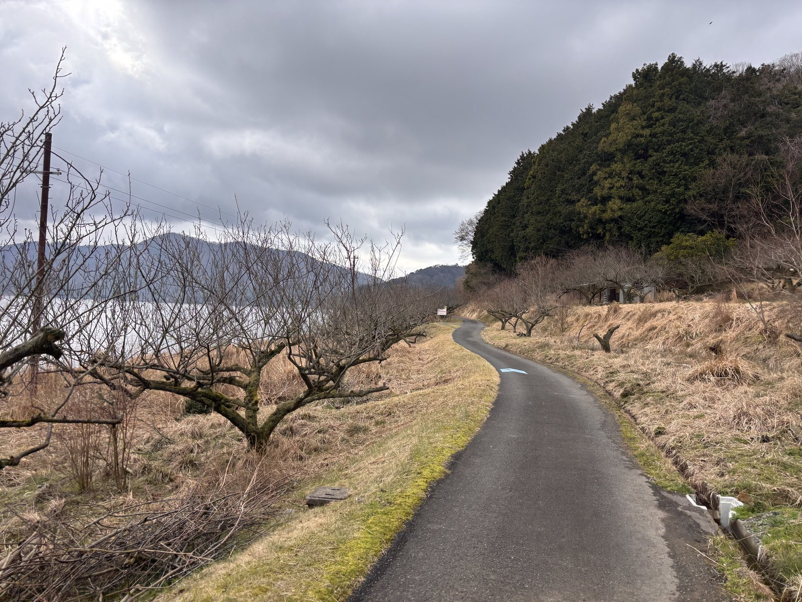

那天多半是陰天,湖面被風吹得都是浪。四點多,三方湖和菅湖之間的湖邊小路落葉很多,路面有裂縫、也不太平整,騎慢一點就好;久久子湖邊一棵樹開滿桃紅色的花,風把湖水吹成一排排白浪。

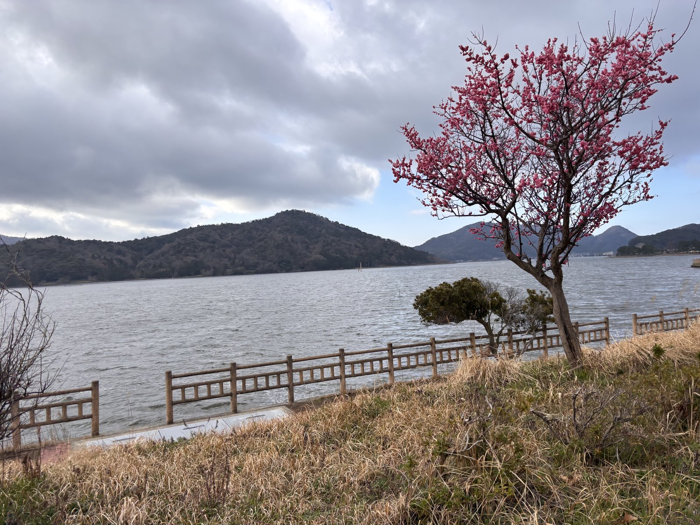

傍晚五點半,回到早瀨的海邊。飯店旁的岩岸上有一座鳥居,消波塊圍出一個小灣,天慢慢暗下來。

晚上,房間的床上攤著兩張地圖:一張是若狹灣自行車路線「Waka-Cycle(わかさいくる)」的全圖,一張是敦賀市區的放大圖——隔天要去的地方。兩張都是繁體中文版。

## 3/27 若狹灣的藍,和氣比松原

天終於放晴。早上十點,飯店旁的海邊,車靠在石燈籠旁,前面是整片若狹灣,對岸是敦賀半島的山。

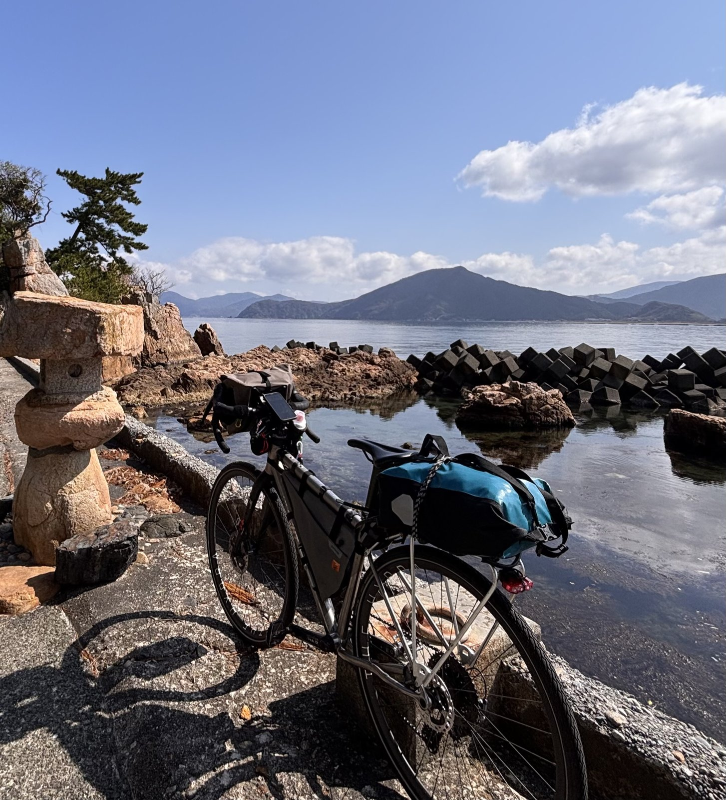

旁邊一塊礁岩被海蝕出幾個洞,從其中一個洞看出去,是一座紅色的鳥居。

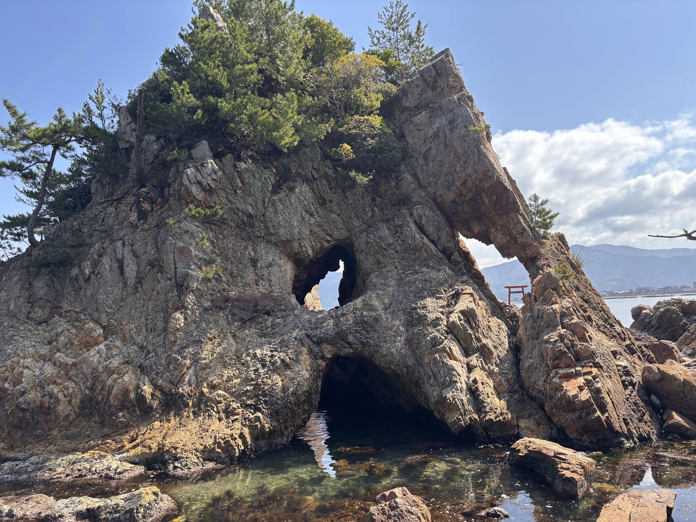

沿著敦賀半島西側的海岸公路往北。快十二點,從路邊往下看,是一整片透明的藍綠色海灣,和一彎白沙灘——菅浜的ダイヤ浜;再往北不遠,就是水晶浜。水晶浜是環境省「日本の水浴場 88 選」之一,夏天縣內外都有很多人來玩水;三月底,ダイヤ浜的沙灘上一個人也沒有,水晶浜也只有零星幾個人。

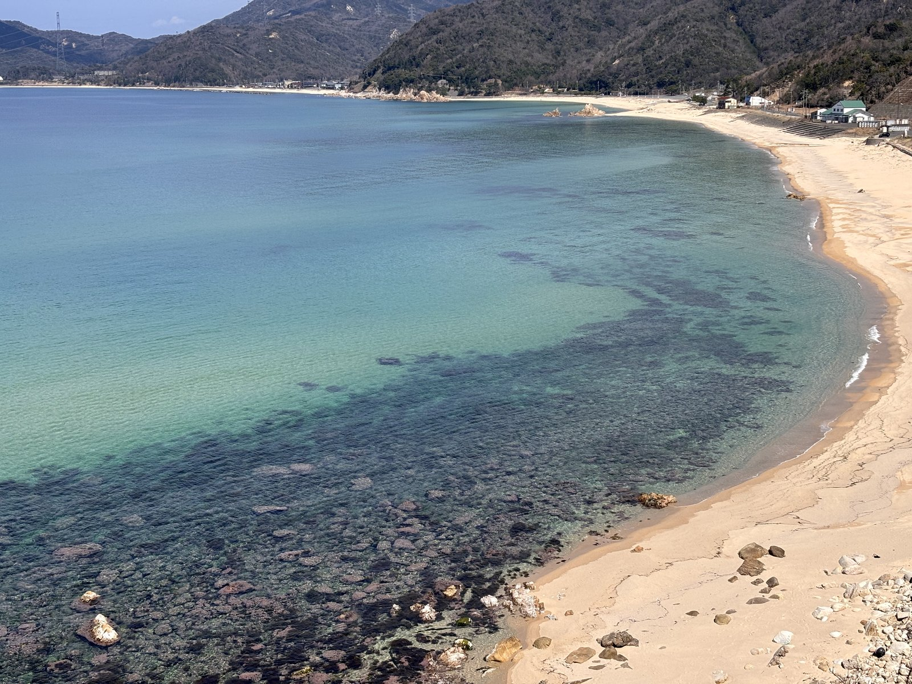

要到敦賀,我走的是最近的一條:從竹波走縣道 33,從馬背峠底下的隧道穿過去,出來就是敦賀灣這一側,再沿著灣邊往南。照片的時間很清楚:一點半多還在水晶浜一帶的竹波,不到兩點已經在敦賀灣這一側。西岸的路其實還能往北、繞過半島頂端到東岸——2020 年白木到浦底的「敦賀半島隧道」通車以後,整個半島可以繞一圈,只是要多繞一大段。

兩點多進氣比松原。它和靜岡的三保松原、佐賀的虹之松原,並稱「日本三大松原」;一條柏油路從松林中間穿過去,兩邊是木頭圍欄,地上落滿松針。

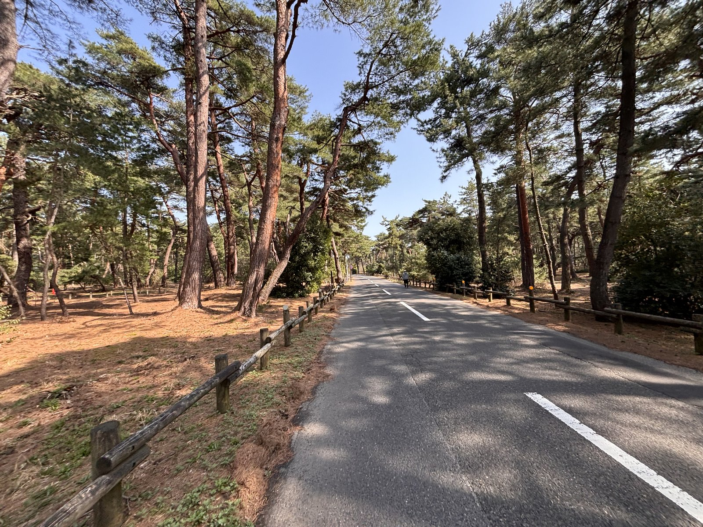

午餐拖到快三點,在敦賀市區博物館通一棟町家改的蕎麥麵店「マツニタカ」,吃了一份蕎麥粉的可麗餅(galette):番茄燉菜、西班牙生火腿、半熟蛋和起司,1,760 日圓。菜單上寫著,店裡的蕎麥麵用福井大野的在來種蕎麥粉,手打的二八蕎麥。

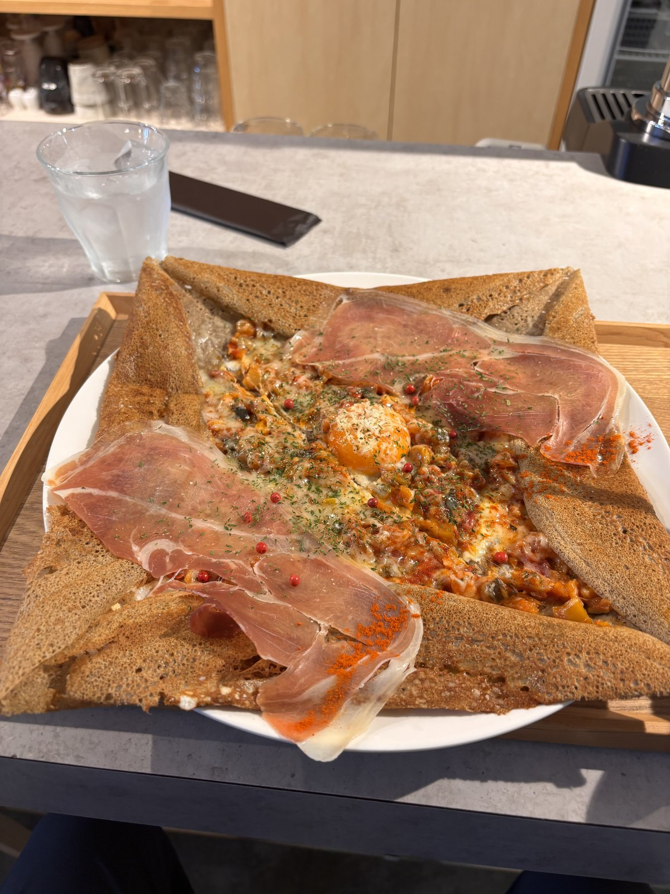

三點多到敦賀港。港邊也有一棟紅磚倉庫,1905 年蓋的,原本是美國石油公司存放石油的倉庫。最後一站是氣比神宮:朱紅色的大鳥居,1645 年建,和春日大社、嚴島神社的並稱日本三大木造鳥居。車停在鳥居旁,這一站就到這裡。

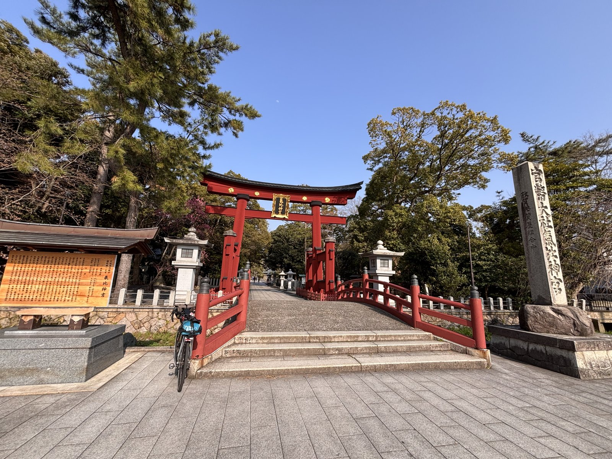

五天,頭尾兩片松原:第二天騎過天橋立,最後一天騎過氣比松原;中間是兩百多棟舟屋、舞鶴的海軍紅磚倉庫、五個湖,和一片白沙灘。照片的數量說得很老實:伊根和天橋立那天兩百七十幾張,三方五湖那天一百八十幾張,舞鶴那天八十張。

如果你也只有幾天,又想帶單車,這一段可以照這個方式排:長距離的移動交給 JR 和丹鐵,車子只騎最值得的那幾段——宮津灣到伊根的海岸公路、天橋立的沙洲、三方五湖一圈、敦賀半島西岸。

## 這一段的實用筆記

- **單車進出日本**:這趟日本是從大阪的關西機場進、關西機場出。單車裝紙箱上飛機;落地時已經是晚上,當晚住機場島上的日航飯店(Hotel Nikko Kansai Airport),紙箱就寄放在飯店,隔天早上直接從飯店出發;回程再回同一家飯店拿紙箱、把車打包。細節寫在第 1 站[山陰](../2026-jp-01-sanin/)。
- **JR 帶車(輪行)**:單車要拆開、整台裝進輪行袋才能上車,不另外收費。鳥取到豐岡的特急「濱風」,車票 1,520 + 特急券 1,930 = 3,450 日圓(2026/3)。濱風在香美町過余部橋梁,靠海那一側的座位看得到整片海灣。東舞鶴到美濱走 JR 小濱線,同一條線、不用轉車。
- **丹鐵(京都丹後鐵道)**:一般列車和 JR 一樣,單車要拆開裝進專用的袋子,免費。岩滝口這類無人站沒有售票窗口:上車抽整理券,下車時付車資。丹鐵只到西舞鶴,往東舞鶴要換 JR 舞鶴線,兩家公司分開付。另有預約制的「丹鐵サイクルトレイン」可以整台推上車:2026 年在 3/14–11/30 之間分段運行(春天是 3/14–4/2、4/5–4/24),每天兩班(9:44 西舞鶴發往豐岡、12:46 豐岡發往西舞鶴),每班只收四台,只在西舞鶴、宮津、天橋立、夕日ヶ浦木津溫泉、豐岡五站上下,單車免費、只收車資,要事先上網預約(依丹鐵官網,2026/9 查;出發前再查一次)。
- **天橋立**:沙洲上是沙土路,單車可以騎;北端「松並木終点」的指標到小天橋(廻旋橋)2.6 公里,全長約 3.6 公里,含拍照二十五分鐘。北端府中有上傘松公園的纜車,南端文殊靠近天橋立站。
- **宮津灣 → 伊根**:国道 178 沿海,路面有藍色箭頭的自行車路線標示,府中到伊根約 15 公里,中途有養老漁港可以停;伊根聚落裡的路很窄。伊根町觀光案內所在伊根浦公園(9:00–17:00),那裡也有收費停車場;觀光協會也有免費借用的單車,押金 2,000 日圓、16:45 前還,不能預約(依伊根町觀光協會官網,2026/9 查)。舟屋是有人住的民家,船庫是私人的地方,拍照留在路邊。
- **伊根灣遊覽船**:從日出的碼頭出發,9:00–16:00 每小時整點和半點各一班,一圈約 25 分鐘,大人 1,200 日圓(依丹後海陸交通官網,2026/9 查)。
- **舞鶴**:紅磚公園免費進出,倉庫裡有博物館和賣店;公園後面的木棧道就看得到自衛隊的軍艦。松榮館的海軍咖哩 1,500 日圓(含稅,2026/3);晚餐 17:30–21:00,午餐只在週末和假日 11:30–14:00(依舞鶴觀光協會網站,2026/9 查)。
- **三方五湖**:JR 美濱站裡的若狹美濱觀光協會可以租單車,8:30–17:00;公路車要 7 天前、交叉車和 e-bike 要 3 天前電話預約,借車要帶證件(依觀光協會官網,2026/9 查)。湖邊有自行車道,地上畫著淺藍色箭頭,大多是窄窄的柏油路;三方湖、菅湖一帶有些段落落葉多、路面有裂縫。從早瀨出發繞一圈約 25–30 公里,一點多出發、五點半回到早瀨,含拍照四個多小時。三方湖東南岸的福井縣年縞博物館,一般 500 日圓,和若狹三方縄文博物館在同一個園區。
- **若狹灣自行車路線(Waka-Cycle,わかさいくる)**:從 JR 敦賀站到 JR 若狹高濱站,全長 126.8 公里,三方五湖那一圈也在路線上(依福井縣官方網站)。紙本路線圖有繁體中文版,三方五湖、小濱、敦賀市區都有放大圖,我手上那兩張就是;三方五湖另有英文版的自行車地圖。
- **敦賀半島**:從美濱海邊的住處沿半島西岸騎到水晶浜,約 15 公里;要到敦賀,最近是從竹波繼續走縣道 33,穿過馬背峠隧道(1,405 公尺,2009 年通車;上面舊的翻山路不開放一般車輛)到縄間,再沿敦賀灣往南到氣比松原,約 10 公里。想繞半島一圈,可以從水晶浜繼續往北,經丹生、白木,穿過 2020 年 3 月通車的敦賀半島隧道(3,863 公尺,福井縣管的道路裡最長的隧道)到東岸的浦底,再往南回敦賀;這條我沒走,長隧道裡前後燈要開。
- **吃**:敦賀「マツニタカ」(博物館通,町家改的蕎麥麵店),蕎麥粉 galette「ラタトゥイユ&ハモンセラーノ」1,760 日圓,蕎麥麵 990 日圓起(2026/3 菜單)。
- **住**:3/23–24 与謝野町岩滝的橋立ベイホテル,連住兩晚,早餐自助吧有日本海一帶的鄉土菜「へしこ」;飯店在阿蘇海西岸,離丹鐵岩滝口站兩三公里,官網寫的最近車站是天橋立站(開車約 10 分鐘,有接駁車,要預約)。3/25 東舞鶴一帶。3/26 美濱町久久子海岸的ホテル湾彩,大廳的落地窗對著若狹灣,早餐是日式定食,離 JR 美濱站兩公里多。3/27 敦賀,隔天早上從敦賀站搭車。
- **天氣**:3 月下旬,3/23、3/24、3/27 晴;3/25、3/26 陰、湖上風大;樹還沒長葉子,梅花在開。氣象廳敦賀站的 3 月平年值,白天最高約 12 度、早晚最低約 4 度;照片裡,白天我多半是長袖加一件防風外套或背心。
- **距離**:表裡的公里數,是用照片定位推算的,不是 GPS 軌跡;實際騎的路會比這長一些。
- **雷點**:丹鐵的自行車列車日子和班次很少,別把行程押在它上面;無人站沒有售票窗口,丹鐵轉 JR 的車資要分開付;三方五湖的湖邊小路落葉多、路面不平;敦賀半島北端的白木到浦底 2020 年以前不通,舊地圖可能還畫成死路;現在通了,只是要穿將近 4 公里的隧道。

---

這段的攝影作品之後放 Flickr。
