<small>2026/3/28–3/31・滋賀縣、京都府、大阪府|上一站:[丹後・若狹](../2026-jp-02-tango-wakasa/)|下一站:[熊野古道](../2026-jp-04-kumano-kodo/)</small>

3 月 28 日早上十點,近江八幡八幡堀邊的櫻樹,枝頭全是花苞。3 月 31 日中午,大阪大川邊的自行車道,已經從一整條櫻花隧道底下穿過去。前後四天——琵琶湖的北半圈,和一條從湖裡流出來、一路流到大阪灣的水。

這一站的走法很簡單:先搭火車到琵琶湖東岸,沿東岸往北騎到湖的頂端,再從西岸下來;然後搭湖西線進京都,順著琵琶湖疏水、鴨川、淀川,一路往下游騎到大阪。這條路線剛好是順著水走的,櫻花也剛好照這個方向開:湖北還是光的,山科開了,大阪已經滿了。

| | |
|---|---|
| 日期 | 2026/3/28–3/31 |
| 路線 | 3/28 敦賀 ‖ JR ‖ 近江八幡:八幡堀 → 長命寺港一帶 → 宮ヶ浜 → 湖岸道路北上 → 彥根城 → 米原湖岸 → 長濱・豐公園 3/29 長濱 → 湖北・尾上 → 賤岳山腳的湖岸路 → 塩津 → 大浦 → 海津大崎 → 海津 → 牧野 Metasequoia 林蔭道 → 今津 3/30 今津 ‖ JR 湖西線 ‖ 山科 → 琵琶湖疏水(山科段)→ 蹴上 → 東山的白川 → 鴨川河岸南下 → 伏見一帶 → 八幡・背割堤 → 淀川左岸 → 枚方 3/31 大阪:毛馬 → 大川(毛馬櫻之宮公園)→ 市區 → 大阪城外堀 |
| 距離 | 照片的 GPS 位置連起來量:3/28 約 43 公里、3/29 約 39 公里、3/30 約 32 公里(山科到枚方)、3/31 約 7 公里。這是點到點的直線加總,實際騎的路會比這長 |
| 交通 | 3/28 敦賀 → 近江八幡:JR。普通車在米原轉琵琶湖線,約一個半小時,1,340 円 3/30 近江今津 → 山科:JR 湖西線,53 公里,新快速約 45–50 分鐘,990 円 (票價是 2026 年 9 月查的) 其餘騎車;搭 JR 時單車拆開裝進輪行袋 |
| 住宿 | 3/28 長濱 3/29 今津(高島市) 3/30 淀川沿線(照片停在枚方,隔天中午在大阪毛馬) |
| 天氣 | 3/28 晴,湖面有霧氣 3/29 上午晴,下午轉陰 3/30 上午晴,下午轉多雲 3/31 多雲(照片看的) |
| GPX / Komoot | 暫無;表中距離是用照片的 GPS 位置估的 |



## 3/28 近江八幡 → 彥根 → 長濱:ビワイチ東岸,花還沒開

早上七點四十四分,敦賀站。站裡的看板上,下一班是 7:47 開往米原的普通車。十點十六分,人已經站在近江八幡一條寫著「八幡堀入口」的巷口。敦賀到近江八幡,JR 普通車在米原換一次琵琶湖線,一個半小時左右;單車拆開、裝進輪行袋,就能跟著上車。

敦賀和琵琶湖北端之間隔著一道山,騎車過去要翻山,走國道 8 號或 161 號,兩條都是北陸往關西的幹線,大車多。這一段是從東岸南邊的近江八幡騎起:兩天把北半圈繞完,最後落在有湖西線可以進京都的西岸。

八幡堀是一條連通琵琶湖的運河。1585 年豐臣秀次在八幡山築城,同時開了這條堀,讓湖上的船可以直接開進城下町;後來近江商人從這裡把生意做到全國。現在岸邊是白牆倉庫和長滿青苔的石階,遊船慢慢從橋下開過。那天堀邊的櫻樹,枝頭幾乎全是花苞,顏色剛剛透出一點粉。

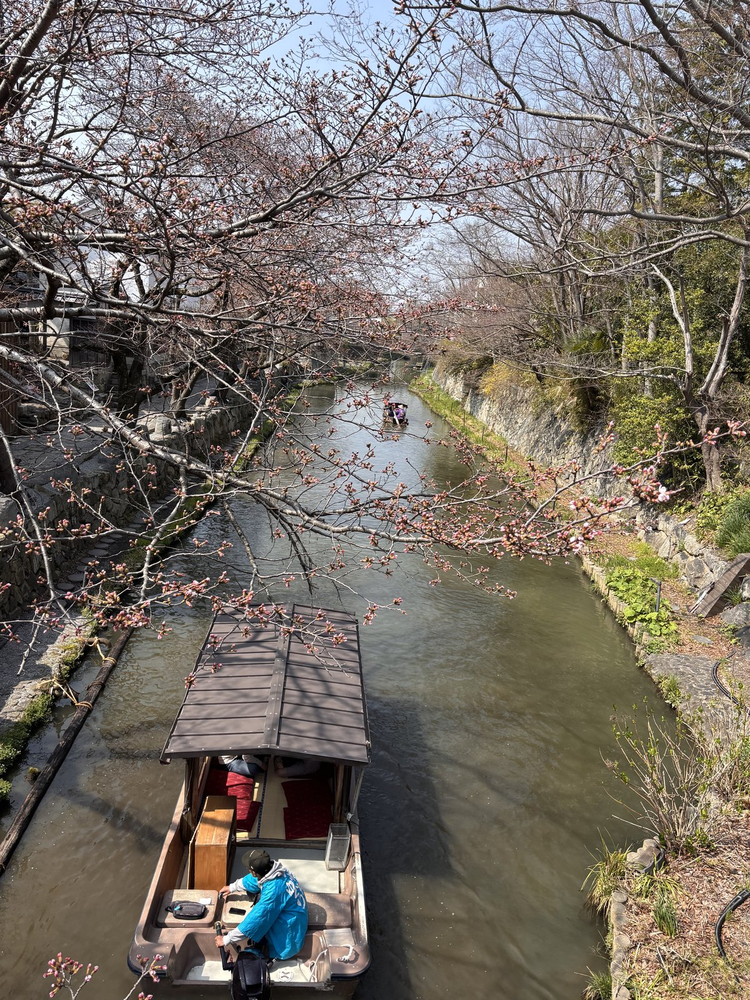

往西出城,路邊一座天滿宮。石鳥居後面是一整片竹林,春天的竹葉黃綠黃綠的,車就靠在石燈籠旁邊。

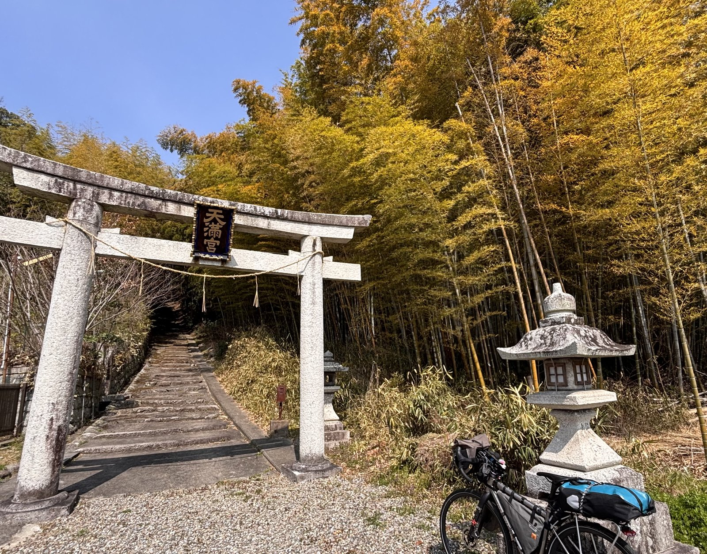

出了城,一條鋪成紅褐色的自行車道筆直往前,兩邊是白色的欄杆;左邊一排櫻樹只有花苞,右手邊的田剛犁過。

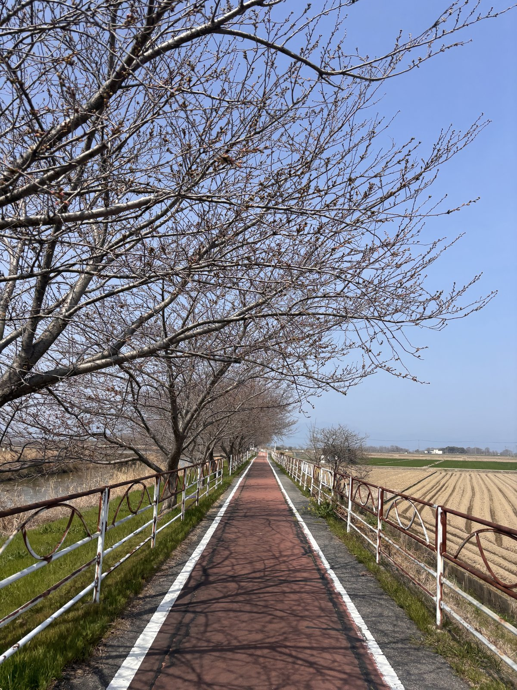

十一點多,長命寺港附近,湖邊一座鳥居,地上落了一層紅色的山茶花。三月底的琵琶湖,山茶花在謝,櫻花還沒開。

騎到湖邊,路面開始出現藍色的箭頭。琵琶湖是日本最大的湖,面積約 670 平方公里;繞一圈約 200 公里,叫「ビワイチ」(Biwaichi),2019 年被指定為日本的國家自行車路線。路面上藍色的箭頭和藍線就是它的標記,跟著走,基本上不會迷路。

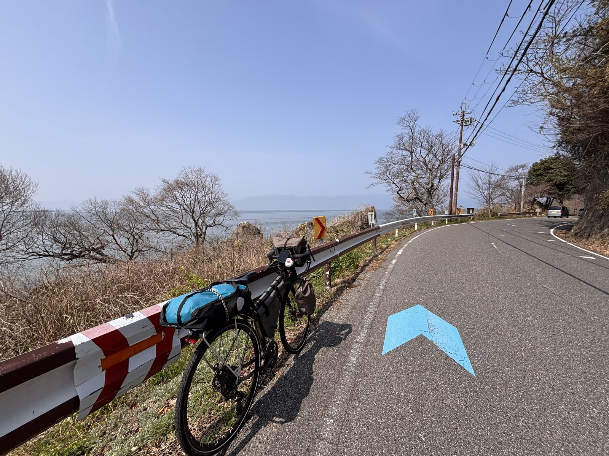

十一點半,長命寺再往北一點的湖邊,湖面上一排排木樁排成箭頭的形狀,遠遠地伸進湖裡。這是琵琶湖傳統的定置漁法「魞」(eri):魚順著木樁圍成的網走,最後游進盡頭的網裡。

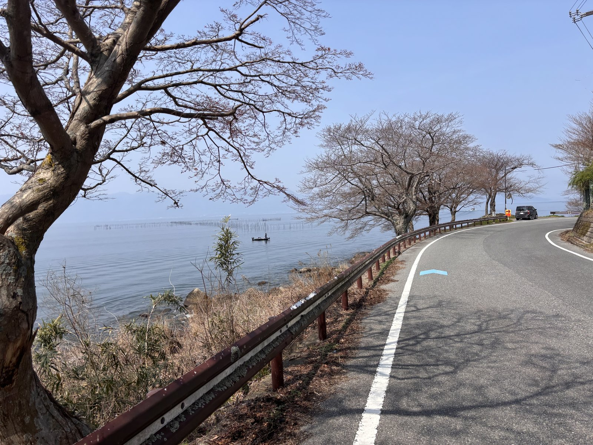

再往北,宮ヶ浜。湖岸一棵柳樹剛冒新芽,黃綠色的,後面是一灣很平的水和對岸的山。

兩點多,人已經過了愛知川,湖岸道路貼著湖往北;三點還在彥根市區西南邊的湖岸自行車道上,三點多繞到彥根城的護城河。

彥根城的天守是日本五座「國寶天守」之一,四百多年前蓋好到現在,是原物,不是戰後重建的。城裡幾棵早開的櫻花已經粉粉的,樹下立著「二季咲桜」的牌子;大部分還在等。護城河邊長滿青苔的石垣底下,一隻白天鵝低著頭在找東西吃。

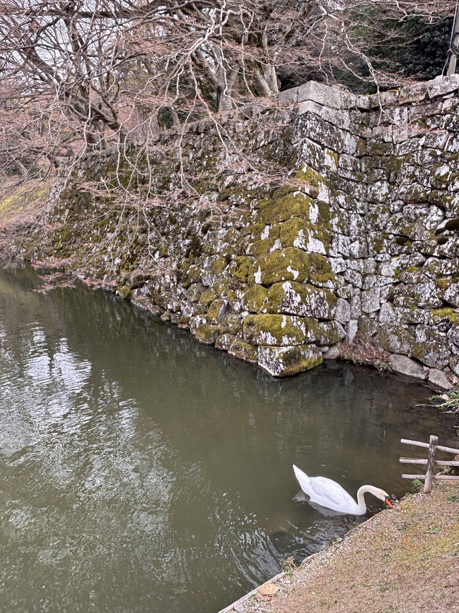

在護城河邊繞了半個小時左右,河面上有遊船開過,就繼續往北。

四點,米原的湖岸,一片沙灘,湖面上浮著一群水鳥。再往北七、八公里,四點半多到長濱。長濱城是豐臣秀吉當上城主之後築的第一座城;現在看到的天守是 1983 年重建的,裡面是歷史博物館。城就在湖邊的豐公園裡,太陽已經低了,松樹和石燈籠的影子拉得很長。

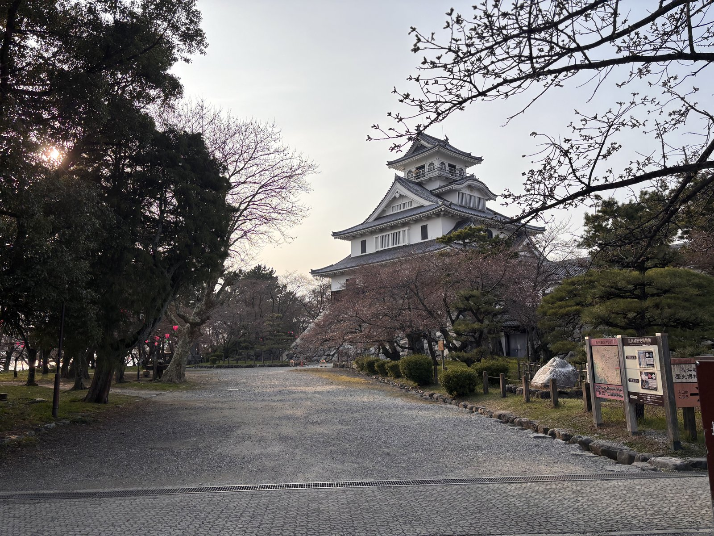

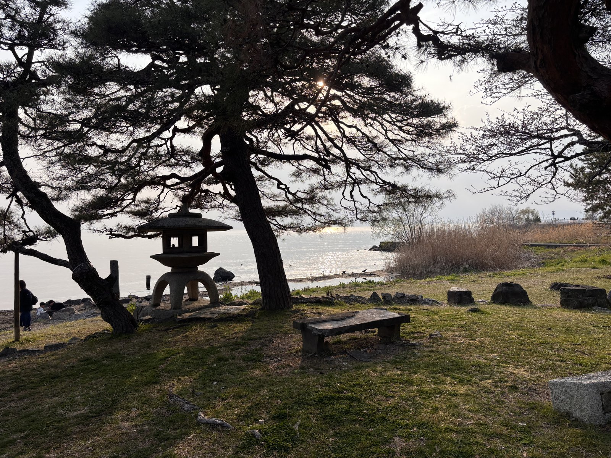

這一晚住長濱。湖東岸這一段大致是平的,路面上一路有藍線,自行車道和一般道路輪流出現。

## 3/29 奧琵琶湖:海津大崎的八百棵櫻花,幾乎都還沒開

第二天從長濱往北。早上十點,長濱北邊的湖岸公園,櫻樹還是光的。琵琶湖的北端叫「奧琵琶湖」,湖面在這裡收窄,兩邊的山直接落進水裡,路也就只能貼著山壁走。

十點多,湖北的尾上一帶,路邊一棵櫻花已經開滿了,旁邊立著一塊石碑。這是這一天照片裡第一棵開滿的。

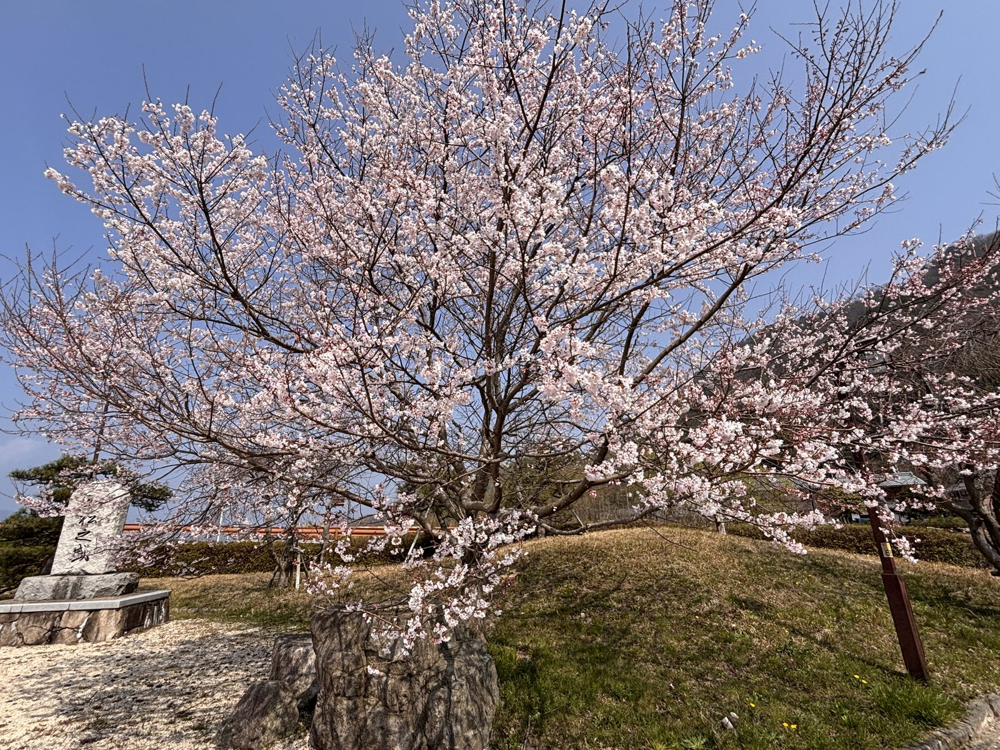

十一點半,賤岳(賤ヶ岳)山腳下的飯浦,往塩津浜的縣道 336 號貼著湖走。一邊是很平靜的湖,一邊是山,有一段路上面蓋著防落石的棚子,鏽紅色的鋼架,路面上一樣畫著 ビワイチ 的藍線。

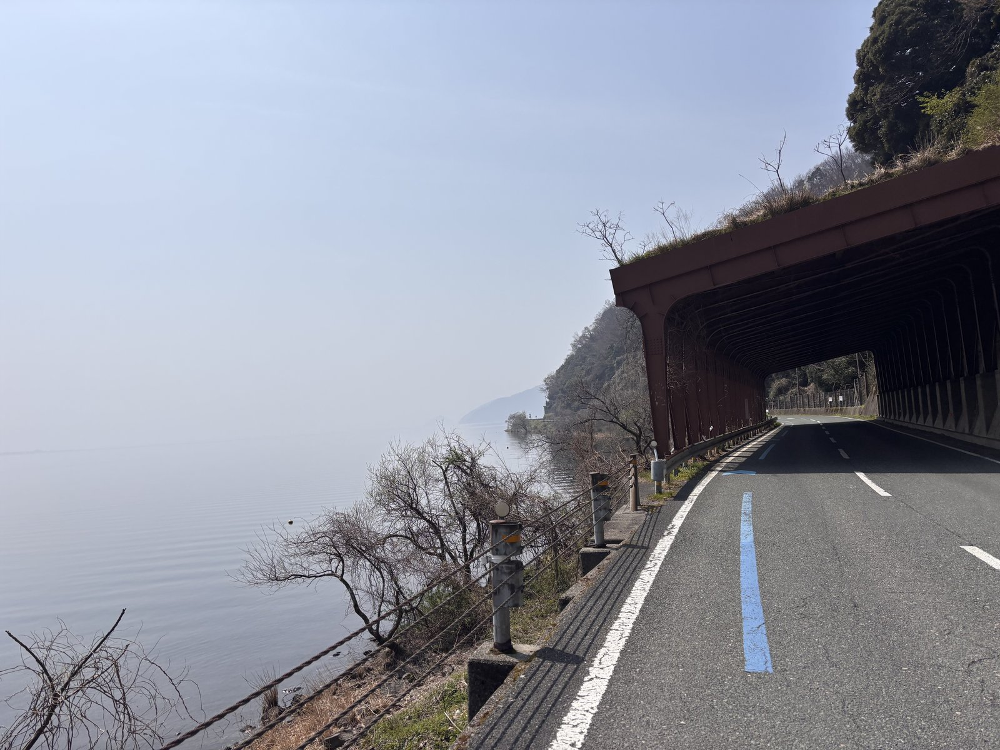

過了塩津往西走國道 303,一點過大浦。國道從這一帶改鑽奧琵琶隧道,貼著湖繞過去的是舊路(現在的縣道 557 號),一點半到湖的北岸、海津大崎。這裡沿著湖岸大約四公里,種了八百棵左右的櫻花,是「日本櫻花名所 100 選」之一。不過海津大崎在湖的最北邊,花期通常比南邊晚,大約要到四月上中旬。3 月 29 日這天,整排櫻樹還是光禿禿的枝椏;枝椏中間望出去,湖中那座小島是竹生島(Chikubushima),島上有寶嚴寺和都久夫須麻神社。

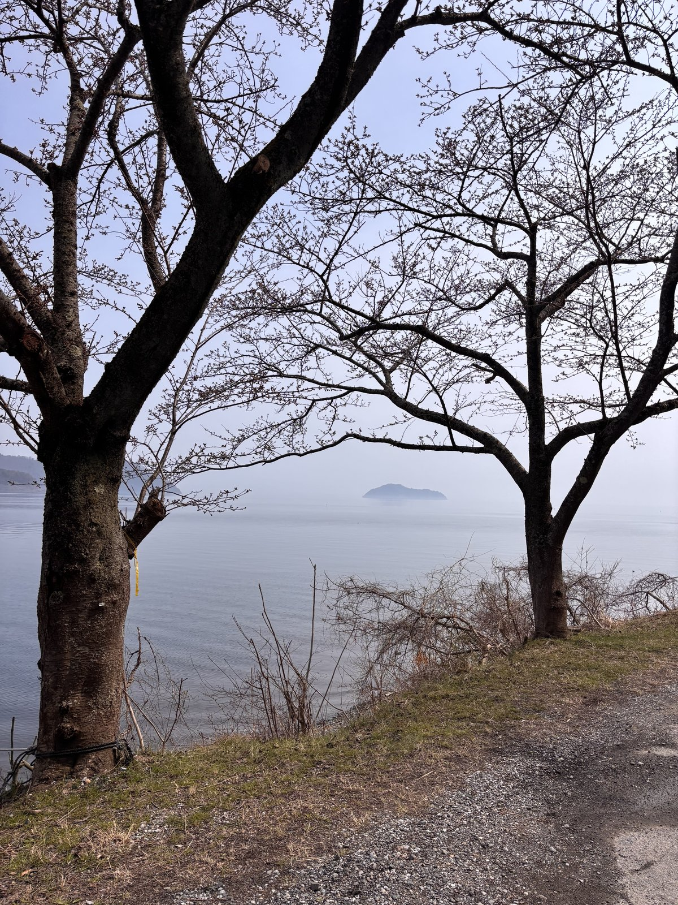

同一條路上,只有少數早開的品種已經一片粉紅。路很窄,前面有兩個人,也是騎車來的。

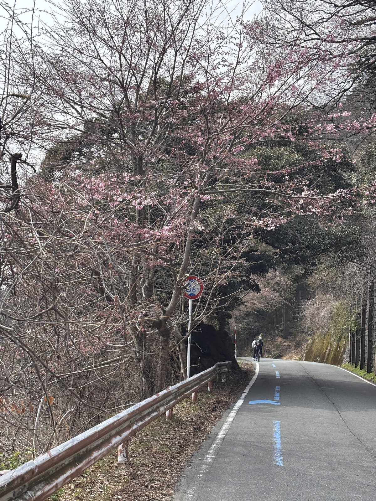

專程為了花來的話,3 月底太早:海津大崎的花期比京都、大阪晚,想看那四公里的櫻花隧道,要等四月上中旬。如果是騎 ビワイチ 順路經過,這條貼著湖的舊路本身就值得騎——一邊是山,一邊是湖,湖中間是竹生島。

再往西,是高島市牧野的 Metasequoia 林蔭道(メタセコイア並木)。從湖邊穿過田間的小路過去,大約 2.4 公里的路,兩邊種了五百棵左右的水杉,夏天綠、秋天轉紅褐色。三月底它還是一身冬天的褐色,枝椏都是空的,一根一根排過去。

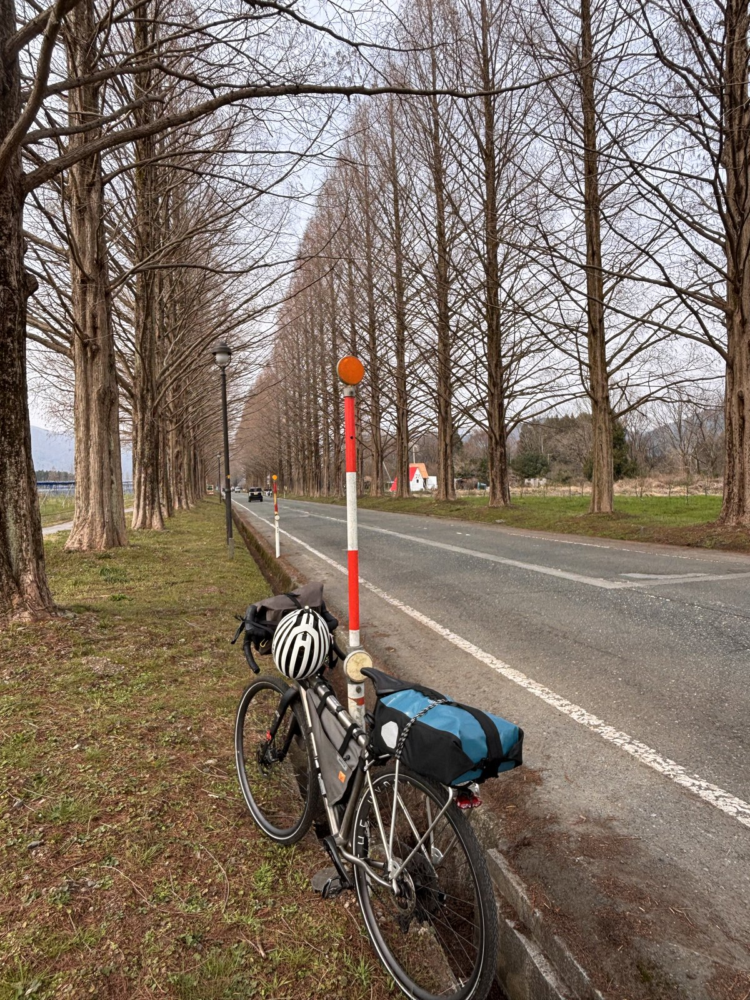

下午三點多,往南回到湖邊。今津北邊的湖畔,一排大樹站在草地盡頭,幾棵光禿禿的,最右邊一棵松,樹下有人和腳踏車,小小的。這一晚住今津。

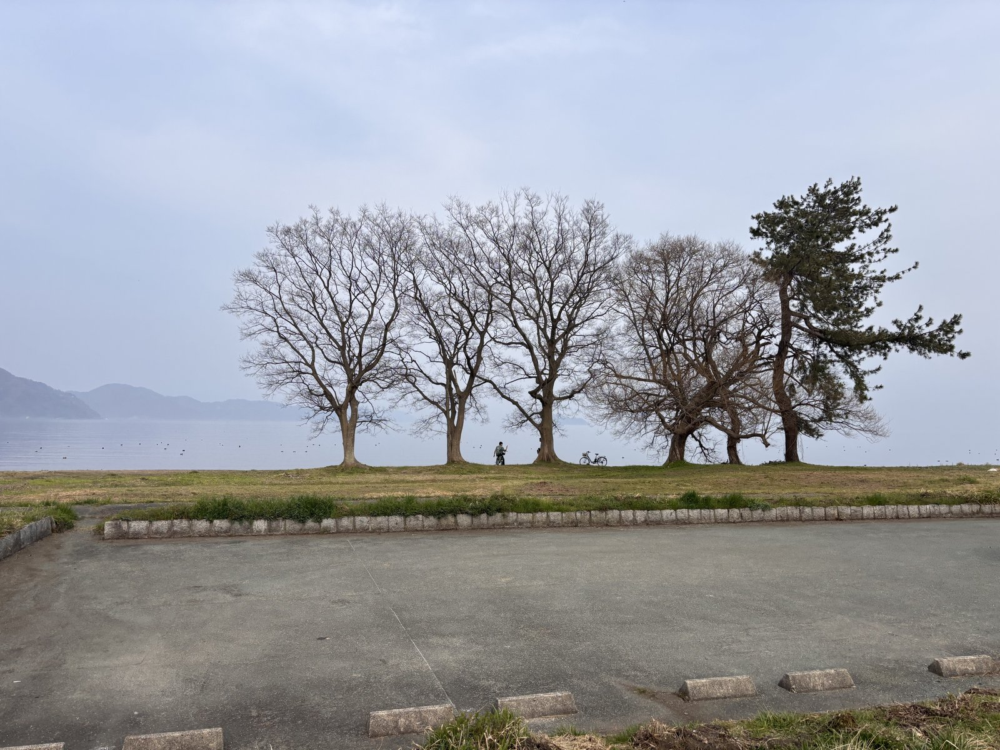

奧琵琶湖這一天:東岸的湖岸路一邊貼山、一邊貼湖,有防落石的棚子,路肩窄;海津大崎那四公里路很窄;牧野、今津一帶是田間小路和平路。照片位置連起來將近四十公里,實際騎的還要多一些。

## 3/30 湖西線到山科,順著琵琶湖疏水、鴨川、淀川騎到枚方

琵琶湖的水,有兩條路往南流。天然的一條是瀨田川,往下變成宇治川、淀川,一路流進大阪灣;人工的一條,是明治時代挖的琵琶湖疏水,從大津穿過山,把湖水送進京都。3/30 這一天,上午我沿著疏水進京都,下午又到了宇治川、淀川邊。

早上七點四十九分,人還在今津的湖邊;十點二十五分,已經在京都山科、車站北邊幾百公尺的疏水旁。中間這五十多公里,是 JR 湖西線:近江今津到山科,新快速四十五到五十分鐘,單車一樣拆開裝袋上車。

湖西岸從今津往大津,白鬚神社一帶(高島市鵜川到大津市北小松)沒有別的路,只能走車流量大的國道 161 號,常被說是 ビワイチ 最難騎的一段;2024 年春天起,這一段靠湖那側(往南)的車道劃了單車專用道。湖西線到山科,剛好接上疏水從第一隧道出來、沿山腳露天流的那一段——疏水邊的櫻花,就從這裡開始。

琵琶湖疏水第一期 1890 年完工。運貨的船、灌溉用水,還有日本第一座營業用的水力發電廠,都靠這條水道;後來它也成了京都自來水的水源。山科這一段疏水沿著山腳走,旁邊是一條碎石步道,兩旁的櫻花——開了。前一天在湖北還是光禿禿的枝子,這裡已經是一整排,樹下還開著油菜花。步道上散步賞花的人不少。

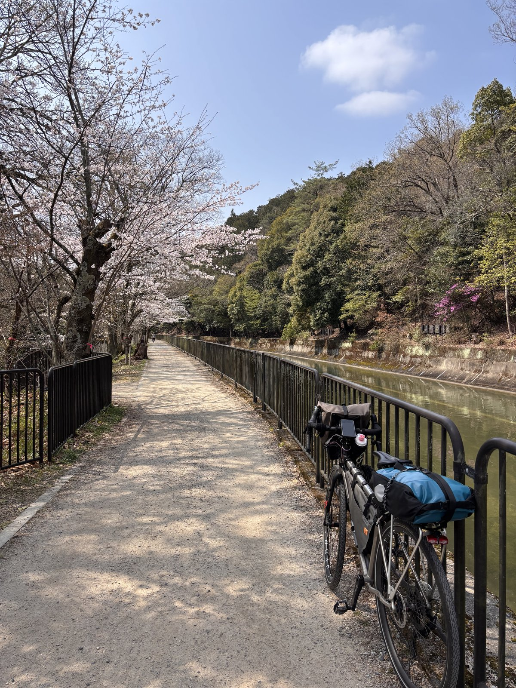

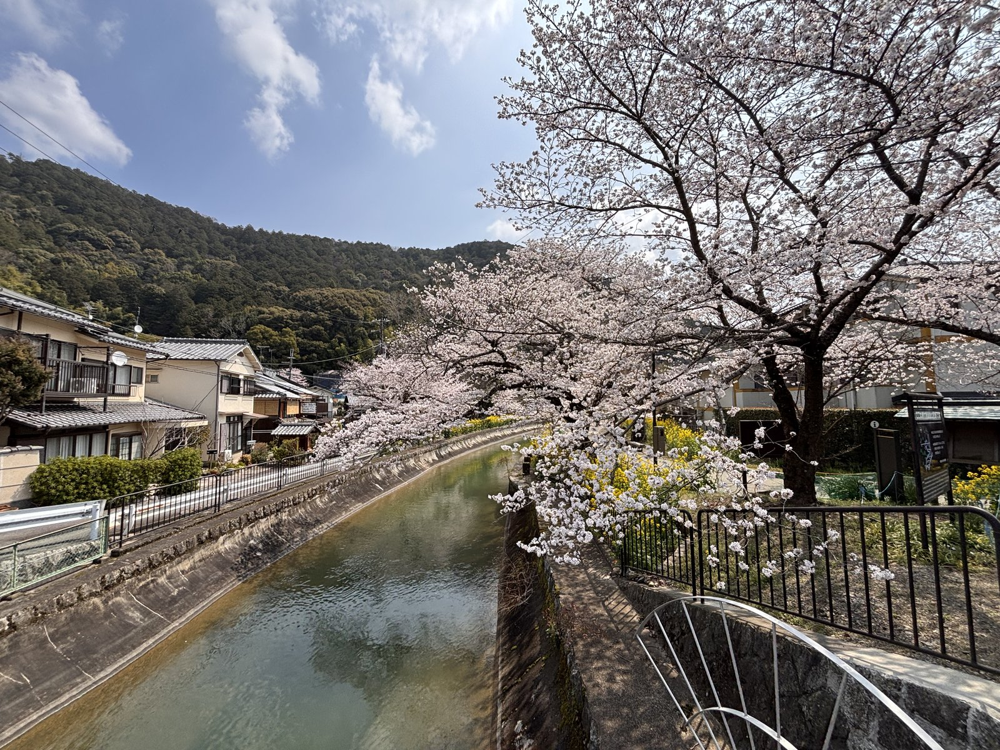

2018 年起,疏水上又開了觀光船,從大津一路開到京都的蹴上,要事先預約。十一點半,一艘船從櫻花樹底下開過來。

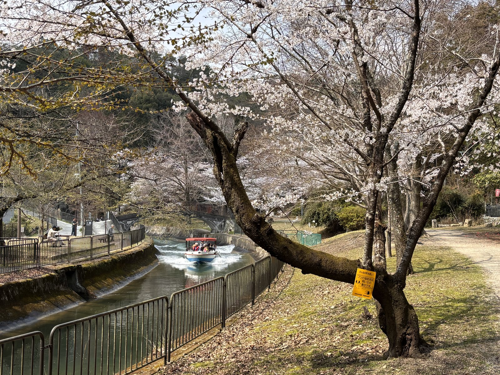

十一點五十分到蹴上。這裡有一段以前把船拉上拉下的斜坡鐵道(蹴上インクライン),現在是京都有名的賞櫻地點;鐵道底下那個紅磚隧道口——「ねじりまんぽ」,磚是斜著砌的——前面滿滿的人和車。

十二點二十多分,東山三條一帶的白川。垂柳剛綠,水流得很急,一邊是老房子,有人騎著車經過。

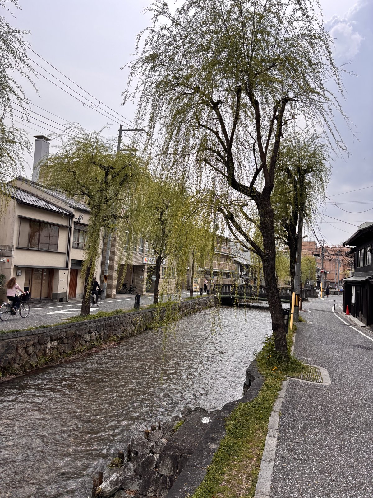

鴨川河岸,雪柳和櫻花一起開,河岸的步道一路往南。

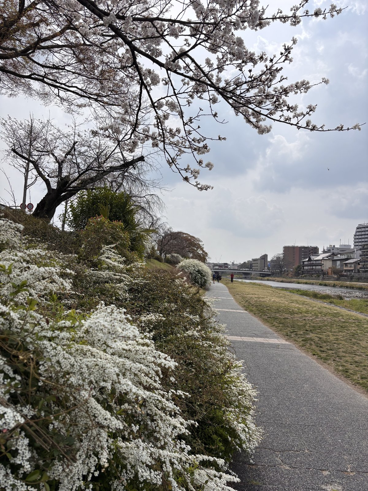

一點多,鴨川下游、伏見一帶的堤防,櫻花排成一整排,樹下就是路。

三點四十五分到八幡的背割堤。背割堤是宇治川和木津川匯流前、夾在兩條河中間的一道長堤,大約 1.4 公里,兩百多棵染井吉野排成一條櫻花隧道。那天天色轉陰;那幾天正好是背割堤的賞櫻祭(2026 年是 3/28–4/5),堤下搭著一排藍色帳篷,堤上散步賞花的人不少。

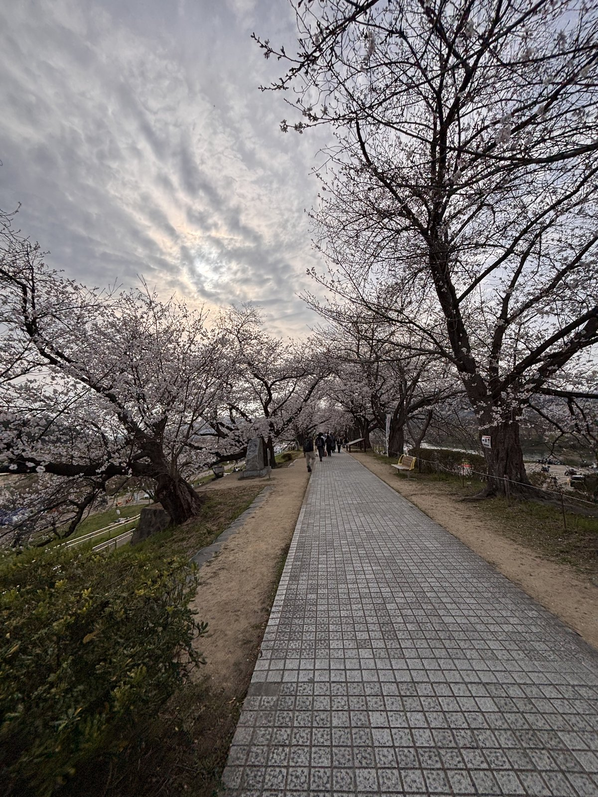

宇治川、木津川,再加上從京都西邊流下來的桂川,三條河在這一帶會合,成了淀川。從這裡開始,我就沿著淀川的堤防往下游騎。快五點,枚方一帶的堤防上是一整排油菜花,堤防外是住宅大樓和一座座電塔。

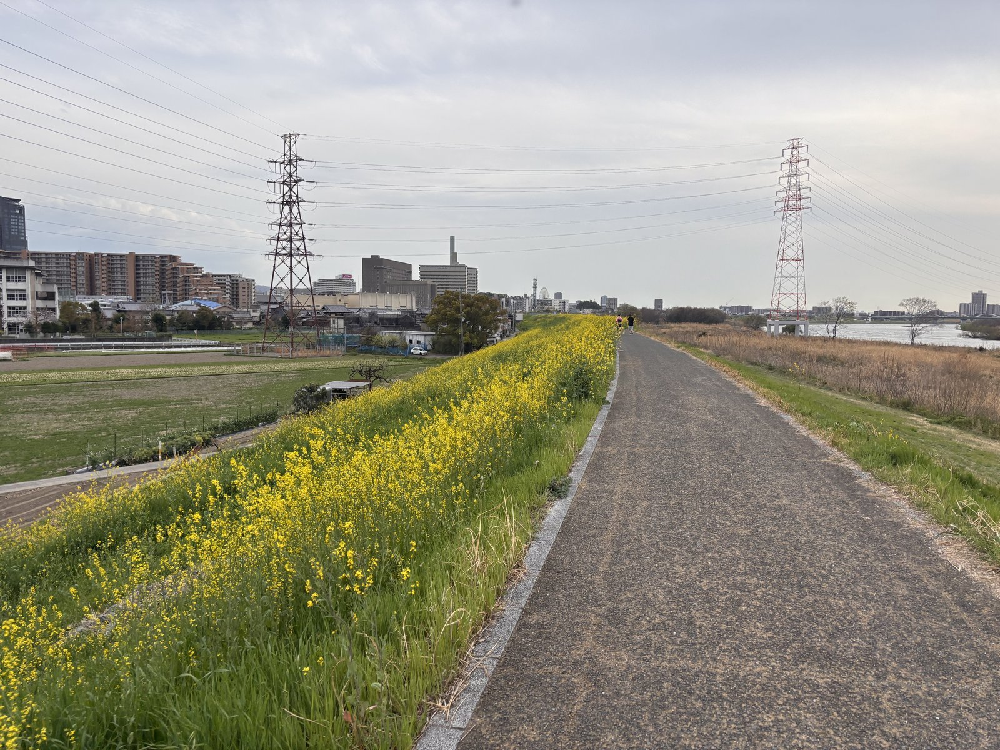

照片停在枚方,傍晚快五點。隔天中午前,人出現在大阪大川的起點毛馬——枚方到毛馬,沿著淀川堤防還有二十公里上下。

## 3/31 大阪:大川的櫻花隧道、大阪城外堀

最後一天在大阪,照片都在市區,照片位置連起來不到十公里。

中午前,毛馬。淀川在這裡分出一條大川——明治末年開了新淀川以後,這條舊河道就叫大川,穿過市中心流到中之島。河岸的毛馬櫻之宮公園,沿河四公里多,兩岸都是櫻花。三天前在近江八幡還是花苞的櫻花,在這裡已經開成隧道,自行車道就從隧道底下穿過去,對面騎過來一個人。

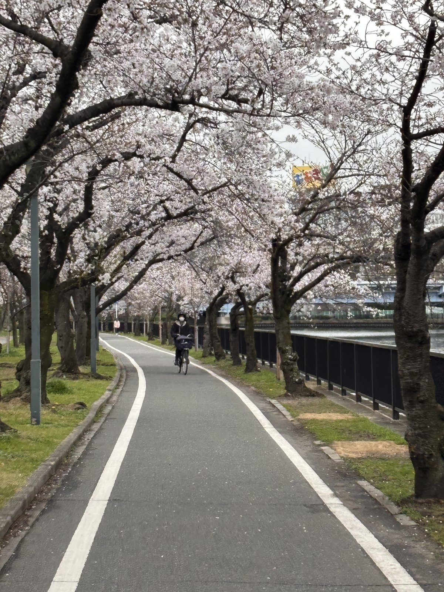

一點過後,從橋上往下看大川:一邊是水,一邊是一整排櫻花,樹下是散步道和自行車道,一路排到看不見的地方。

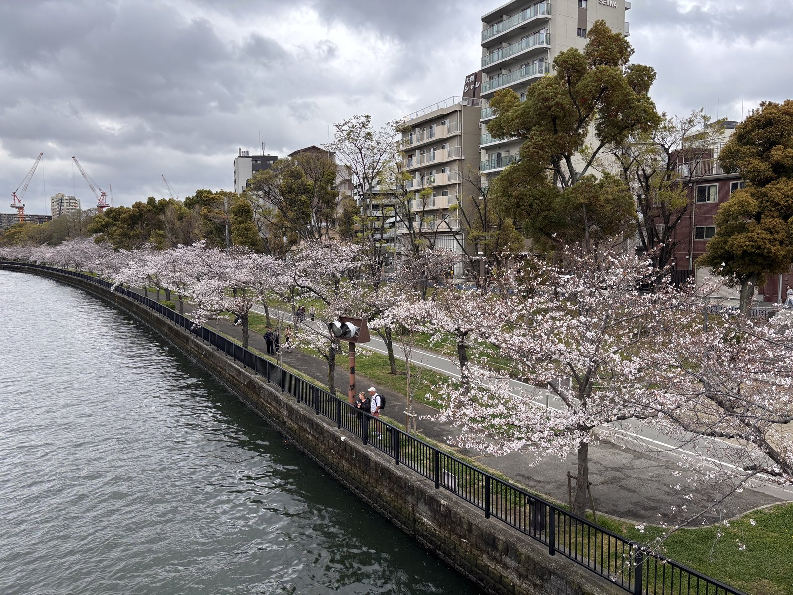

下午兩點,在市區進了一家單車店,店裡從天花板到地上,掛滿了折疊車和小徑車。

兩點四十多分到大阪城。大阪城是豐臣秀吉從 1583 年開始築的,現在看到的巨大石垣,是豐臣家滅亡後,德川幕府在 1620 年代重新堆起來的。從西邊的外堀一路往南,再往東走了一段,護城河邊的櫻花也開了。這一天的照片,都在外堀這一圈。

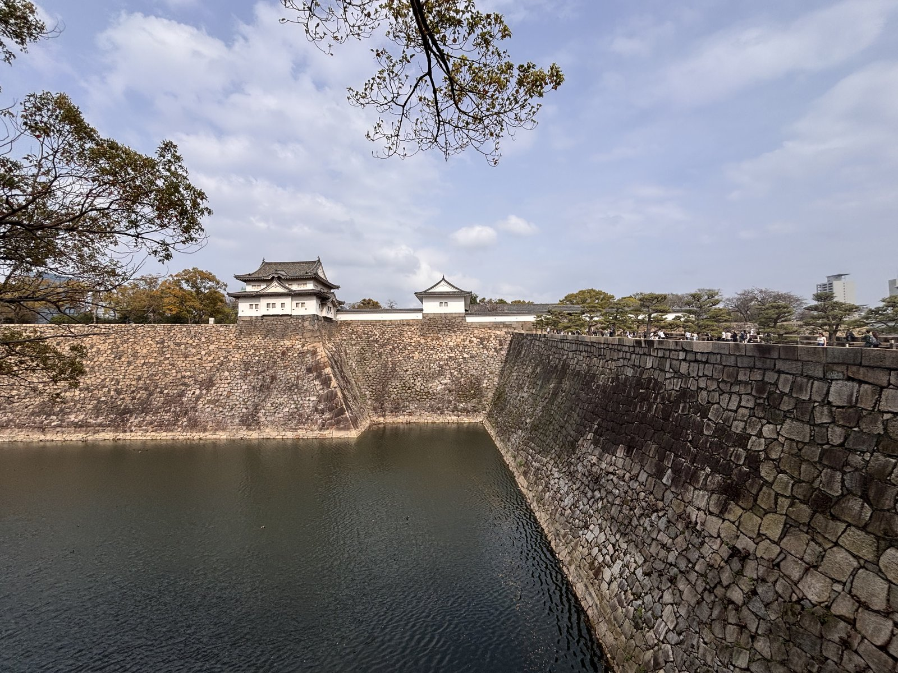

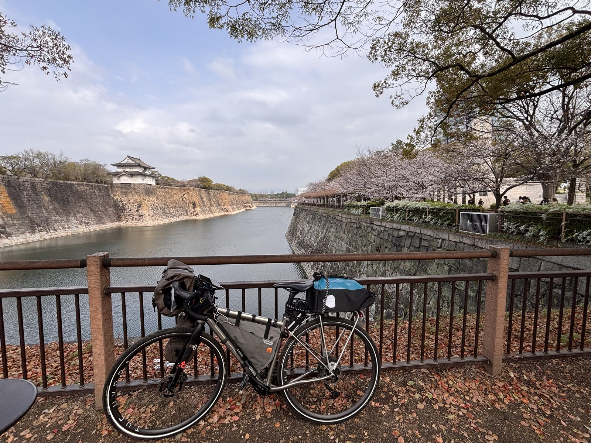

3/31 的照片到三點二十分為止。第 3 站到這裡。

回頭看這四天,路線是順著水走的:琵琶湖北半圈,再順著疏水、鴨川、淀川往下游。花剛好也是這樣開的——湖北還是光的,山科開了,大阪已經滿了——每天往南一點,就多開一點。只有海津大崎沒趕上:四公里、八百棵、名所百選,3 月 29 日幾乎還是光的枝子。想看名所,四月上中旬再來;想看花一天比一天開,三月底這樣由北往南走,剛好。

## 這一段的實用筆記

- **JR 帶單車(輪行)**:JR 的規定是單車要拆開裝進輪行袋,袋子三邊合計 250 公分以內、30 公斤以內,不另外收費。這一段搭了兩次 JR:3/28 敦賀到近江八幡,普通車在米原轉琵琶湖線,約一個半小時,1,340 円;3/30 近江今津到山科,湖西線 53 公里,新快速約 45–50 分鐘,990 円(票價是 2026 年 9 月查的)。
- **單車紙箱怎麼辦**:這趟日本是從大阪(關西機場)進、大阪出。單車的紙箱寄放在關西機場島上的日航飯店:落地時已經是晚上,紙箱就寄在飯店,隔天一早直接從飯店出發;回程再回同一家飯店,用那個紙箱打包。做法寫在第 1 站[山陰](../2026-jp-01-sanin/)。
- **ビワイチ 有標線**:琵琶湖沿岸的路面畫有藍色箭頭和藍線,就是環湖單車路線 ビワイチ 的標記,照著走不太會迷路。東岸近江八幡到長濱大致是平的,自行車道和一般道路輪流出現。
- **奧琵琶湖的路比較窄**:賤岳山腳的飯浦到塩津浜,ビワイチ 走的是貼著湖的縣道 336 號(塩津浜飯浦線),一邊貼山、一邊貼湖,有防落石的棚子,路肩窄。照片裡車不多,不過那天是星期天。國道 8 號是北陸往關西的幹線,大車多,在這一段走內側的塩津バイパス,不走湖邊;ビワイチ 的路線也盡量避開它。海津大崎那四公里路很窄;花季最盛的那個週末(2026 年是 4/4、4/5,9:30–17:00),汽車改成從海津往西淺井的單向通行,單車不受單向限制,但經過海津的村子要下來牽(高島市的公告)。
- **湖西岸的白鬚神社一段**:高島市鵜川到大津市北小松,只能走國道 161 號,車多、路窄。2024 年春天起,靠湖那側往南的車道劃了單車專用道;往北騎的沒有。這一段搭湖西線跳過去,是另一個選擇。
- **櫻花是南早北晚**:2026 年 3/28 近江八幡還是花苞,3/29 海津大崎幾乎沒開(花期通常是四月上中旬),3/30 京都山科、蹴上、背割堤都已經開了,3/31 大阪大川已經開成隧道。想看海津大崎,四月上中旬再去;三月底來,把它當一條湖邊的好路就好。
- **琵琶湖疏水(山科段)**:四ノ宮到日ノ岡約 4.2 公里,沿疏水整理成散策路,春天櫻花和油菜花一起開。京都市的觀光網站「とっておきの京都」寫明這條散策路是行人專用道;路面是碎石,賞櫻季散步的人又多,單車要下來牽著走。疏水船要事先預約。到了蹴上,ねじりまんぽ 隧道口前人和車都多。
- **京都市區**:市區是平的,鴨川兩岸有河岸步道,可以一路順著河往南騎到伏見一帶。
- **背割堤**:堤上是鋪磚步道,賞櫻季人多。賞櫻祭(さくらまつり;2026 年是 3/28–4/5,9:00–17:00)期間,入口「さくらであい館」前有單車架,背割堤地區的停車場另設臨時單車停車場(淀川河川公園的公告);堤上人擠人,車停好再走上去比較實際。
- **淀川自行車道**:從八幡(御幸橋)經枚方到大阪毛馬,堤防上有鋪面的路,大約三十公里,平的;枚方一帶堤防上是油菜花,堤外是住宅區和電塔。終點毛馬就是大川的起點,接上毛馬櫻之宮公園(沿大川到天滿橋,約 4.2 公里)的河岸路。
- **大阪**:大川兩岸沿河四公里多都是櫻花,自行車道從樹下穿過;大阪城可以沿外堀繞一段,櫻花季的下午外堀邊人很多。
- **住宿**:3/28 長濱、3/29 今津、3/30 淀川沿線。長濱、今津都有 JR 新快速會停的車站(長濱站、近江今津站),碰到下雨或騎不動,可以直接接火車。
- **補給**:湖東岸沿路會經過彥根、長濱這些市區,便利商店不難找。奧琵琶湖這邊,塩津浜的國道 8 號旁有道の駅「塩津海道あぢかまの里」(有餐廳和物產店,3–11 月 9:00–17:00,週末假日到 18:00,週二休);過了塩津,往大浦、海津大崎是沿湖的小聚落,想穩一點就在這裡先補。
- **距離**:照片 GPS 位置的直線加總,3/28 約 43 公里、3/29 約 39 公里、3/30 山科到枚方約 32 公里、3/31 市區約 7 公里;實際騎的路會比這長。這一段暫時沒有軌跡檔。

---

這段的攝影作品之後放 Flickr。
