<small>2026/4/1–4/8・和歌山縣、三重縣、大阪府|上一站:[琵琶湖・京都・大阪](../2026-jp-03-biwa-kyoto-osaka/)|下一站:[北阿爾卑斯](../2026-jp-05-northern-alps/)</small>

4 月 3 日下午兩點半,熊野本宮觀光協會的櫃台上立著一塊牌子,上面一行日文「巡礼達成おめでとうございます」,底下一行英文「CONGRATULATIONS DUAL PILGRIM」。我在這裡拿到一張證書,日期寫著 2026 年 4 月 3 日。熊野古道和西班牙的聖雅各之路(Camino de Santiago),常被說是世界上唯二列入世界遺產的朝聖路,兩條都走完的人,可以在這裡登記成「雙重朝聖者(Dual Pilgrim)」——而我是騎單車來的,熊野古道,偏偏是一條單車上不去的路。

這張證書要兩條路都完成才發;聖雅各之路那一半,是我之前完成的。

中邊路是步道:石階、樹根、泥土坡,載了行李的車上不去。所以這一站我做的事很簡單——騎和古道平行的公路,把古道前後的東西串起來:山裡的聚落、溫泉、河、海;到了最該用走的那一段,把車放下,從發心門王子走七公里進本宮。4 月初正好是櫻花季,從山裡一路開到海邊。

| 日期 | 路線(依照片的時間與定位) | 路程參考(沿公路估) | 天氣 | 過夜 |
|---|---|---|---|---|
| 4/1 | 滝尻王子一帶 → 國道 311 → 近露 | 滝尻→近露約 14 km | 小雨,山腰有霧 | 近露 |
| 4/2 | 近露 → 近露王子 → 野中(繼櫻王子、秀衡櫻一帶)→ 國道 311 → 湯峰溫泉 | 約 23 km | 晴 | 湯峰溫泉 |
| 4/3 | 湯峰 → 本宮・大齋原;發心門王子 → 步行 → 熊野本宮大社 | 湯峰→本宮約 6 km;古道步行約 7 km | 晴 | 本宮一帶 |
| 4/4 | 大齋原 → 國道 168,沿熊野川往下游 | 本宮→新宮約 34 km | 上午陰,下午起大雨 | 這晚沒有照片 |
| 4/5 | 新宮城跡 → 熊野速玉大社 → 過熊野川進三重縣 → 熊野市鬼城 → 御濱町的海邊 | 約 38 km | 陰 | 御濱町(七里御濱) |
| 4/6–4/7 | 這兩天沒有照片 | | | |
| 4/8 | 濱寺公園 → 堺・シマノ自転車博物館 → 南海堺站(單車裝袋) | 約 9 km | 晴 | 這晚沒有照片;隔天早上從新大阪出發 |



## 4/1 滝尻 → 近露:雨裡騎進中邊路旁的公路

這一站的第一張照片,4 月 1 日下午四點十三分,GPS 落在滝尻王子往東北三公里左右的公路邊——人已經過了中邊路傳統的起點。滝尻王子是走路的人上山的地方,從這裡走到本宮約 38 公里,中間多半在近露一帶過夜。

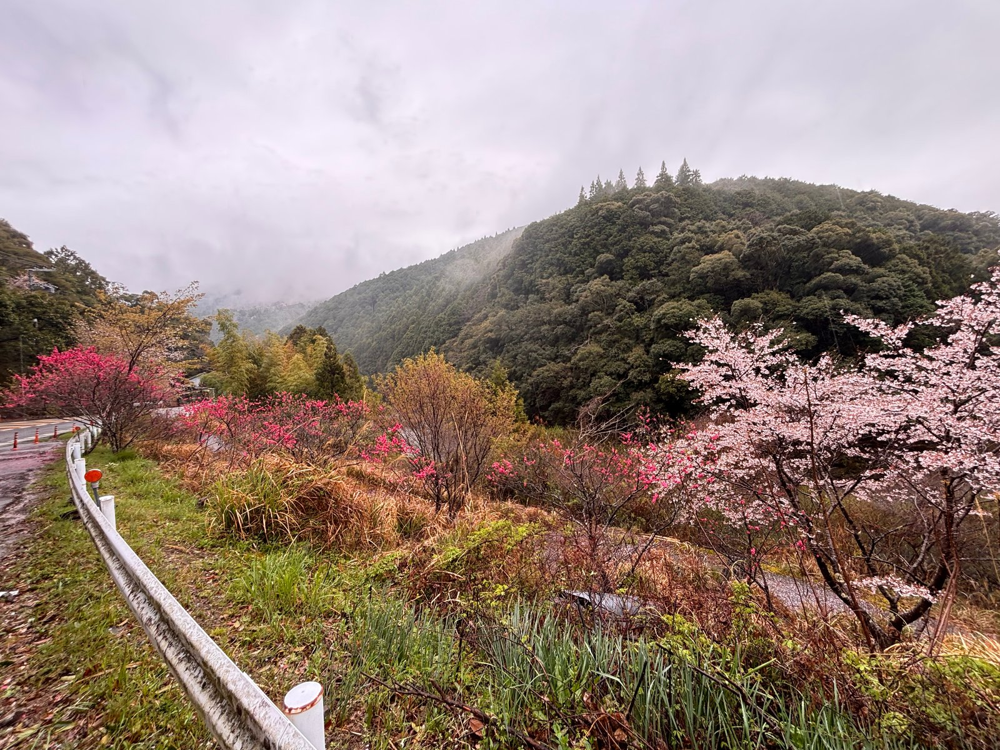

前一天(3/31)下午還在大阪城。從大阪到中邊路的入口,一般是搭 JR 特急くろしお到紀伊田邊,新大阪出發約兩小時二十分;從田邊到滝尻王子,沿國道 42 接國道 311,公路約二十二公里,也有路線巴士可以搭。

中邊路本身是步道,石階、樹根很多,載了行李的單車上不去;所以這幾天騎的,是和古道平行的國道 311。這條路從田邊這一側沿著富田川往山裡走,古道走在旁邊的山稜上,方向一樣。

四點十九分,公路貼著河,河上三道攔水堰,水白花花的;對岸的山坡,霧一條一條掛在半腰,霧裡夾著幾棵白色的山櫻。

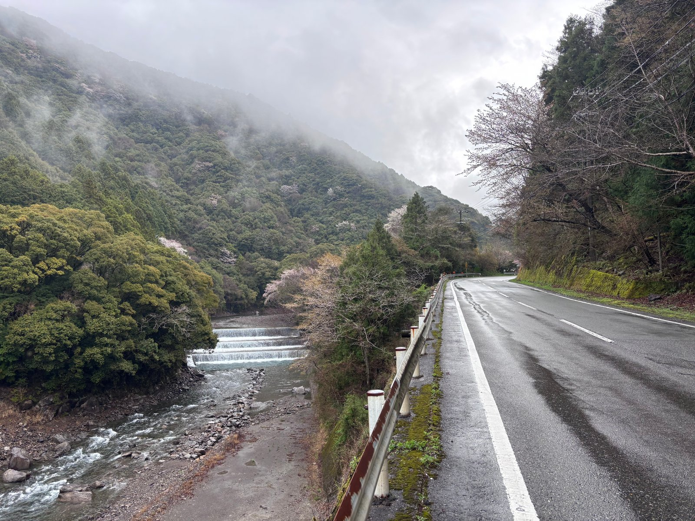

傍晚六點二十三分,到近露(Chikatsuyu)。天已經暗成深藍,停車場邊一座木頭門架,下面掛著三盞大燈籠:兩盞寫「近露」,中間那盞畫著一隻烏鴉。

近露是中邊路上的老聚落,自古就是參拜的人往本宮途中過夜的地方——現在也還是。燈籠上那隻烏鴉是八咫烏,傳說中三隻腳,替神武天皇帶路的熊野神使,現在也是日本足球代表隊的隊徽。

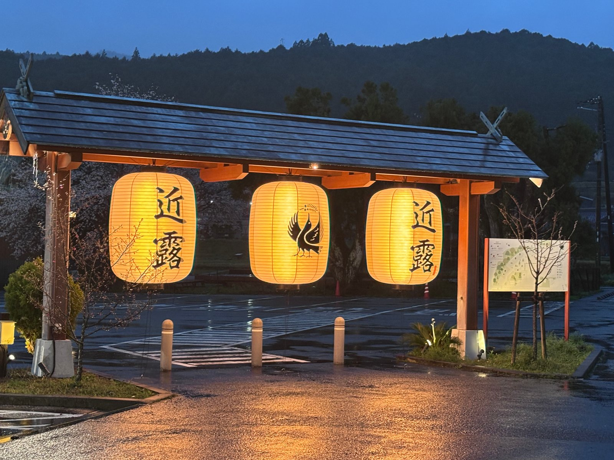

從滝尻到近露,國道 311 大約十四公里。這天的雨斷斷續續:日本氣象廳滝尻附近的栗栖川站,上午十點多開始下,每小時零點五到兩毫米,入夜後才變大。路面一路是濕的,到近露時天已經快黑了。這晚住近露。

## 4/2 近露 → 野中 → 湯峰溫泉:放晴,櫻花一路

隔天放晴。早上九點多還在近露,停車場邊那棵櫻花開得正滿。九點四十五分,近露王子:路邊一個小木屋造型的蓋章箱。中邊路沿線這種祭祀熊野神的小社叫「王子」,一座接一座,走古道的人一站一站蓋章;近露王子就在聚落邊上,騎車也順路,我在這裡蓋了章。要登記 Dual Pilgrim,熊野這一邊的證明,就是古道集章帳上的這些章。

十一點前後,騎到野中(Nonaka)。十點五十分那張照片的 GPS 就在繼櫻王子:王子前面有一排枝子只往南長的「野中一方杉」;再往東一百公尺左右的路邊是秀衡櫻,一棵傳說跟藤原秀衡有關的老櫻。十一點以後的幾張,GPS 又往東四、五百公尺,比秀衡櫻還遠三百多公尺,所以下面這棵應該不是秀衡櫻。這裡是山上一片開闊的地方,一棵老櫻樹斜斜地長在路邊,枝子往外伸,後面是一層一層的山;地上鋪滿花瓣,車就靠在樹下的欄杆邊。

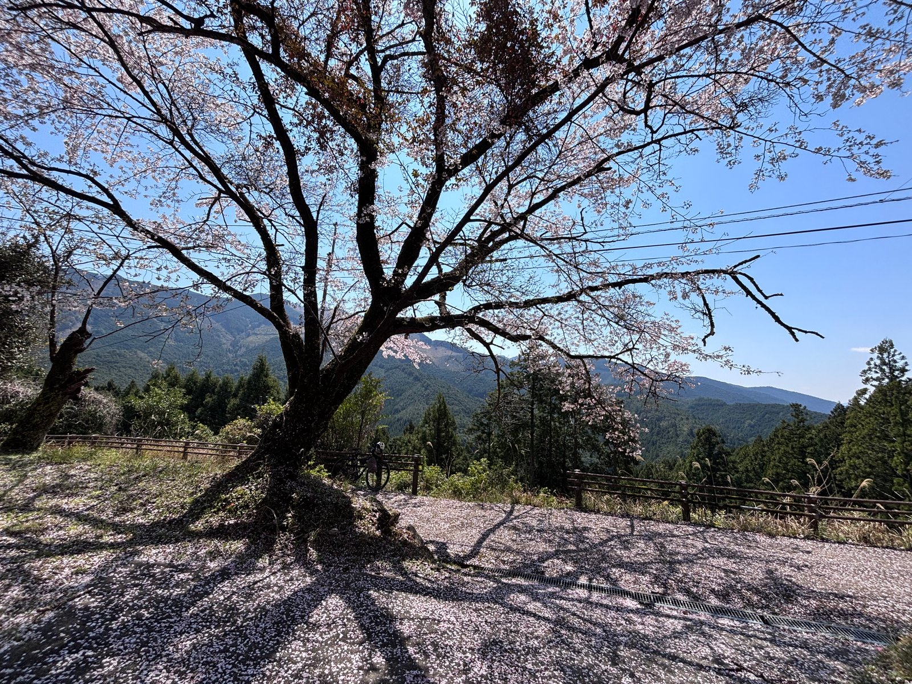

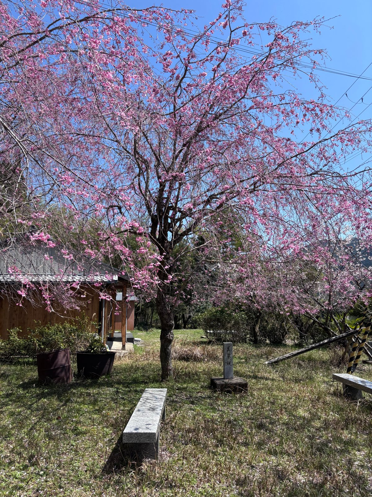

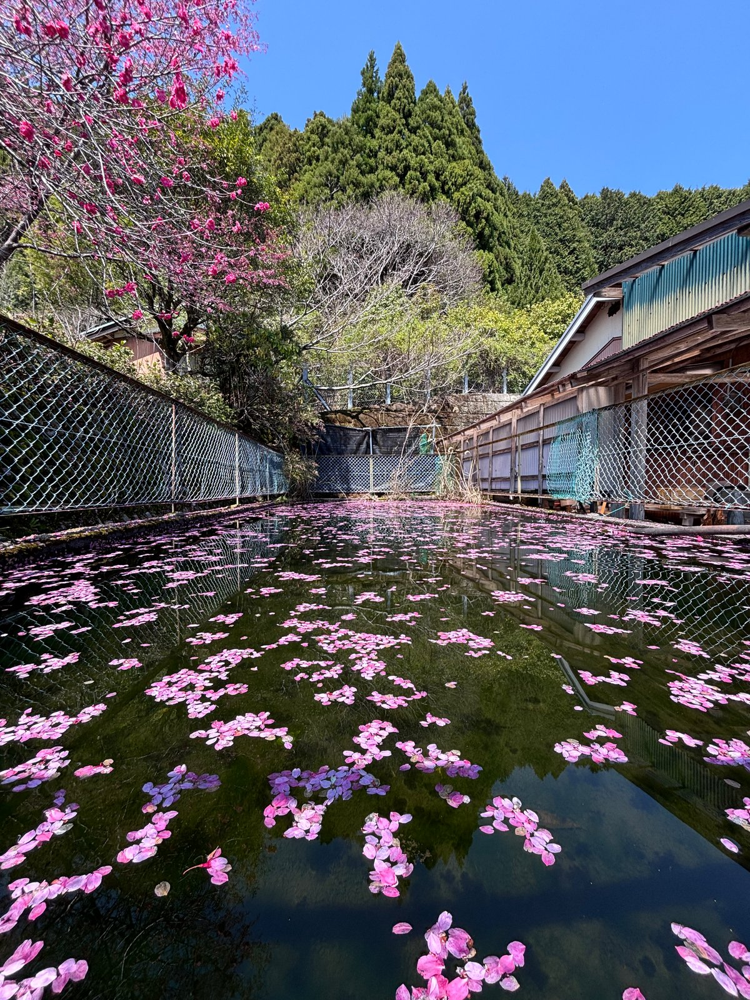

十二點多離開野中,國道 311 繼續往東。十二點四十八分,路邊一條溪谷,水在石頭間翻白,樹影蓋在上面。

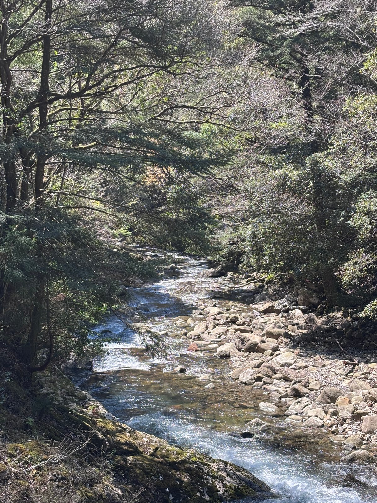

下午一點四十分,到湯峰溫泉(Yunomine Onsen)。湯峰據說是日本最古老的溫泉之一,有一千八百年的說法;以前的人參拜本宮之前,先在這裡泡湯淨身。溫泉街中間一條窄窄的溪,溪裡那間小木屋是「つぼ湯」,一次只讓一組人進去,是世界遺產裡唯一可以真的下去泡的溫泉。

溪邊的東光寺,掛著「南無薬師如来」的紅旗子;前面那塊大石碑寫著「玄峰塔」,紀念在湯峰出生的禪僧山本玄峰。寺旁邊就是公眾浴場。

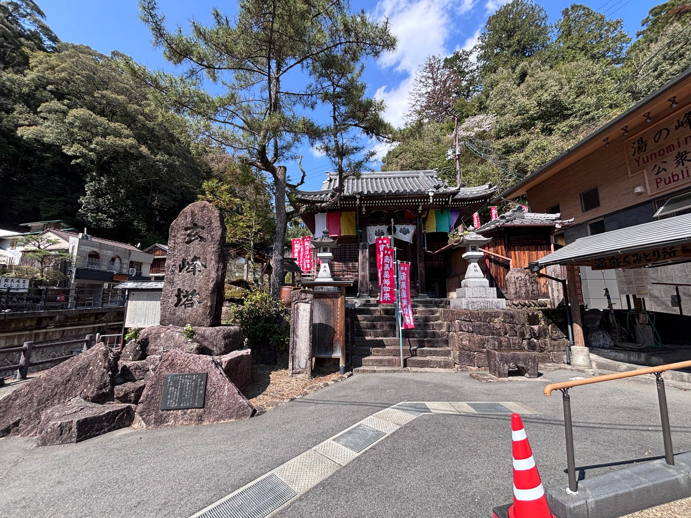

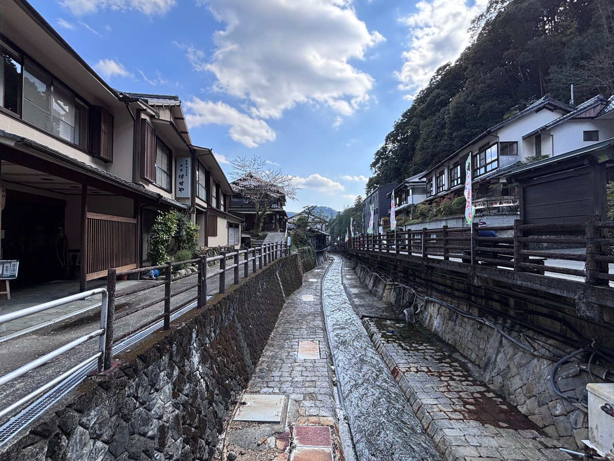

這晚住湯峰。隔天早上七點的照片是一間榻榻米和室,GPS 還在溫泉街上。つぼ湯的時間、價錢和規矩,整理在文末的實用筆記。

## 4/3 發心門王子 → 熊野本宮大社:最後 7 公里用走的

早上八點四十分,從湯峰到了本宮的街上,天很藍。八點四十四分,田的另一頭,就是大齋原(Ōyunohara)的大鳥居。

熊野本宮大社原本蓋在熊野川和音無川交會的沙洲上;明治 22 年(1889)一場大水沖壞了社殿,才搬到現在的山坡上。舊址就叫大齋原。入口這座大鳥居高約 34 公尺,2000 年立起來,是日本最大的鳥居。

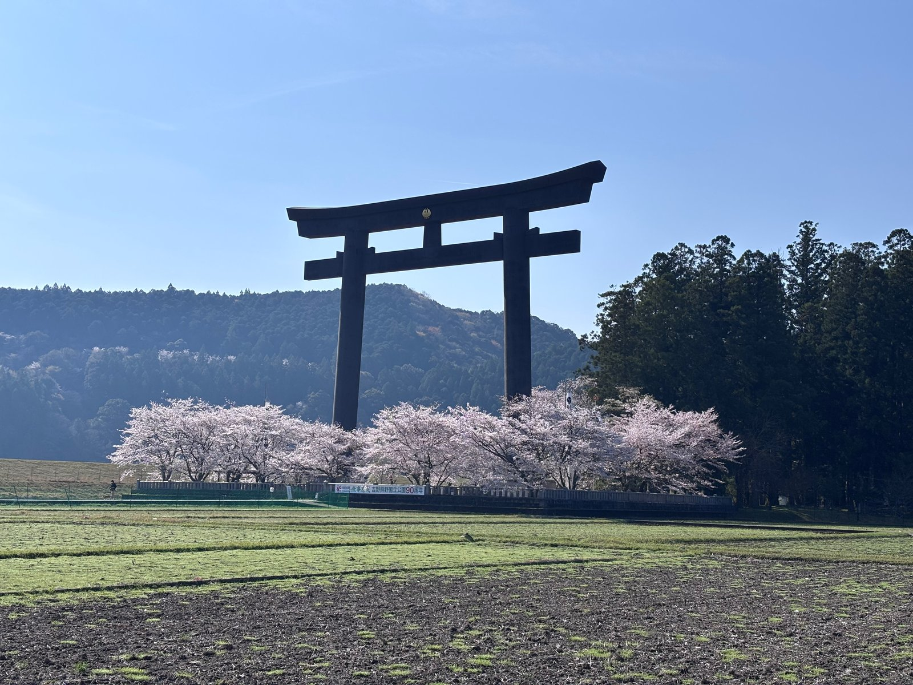

然後,這一天改用走的。

發心門王子在本宮西北邊的山上,走回本宮大社大約 7 公里,下坡居多,是整條中邊路最多人走的一段,很多人就是為了這 7 公里來的。從本宮上去有龍神巴士:本宮大社前上車,十五分鐘左右,470 日圓(2026 年 9 月查的票價)。很多人就是這樣,搭車上去、再走下來。

九點五十三分,在發心門王子(Hosshinmon-ōji),一塊大石頭上刻著「世界遺産」和「熊野参詣道中辺路」。前段是村子裡的水泥小路,穿過幾戶人家和菜園;十點半,在水呑王子附近,步道進到一片筆直的杉木林。

中午十二點,走到伏拜王子(Fushiogami-ōji)。以前的參拜者走到這裡,第一次看見遠處的本宮,就伏在地上拜——名字是這麼來的。現在這裡是山腰一處休息點:一間木造小屋、幾張木頭桌椅,坡上是一畦一畦的茶園,垂枝櫻從頭頂垂下來,遠處的山一層疊一層。

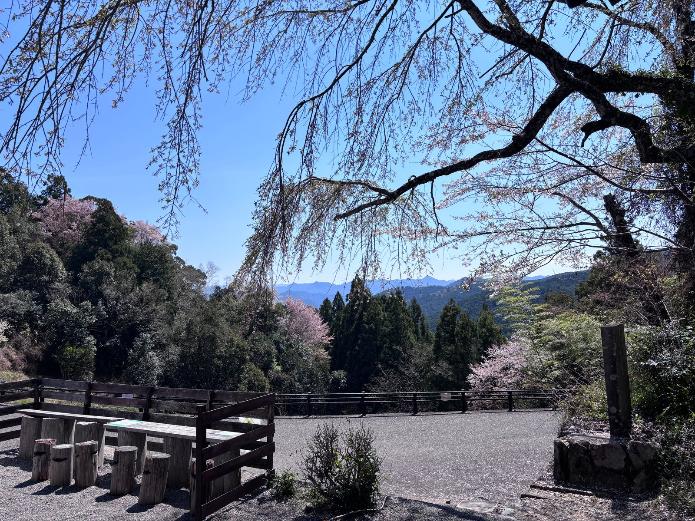

從伏拜王子再走三公里多,經過三軒茶屋跡和祓殿王子——祓殿王子就在本宮大社背後——古道就走到了本宮大社。熊野本宮觀光協會的介紹是:全程 6.9 公里,步行約兩個半小時,含參拜休息約三個半小時;緩下坡、路寬、好走,村子裡的路和留著石疊的古道輪流出現。和歌山縣的觀光官網說,運動鞋也能走,低山用的健行鞋比較好走;鞋底有釘或很硬的鞋會傷到古道,要注意。

我九點五十三分從發心門王子出發,十二點在伏拜王子;伏拜王子之後的下一張照片,已經是下午兩點十七分,人在本宮大社對面的世界遺產熊野本宮館。

兩點半,在館裡觀光協會的櫃台登記,拿到那張 Dual Pilgrim 證書——從照片的時間看,進館到拿到證書大約十五分鐘。櫃台旁的說明寫著:登記好的雙重朝聖者,可以到本宮大社的社務所報名,參加一場打太鼓的儀式;不是每天都有。

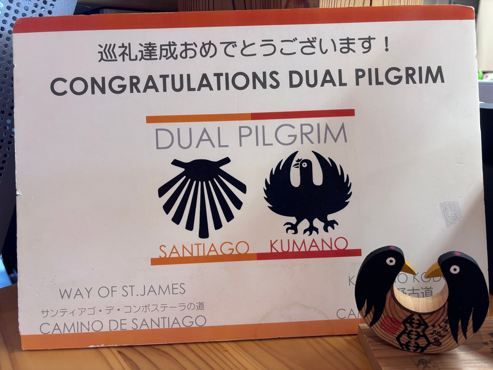

想走最短的發心門王子這一段來登記的人要注意:照田邊市熊野觀光局官網的規定,除了這 7 公里,還要參拜熊野速玉大社和熊野那智大社。五種可以登記的路線、要帶哪些證明,整理在文末;能不能登記,以櫃台當場認定為準。

三點二十三分,停車場邊一塊石柱,嵌著聖雅各之路那個黃色貝殼的路標,底下的小牌子寫「10.755 Km」——歐洲的寫法,一萬零七百五十五公里,和從這裡到聖地牙哥的直線距離對得上。田邊市和聖地牙哥在 2014 年簽了觀光交流協定,Dual Pilgrim 就是兩邊合辦的;路標就立在觀光協會外面。

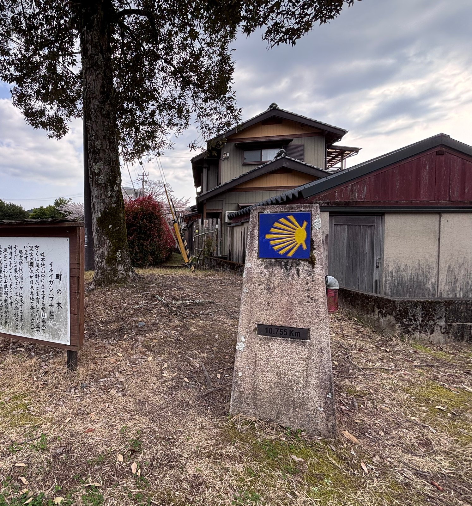

## 4/4 大齋原,沿熊野川往新宮

4/4 天陰了。上午十一點,走進大齋原。通往舊社地的參道兩旁是高大的杉樹,碎石路一直往裡面延伸,人在樹底下顯得很小。

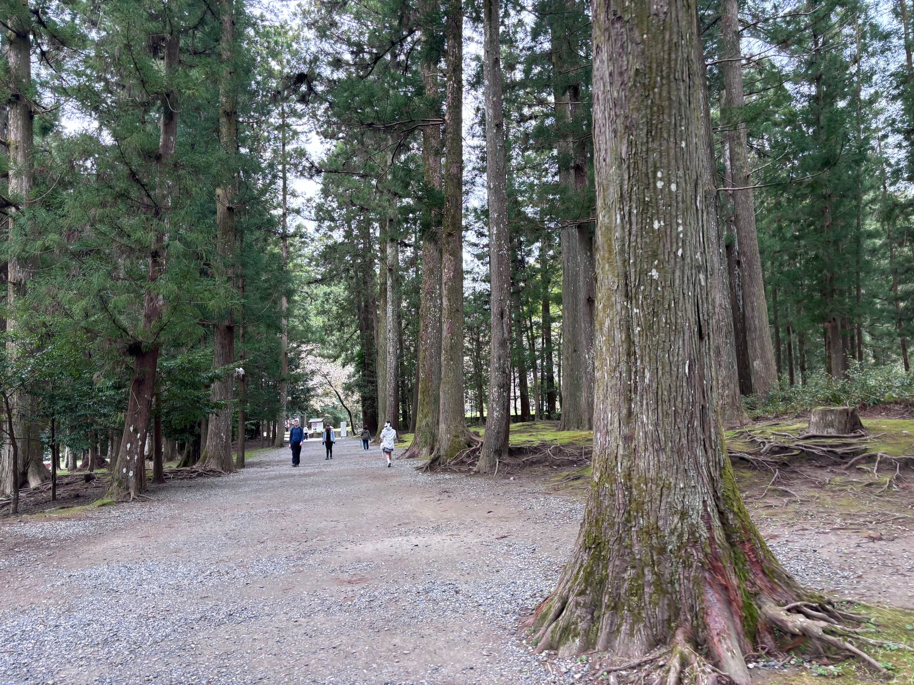

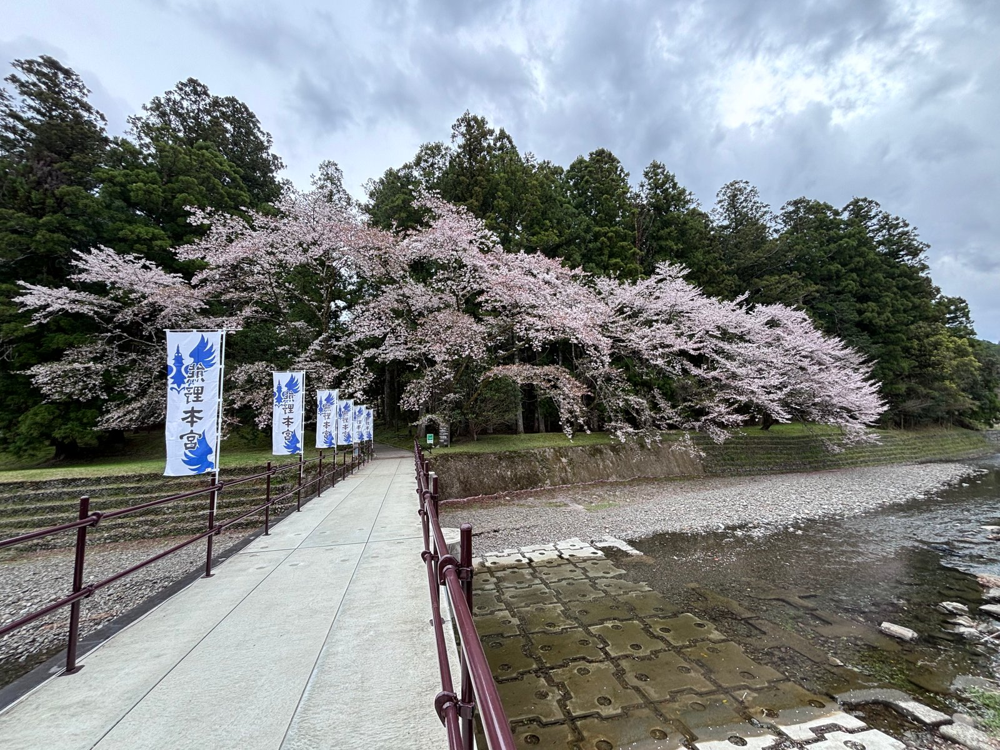

十一點二十分,離開本宮,往熊野川下游。國道 168 貼著河走,河床很寬,一大片灰白的礫石灘,一座生鏽的舊鐵橋橫過河;右手邊一整排櫻花。

熊野川從本宮流到新宮出海。以前參拜完本宮的人,很多是搭船順流而下到新宮的速玉大社——這段「川的參詣道」,是熊野古道世界遺產裡唯一的一段水路。

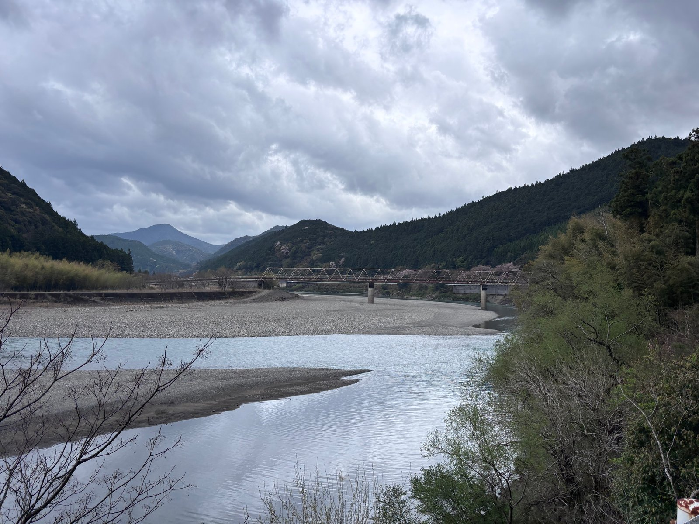

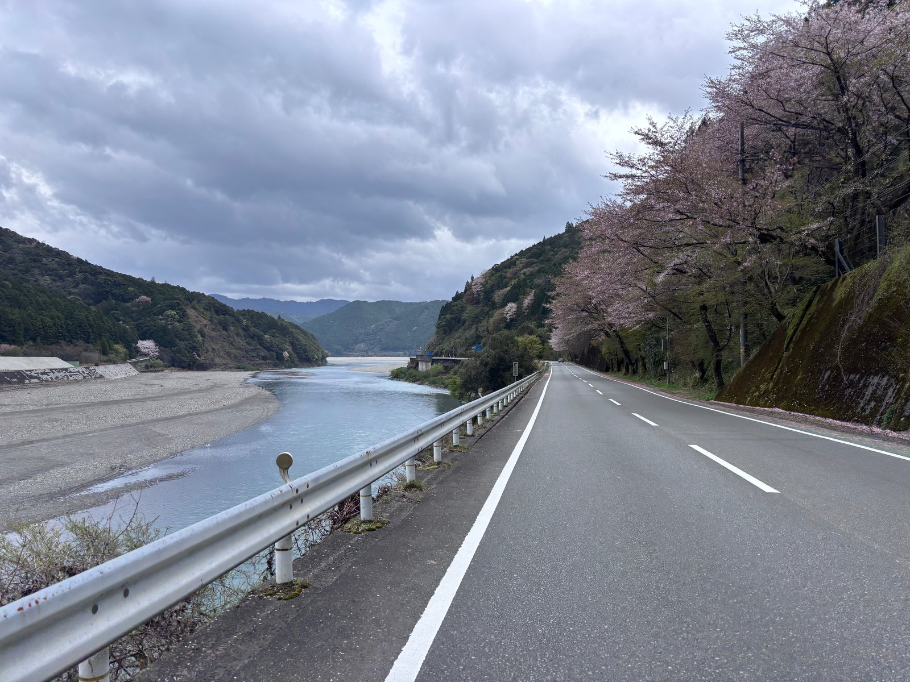

這天的照片到十一點二十一分就停了,下一張已經是隔天早上十點的新宮城。本宮到新宮,沿國道 168 大約三十四公里,順著河往下游走。照片裡這一段是雙線道,路面平整,白線外只有一條窄窄的路肩,護欄外就是河灘。

要留意的是天氣。日本氣象廳的紀錄,這天本宮中午開始下雨,新宮一整天累積 116 毫米,下午三點到七點,每小時十六到二十五毫米。沿河的山邊公路,出發前先看一下當天的雨勢預報。

## 4/5 新宮城跡、熊野速玉大社,過縣界到三重的鬼城

早上十點,在新宮城跡。新宮城又叫丹鶴城,江戶時代的城,現在只剩石垣;城跡在熊野川邊的小山上,往下看就是入海前最後一段的熊野川。

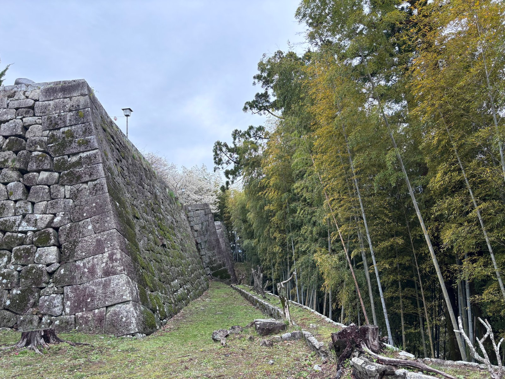

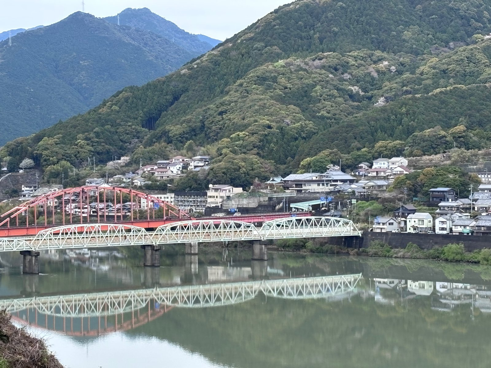

十一點,熊野速玉大社。速玉大社和本宮大社、那智大社合稱「熊野三山」;三座裡它離海最近,就在新宮市區。社殿的屋簷下掛著一面大繪馬,寫著「令和八年丙午」——2026 年是丙午年,畫的是一匹白馬。

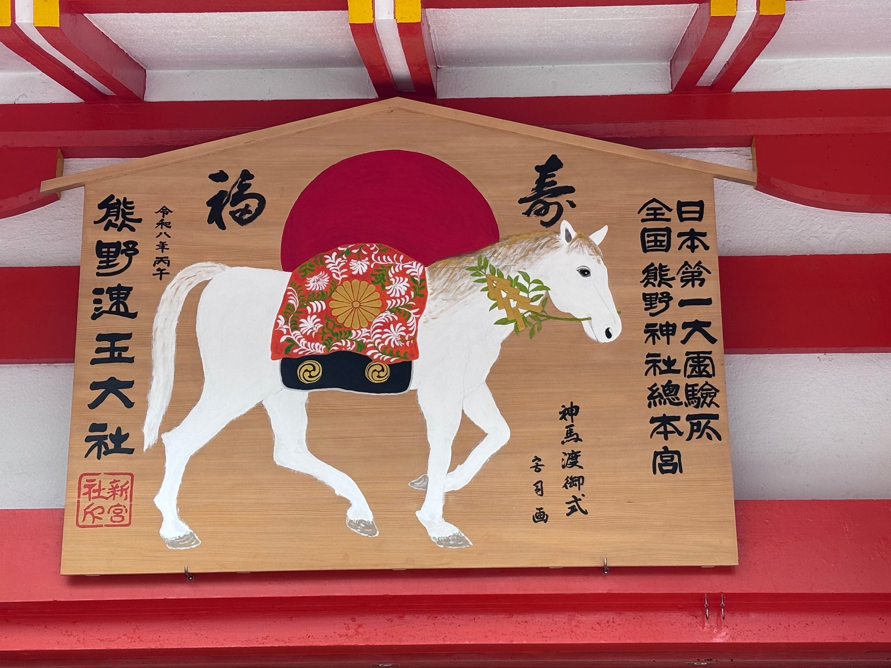

那智大社和那智瀑布在新宮的西南邊;我這天是往北走,過了熊野川就是三重縣——這一趟的照片裡沒有那智。

下午三點多,到三重縣熊野市的鬼城(Onigajō)。這是一段一公里多的海岸,岩壁被地震抬升、再被海浪一層一層掏空,蜂巢一樣的小洞一個接一個。名字來自傳說:平安時代的坂上田村麻呂,在這裡征討盤據的「鬼」。鬼城在吉野熊野國立公園裡,也是熊野古道世界遺產的一部分。步道貼著岩壁鑿出來,有欄杆,浪就在欄杆底下打。

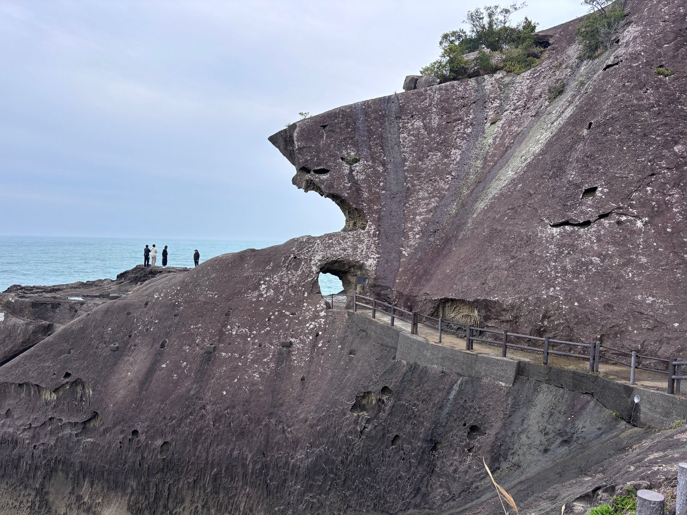

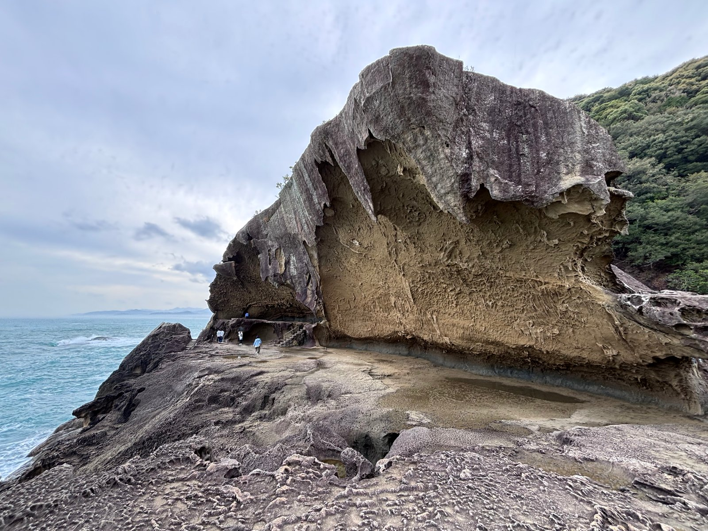

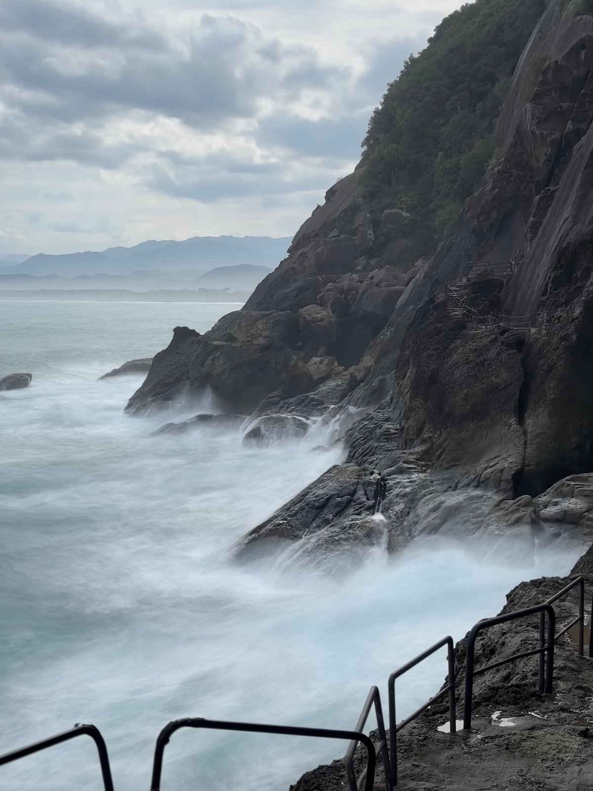

這幾張拍的時候開著原況照片(Live Photo),所以手機裡多了 8 支兩三秒的小影片,拍的就是浪打上來、和岩洞底下的那幾秒。步道沿著海岸,東口到西口約一公里,岩面濕了會滑,鞋子要穿防滑的。

傍晚六點半,最後一張照片的 GPS 在鬼城往南十幾公里的海邊,御濱町的阿田和一帶——七里御濱的海岸。那張是在房間裡拍的,窗外一整棵櫻花正開;這晚就住在這片海邊。

## 4/6–4/7 空白的兩天

這兩天,手機裡沒有照片;再有照片,已經是 4/8 下午的大阪府濱寺公園。

從熊野這一帶的海邊回大阪,JR 最直接的是紀勢本線:新宮有特急くろしお直通新大阪,約四小時十五分到四個半小時,單車一樣拆開裝進輪行袋上車。

## 4/8 濱寺公園、堺的シマノ自転車博物館,單車裝袋搭南海電車

4/8 下午兩點半,人已經在大阪府南邊的濱寺公園。一條筆直的路穿過松林,天很藍,路上全是樹影。濱寺公園以一大片老松林出名,是大阪最老的公園之一。

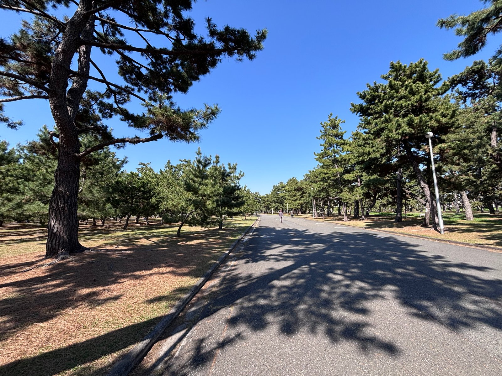

三點多,到堺的シマノ自転車博物館(Shimano Bicycle Museum;舊名自転車博物館サイクルセンター,原本在大仙公園裡,2022 年搬到堺東站北邊的新館、改了名)。堺是日本自行車產業的重鎮,Shimano 的總部就在這裡。玻璃窗邊,擺著前輪巨大的早期高輪車。

裡面有一台車,掛滿馱包、後架綁著備胎,龍頭上掛著安全帽,馱包的顏色都褪了。說明牌寫著:1995 年 9 月,坂本達騎著它出發,到 1999 年 12 月,花了四年三個月,騎過 43 個國家、大約五萬五千公里。

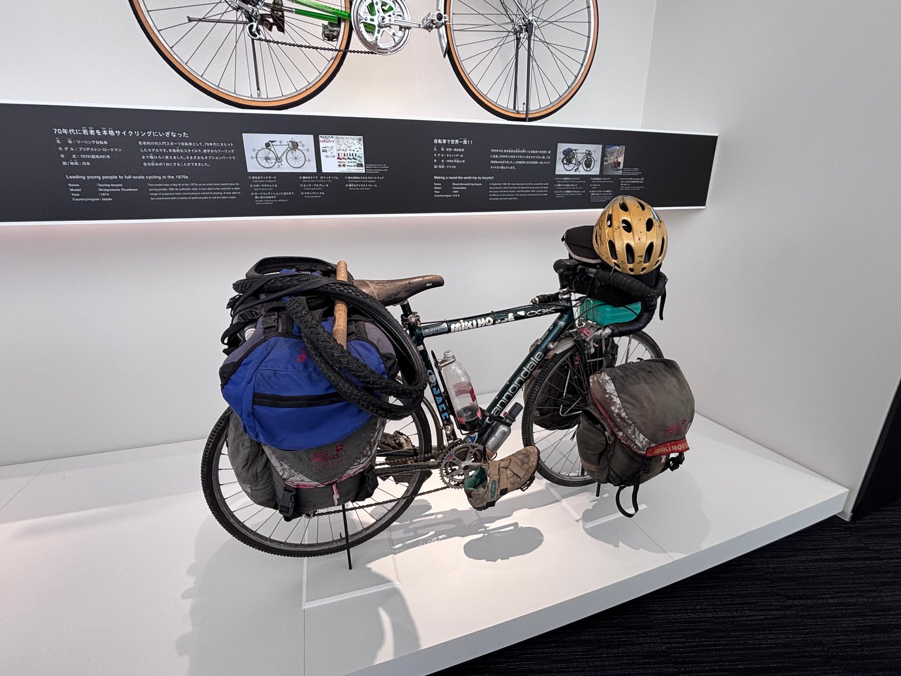

傍晚五點,人在南海本線堺站的月台上,單車已經裝進袋子。南海和 JR 的規定一樣:單車拆開(折疊車就折起來)、整台裝進專用的袋子,就能當隨身行李免費帶上車。隔天 4/9 早上十點多,人已經在新大阪的新幹線上,往長野縣的鹽尻——那是下一站了。

## 這一段的實用筆記

- **騎車與古道**:中邊路的古道是步道(石階、樹根、土坡),載行李的單車上不去;田邊市熊野觀光局的 Dual Pilgrim 規定也寫明:熊野古道只算用走的,騎車、騎馬都不算。我騎的是和古道平行的國道 311:從田邊經國道 42 接上 311,滝尻 → 近露 → 野中 → 湯峰都在這條路上,湯峰再騎一小段到本宮;古道沿線的聚落、王子、溫泉都在路邊,或岔路進去一點。要走古道的那一段,把車放下用走的。
- **發心門王子 → 本宮大社**:熊野本宮觀光協會的數字是 6.9 公里,步行約兩個半小時,含參拜休息約三個半小時;下坡居多,路面是村道、碎石、土徑和一些石疊。上去搭龍神巴士:本宮大社前 → 發心門王子約 15 分鐘,470 日圓(2026 年 9 月查的票價);班次不多,出發前先查時刻表。
- **Dual Pilgrim 登記**:在熊野本宮大社對面的世界遺產熊野本宮館(本宮觀光協會的櫃台),或田邊的觀光服務處;官網寫免費。要證明兩邊都走完。熊野這邊只算用走的(騎車不算),官網列了五種路線:滝尻王子 → 本宮大社(約 38 公里)、那智大社 ↔ 本宮大社(約 30 公里)、高野山 → 本宮大社(約 65 公里)、大邊路的指定地點加熊野三山,還有最短的發心門王子 → 本宮大社(約 7 公里),但走這條的,還要另外參拜熊野速玉大社和熊野那智大社。證明是古道集章帳上蓋的章。聖雅各那邊是走完最後 100 公里(騎車是最後 200 公里),帶 Compostela 證書,拍照或電子檔也可以。規定會改,出發前看田邊市熊野觀光局(Tanabe City Kumano Tourism Bureau)的 Dual Pilgrim 網頁;能不能登記,以櫃台認定為準。我在熊野本宮館辦,從進館到拿到證書大約十五分鐘。登記後,本宮大社有給雙重朝聖者的打太鼓儀式,要到社務所報名,不是每天都有。
- **湯峰的つぼ湯**:一組人包場 30 分鐘。熊野本宮觀光協會官網寫:大人 800 日圓(2022 年 4 月起;我在湯峰拿到的導覽單上還寫 770 日圓),6:00–21:00,20:30 停止受理。導覽單上也寫不能用肥皂和洗髮精。
- **住宿**:古道上的小聚落住的地方不多;田邊市熊野觀光局提醒,高原、近露/野中、小口這幾個聚落春秋旺季很快就滿,旺季建議約半年前就訂。我這幾晚在近露、湯峰溫泉(榻榻米和室)、本宮一帶、御濱町的海邊——地點是照片的時間和定位推出來的。
- **補給**(田邊市熊野觀光局 2024 年底的整理,營業時間會變):近露前約 2 公里的道之驛「熊野古道中辺路」有小賣店和食堂,9:00–17:00(12 到 2 月週四休);近露有一家 A コープ超市,每天 8:30–18:00;湯峰東光寺旁有茶屋,7:00–17:00;本宮有兩家小便利商店和幾家餐廳。山裡店少、打烊早,零食和午餐最好在田邊就先補好。
- **那智**:那智大社和那智瀑布在新宮西南邊,和鬼城反方向;這一趟的照片裡沒有那智。熊野三山想走齊的話,行程要另外留時間。
- **季節與天氣**:4 月初櫻花從山裡開到海邊。天氣變得快:4/1 山區從上午起斷續小雨、入夜變大;4/2、4/3 大晴天;4/4 下午起大雨,氣象廳新宮站一天 116 毫米。近露入夜就暗,車上要有燈。
- **帶車搭火車**:JR 和南海帶單車,都要拆開(或折疊)、整台裝進專用的袋子(輪行袋);JR 的限制是三邊合計 250 公分以內、30 公斤以內,不另收費,南海一樣免費(其他私鐵各家規定不同,搭之前查)。4/8 傍晚在南海堺站的月台上,單車已經裝好袋子。大阪 ↔ 紀伊田邊搭 JR 特急くろしお,新大阪出發約兩小時二十分;新宮 ↔ 新大阪約四小時十五分到四個半小時。
- **單車進出日本**:這趟日本是從大阪的關西機場進、關西機場出。單車裝紙箱上飛機;落地時已經是晚上,當晚住機場島上的日航飯店(Hotel Nikko Kansai Airport,和航廈、關西機場站有室內通道相連),紙箱就寄放在飯店,隔天早上直接從飯店出發;回程再回同一家飯店拿紙箱、把車打包。細節寫在第 1 站[山陰](../2026-jp-01-sanin/)。
- **距離**:表裡的公里數,是用照片定位沿公路估的,不是 GPS 軌跡。

熊野古道是一條走路的路。騎車來,能做的是把它前後的東西串起來——山裡的聚落、溫泉、河、海;真正踏上古道,還是得把車放下,用走的。那 7 公里,是這八天裡走得最慢的一段。

---

這段的攝影作品之後放 Flickr。
