<small>2026/4/9–4/13・長野縣・騎乘約 83 km(照片定位估)｜上一站:[熊野古道](../2026-jp-04-kumano-kodo/)｜下一站:[中山道](../2026-jp-06-nakasendo/)</small>

4 月 12 日下午,白馬的櫻花才剛開,枝頭稀稀疏疏一層淡粉紅,枝條都還看得見。隔天中午,我帶著車坐了一個多小時的大糸線往南,安曇野路邊的櫻花已經開滿了。同一條鐵路,同一個禮拜,北邊那一頭還是冬天的尾巴,南邊這一頭已經是春天。

這一站五天,就是在這兩個季節之間來回:從大阪坐火車上長野,在鹽尻下車,把車裝回去騎進松本;在白馬村南邊的神城住三晚,雨一天、晴兩天,在雪山腳下的農路、河邊和青木湖繞;最後一天再帶車上大糸線,到安曇野看水、看山葵田、看櫻花。

| | |
|---|---|
| 日期 | 2026/4/9–4/13 |
| 路線 | 4/9 新大阪 ‖ 新幹線 ‖ 名古屋 ‖ 特急しなの(經木曾谷)‖ 鹽尻 → あづみ野やまびこ自転車道 → 松本 4/10 松本 ‖ 大糸線 ‖ 白馬站 → 神城(雨)→ 白馬五竜滑雪場山腳 4/11 神城 → 白馬村往北:松川的橋、田間農路、大出公園(大出吊橋、姬川)→ 神城 4/12 神城 → 青木湖一圈 → 親海濕原 → 白馬 → 神城 4/13 神城 ‖ 大糸線(信濃大町換車)‖ 穗高 → 穗高神社 → 大王山葵農場 → 拾ヶ堰旁的自行車道 |
| 距離 | 騎乘(照片定位連線估的,不是 GPS 軌跡,實際會多一些):4/9 約 14 km・4/10 約 7 km・4/11 約 23 km・4/12 約 28 km・4/13 約 11 km;合計約 83 km |
| 交通 | 火車帶車(輪行袋)三段:4/9 新大阪→鹽尻、4/10 松本→白馬、4/13 神城→穗高;其餘騎車 |
| 住宿 | 4/9 松本 4/10–4/12 神城三晚;4/12、4/13 兩天早上都從神城的「ペンション ボナール」(Pension Bonnard)出門 4/13 離開白馬,隔天中午已在奈良井宿(見下一站) |
| 天氣 | 4/9 陰・4/10 雨・4/11–4/12 大晴・4/13 晴時多雲 |



## 4/9 新大阪 → 鹽尻 → 松本:輪行上長野,騎進松本

早上十點多,人在新大阪的新幹線車廂裡。車廂最後一排座位的椅背後面,牆上標著「特大荷物スペース」,裝在黑色輪行袋裡的單車就立在那個空間。下午一點多,火車已經在木曾谷裡沿著木曾川往上爬,車窗外的櫻花正開——新幹線到名古屋,換中央本線的特急「しなの」。

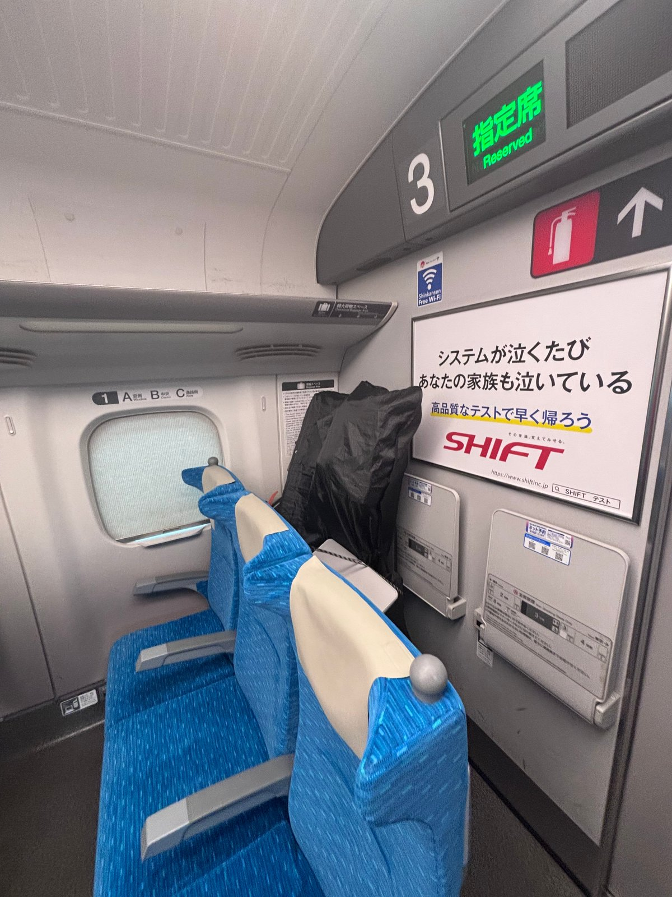

兩點過後,人在鹽尻站前。照片裡,車架靠在長椅邊,前後輪用橘色綁帶並排綁在一起,馱包卸了一地——剛下車,正要把車裝回去。在日本搭 JR 帶單車,要把輪子拆下來、整台裝進「輪行袋」才能上車,日本人叫這「輪行」。背後兩個大木桶是酒桶:鹽尻是長野有名的葡萄酒產地,連車站前都擺著。

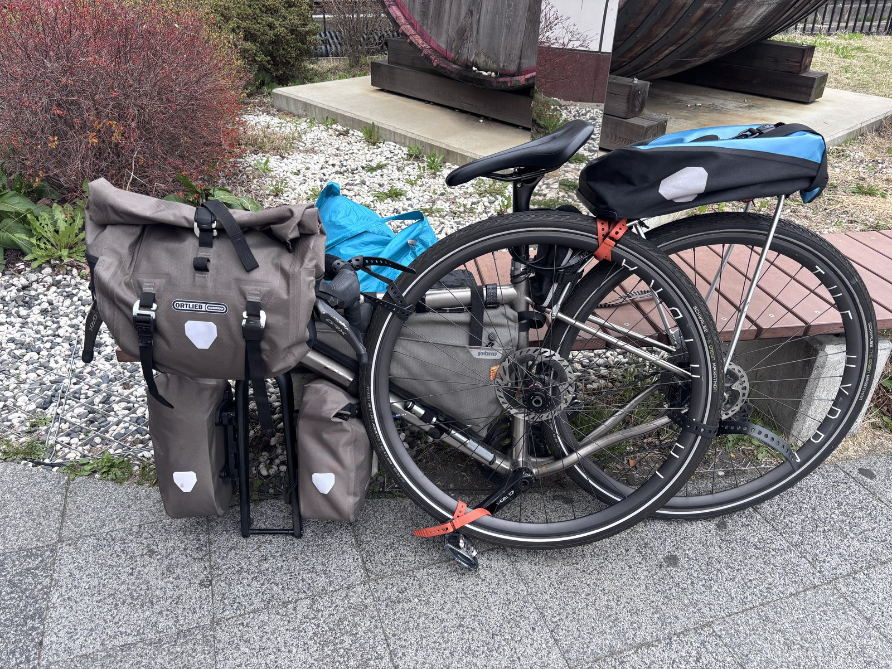

在鹽尻下車、不坐到松本,好處是:特急在鹽尻有停,從這裡騎進松本只有十幾公里、全是平路,坐了半天火車,剛好把腿鬆一鬆,中段還能接上一條自行車道。從下車到裝好車上路,照照片的時間差不多一個鐘頭:14:07 還在綁輪子,15:13 已經在四公里外。新大阪到鹽尻,新幹線加特急しなの,照 2026 年的票價,自由席是 11,110 日圓,車程三個小時左右;要訂最後一排放車,就是指定席,每段再加幾百日圓。

三點二十幾分,地上出現藍白色的標誌:「あづみ野やまびこ自転車道」(Azumino Yamabiko Cycle Track),箭頭指著往前、往左。這條自行車道從鹽尻經松本一路往北到安曇野的穗高,計畫全長約 40 公里,有一大段沿著「拾ヶ堰」這條水圳走;長野縣的說明是安曇野市那一段已大致完成,整條還沒全部完工。我在鹽尻北邊接上它的南段。路面有補丁、有裂縫,縫裡長草,旁邊是還沒整地的田,左後方遠遠一排雪山。

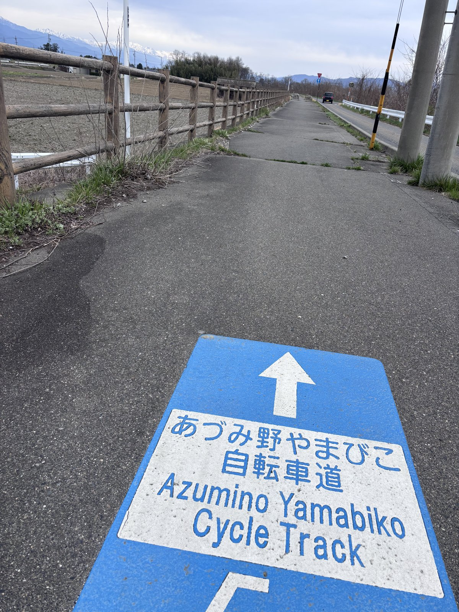

天是陰的,雪山卻很清楚。從松本盆地往西看,北阿爾卑斯就橫在一排瓦頂民房後面,山腳還是藍的,山頂整片白。

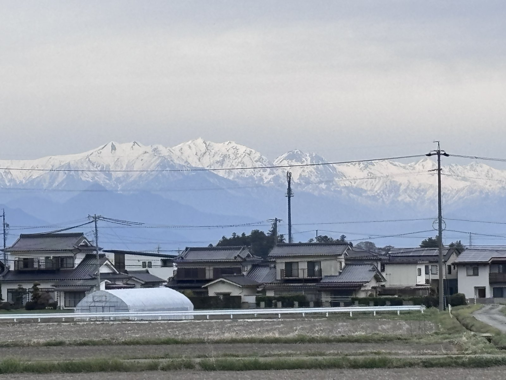

照片一路往北,15:54 最後一張已經在松本市區、離松本站不遠,之後這天就沒再拍了,這晚在松本過夜。松本城離車站一公里多,這一趟的照片裡沒有它。

## 4/10 雨中的白馬:白馬站、神城站、五竜滑雪場山腳

松本到白馬六十公里、一路往上,這天又下雨,我帶著車坐大糸線上來:前一天最後一張照片在松本站附近,這天第一張已經是白馬站前,中間一張也沒有。大糸線的普通車從松本到白馬一個半到兩個小時,有直達的班次,也有要在信濃大町換車的;照 2026 年的票價是 1,230 日圓。中午十二點多,白馬站前廣場濕成一片,天灰灰的,雨還在下。

一點多,人在神城站的候車室裡躲雨:木頭長椅、木牆、牆上一個時鐘,車靠在柱子邊,站名牌寫著「神城駅」。神城在白馬站往南兩站,是大糸線上的一個小站,離白馬站四、五公里。之後三天,早上出門和傍晚收工的照片,大多落在神城站和五竜滑雪場山腳之間;4/12、4/13 兩天早上,出門的第一張照片都拍在神城站西北邊、走路十分鐘左右的「ペンション ボナール」(Pension Bonnard)門口。住神城的好處是位置在中間:往北到白馬、往南到青木湖都在十公里內,一天騎一個方向剛好。

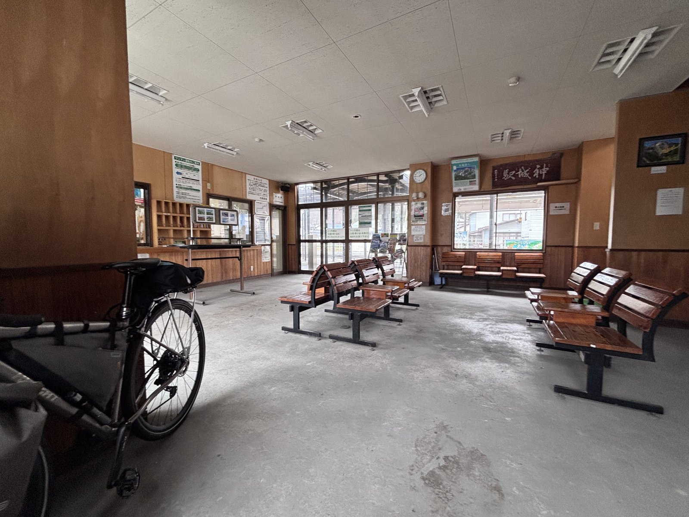

傍晚五點多,我到白馬五竜滑雪場的山腳(GPS 就在山腳的エスカルプラザ一帶)。草坡已經枯黃,只剩一塊殘雪;纜車停著,造雪機還立在坡上,雲纏在雪山的半腰和山頭。白馬是 1998 年長野冬季奧運的場地之一;到了四月中,山腳的雪化得差不多,山上還是白的。

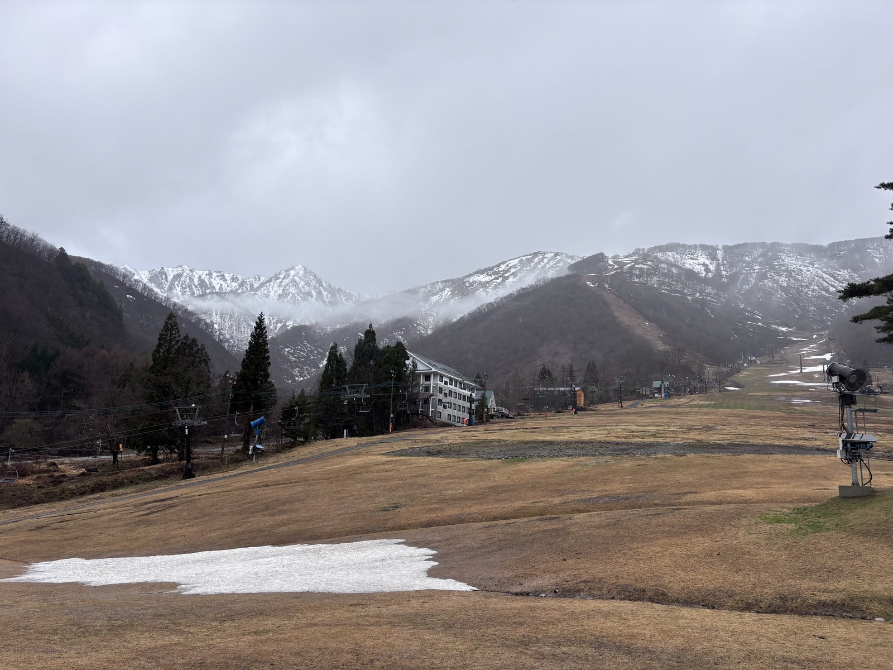

## 4/11 放晴:白馬村的農路、松川、大出吊橋

前一天的雨停了,天整片深藍,整排北阿爾卑斯就站在田的後面。這天從早上九點多拍到傍晚五點,從神城一路往北,最遠到白馬站北邊五公里左右的滑雪場山腳,在村子裡的農路和河邊繞。照片定位連起來約 23 公里,一整天拍了一百多張——騎一段,停一下。

十點多,白馬站西北邊的樹林,電線桿上綁著一張黃色告示:「熊に注意」,白馬村役場農政課貼的。上面寫:進山要帶笛子、鈴鐺或開收音機,讓熊知道有人;看到熊的糞便或腳印就折返;看到小熊,母熊一定在附近,要安靜離開。告示是寫給進山的人看的;在白馬騎車,路邊常常就是林子,清晨、黃昏想保險一點,可以在車上掛個熊鈴。

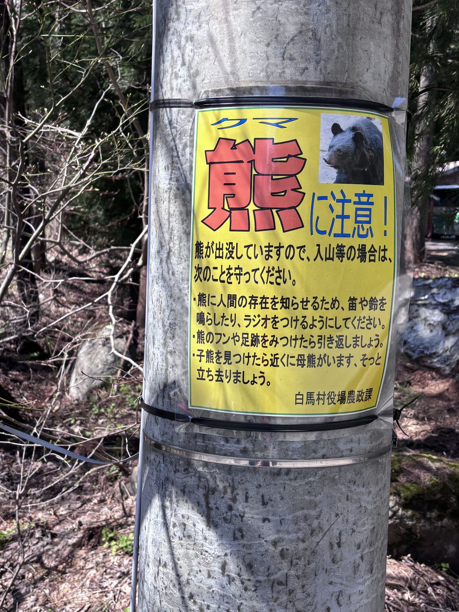

十點半,停在松川上的一座橋。橋下是一大片灰白色的石頭河床,雪水分成好幾股往下流;遠處的雪峰被一長條白雲壓著。橋欄杆上有一塊解說牌,標題是「白馬の雪形(その2)仔馬」:融雪的時候,山壁上會露出一匹四隻腳站得直直的小馬,農家看到這匹馬,就知道該做秧田了;附近還有「雞」和「播種的爺爺、奶奶」幾個雪形。牌子上寫的眺望期是 4 月下旬到 6 月上旬,4 月 11 日還早了一點,山上還是整片白的。「白馬」這個名字也是從雪形來的:春天山上露出「代掻馬」(整田拉犁的馬)的形狀,山就叫「代馬岳」,後來才寫成白馬。

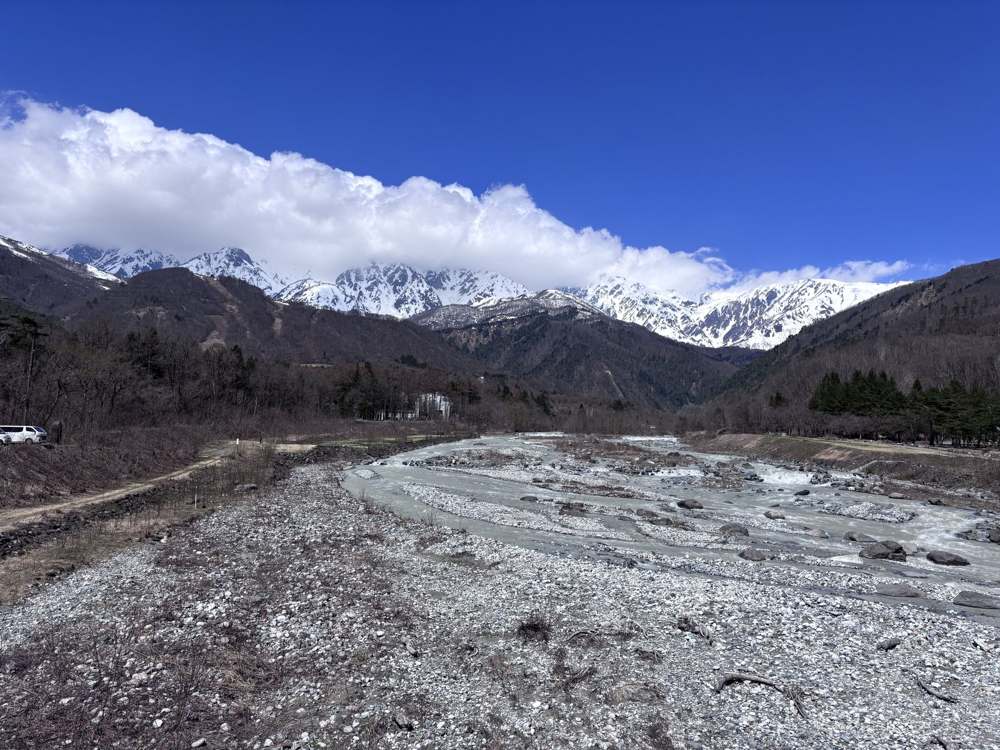

中午,田邊一棵大樹,枝頭剛冒出幾朵白花,後面是農舍,再後面就是雪山。田裡去年的稻樁還在,新草才從縫裡長出來。

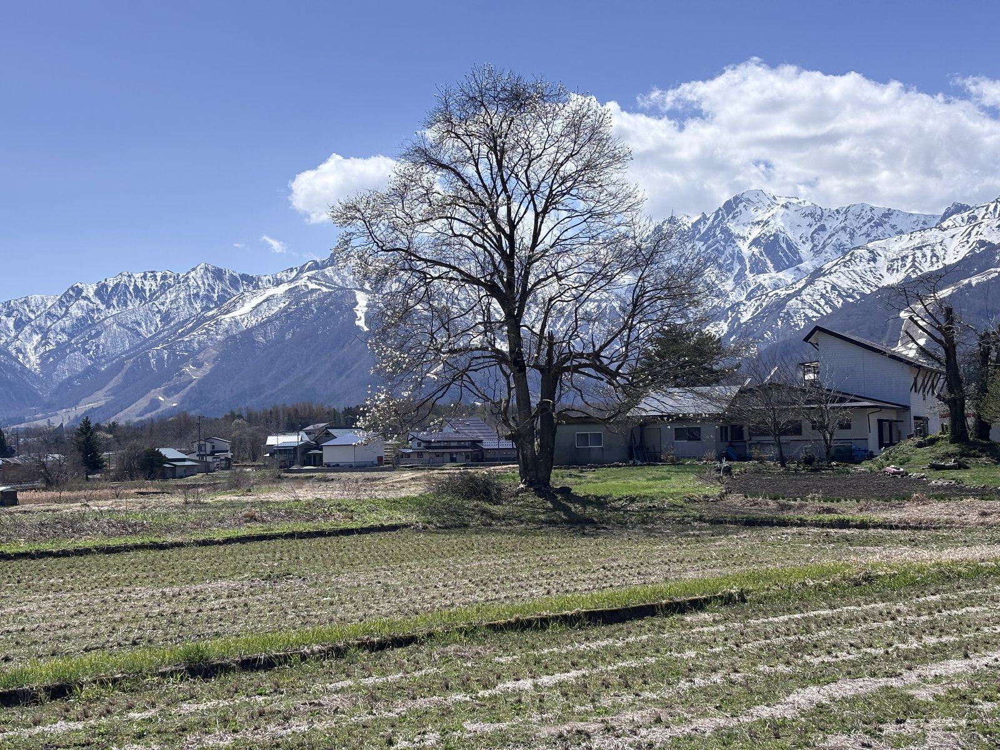

下午兩點多,又停在一座橋上,車靠著欄杆,後面整排雪山一字排開,山腳的樹林還沒長葉。這幾天最常做的事就是這個:騎一段,停下來,把車靠好,拍山。再往前,一條直直的農路,電線桿一根一根排到山腳,田邊一排溫室,路上只有一台車。

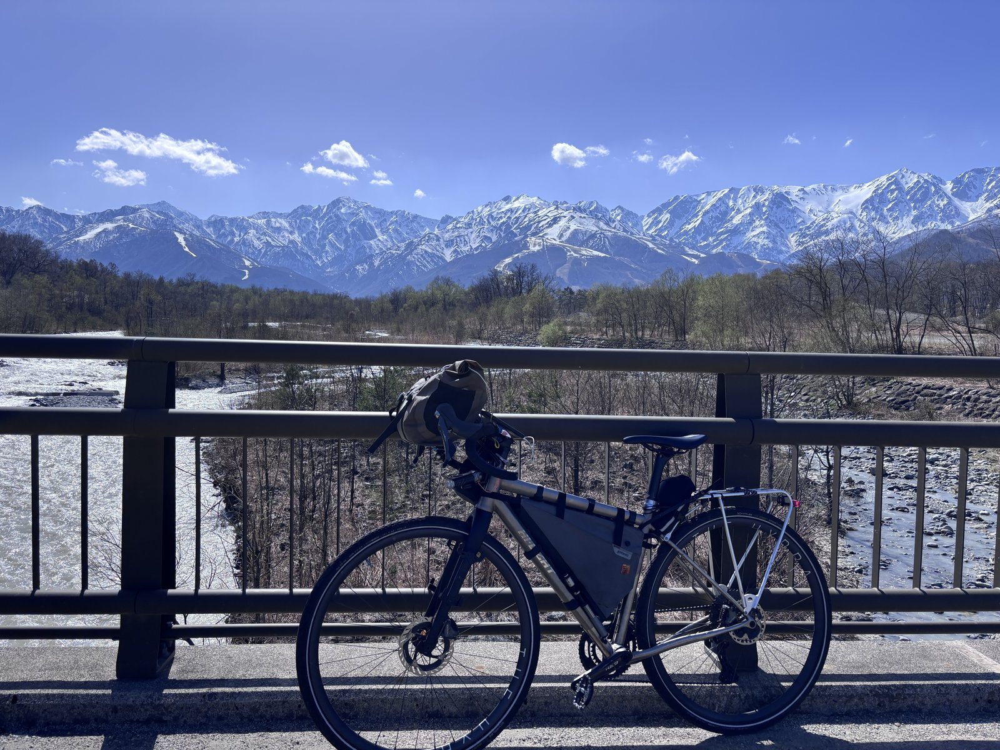

兩點半過後到大出公園。姬川上掛著一座吊橋(大出吊橋),橋頭有老房子;換個位置從河岸看過去,雪山、吊橋、茅草屋頂疊在一起——這是白馬最有名的取景角度之一,照片裡的河岸上站著好幾組人。

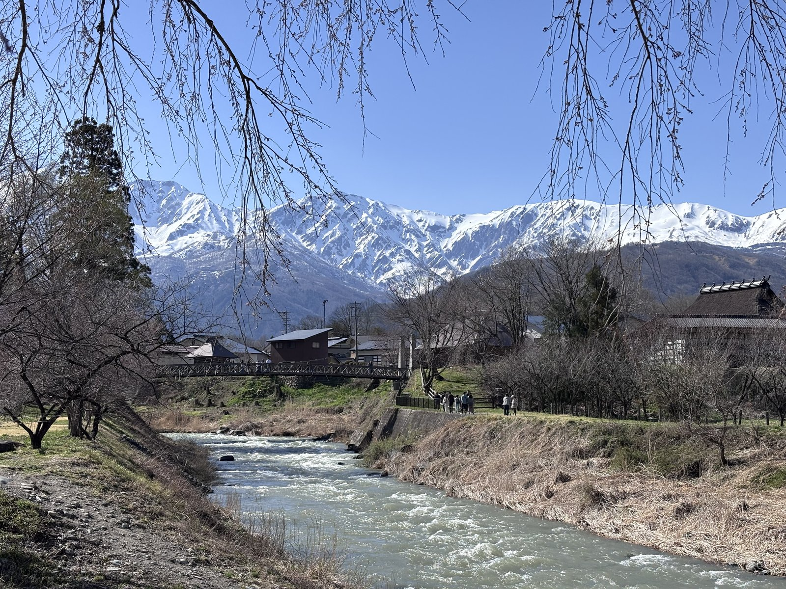

傍晚五點,山腳先暗下來,一片藍影,雪山轉成灰藍色,只剩右邊的山坡還照得到一點夕陽。田是剛翻過的黑土。

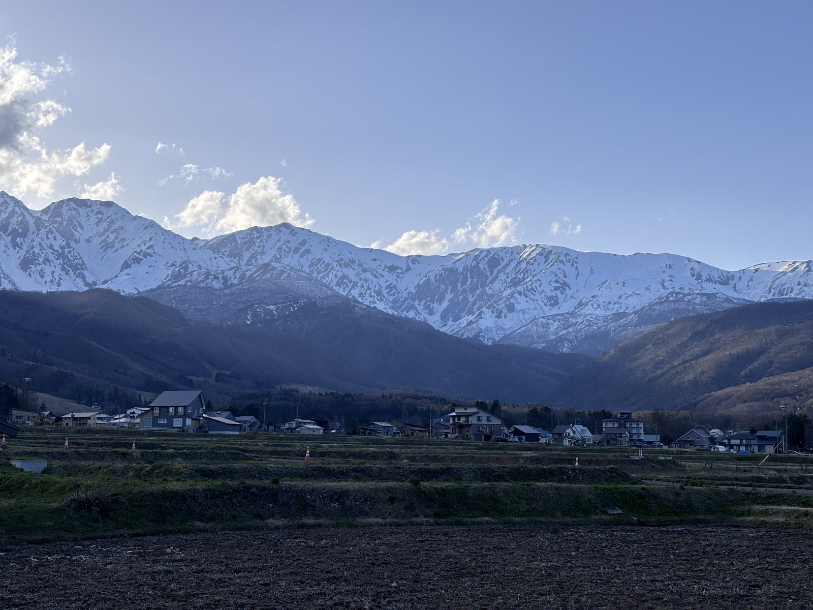

## 4/12 青木湖一圈、親海濕原,回白馬看剛開的櫻花

又是大晴天,這天往南。

快十點,田埂邊一叢黃水仙,後面的雪山連成一條白線。白馬的四月是這樣的:先開的是水仙,櫻花還在等。

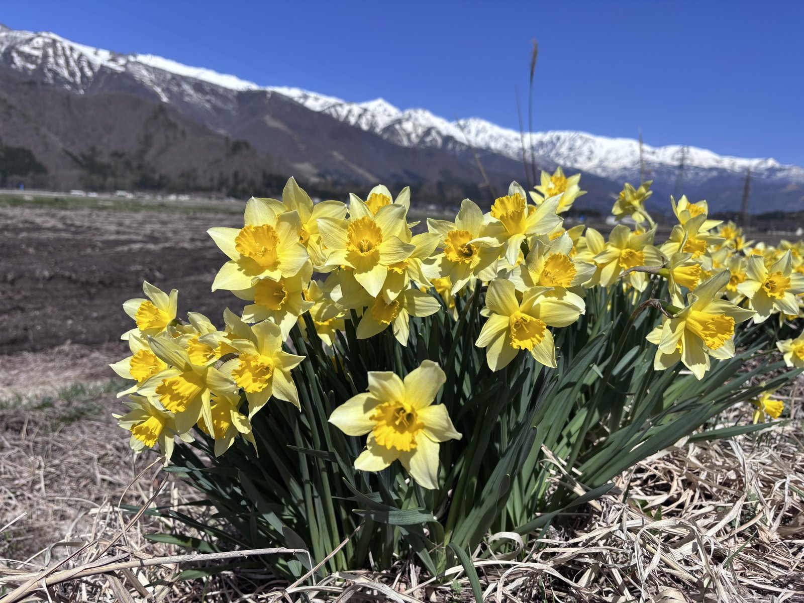

十點半到青木湖。白馬村往南,三個湖串在一起,叫「仁科三湖」:青木湖、中綱湖、木崎湖,青木湖最大也最深。湖水是很深的藍,對岸的山頂還有雪。東岸國道邊有一處觀景平台,木牌寫著「青木湖テラス」,車靠在木牌旁,底下就是沙灘。照片的定位從東岸經南端繞到西岸、再回到北邊,青木湖我是繞了一圈的,一圈六、七公里;東岸是國道 148 號和大糸線,西岸是沿湖的小路。湖邊想坐下來吃東西,有一家 2024 年夏天開的「ao LAKESIDE CAFE」,官網寫的營業時間是 8:00–20:00,湖上的露台座位 11 月下旬到 3 月底不開。

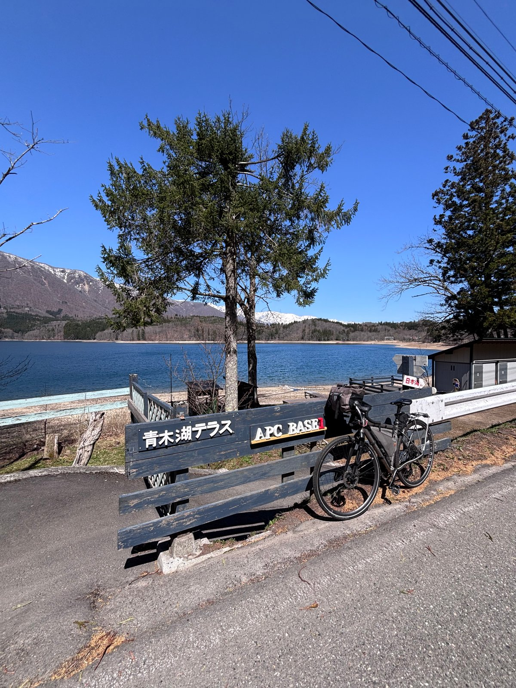

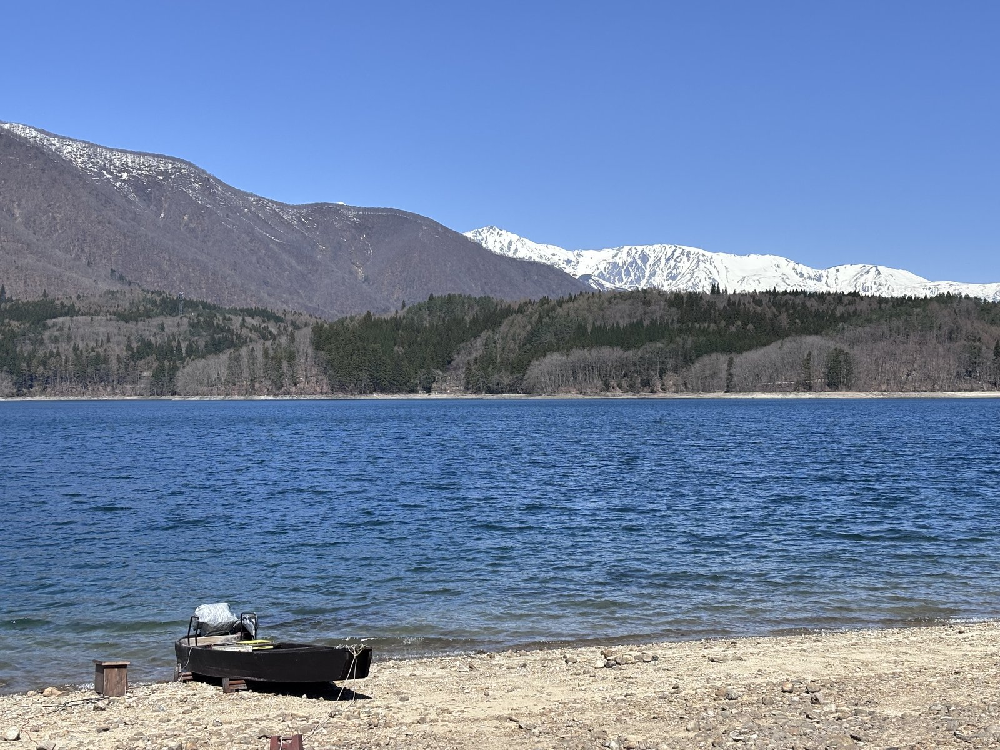

中午往回騎,快一點停在青木湖北邊的一片濕原——照 GPS,是親海濕原。一條木棧道筆直穿過去,兩邊是去年的枯草,新草才剛冒出一點綠。這一帶是分水嶺:青木湖的水往南流,姬川從這裡往北流,經過白馬,到糸魚川出海。

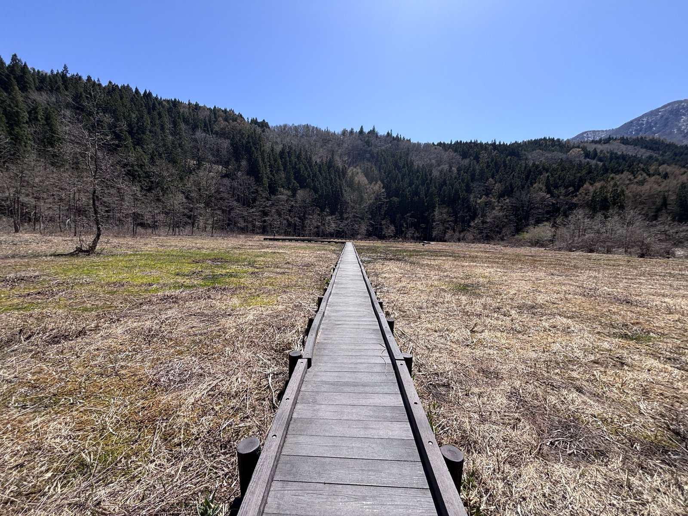

下午兩點前,一條從山裡流下來的河,河床上一階一階的小堰,水很清,後面還是那排雪山。

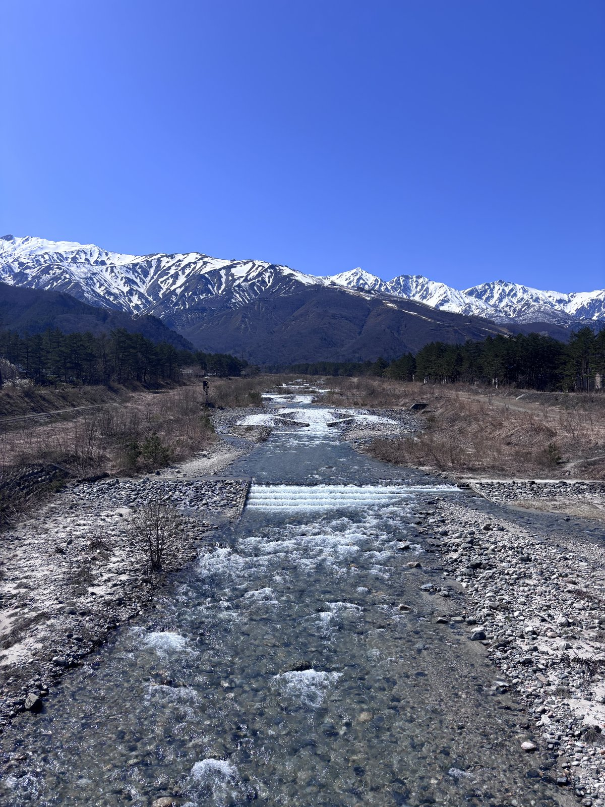

快四點回到白馬,櫻花才剛開,稀稀疏疏一層淡粉紅,枝條都還看得見——這是 4 月 12 日的白馬。這天照片定位連起來約 28 公里。

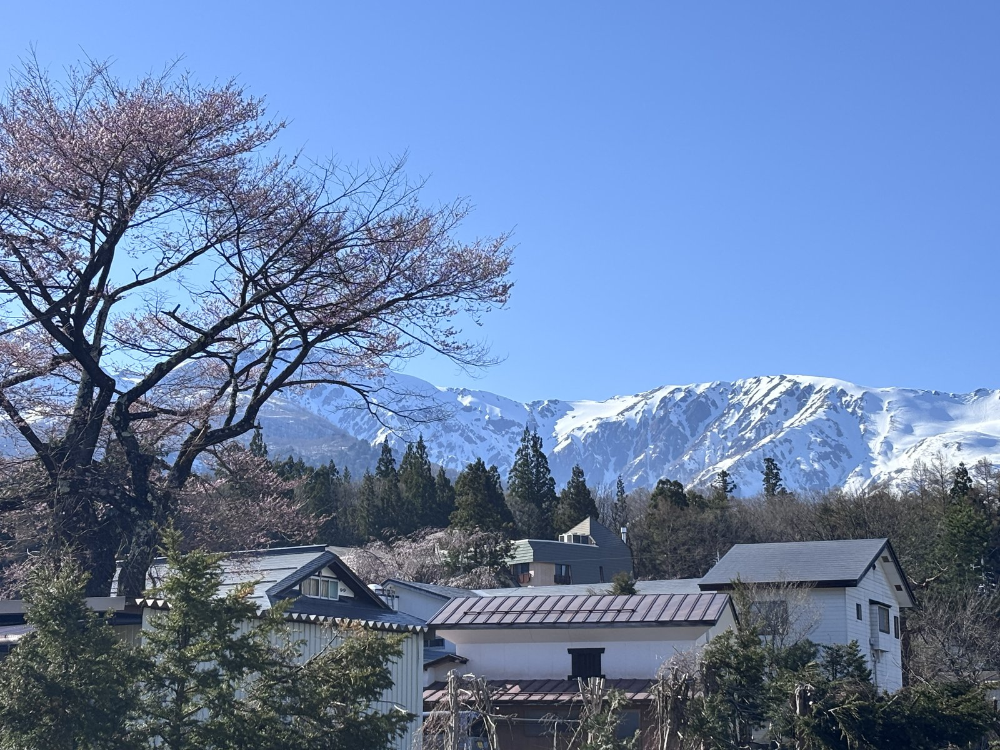

## 4/13 大糸線往南:穗高、大王山葵農場、拾ヶ堰的櫻花

早上十點半,神城站月台,雪山還在月台後面。從神城騎到安曇野四十公里上下,走的是國道 148 號、到大町再接 147 號;這一段我帶車坐大糸線下去,車照樣裝袋。10:44 已經在車廂裡,10:58 經過木崎湖邊,11:56 已經在穗高站前——一個多小時,從冬天的尾巴到春天。照時刻表,白馬這一頭往南的普通車大多只開到信濃大町,早上這班也是,所以在大町換一次車,再坐往松本的車到穗高。神城到穗高 39 公里,照 2026 年的票價是 810 日圓。

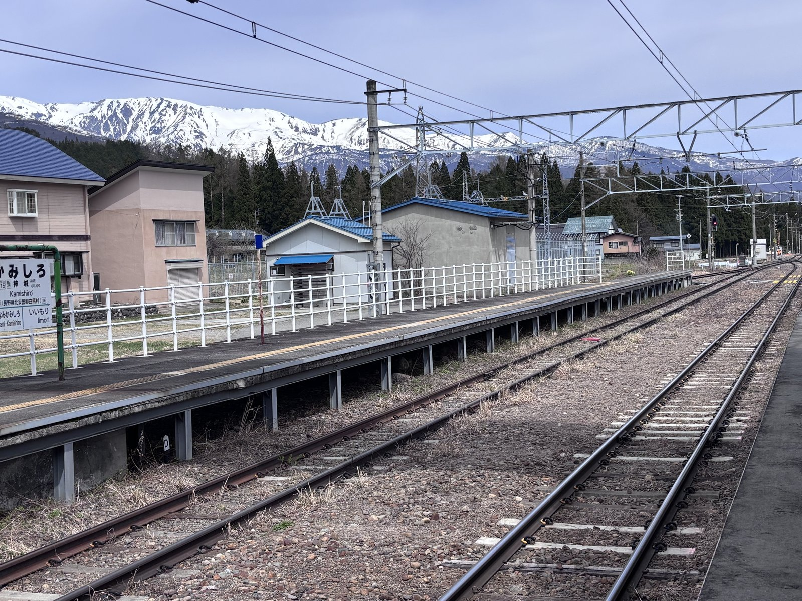

穗高站的站房是木造的,屋頂鋪瓦、屋簷往外翹,像一座神社,門口還立著一尊道祖神。

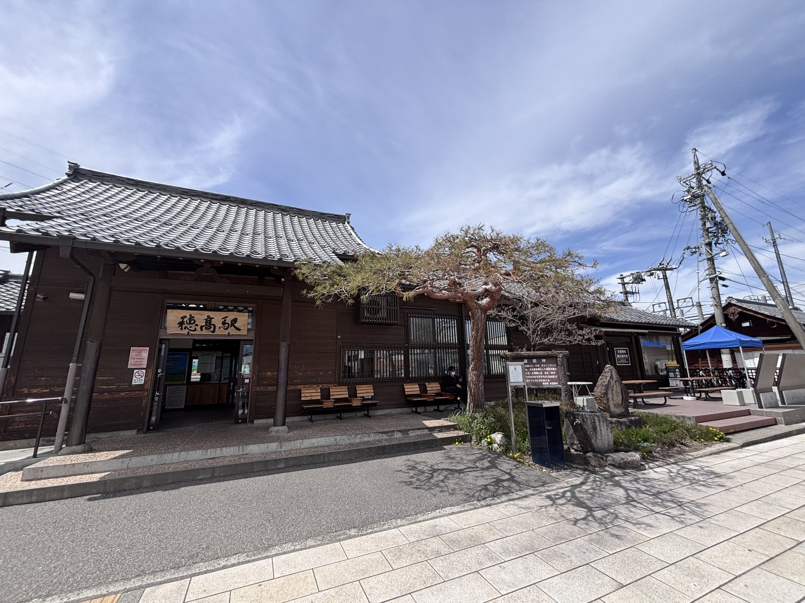

走幾分鐘就是穗高神社,下午一點多我在神社裡:一對銀色的老夫婦像,手牽著手,旁邊的直幅寫著「道祖神 夫婦円満の手撫で詣り」——摸一摸他們牽著的手,夫妻會和睦,單身的可以求姻緣。安曇野路邊常見成雙的道祖神石像,是守村子和路的神。神社裡的櫻花正開,地上一層落下來的花瓣。

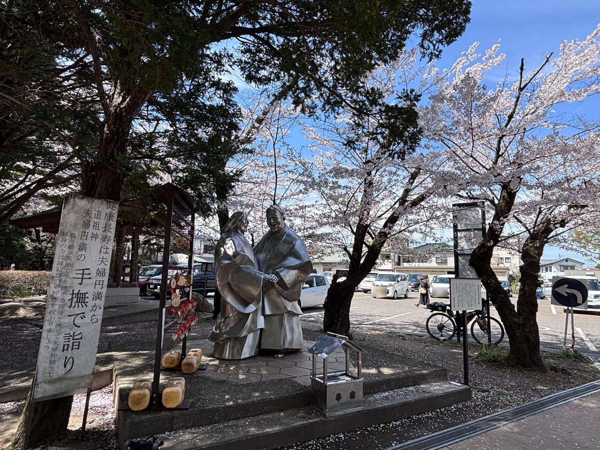

一點四十分左右,沿著一條河邊小路往東,岸邊的櫻花開成一片粉紅。兩點到大王山葵農場。

農場裡的水清到看得見底,長長的水草順著水流擺。河邊是茅草屋頂的小屋和木造水車——黑澤明 1990 年的電影《夢》,最後一段「水車之村」就在這裡拍的。岸邊一塊解說牌寫著「珍百景 ふたつの川」:後面那條是一般河川萬水川,前面是百分之百湧水的蓼川,兩條水質完全不同的河夾著一座細長的小島流過;再往前會合流,但因為水溫這些差別,還會有一段不混在一起。

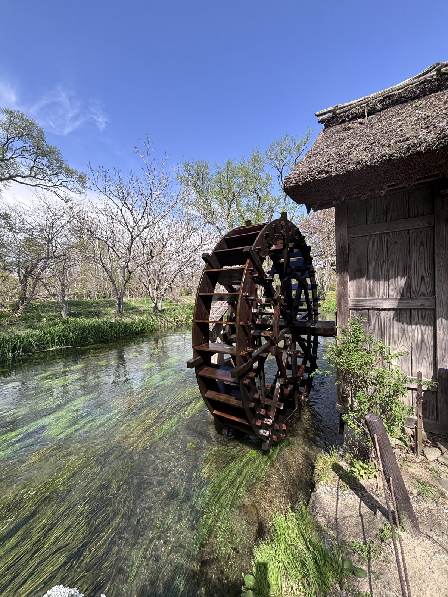

山葵田是一格一格的淺水床,上面架著黑色遮光網,湧水從底下流過去。山葵怕曬,也要一直有乾淨的冷水沖,安曇野的湧水剛好。農場免門票,官網寫的時間是 8:00–17:00(12 月到 2 月是 9:00–16:00)。

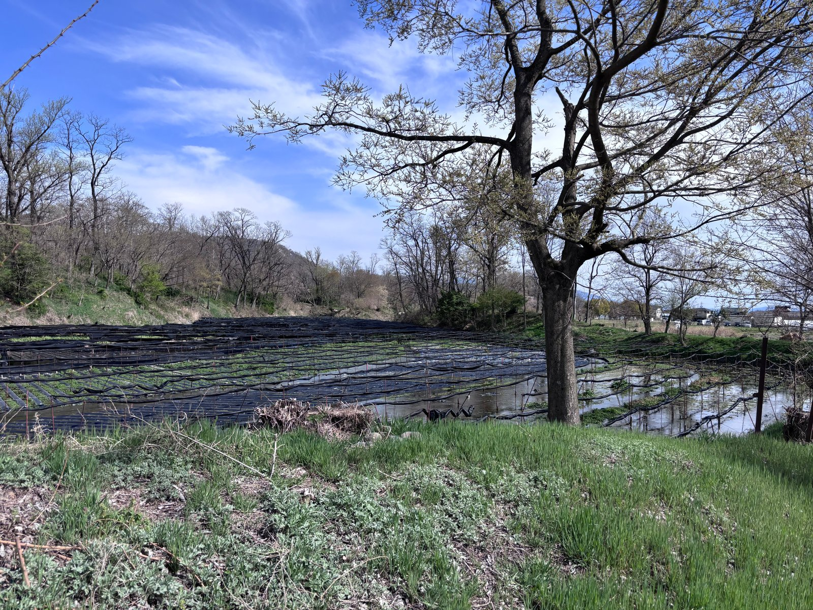

離開農場,往西南騎。三點過後,路邊一棵櫻花開得滿滿的,遠處雪山還在——昨天下午白馬的櫻花才剛開,今天安曇野已經滿開,中間只隔了一個多小時的火車。

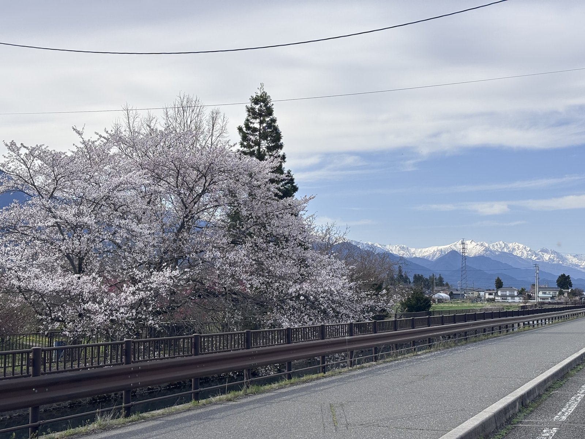

三點二十分,一條大水圳旁的小路,兩邊白線畫得清清楚楚,左邊一整排櫻花,右邊是欄杆和水。照 GPS,這條水圳就是拾ヶ堰,路是あづみ野やまびこ自転車道沿著水圳的一段——四天前在鹽尻北邊接上的那條自行車道,就是它。拾ヶ堰是江戶時代後期挖的灌溉水圳,從松本的奈良井川引水、橫過梓川,沿著標高 570 公尺左右的等高線流約 15 公里,到穗高注入烏川;水圳幾乎是平的,旁邊的自行車道也就幾乎沒有坡。

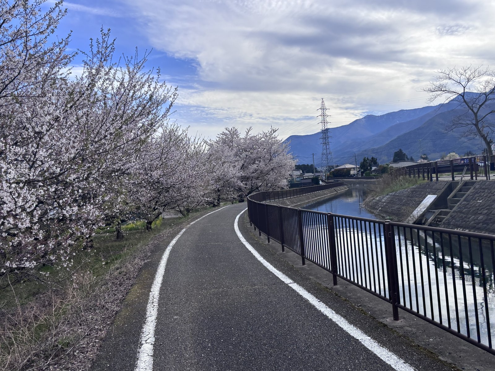

照片停在下午三點二十幾分的拾ヶ堰邊,這天照片定位連起來約 11 公里。隔天中午,人已經在中山道的奈良井宿——那是下一站。

---

四月中的北阿爾卑斯,同一個禮拜裡,山上還是冬天,谷底已經是春天;一條大糸線,加一台裝得進袋子的單車,就可以在兩個季節之間來回。要我推薦,四月中的白馬不是為了櫻花來的,是為了雪山:放晴那兩天,整排山從早到晚都在田的後面,騎哪條農路都看得到。想看櫻花,往南一小時的安曇野才是。

## 這一段的實用筆記

**單車怎麼進出日本**

- 這一趟日本從大阪進、大阪出,兩頭都是關西機場。單車裝紙箱上飛機;落地時已經晚上,就住機場島上的日航飯店,紙箱寄放在飯店,隔天早上直接從飯店出發。回程再回到同一家飯店,取回紙箱,在那裡把車打包。帶單車出國,最麻煩的就是紙箱怎麼處理,細節寫在[第 1 站 山陰](../2026-jp-01-sanin/)。

**火車帶車(輪行)**

- JR 帶單車要拆輪、整台裝進輪行袋。這一站三段火車:4/9 新大阪—(新幹線)—名古屋—(特急しなの,經木曾谷)—鹽尻;4/10 松本—(大糸線)—白馬;4/13 神城—(大糸線,信濃大町換車)—穗高。
- 東海道新幹線:車廂最後一排座位的椅背後面,牆上標著「特大荷物スペース」,輪行袋就放這裡。三邊合計超過 160 公分的大行李要預約這一排的座位(特大荷物スペースつき座席),運動用品不論尺寸都不必預約;但不預約,這個位置不一定空著,想穩一點,訂票時直接訂最後一排。
- 票價(照 2026 年的價格):新大阪→鹽尻 11,110 日圓(新幹線+特急しなの的自由席價格,約三小時;指定席每段再加幾百日圓);松本→白馬 1,230 日圓(大糸線普通車,一個半到兩個小時;有直達班次,也有在信濃大町換車的);神城→穗高 810 日圓(39 公里,大町換車,一個多小時)。
- 大糸線是松本—安曇野—大町—白馬—糸魚川的地方線,普通車班次不多;照現在的時刻表,白馬那一頭的普通車大多只開到信濃大町,要在大町換車,大町往白馬方向有的時段三個多小時才一班。
- 鹽尻站前有長椅和空地,拆裝車方便;神城站有候車室,下雨時車可以推進去躲。

**路線與路況**

- 鹽尻→松本:約 14 km 平路,中段接上「あづみ野やまびこ自転車道」的南段;路面有補丁和裂縫,還能騎。這條自行車道從鹽尻經松本到安曇野的穗高,計畫全長約 40 公里,有一大段沿著拾ヶ堰,安曇野市那一段已大致完成;4/13 在安曇野騎的那段水圳邊也是它。
- 白馬村:雪山腳下多是田間農路,照片裡路上很少車;松川、姬川上的橋是看整排山的位置。
- 青木湖一圈六、七公里;東岸是國道 148 號和大糸線,國道邊有「青木湖テラス」觀景平台,西岸是沿湖的小路。
- 白馬村役場貼著熊出沒的告示,說進山要帶鈴鐺、笛子或收音機;告示上寫的是進山時的注意事項。

**季節與天氣**

- 4/9 木曾谷車窗外櫻花已開;4/12 白馬的櫻花才剛開;4/13 安曇野滿開。4 月中來白馬,看的是雪山,不是櫻花。
- 4/10 滑雪場山腳的草坡只剩零星殘雪;雪形的眺望期,解說牌寫 4 月下旬到 6 月上旬。
- 五天:陰、雨、晴、晴、晴時多雲。雨天雲纏在山腰,整排山看不全;放晴那兩天,山從早到晚都清楚。

**住宿**

- 4/9 松本(這天最後一張照片在松本站附近)。
- 4/10–4/12 神城三晚。4/12、4/13 兩天早上都從「ペンション ボナール」(Pension Bonnard)出門:在神城站西北邊,走路約 10 分鐘,訂房網站上寫 15:30 入住、10:00 退房。住神城,往北到白馬、往南到青木湖都在十公里內。
- 4/13 離開白馬,下一晚的事寫在下一站。

**補給**

- 神城一帶有 7-Eleven 和 Lawson:7-Eleven 白馬神城店在國道 148 號邊、離神城站走路十分鐘左右(不到 1 公里),24 小時;往南去青木湖、大町方向,過了這家有一段路沒有便利商店,水和吃的先在這裡買。Lawson 白馬神城店在飯森站附近。
- 大王山葵農場免門票,裡面有餐廳、咖啡和賣店;8:00–17:00(12 月到 2 月 9:00–16:00)。

**雷點**

- 4 月中的白馬,櫻花才剛開,別為了櫻花上來;要櫻花,往安曇野。
- 下雨那天雲壓在山腰,整排雪山看不全;白馬的行程要留一天彈性。
- 神城→安曇野四十公里上下,走國道 148、147 號;大糸線帶車一個多小時就到,但大町一帶班次少,先查好時刻表。
- 想看雪形,要 4 月下旬以後。

---

這段的攝影作品之後放 Flickr。
