<small>2026/4/14–4/16・長野縣木曾谷 → 岐阜縣中津川|上一站:[北阿爾卑斯(松本・白馬・安曇野)](../2026-jp-05-northern-alps/)|這是這趟日本的最後一站</small>

「木曾路はすべて山の中である。」——島崎藤村的小說《黎明前》,第一句就這樣寫:木曾路,全在山裡。

四月中旬,山下的城市,櫻花季大多已經過了;木曾谷海拔高,櫻花這時候才開到這裡。我從谷地最高的那一頭進去,跟著木曾川往下走了三天,出了山,整趟日本也就結束了。

中山道是江戶時代連接江戶和京都、走內陸山路的那條街道,沿路六十九個宿場;穿過木曾谷的十一個,合稱「木曾路」。這一段我從第 34 宿奈良井出發,經過藪原、宮ノ越、福島、上松,後半段把車裝進袋子改搭火車,兩天後的早上,站在第 45 宿中津川的老街上。之後回到將近一個月前落地的關西機場,在機場飯店領回寄放的紙箱,把車裝箱——帶單車出國最麻煩的那件事,這趟是這樣解決的。

| | |
|---|---|
| 日期 | 2026/4/14–4/16 |
| 路線 | 4/14 奈良井站 → 奈良井宿 →(鳥居峠)→ 藪原 → 日義・巴淵 → 宮ノ越 → 中山道中間點 → 木曾福島 4/15 木曾福島 → 木曾の桟 → 上松 ‖ JR 中央本線普通車 ‖ 中津川 4/16 中津川宿老街 回程:回關西機場,在機場飯店領回紙箱、把車裝箱 |
| 距離 | 4/14 奈良井站到木曾福島站,走公路約 21 km;照片定位連起來,藪原到木曾福島的旅館約 13 km 4/15 木曾福島 → 上松,照片定位連起來約 9 km;火車 45.9 km(JR 上松 → 中津川的營業里程) 公里數是用照片定位估的,不是 GPS 軌跡 |
| 交通 | 單車 + JR 中央本線輪行(4/15 上松 11:55 → 中津川 12:54) 回程回關西機場;紙箱從頭到尾寄放在機場島上的飯店 |
| 住宿 | 4/14 木曾福島「木曽三河家」:和室,窗外就是木曾川;官網寫每個方案都附免費自助早餐,有溫泉,有機車和單車的專用停車區 4/15 中津川一帶(照片裡沒有拍到住的地方) |



## 4/14 奈良井宿:從木曾路最高的一段開始

這天手機裡的第一張照片是 11:18,拍在奈良井站的候車室裡:木柱子、木天花板,門楣上掛著「奈良井宿」的木牌,售票窗口前排著一串人。11:39,車已經掛好行李,靠在站房前面——連車站都是深色木頭蓋的,白牆、格子窗,屋簷下掛著「奈良井駅」的木招牌。奈良井站海拔 933.8 公尺,是 JR 東海所有車站裡最高的一站。

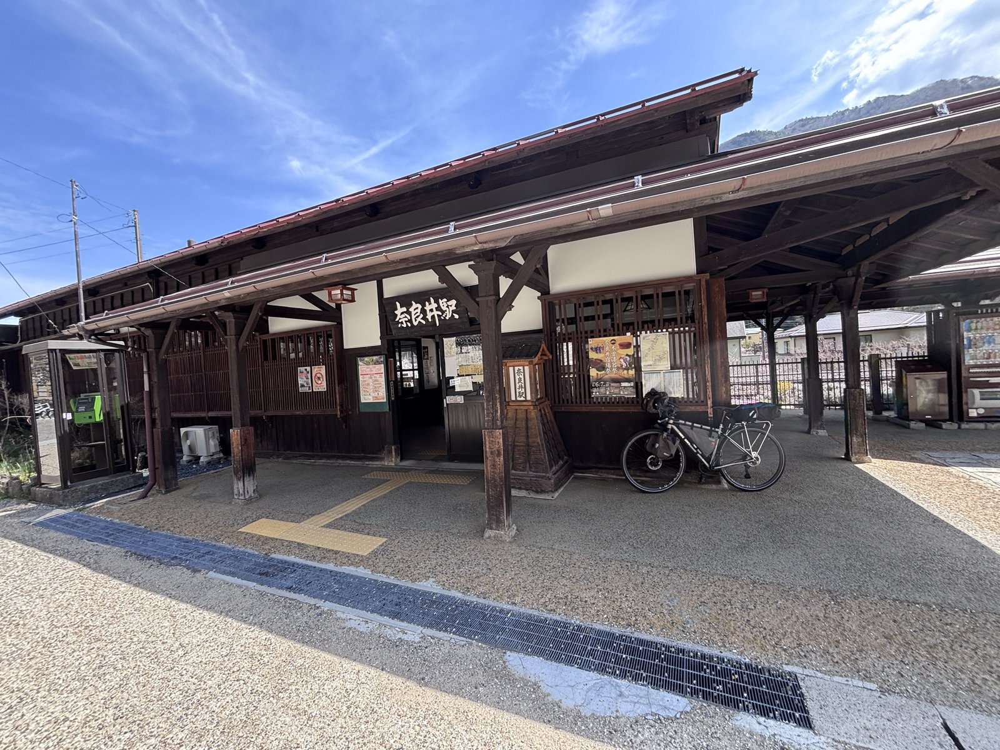

奈良井海拔九百多公尺,是木曾十一宿裡從北邊數來第二個。整條宿場街將近一公里長,兩排木屋保存得很完整,列為國家的重要傳統建造物群保存地區。

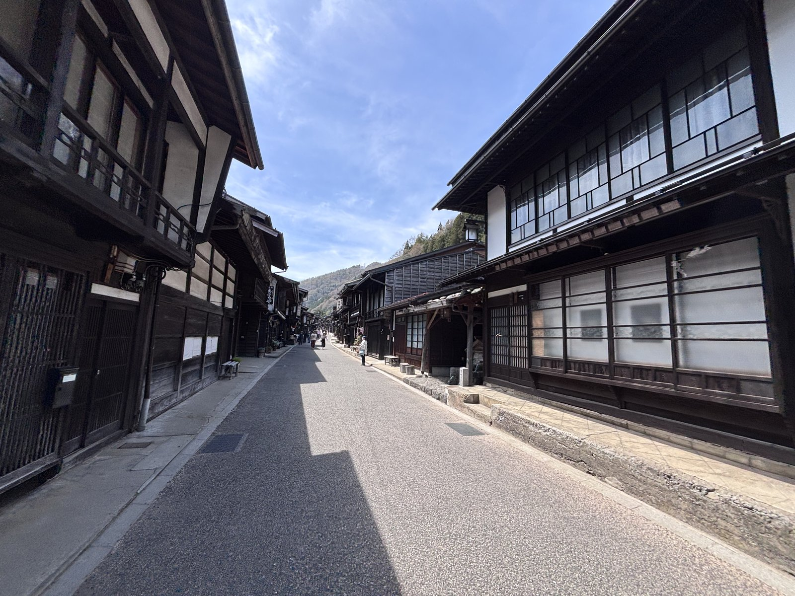

兩層樓的木屋,二樓比一樓往外凸出來一截,格子窗、深色木板牆,街的盡頭就是山。主街請外地的汽車、機車不要開進來;那天是平日中午,街上的人三三兩兩,走在路中間也不太需要讓車。我在街上待了一個多小時,照片從 11:18 一直拍到 12:40。

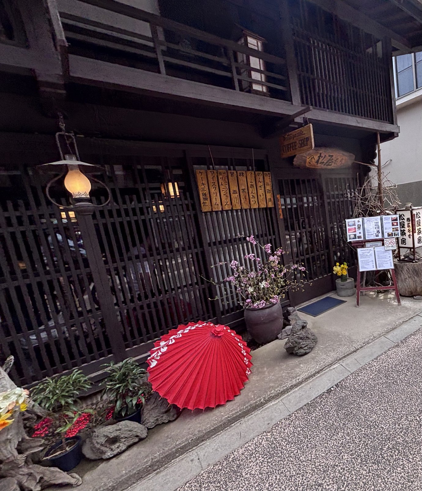

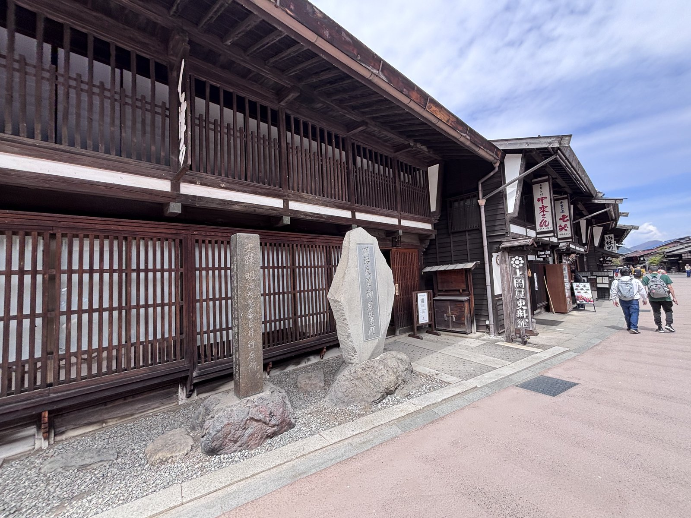

「問屋」是宿場裡負責調度人馬、轉送公文和貨物的地方;上問屋現在改成史料館。門前的石碑刻著「史蹟 明治天皇奈良井行在所」——明治天皇巡幸中山道時,在這裡歇過腳。

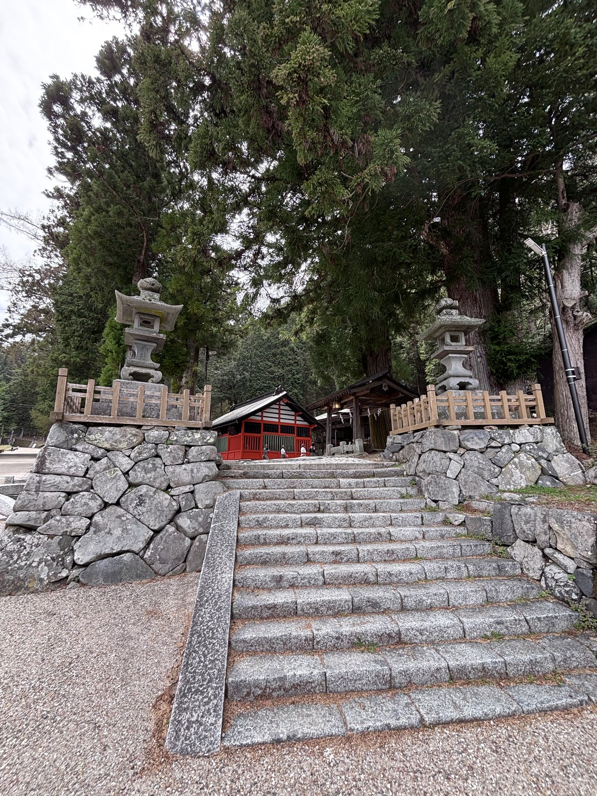

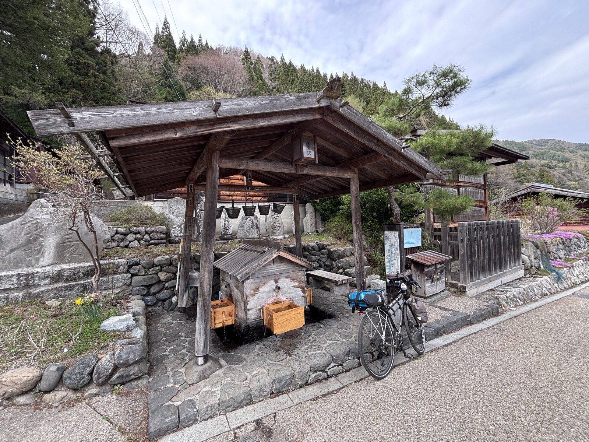

奈良井沿街有六處這樣的水場,木頭屋頂蓋著一個石砌的水池。山上下來的水,到現在還是當地人的生活用水和防火用水;不過水場的告示寫著,要喝的話請先煮沸。

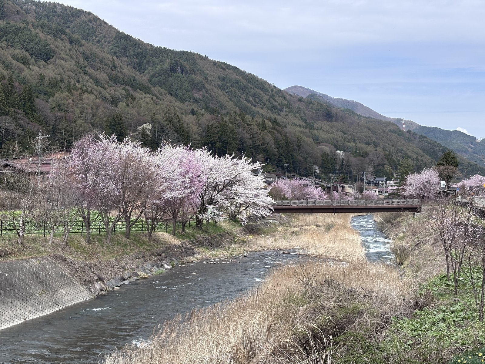

## 4/14 下午:鳥居峠以南,跟著木曾川往下

奈良井再往南是鳥居峠,海拔 1,197 公尺,木曾路的分水嶺:北邊的奈良井川往北流,最後進日本海;南邊的木曾川往南,流進太平洋。從這裡開始,接下來兩天我都跟著木曾川走。

12:40 我還在奈良井,下一張照片是 13:54,已經在藪原的河邊,中間這一段沒有照片。奈良井到藪原,要過鳥居峠,有幾種走法:舊中山道翻過山頂,是一條約 6 公里的登山步道,入口一段是石疊,走路要三到四個小時,載了行李的車不適合;國道 19 號從新鳥居隧道(1,738 公尺)底下鑽過去;另外還有明治時代開的「明治新道」。不想碰山路和隧道,也可以把車裝袋,搭中央本線坐一站,奈良井到藪原五分鐘。幾條路的情況整理在文末。

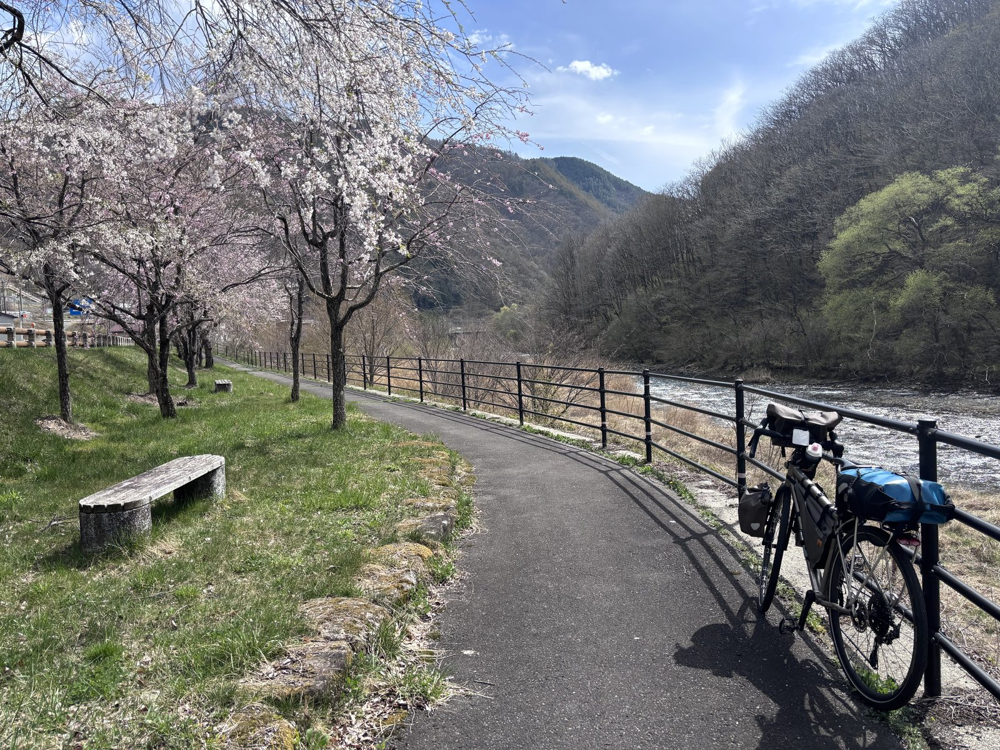

小路鋪得平平的,路邊一張長椅,車靠在欄杆上,河水在下面嘩嘩地流。

從藪原往下,國道邊一家 7-Eleven 立著 ATM 的招牌,路這一邊的欄杆旁就立著一根「中山道」的木柱——這段路,舊街道、國道和便利商店是疊在一起的。

三點左右到巴淵。木曾川在這裡拐了一個彎,拐出一潭深綠色的水。路邊的木牌寫著「伝説『巴』と巴淵」——傳說和木曾義仲身邊的女武將巴御前有關;旁邊的指標寫著,再 1.5 公里就是中山道的宮ノ越宿。

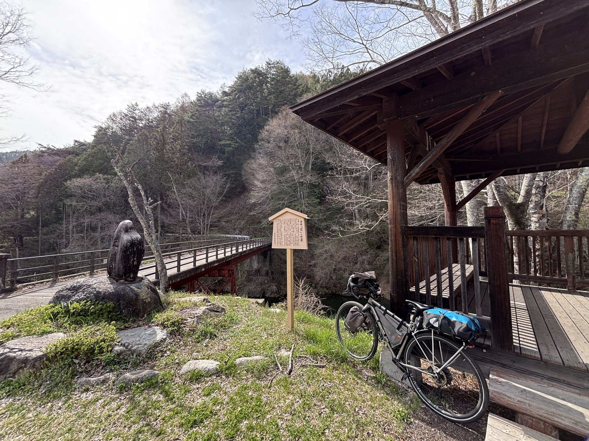

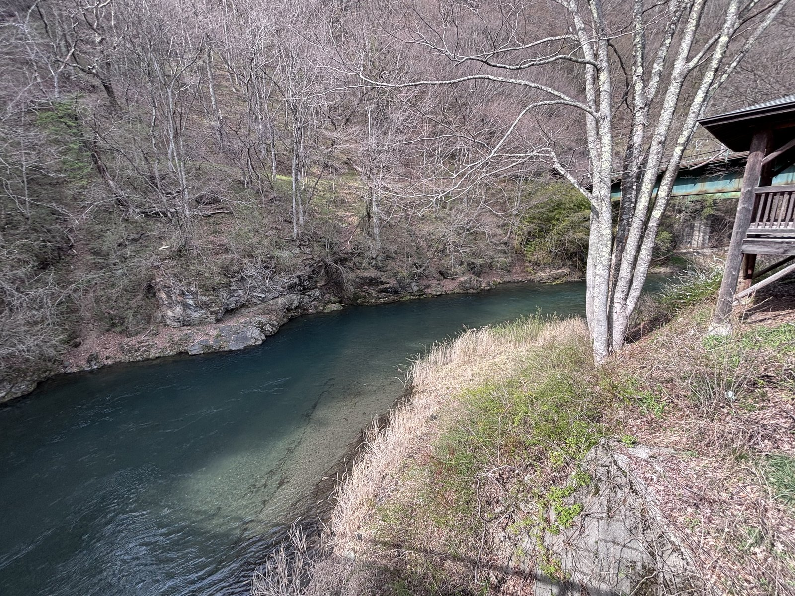

往宮ノ越的路貼著河走,一邊是村子裡的老房子,一邊是河岸,河岸上一棵開白花的樹,腳下一叢水仙。

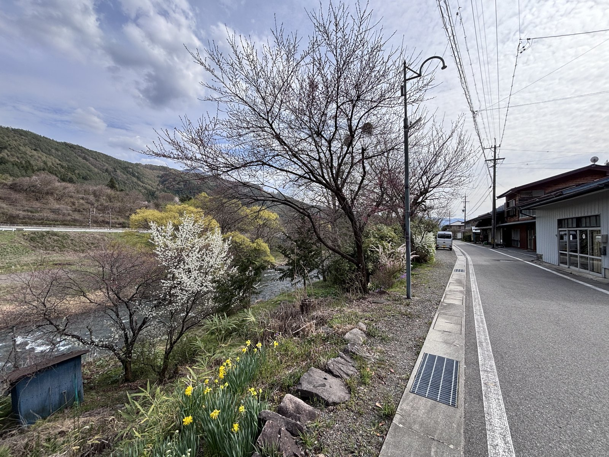

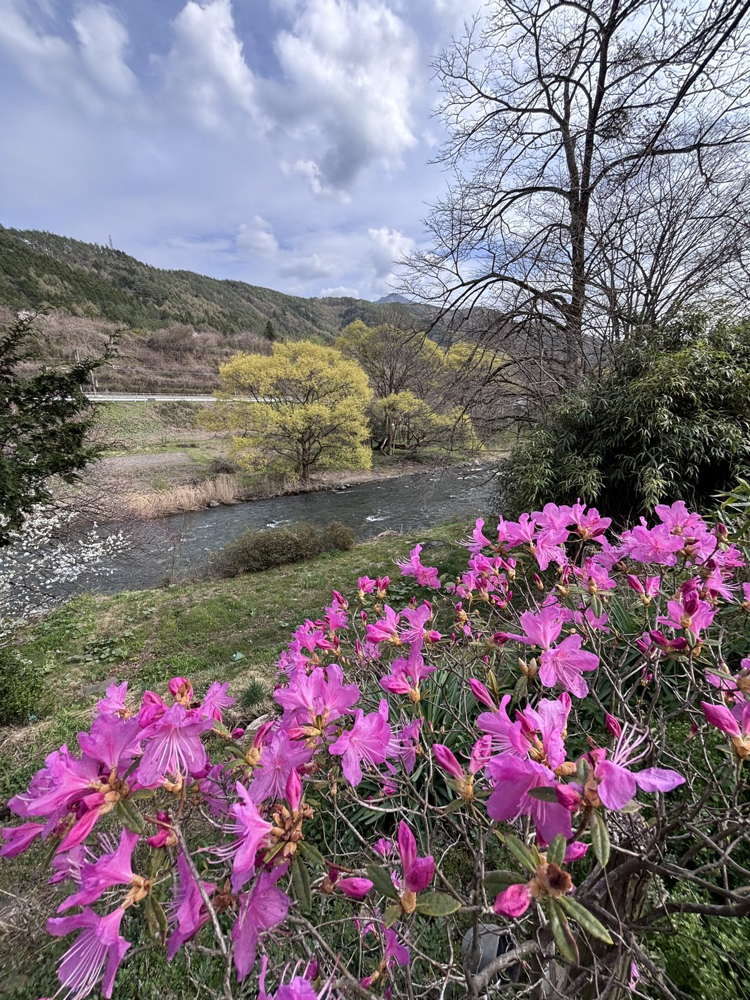

15:30 過了宮ノ越,路邊一塊解說牌:「中山道中間點」。江戶到這裡六十七里二十八町,京都到這裡也是六十七里二十八町,大約 266 公里。中山道全長五百多公里,我這三天走的,是從中間點前面一點點開始的那一小段。牌子下面的指標寫著:JR 原野站 0.5 公里,公共廁所 100 公尺。

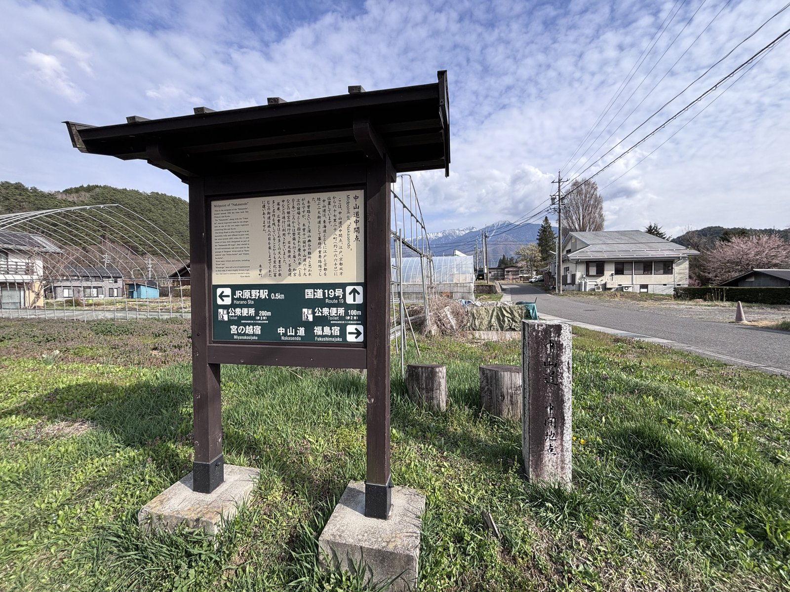

15:36,竹林前面立著一塊牌子:「中山道 → この下の橋を渡り木曽福島へ」——過下面那座橋,就是木曾福島。四點十分,我進了這一晚的旅館。

木曾福島在江戶時代設有福島關所,常和箱根、新居、碓氷並列四大關所。旅館「木曽三河家」就在木曾川邊,和室的窗外就是河;16:16,我手上拿著一杯喝的,隔著臨河的玻璃欄杆看木曾川。

白馬那幾天是開闊的:田、雪山一字排開;木曾谷是窄的,路貼著河,山就在兩邊,抬頭多半只看得到樹和雲;到了原野一帶,谷地稍微打開,中山道中間點的牌子後面,才露出頂上積著雪的山。

## 4/15 木曾福島 → 木曾の桟 → 上松,中午改搭火車

早上 07:48 吃早餐。餐廳一整面都是玻璃窗,窗外就是木曾川和對岸的房子。盤子裡有炒麵、玉子燒、青菜、一小碟燉菜、味噌湯,另一盤是麵包。

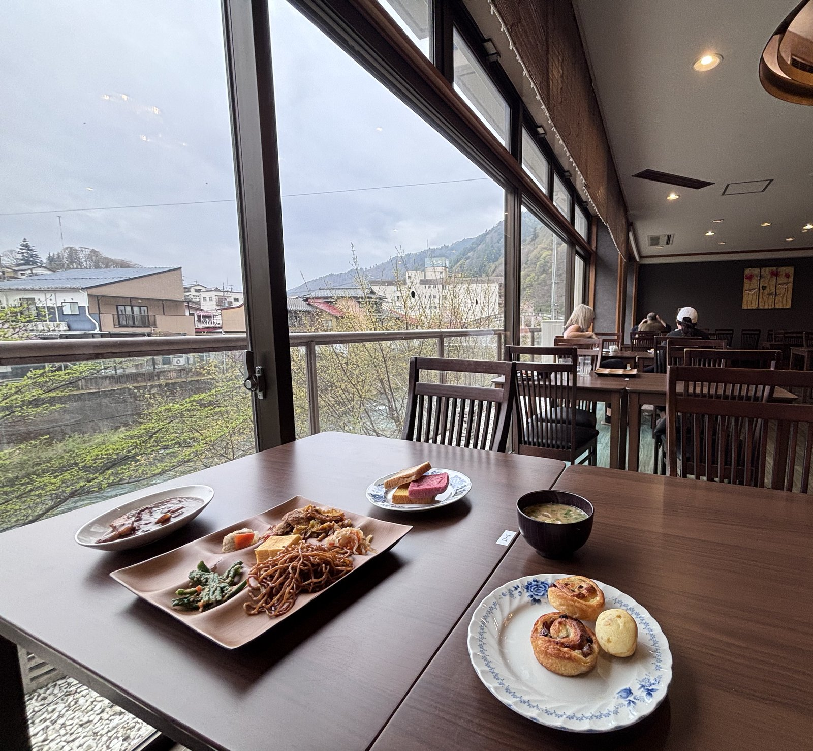

十點多出發,路面是濕的,山頭都被雲蓋住。行人橋旁邊,一棟老房子上的大看板寫著「歴史を守る木曽の味」——守著歷史的木曾味道;看板底下的門窗都關著。

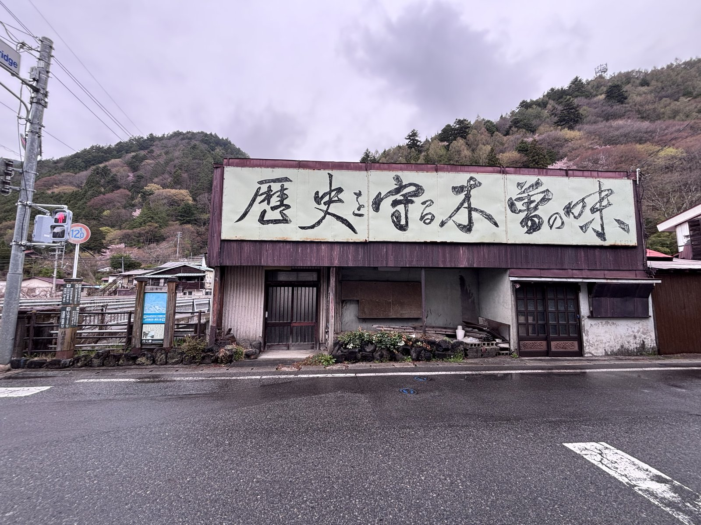

往南騎了二十分鐘,10:42 到木曾の桟(かけはし)。「桟」原本是沿著懸崖架出來的木棧道,是中山道上出名的險路,後來改築成石垣;路邊石垣前的木柱寫著,它在昭和四十一年三月三十一日被指定為長野縣史跡,另一根木柱請人「從對岸看」;旁邊的指標,往前是上松宿和寝覚の床。現在石垣上面走的是舊國道 19 號(國道本身已經改走隧道和新橋繞過去),河對面架著一座紅色的拱橋,背後的山被霧遮了一半。

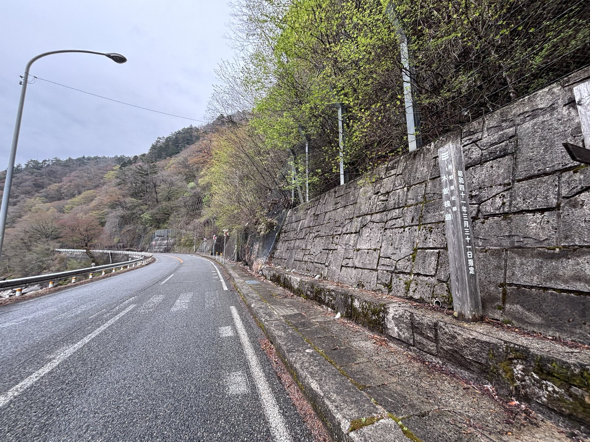

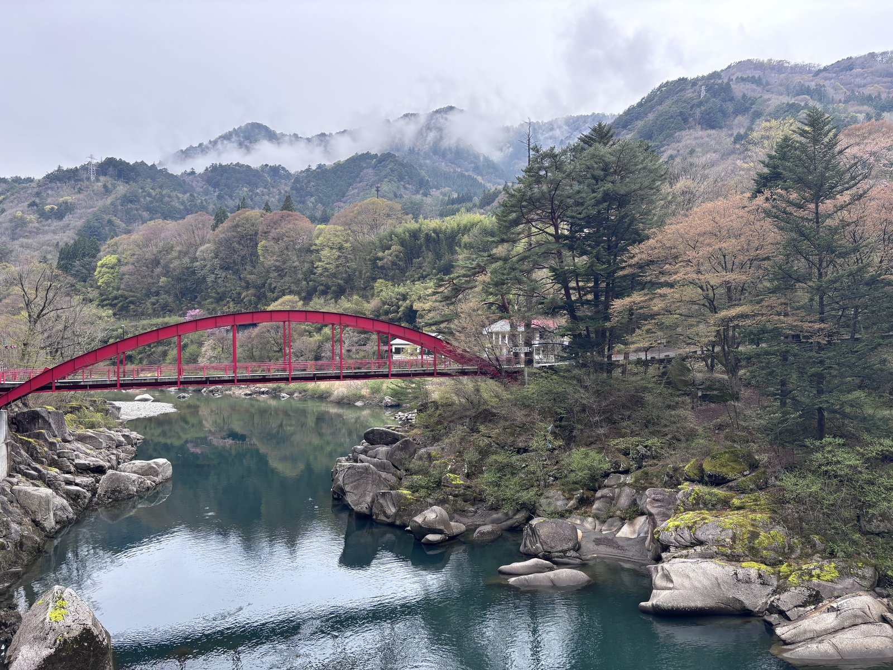

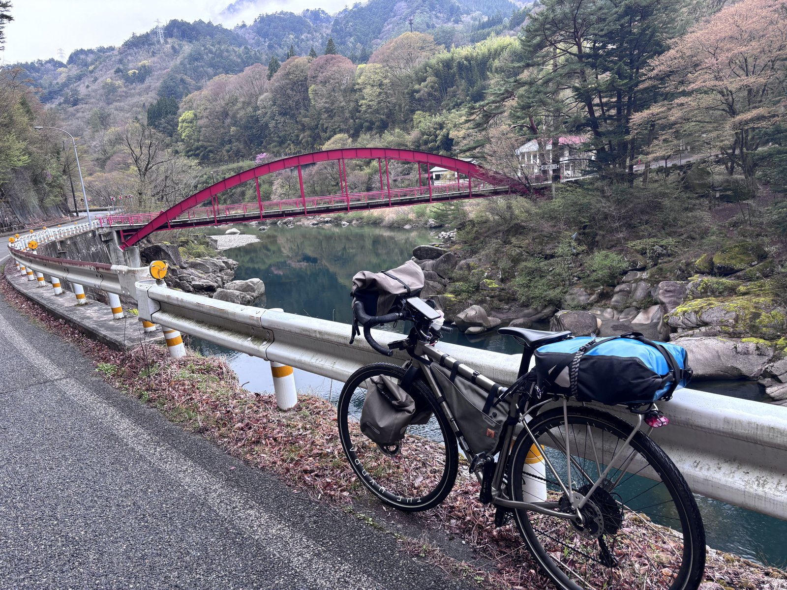

11:04 在上松附近,河邊的櫻花還開著,雲壓得很低,對岸的房子擠在山腳下。

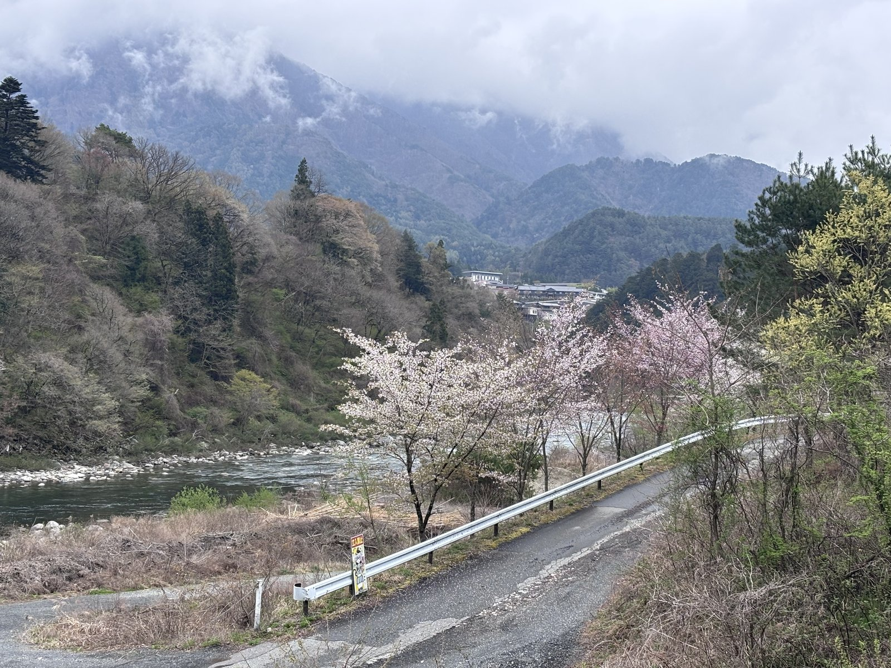

寝覚の床就在上松站往南約兩公里:木曾川把花崗岩切成一塊一塊、像大箱子排在一起的石頭,1923 年列為國家名勝,從上松站走路約三十分鐘,不用門票。這一趟的照片裡沒有它;想看的話,在上松站下車走過去就到。

11:07 還在上松附近,定位又往北、往上松站的方向回去了一點;下一張是 12:28,人已經在南邊將近二十公里外的十二兼站一帶,從高處看下去是木曾川。12:48 這幾張是隔著車窗拍的:不到一分鐘,手機定位就移動了六百多公尺,接著火車停進落合川站,月台邊有長椅和櫻花樹。照片的時間和定位,對得上上松 11:55 發往中津川的那班普通車:12:25 過十二兼,12:48 停落合川。從時間和位置看,我是在上松站把車裝進輪行袋上車的。

上松到中津川還有四、五十公里,要繞進妻籠、馬籠再翻馬籠峠的話更多;那天雲一直壓在山上,路面到十一點多都還是濕的。後半段,我交給了火車。妻籠、馬籠這兩個最有名的宿場,這次就留在火車窗外——其實連窗外都看不到,它們離鐵路還有一段山路。

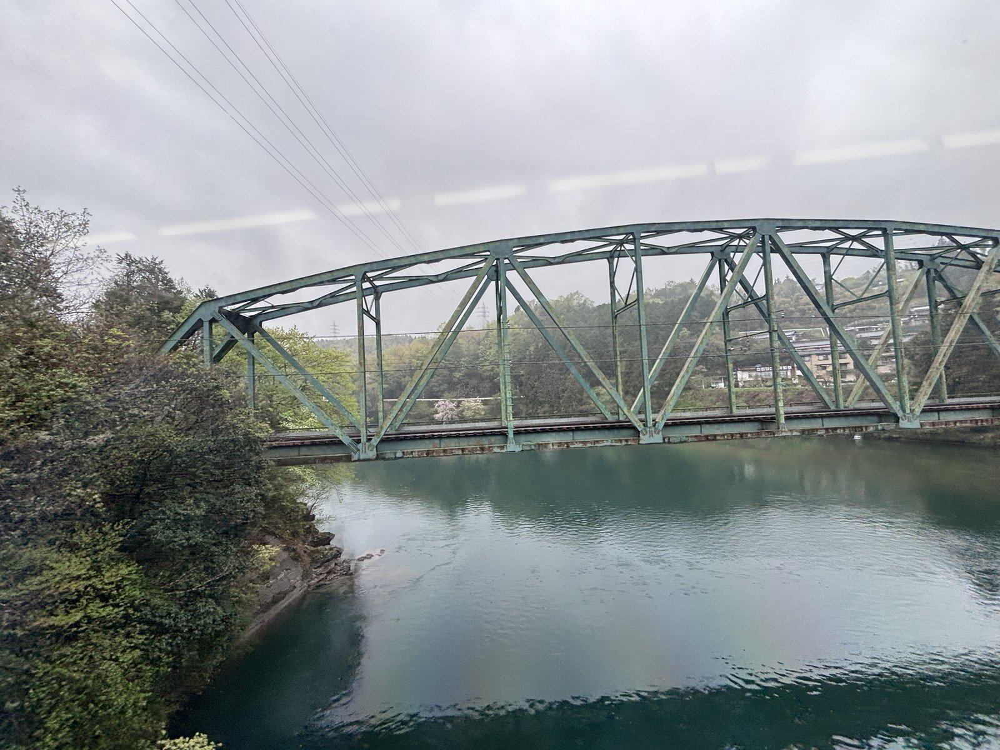

照時刻表,這班車 12:54 到中津川;12:48 以後,這天手機就沒有再拍照。隔天早上九點,我人在中津川宿的老街上。

## 4/16 中津川宿:出了山,最後一個早上

最後一天,天藍得發亮,山退到了後面。早上九點多,我在中津川宿的老街上,照片是 09:13 到 09:18 這五分鐘裡拍的,二十幾張。四月中,街上已經掛起了鯉魚旗,等著五月五日的兒童節。

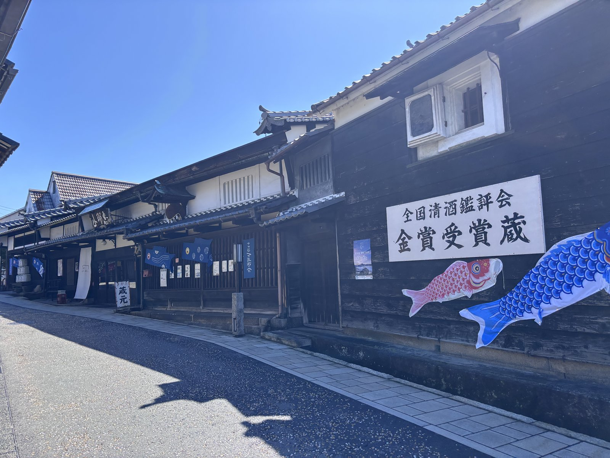

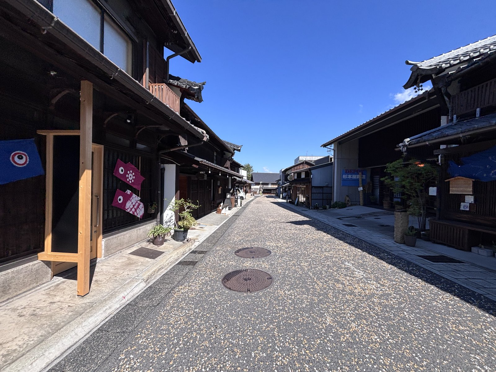

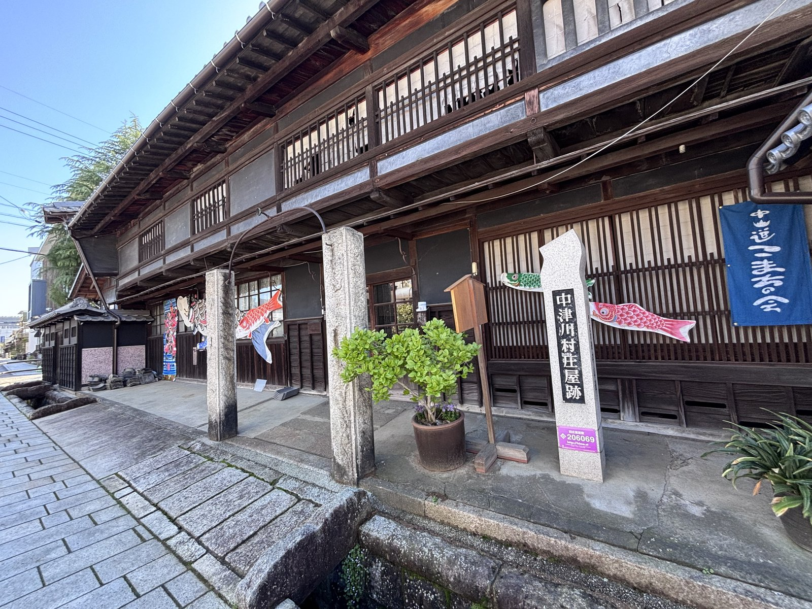

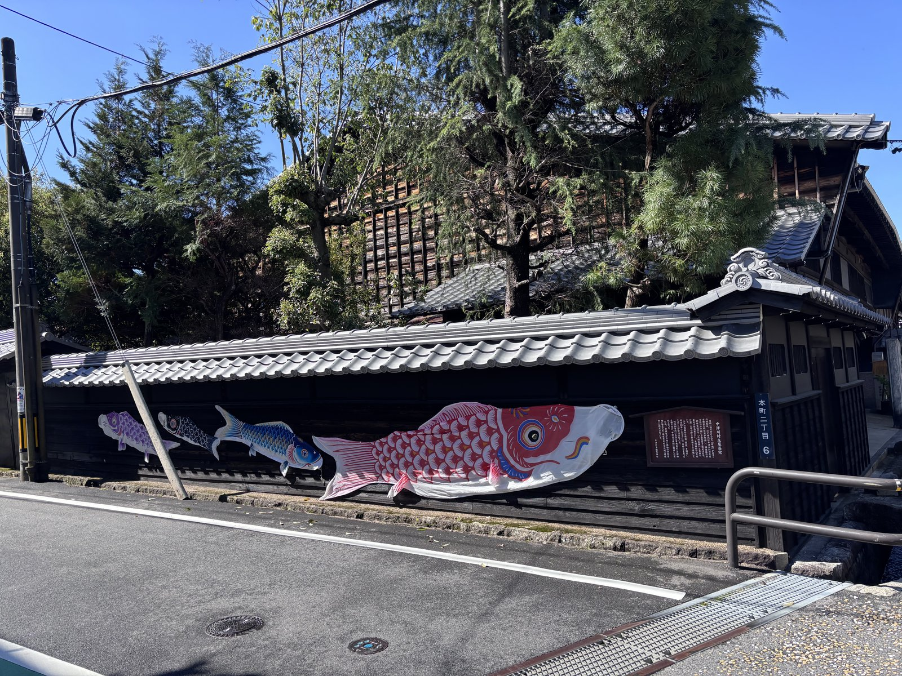

中津川是中山道的第 45 宿。木曾谷到這裡打開,變成美濃的平地,城市背後站著恵那山。這也是這趟日本的最後一站。

09:18 之後,手機就沒有再拍照。回程,是回到將近一個月前落地的地方——關西機場。3 月 18 日落地時已經是晚上,我住在機場島上的日航飯店,裝單車的紙箱就寄放在飯店,隔天早上直接從飯店出發;一個月後回來,再到同一家飯店把紙箱領出來,在那裡把車拆好、裝箱。從中津川回關西機場,一般的走法是中央本線到名古屋、換東海道新幹線到新大阪、再搭特急はるか到關西機場,全程三個半小時左右。

從奈良井到中津川,一共十二個宿場。奈良井、藪原、宮ノ越、福島、上松五個,是帶著單車一個一個經過的;再往南的六個,有的在火車窗外閃過,妻籠、馬籠離鐵路遠,連影子都沒看到;最後一個中津川,留給了最後一個早上。木曾路全在山裡,藤村說得沒錯;出了山,天一下子藍得發亮,櫻花換成了鯉魚旗,我的四月也就到這裡了。

## 這一段的實用筆記

**單車和紙箱:關西機場進、關西機場出**

- 帶單車出國,最麻煩的通常是紙箱:騎一個月,紙箱不可能帶著走,回程又一定要有箱子裝車。這趟我的做法是進出同一個機場:從大阪的關西機場進、關西機場出。落地當晚住機場島上的日航飯店(Hotel Nikko Kansai Airport,和關西機場站之間有通道相連),裝單車的紙箱就寄放在飯店,隔天早上直接從飯店出發;回程再回到同一家飯店,領出紙箱、在飯店把車打包。落地時間晚、回程要裝箱的話,這樣最省事。寄放紙箱要先跟飯店確認。紙箱、輪行袋怎麼換,細節和照片在第 1 站[山陰](../2026-jp-01-sanin/)。
- 中津川 → 關西機場:一般走法是 JR 中央本線到名古屋(快速約一小時二十分)、東海道新幹線到新大阪、特急はるか到關西機場,全程三個半小時左右(Yahoo!路線情報查的一個例子:中津川 10:00 發,13:27 到關西機場)。
- 東海道新幹線帶輪行袋:JR 東海的規定,單車算運動用品,不適用「特大行李」的規則;但如果要把車袋放進特大行李放置區,就要預約附放置區的座位(特大荷物スペースつき座席)。

**路線與路況**

- 中山道木曾路跟木曾川、國道 19 號、JR 中央本線是疊在一起走的。路邊常看到「中山道」指標(「宮ノ越宿 1.5km」「この下の橋を渡り木曽福島へ」),不過指標指的多半是徒步的舊道:鳥居峠那一段是登山步道,村子裡的舊道則多半是鋪好的小路。
- 鳥居峠(1,197 m)在奈良井和藪原之間,是這段的最高點。過去有幾種走法:① 舊中山道,約 6 公里的登山步道,入口有一段約 600 公尺的石疊,走路三到四個小時,塩尻市觀光協會提醒要防熊,奈良井的觀光案內所可以借熊鈴;② 國道 19 號走新鳥居隧道(1,738 m),騎過的人寫說隧道裡只有一側有窄窄的人行道,車開得很快;③ 明治新道,1890 年開的第一條車道,現在還能通行,有人騎登山車翻過去,路況要自己先查;④ 搭中央本線坐一站,奈良井 → 藪原約五分鐘。
- 過了鳥居峠,整段路順著木曾川往下:奈良井站海拔約 934 m,藪原站約 924 m,木曾福島站約 775 m,上松站約 709 m。
- 藪原的河邊有鋪好的小路,有欄杆、有長椅,櫻花季很好走。木曾谷的主幹道是國道 19 號,名古屋和長野之間的幹線,大卡車多、車開得快,能走平行的舊道、町道就走;隧道裡要開前後燈。
- 中山道中間點在宮ノ越和木曾福島之間、原野站附近,就在路邊,不用特地找;指標寫著 JR 原野站 0.5 公里,旁邊 100 公尺、200 公尺各有一處公共廁所。

**火車帶車(輪行)**

- JR 的規定:單車要拆開、整台裝進輪行袋,不能露出來,三邊合計 250 公分以內、30 公斤以內,不另外收費。
- 奈良井站:木造站房,就在宿場街的北口,出站就能騎;站內有跨線橋,車停在另一側月台的話,要扛著車袋走樓梯才出得了站。從松本搭中央本線普通車到奈良井約五十分鐘(2026 年 9 月查的平日時刻表,例如松本 10:20 發、11:12 到奈良井)。
- 4/15 上松 11:55 發的普通車(松本始發),經須原、野尻、南木曽、坂下、落合川,12:54 到中津川,59 分鐘;照片的時間和定位都對得上這一班。木曾谷段的普通車白天兩個小時上下才一班(同一份時刻表,上松往中津川 9:28、11:55、13:50、16:09),先查好時刻表,再決定在哪一站結束騎車。

**住宿**

- 4/14 木曾福島「木曽三河家」:木曾川邊的旅館,房間是和室、榻榻米上擺了床,窗外就是河;早餐餐廳整面玻璃看河,自助式,我拿了炒麵、玉子燒、麵包、味噌湯。官網寫:離 JR 木曾福島站走路約 15 分鐘;每個方案都附免費早餐(約 25 道手作菜);有溫泉「二本木の湯」和三溫暖,24 小時免費飲料吧;有機車、單車的專用停車區,部分有屋頂;入住 15:00 起,退房到 10:00。房價隨日期和方案變動,訂之前在官網或訂房網站查。
- 4/15 中津川:照片裡沒有拍到住的地方。中津川站是特急しなの的停靠站,站前走路幾分鐘內就有商務旅館;中津川觀光協會的官網有住宿列表。

**補給**

- 奈良井宿街上有茶房、咖啡店、酒舖;我拍到的那家茶房門口貼著「CASH ONLY」,記得帶現金。
- 奈良井宿沿街有六處水場,山上的水從木槽裡流出來;告示寫著要喝請先煮沸,水壺別直接在這裡裝。
- 藪原到宮ノ越之間,國道 19 號邊有一家 7-Eleven(有 ATM)。
- 木曾福島是木曾町的中心,特急しなの都停;車站附近有便利商店和超市,是這段補給最方便的地方。

**季節與天氣**

- 4/14 晴時多雲;4/15 陰、早上路面濕、山頭有雲;4/16 大晴天。
- 櫻花:前一天(4/13)安曇野已經滿開,4/14 奈良井、藪原正開,4/15 木曾福島、上松河邊還在。山下謝了、山上剛開——四月中旬,櫻花季在木曾谷還能再接上一段。
- 河岸的杜鵑、水仙也在開;山坡上的落葉樹大多還沒長葉。

**值不值得**

- 奈良井宿值得專程來:整條街一公里都是老房子,主街請外地車不要開進來;車站就在街口,下車就能騎。我去的是平日中午,人不算多。
- 木曾の桟現在看到的是 1648 年尾張藩改築的石垣,上面走的是舊國道 19 號(國道已改走隧道和新橋);騎舊國道會直接經過,不用另外繞路。
- 寝覚の床離上松站約兩公里,這次沒有照片;妻籠、馬籠這次沒去,都不替它們打分數。

**雷點**

- 國道 19 號的卡車和隧道:大卡車多、車速快;奈良井和藪原之間的新鳥居隧道人行道很窄,不想走隧道,可以改走明治新道,或搭一站火車。
- 木曾谷的普通車白天兩個小時上下才一班,錯過一班要等很久。
- 有的茶房、小店只收現金(奈良井那家茶房門口就貼著「CASH ONLY」)。

---

這段的攝影作品之後放 Flickr。
